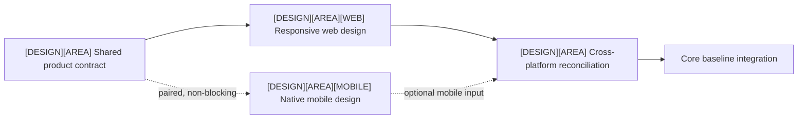
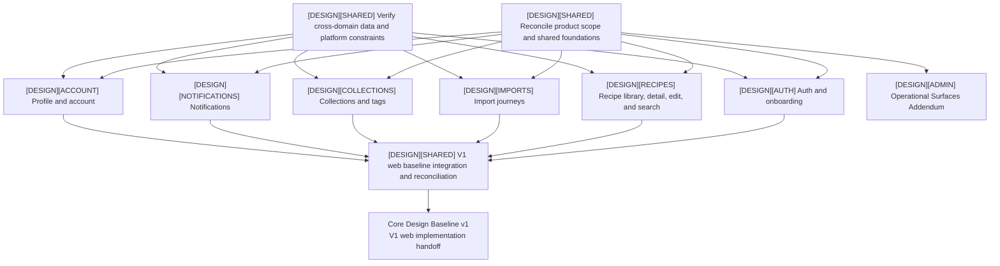

# Product Design Roadmap

Updated: 2026-08-14
Status: Core Design Baseline v1 in progress

This is the canonical current plan for the `[DESIGN]` track. It covers the V1
responsive-web release and the paired mobile Design context that can inform V2.
Platform-specific navigation, gestures, overlays, keyboard behavior, and
density may differ while preserving shared product concepts and visual
continuity where appropriate. Mobile Design children may be created alongside
web children, but their completion is non-blocking for V1 and does not
authorize mobile Development. The cross-domain scope and decision evidence
for the current frontier is maintained in
[`shared/scope-and-decision-inventory.md`](shared/scope-and-decision-inventory.md).

## Gates

### Core Design Baseline v1

For V1, the Core baseline blocks responsive-web UI implementation and requires:

- approved scope for every primary V1 web journey;
- shared shell, navigation, design system, and content/error conventions;
- responsive-web behavior and the shared product meaning that a future mobile
  client must preserve;
- normal, empty, loading, error, permission, sparse, dense, and localization-pressure states;
- accessibility and V1 web interaction contracts, with mobile implications
  recorded when paired Design work is available;
- reconciliation of shared decisions across parallel Design Domains for the V1
  web handoff;
- an implementation handoff and verified API/schema change list.

Paired `[MOBILE]` Design work is useful evidence and may proceed in parallel,
but a missing mobile Design child or mobile-specific reconciliation does not
block the V1 web baseline.

### V2 Mobile Design Gate

After V1 Web Release, the mobile planning iteration defines the V2 mobile
specification and requirements. V2 mobile UI implementation requires that
approved specification plus the applicable mobile Design and reconciliation
evidence. The current roadmap may capture mobile evidence early, but it does
not create a V1 mobile implementation commitment.

### Operational Surfaces Addendum v1

The Addendum covers admin, debug, and operational screens. V1 requires the
web operational contract before Public v1; mobile operational Design may be
paired or deferred to V2. The Addendum may run in parallel with V1 Core web
implementation after the Core baseline is approved. It blocks Public v1, not
Internal Web Beta.

## Domain status

| Design Domain | Status | Notes |
| --- | --- | --- |
| Shared product foundation | In progress | Product vocabulary, Design boundary, and mobile shell evidence exist; the V1 web inventory is recorded, while cross-product tokens, responsive conventions, and state reconciliation remain open |
| Recipe Detail and Edit | In progress | Structural foundation is approved; the current inventory and remaining sections/contracts are listed in [`shared/scope-and-decision-inventory.md`](shared/scope-and-decision-inventory.md) and [`recipe-detail/decisions/current-scope.md`](recipe-detail/decisions/current-scope.md) |
| Authentication, invitations, onboarding | Not started | Define the V1 web entry and lifecycle states; capture mobile implications as paired evidence or defer them to V2 |
| Recipe library and search | Not started | Include list, search, filtering, sorting, pagination, and transition to detail |
| Import journeys | Not started | Include creation, progress, terminal results, retry, resource failure, and navigation |
| Collections and tags | Not started | Include V1 web organization, selectors, large sets, and empty/error states; mobile patterns are paired/non-blocking |
| Notifications | Not started | Include V1 web unread state, history, and navigation targets; mobile presentation is paired/non-blocking |
| Profile and account | Not started | Include V1 web settings, lifecycle, and deletion; mobile account presentation is paired/non-blocking |
| Core baseline integration | Blocked | Reconcile every shared decision and V1 web outcome, then produce the versioned web handoff; mobile-specific reconciliation may follow in V2 |
| Admin/debug/operational surfaces | Deferred non-blocking | Begins as the Operational Addendum; required before Public v1 |

## Parallel dependency map

Every Design Domain follows this issue shape. Shared, web, and mobile Design
remain separate deliverables, not two states inside one oversized task. Create
the pair in one product context when useful; only the web output and shared
decisions are V1 blockers:

The shared child fixes product meaning, data and state requirements, not visual
parity. Web and mobile may use different navigation, density, gestures,
overlays, and interaction patterns. V1 reconciliation preserves terminology,
capabilities, and intentional continuity for the web handoff; mobile-specific
differences can be recorded as paired evidence and finalized during V2.

The global domain graph remains:

Feature workstreams may proceed in parallel. A change to a shared decision records every affected Design Domain; integration applies it consistently before baseline approval.

## Readiness frontier

| Candidate child issue | Readiness | Why |
| --- | --- | --- |
| `[DESIGN][SHARED] Inventory first-version scope and existing decisions` | Completed | [`shared/scope-and-decision-inventory.md`](shared/scope-and-decision-inventory.md) accounts for the Core domains, discrepancies, deferrals, decision packets, and next issue split; #20 is published in [PR #51](https://github.com/starkovalera/recipe-manager/pull/51), so shared-contract children may be created after #22 supplies the cross-domain contract matrix (the Recipes child also consumes #21) |
| `[DESIGN][SHARED] Audit API, schema, and platform constraints` | Agent-ready | This is read-only contract discovery with a checkable change list |
| `[DESIGN][RECIPES] Verify Recipe Detail/Edit contracts` | Agent-ready | Existing decisions name the missing backend facts explicitly |
| Domain `[WEB]` and paired `[MOBILE]` design children | Refinement or blocker-dependent | Start after the domain's shared product contract is explicit; create the pair in one context, while allowing the mobile child to remain deferred without blocking V1 |
| V1 shared/web reconciliation children | Blocked | Require the shared contract and web child; mobile evidence is an optional input |
| V2 mobile reconciliation children | Deferred | Run during or after the post-V1 mobile planning iteration when mobile requirements are approved |
| Core baseline integration | Blocked | Requires reconciled shared/web output from every Core Design Domain; mobile completion is not a V1 gate |

## Recipe Detail and Edit frontier

The existing Recipe Detail workspace remains the first mature Design Domain. After
contract verification, each remaining area is split into a responsive-web child
and a paired native-mobile child when useful. The responsive-web child is the
V1 handoff; the mobile child may be completed in parallel or deferred to V2.
Its current parallelizable work is:

- verify Unit dictionary, field limits, ordering identity, persistence, concurrency, media capacity, and permission contracts;
- design Instructions editing and validation;
- design Cooking notes editing and validation;
- design Estimated nutrition editing and incomplete states;
- design save progress, success, failure, retry, and mobile keyboard behavior;
- design Manage Media and its independent draft;
- design Organize Recipe.

Instructions, notes, nutrition, Manage Media, and Organize may proceed in
parallel after their required contract facts are known. Within each area, web
and mobile may also proceed in parallel, followed by V1 shared/web
reconciliation; mobile-specific reconciliation may follow later. Visual-
direction comparison for Recipe Detail follows structural reconciliation of
those areas and then feeds the shared visual-system work; it is not an isolated
production implementation source.

## Completion criteria

Each Design Domain is complete for V1 when its scope, decisions, rejected
alternatives, V1 web behavior, difficult states, reviews, approval record, and
permanent evidence are current. Paired mobile evidence may be incomplete
without blocking the V1 handoff. The Core baseline is complete only after
cross-domain shared/web integration and the V1 web implementation handoff are
approved; V2 mobile completion has a separate gate.
