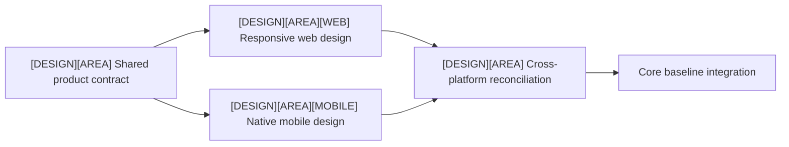
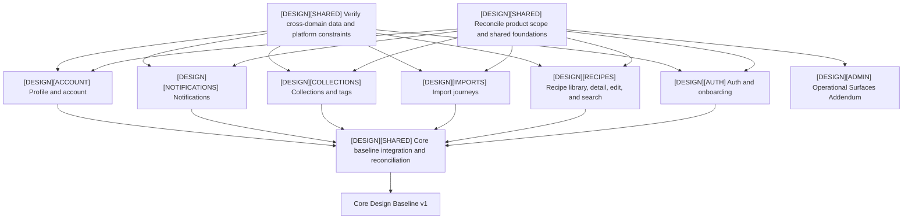

# Product Design Roadmap

Updated: 2026-08-14
Status: Core Design Baseline v1 in progress

This is the canonical current plan for the `[DESIGN]` track. It covers responsive web and native mobile product design. Platform-specific navigation, gestures, overlays, keyboard behavior, and density may differ while preserving shared product concepts and visual continuity where appropriate. The cross-domain scope and decision evidence for the current frontier is maintained in [`shared/scope-and-decision-inventory.md`](shared/scope-and-decision-inventory.md).

## Gates

### Core Design Baseline v1

The Core baseline blocks production UI implementation and requires:

- approved scope for every primary first-version journey;
- shared shell, navigation, design system, and content/error conventions;
- responsive web and native mobile behavior;
- normal, empty, loading, error, permission, sparse, dense, and localization-pressure states;
- accessibility and platform interaction contracts;
- reconciliation of shared decisions across parallel Design Domains;
- an implementation handoff and verified API/schema change list.

### Operational Surfaces Addendum v1

The Addendum covers admin, debug, and operational screens on web and mobile. It may run in parallel with Core implementation after the Core baseline is approved. It blocks Public v1, not Internal Web Beta or Mobile Beta.

## Domain status

| Design Domain | Status | Notes |
| --- | --- | --- |
| Shared product foundation | In progress | Product vocabulary, Design boundary, and mobile shell evidence exist; the first-version inventory is recorded, while cross-product tokens, responsive conventions, and state reconciliation remain open |
| Recipe Detail and Edit | In progress | Structural foundation is approved; the current inventory and remaining sections/contracts are listed in [`shared/scope-and-decision-inventory.md`](shared/scope-and-decision-inventory.md) and [`recipe-detail/decisions/current-scope.md`](recipe-detail/decisions/current-scope.md) |
| Authentication, invitations, onboarding | Not started | Include web/mobile entry, restricted registration, recovery, and user lifecycle states |
| Recipe library and search | Not started | Include list, search, filtering, sorting, pagination, and transition to detail |
| Import journeys | Not started | Include creation, progress, terminal results, retry, resource failure, and navigation |
| Collections and tags | Not started | Include organization, selectors, large sets, empty/error states, and mobile patterns |
| Notifications | Not started | Include unread state, history, navigation targets, and platform-specific presentation |
| Profile and account | Not started | Include settings, lifecycle, quota visibility when applicable, and deletion |
| Core baseline integration | Blocked | Reconcile every shared decision and produce the versioned handoff after all Core domains are approved |
| Admin/debug/operational surfaces | Deferred non-blocking | Begins as the Operational Addendum; required before Public v1 |

## Parallel dependency map

Every Design Domain follows this issue shape. Web and mobile are separate deliverables, not two states inside one oversized task:

The shared child fixes product meaning, data and state requirements, not visual parity. Web and mobile may use different navigation, density, gestures, overlays, and interaction patterns. Reconciliation preserves terminology, capabilities, and intentional continuity while recording justified platform differences.

The global domain graph remains:

Feature workstreams may proceed in parallel. A change to a shared decision records every affected Design Domain; integration applies it consistently before baseline approval.

## Readiness frontier

| Candidate child issue | Readiness | Why |
| --- | --- | --- |
| `[DESIGN][SHARED] Inventory first-version scope and existing decisions` | Completed | [`shared/scope-and-decision-inventory.md`](shared/scope-and-decision-inventory.md) accounts for the Core domains, discrepancies, deferrals, decision packets, and next issue split; #20 is published in [PR #51](https://github.com/starkovalera/recipe-manager/pull/51), so shared-contract children may be created after #22 supplies the cross-domain contract matrix (the Recipes child also consumes #21) |
| `[DESIGN][SHARED] Audit API, schema, and platform constraints` | Agent-ready | This is read-only contract discovery with a checkable change list |
| `[DESIGN][RECIPES] Verify Recipe Detail/Edit contracts` | Agent-ready | Existing decisions name the missing backend facts explicitly |
| Domain `[WEB]` and `[MOBILE]` design children | Refinement or blocker-dependent | Start after the domain's shared product contract is explicit; each produces evidence and then waits for user approval |
| Cross-platform reconciliation children | Blocked | Require both platform children for that domain |
| Core baseline integration | Blocked | Requires reconciled output from every Core Design Domain |

## Recipe Detail and Edit frontier

The existing Recipe Detail workspace remains the first mature Design Domain. After contract verification, each remaining area is split into a responsive-web child and a native-mobile child. Its current parallelizable work is:

- verify Unit dictionary, field limits, ordering identity, persistence, concurrency, media capacity, and permission contracts;
- design Instructions editing and validation;
- design Cooking notes editing and validation;
- design Estimated nutrition editing and incomplete states;
- design save progress, success, failure, retry, and mobile keyboard behavior;
- design Manage Media and its independent draft;
- design Organize Recipe.

Instructions, notes, nutrition, Manage Media, and Organize may proceed in parallel after their required contract facts are known. Within each area, web and mobile may also proceed in parallel, followed by one area reconciliation. Visual-direction comparison for Recipe Detail follows structural reconciliation of those areas and then feeds the shared visual-system work; it is not an isolated production implementation source.

## Completion criteria

Each Design Domain is complete when its scope, decisions, rejected alternatives, web/mobile behavior, difficult states, reviews, approval record, and permanent evidence are current. The Core baseline is complete only after cross-domain integration and implementation handoff are approved.
