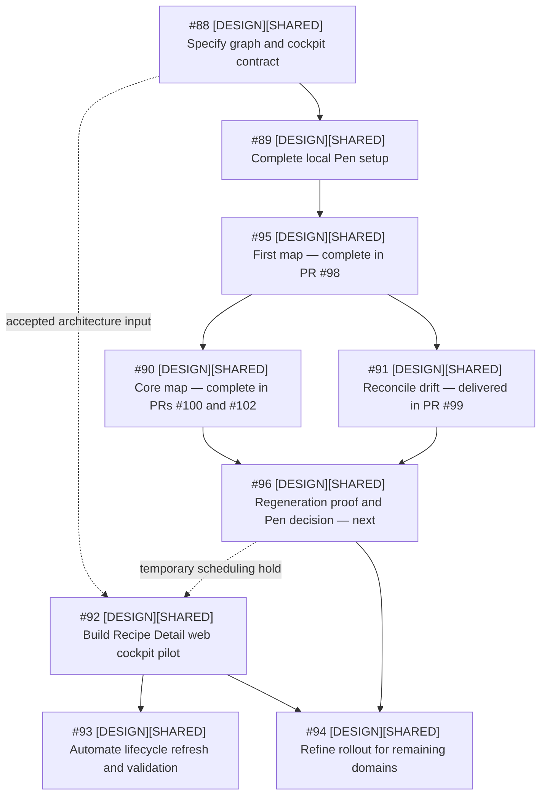

# Repository-owned Design Operations cockpit

Status: accepted; complete and delivered in merged PR #86 for issue #88<br>
Decision date: 2026-08-20<br>
Initial slice: Recipe Detail, desktop web only

#96 checkpoint status: deterministic repository-input evidence prepared; owner
Pen-role decision pending. See [`regeneration-review.md`](pen/regeneration-review.md).

## Purpose

Create one visual, interactive, current representation of Recipe Manager Design
work without creating another source of approval or delivery truth. A
repository-owned graph defines the navigable structure, a generated static web
cockpit is the primary interactive human surface, and Pen is evaluated as a
derived spatial companion.

The first implementation is a bounded Recipe Detail desktop-web experiment.
Other product Design tasks remain on a temporary planning hold until the Pen
experiment produces an explicit continue, change-scope, or stop decision. This
hold is scheduling policy, not a product dependency and not a native GitHub
blocker.

## User and primary questions

The primary user is the project's sole technical product owner and developer.
The default view prioritizes visual comprehension; source and code relationships
remain available through progressive disclosure.

Within two minutes, the user should be able to answer:

- Which current desktop journeys, screens, states, and transitions exist?
- What is approved, unresolved, blocked, or delivered?
- Where do Design state and Delivery state differ?
- Which decision and executable prototype support a screen or state?
- Is any displayed result stale or contradictory?

## Authority and invariants

The ownership boundary is recorded in
[`ADR-0007`](../../docs/adr/0007-repository-owned-design-operations-cockpit.md).

- Current decision documents and the applicable decision log own Design
  approval.
- GitHub issues and merged pull requests own task and Delivery state.
- Canonical roadmaps own scope and release boundaries.
- The repository graph owns stable visual IDs and relationships.
- HTML prototypes, screenshots, and reviews are evidence; they do not assign
  operational status.
- The cockpit and Pen are generated projections and never become authorities.
- A contradiction is rendered as `verification_needed`; generation never
  guesses which source is correct.
- A represented state change is generated and verified in the same pull request
  before merge. Post-merge work audits the atomic result rather than silently
  repairing it.
- Graph, cockpit, Pen files, and prototype code remain Design tooling and are
  never imported into the production application.

## Current-slice rule

The first version represents the latest applicable state, not the history of
how it was reached.

- Include the latest approved decision for each represented concern.
- Include current `not_started`, `in_progress`, `blocked`, unresolved, and
  `verification_needed` placeholders where work is incomplete.
- Resolve superseded decisions before generation and omit their nodes from the
  current projection.
- Keep links to the authoritative source, where history remains available.
- Do not copy historical alternatives, discussion timelines, or all previous
  screenshots into the graph or Pen.

## Architecture

```text
current decisions + authored graph + cached GitHub snapshot
                         |
                         v
             deterministic normalizer/validator
                         |
              +----------+-----------+
              |                      |
              v                      v
       static interactive cockpit   normalized Pen input
                                      |
                           deterministic renderer
                                      |
                          .pen atlas + review export
```

The normalizer resolves sources and contradictions before either projection
runs. Pen does not read GitHub, decision documents, or the filesystem to infer
status.

## Repository graph contract

Use versioned JSON so the project can validate with JSON Schema and Node without
adding a parser dependency:

```text
design/shared/design-graph/
  schema.json
  graph.json
  domains/
    recipe-detail.json
  snapshots/
    github.json
```

`graph.json` owns schema version and domain references. Domain files own authored
stable IDs and relationships. `github.json` is generated evidence and includes
`asOf`, source URLs, and source revision; it is never manually edited to make a
status look correct.

### Node hierarchy

Every navigable product node has a stable, human-readable ID:

```text
domain -> journey -> screen -> state
```

Transitions are directed edges between screen or state IDs. Each transition has
an action label and relationship provenance. The Core experiment supports three
provenance values:

- `native`: verified in the authoritative system, such as a GitHub blocker;
- `docs-derived`: explicitly stated in a current canonical document;
- `curated`: intentionally authored for navigation or explanation.

### Required current-slice fields

- stable ID, type, title, and parent ID where applicable;
- desktop-web platform and applicable release boundary;
- Design status and Delivery status as independent fields;
- exact decision and prototype links for represented approved behavior;
- directed transitions with labels and provenance;
- source selectors needed to refresh derived status;
- `verification_needed` details when sources disagree.

Representative screenshot and issue/PR links are required in the Core dataset
where they prove visual comprehension or Delivery derivation. API links, complete
review coverage, production routes/components, and exhaustive issue/PR provenance
are optional extension fields.

### Status axes

Design status uses:

```text
not_started | in_progress | blocked | awaiting_approval | approved |
verification_needed
```

Delivery status uses:

```text
not_planned | blocked | ready | in_progress | delivered |
verification_needed
```

The UI never combines these into one ambiguous `done` state.

## Generated web cockpit

The first cockpit is static HTML/CSS/JavaScript generated deterministically by a
Node script. It uses no production components, application APIs, production
styles, or framework dependency. It can be opened locally with one documented
command and supplied as a pull-request artifact; permanent hosting is deferred.

### Information architecture

The pilot opens at a Recipe Detail overview and provides:

1. journey lanes;
2. screen cards within each journey;
3. state variants grouped under their screen;
4. labeled transition arrows;
5. a detail panel opened from a screen/state;
6. visible source revision, snapshot time, and stale/contradiction warning.

A screen/state card shows a representative thumbnail when useful, title,
desktop-web platform, and separate Design and Delivery badges. Its detail panel
links the current decision and interactive HTML prototype and may expose
representative screenshot and issue/PR evidence. Source/code details are
secondary and do not compete with the visual journey.

The cockpit must not use a card around every page section or imitate a generic
project-management board. Its primary visual grammar is journey lanes, screens,
states, and transitions.

### Initial Recipe Detail journeys

1. **Read and focus:** open and read a recipe, enter Cooking Focus, and return.
2. **Edit and save:** edit Basics/Ingredients, encounter validation, save, and
   encounter the dirty-draft guard when leaving.
3. **Inspect resources and media:** open Media and Import Info, inspect resource
   relationships, and encounter a destructive confirmation.

Manage Media, Instructions, Cooking notes, Nutrition, and Organize appear only
as current incomplete placeholders when no approved desktop design exists. The
pilot does not invent screens to make the map look complete.

## Core Pen experiment

Pen is a parallel experiment, not an acceptance requirement for the cockpit.
The experiment uses only the current Recipe Detail desktop-web slice and is
estimated at 16–28 aggregate agent-hours and 2–4 human-hours, with approximately
40 percent uncertainty. Parallel inventory, normalized data, synthetic visual
components, and setup work reduce the expected active critical path to roughly
10–18 agent-hours; one owner assembles the final `.pen` file.

### Pen representation

- Show the same three journeys and 20–30 canonical screen/state nodes.
- Represent transitions as labeled arrows and grouping, not as a simulated
  clickable application.
- Include a small initial set of representative thumbnails. Review determines
  whether the set provides a coherent picture of the interface; image count is
  not an acceptance criterion.
- Begin with current evidence from Prototype 05 and Prototype 17: default
  detail, Cooking Focus, Media, Import Info/cascade, Edit Basics/Ingredients,
  validation, and unsaved-changes guard. Capture a fresh current-state image
  when an older screenshot may be superseded.
- Link decisions and HTML prototypes. Keep API, full reviews, all screenshots,
  and complete work-item history outside the required scope.
- Prefer stable explicit IDs and deterministic Code on Canvas/direct operations
  over whole-atlas model prompts.

### Local and headless boundary

The first setup uses the Windows x64 desktop application so JetBrains remains
the development IDE. The VS Code extension is a fallback only if the desktop MCP
cannot be discovered. Core evaluates a pinned local headless CLI proof when its
supported authentication boundary is available:

- open, save, and export without the GUI;
- regenerate twice from identical normalized input;
- compare normalized structure and fixed visual evidence;
- change one real source fact and verify that only expected nodes change.

The #96 check pinned `@pen.dev/cli@0.3.4` and confirmed that both status and
headless interactive mode require `pen login` or `PEN_CLI_KEY`. The repository
normalizer and Pen semantic-ID proof are complete without credentials; the
authenticated Pen open/save/export run remains an explicit human prerequisite.

GitHub Actions, CI secrets, required Pen checks, and automatic commits are not
part of Core.

### Checkpoints and decision method

1. **Setup (#89, evidence recorded in #90):** Pen runs, Codex sees the actual
   MCP tools, and configuration changes are understood.
2. **First map (#95):** complete; the small current desktop slice, review
   evidence, and owner `continue` decision are delivered in
   [PR #98](https://github.com/starkovalera/recipe-manager/pull/98). The decision
   opens #90 and #91 as parallel work.
3. **Core map (#90):** complete; all three journeys and 27 nodes are delivered
   in [PR #100](https://github.com/starkovalera/recipe-manager/pull/100), while
   repository persistence, fresh-open proof, recovery cost, and the owner
   `continue` decision are delivered in
   [PR #102](https://github.com/starkovalera/recipe-manager/pull/102). The
   independent #91 controlled source correction remains in
   [PR #99](https://github.com/starkovalera/recipe-manager/pull/99).
4. **Regeneration proof and decision (#96):** identical-input and controlled-
   change runs consume the #91 correction delivered in
   [PR #99](https://github.com/starkovalera/recipe-manager/pull/99). The
   repository-input proof is recorded in
   [`pen/regeneration-review.md`](pen/regeneration-review.md); authenticated
   Pen open/save/export remains the owner prerequisite before a final role
   decision.

At every checkpoint, the agent presents the visible result, actual agent/human
time, unexpected complications or advantages, remaining work, and a recommendation
to continue, change scope, or stop. The human owner makes the decision; numerical
thresholds do not decide automatically. A checkpoint that opens two or more
independently executable branches is its own issue; it must not be hidden inside
one of the downstream branches.

Planning guides are a maximum of 28 agent-hours and 4 human-hours, no more than
90 minutes of initial human setup, and an expected steady-state update of no
more than 30 agent-minutes plus 10 minutes of human review. Exceeding a guide is
reported at the next checkpoint with a revised estimate.

## Human setup task and wizard

Create a `ready-for-human` setup issue with a repeatable
[Git Bash wizard](../../scripts/design-ops/setup-pen-core-experiment.sh) and the
same steps in the issue body. The wizard must not collect or persist OTPs,
passwords, tokens, or model credentials.

Stages:

1. Open the official Windows x64 download and install Pen.
2. Activate Pen through its email/OTP flow.
3. Open the provided smoke `.pen` file and leave Pen running.
4. Hand control back so the agent can inspect MCP discovery and compare the
   current Codex configuration against its backup.
5. Install the VS Code extension only if desktop MCP discovery fails.
6. Authenticate Claude Code only if the installed Pen version demonstrably
   requires it for the bounded Codex MCP operation.
7. Perform the visual reviews requested by #95, #90, and #96.

The agent owns safe backup/comparison commands, version capture, smoke-file
preparation, MCP inspection, CLI checks, and cleanup of temporary evidence.

## Drift maintenance as experiment input

Create a separate maintenance issue for the currently known roadmap/tracker
contradictions. Do not fix it before the first data-backed map.

1. Generate the first snapshot from current sources.
2. Verify that contradictions appear as `verification_needed`.
3. Execute the maintenance task to reconcile the canonical roadmaps and trackers.
4. Regenerate from the corrected sources.
5. Verify that warnings clear and only expected nodes change.

This maintenance task did not block setup or the first map. With #95 complete,
it ran as the parallel #91 frontier with #90 and is delivered in
[PR #99](https://github.com/starkovalera/recipe-manager/pull/99). The corrected
source now remains an input to the controlled-change regeneration proof and
final Pen decision in #96.

## Lifecycle contract

- **Preflight/status:** refresh the cached GitHub snapshot and validate source
  links.
- **Contract/plan:** add stable graph nodes and relationships for newly approved
  scope.
- **Approval:** record approval in the owning decision document; projection
  status is derived.
- **Prototype verification:** add permanent evidence and validate navigation.
- **PR gate:** regenerate graph projections, validate schema/references, and
  include the final represented state atomically.
- **Post-merge:** audit merged sources and projections; report an incomplete
  delivery instead of silently creating maintenance work.

The first pilot has no webhook service, continuous server, or permanent URL.
Lifecycle-triggered refresh plus visible `asOf` provenance defines
`up-to-date`.

## Verification

The graph/cockpit pilot requires:

- JSON Schema and referential-integrity checks;
- stable ordering and IDs;
- decision, prototype, screenshot, issue, and PR link checks for included data;
- explicit source precedence and contradiction fixtures;
- deterministic generated-file comparison;
- Playwright navigation, missing-asset, console-error, and horizontal-overflow
  checks at 1440 x 900 and 1024 x 768;
- keyboard access and visible focus for cockpit controls;
- a verified one-command local start/open path;
- confirmation that generated artifacts contain no secrets.

The Pen experiment additionally requires MCP version/tool inventory, Codex
configuration before/after comparison, two identical-input runs, one controlled
source change, structural diff, fixed visual review, and confirmation that the
repository graph/cockpit remain usable if Pen is removed.

For the current #96 checkpoint, the repository-side structural proof and
Pen-independent validation pass. The pinned CLI version/auth boundary and the
remaining owner action are recorded in
[`pen/regeneration-review.md`](pen/regeneration-review.md); no credential or
account state is part of the repository evidence.

## Explicitly out of scope

- native-mobile or mobile-web visualization;
- historical decision browsing or superseded visual variants;
- all 117 screenshots or all prototype iterations as visual nodes;
- complete API, review, source-code, issue, or PR mapping;
- production frontend/backend changes;
- Pen as an approval or status authority;
- native interactive transitions inside Pen;
- required Pen CI, CI secrets, auto-commits, webhooks, or permanent hosting;
- Penpot adoption.

## Planned task graph



First map was an independent fork task; its recorded `continue` decision opened
Core-map work and drift reconciliation in parallel. Drift reconciliation is
delivered in [PR #99](https://github.com/starkovalera/recipe-manager/pull/99).
Regeneration and the final Pen decision are an independent join task that
consumes that correction after the Core map. The
specification issue is contained by the Core Design Baseline tracker #29. The
human setup issue blocks only the Pen experiment.
Product Design issues do not receive false native Pen blockers. The refinement
issue contains an explicit checklist for Auth/onboarding, Recipe library/search,
Imports, Collections/tags, Notifications, Profile/account, shared integration,
and operational surfaces so no domain is forgotten before rollout tasks are
created from measured pilot evidence. Every issue in this Design Operations
series uses the same `[DESIGN][SHARED]` title prefix.

## Decision after the experiment

The #96 checkpoint evidence supports one explicit outcome:

The current evidence packet recommends `change scope` and a Pen role of
`optional`; the owner has not yet recorded the final decision.

- **adopted:** Pen requirements join cockpit automation and future domain tasks;
- **optional:** Pen remains a manually invoked companion and cockpit delivery is
  independent;
- **rejected:** retain evidence and remove Pen from future acceptance criteria.

All outcomes preserve the repository graph and generated web cockpit.
