# Core Design Baseline v1 - First-Version Scope and Decision Inventory

Status: current inventory; Core Design Baseline v1 is not approved
Task: [#20 - Inventory first-version scope and existing decisions](https://github.com/starkovalera/recipe-manager/issues/20)
Updated: 2026-08-14

## Purpose and boundary

This is the canonical cross-domain inventory for the active Design track. It
records what is approved, unresolved, contradictory, or deferred before
platform-specific Design children are generated. It links to feature-level
decisions instead of duplicating them.

This is a Design artifact, not a screen specification and not a production
implementation plan. It does not authorize changes under `frontend/`,
`backend/`, `infra/`, or `docker/`. The current application and API are
evidence for data, actions, states, permissions, limits, and failure behavior
only; current production composition and styling are not a visual baseline.

## Classification

| Classification | Meaning in this inventory |
| --- | --- |
| **Approved** | A current, explicit decision has permanent repository evidence. Approval of UX does not imply that the current API already supports it. |
| **Unresolved** | A product, interaction, state, or contract decision is still missing or explicitly open. It blocks the child that depends on it. |
| **Contradictory** | Two current-looking artifacts, or a Design artifact and an active production contract, make incompatible claims. Neither side is silently preferred here. |
| **Deferred** | The repository explicitly keeps the capability outside the active first-version scope or in the Operational Surfaces Addendum/Future Capabilities funnel. It is not a Core blocker. |
| **Not started** | The domain has a first-version destination in the Design roadmap but no domain-level Design contract yet. This is a status, not permission to invent behavior. |

## Source-of-truth order

Use these sources in this order when later work turns the inventory into
domain decisions:

1. [`design/roadmap.md`](../roadmap.md) for Design Domains, gates, and current
   readiness;
2. [`CONTEXT.md`](../../CONTEXT.md) and
   [`shared/product-scope.md`](product-scope.md) for product vocabulary and
   cross-feature boundaries;
3. the feature-level consolidated decision and latest decision log, such as
   [`Recipe Detail current scope`](../recipe-detail/decisions/current-scope.md)
   and [`Recipe Detail decision log`](../recipe-detail/decisions/decision-log.md);
4. active technical contracts: [`API documentation`](../../docs/api.md),
   [`authentication and authorization`](../../docs/authentication-and-authorization.md),
   [`production roadmap`](../../docs/architecture/production-roadmap.md), and
   [`production architecture`](../../docs/architecture/production-architecture.md);
5. [`docs/future/`](../../docs/future/README.md) for explicit exclusions and
   capabilities that have not been promoted;
6. prototypes, screenshots, and historical comparisons as evidence of the
   decision process, never as an independent current requirement.

The [`Recipe Detail implementation handoff`](../recipe-detail/implementation-handoff.md)
is an entry point for future issue slicing, but it remains subordinate to the
latest consolidated decisions and the verified production contracts.

## First-version boundary

The Core Design Baseline v1 is the cross-platform contract for these primary
journeys:

| First-version journey | Core boundary | Current status |
| --- | --- | --- |
| Enter and access the product | Invite-only sign-up where configured, sign-in/session behavior, first-login provisioning, restricted/deactivated/deletion-pending states, and recovery/account-management boundaries | Technical contract exists; Design not started; onboarding scope needs one decision |
| Add a recipe | Import from supported text, image, or link evidence; or start a manual recipe flow | Import API exists; Design not started |
| Understand an import result | Observe progress, terminal success/flagged/failure states, retry where allowed, and navigate to the created Recipe | Technical lifecycle exists; Design not started |
| Browse and find Recipes | Recipes root, list/empty/loading/error/permission states, search and structured filters, and transition to Recipe Detail | Recipe API/search contracts exist; Design not started except Recipe Detail foundation |
| Read and use a Recipe | Default View, Cooking Focus, optional media, Import Info/review, and destructive recipe actions | Recipe Detail structural foundation partially approved; remaining sections open |
| Edit and organize a Recipe | Recipe content draft, validation, save/exit behavior, tags, Collections, cover/media, and organization | Partial Recipe Edit UX approval; several contracts and sections open |
| Manage Collections and Tags | Create, browse, update/delete where supported, assign/remove Recipes, and dense/empty/error states | API exists; Design not started |
| Follow activity | Import notifications, unread/read state, notification history, and navigation to affected entities | API and mobile destination exist; Design not started |
| Manage the account | Profile/access state, Clerk-managed identity actions, account deletion, and eligible role/admin entry points | Technical lifecycle exists; Core Profile/account Design not started; Admin is a later Addendum |

The Core quality bar applies to every journey: normal, empty, loading, error,
permission, sparse, dense, long-content, localization-pressure,
keyboard/accessibility, and platform-specific interaction states. This is a
baseline gate, not evidence that those states are already designed. See the
[Core Design Baseline gate](../roadmap.md#core-design-baseline-v1).

The following are not Core Design Baseline outcomes:

- admin, debug, and operational screens; these belong to the
  [Operational Surfaces Addendum](../roadmap.md#operational-surfaces-addendum-v1)
  and are non-blocking for Core Design;
- production web/mobile implementation before the Core baseline is approved;
- identical web and native-mobile navigation, density, gestures, overlays, or
  keyboard behavior;
- capabilities retained in the [Future Capabilities funnel](../../docs/future/README.md)
  until they are explicitly promoted.

## Approved cross-domain foundations

These foundations can constrain every Design Domain without deciding its
screen hierarchy.

| Foundation | Classification | Evidence and consequence |
| --- | --- | --- |
| Product vocabulary | Approved | [`CONTEXT.md`](../../CONTEXT.md) defines Recipe, Imported Recipe, Recipe Resource, Import Job, Review Flag, Collection, Design Domain, Core Design Baseline, and Future Capability. Domain children must use this vocabulary. |
| One owner-scoped backend/API for web and mobile | Approved | [ADR-0001](../../docs/adr/0001-one-backend-for-web-and-mobile.md) and the [production architecture](../../docs/architecture/production-architecture.md) fix one API boundary while allowing platform-specific experiences. |
| Identity and authorization boundary | Approved technical contract | [ADR-0002](../../docs/adr/0002-gateway-identity-backend-authorization.md) and the [authentication contract](../../docs/authentication-and-authorization.md) assign Clerk credentials/session work, gateway token validation, and FastAPI user/role/owner authorization to separate owners. |
| Core Design gate for production UI | Approved planning rule | [ADR-0004](../../docs/adr/0004-design-baseline-gates-ui-implementation.md) and the [Design roadmap](../roadmap.md) keep Core web/mobile implementation behind the approved baseline. |
| Prototypes are evidence | Approved workflow | [ADR-0005](../../docs/adr/0005-prototypes-are-design-evidence.md) and the [shared working agreement](working-agreement.md) prohibit treating mock data, isolated styling, or prototype structure as production source. |
| Mobile application shell | Approved shared mobile input | [`11-global-mobile-shell.md`](../recipe-detail/decisions/11-global-mobile-shell.md) approves the hierarchy-aware top bar, `Recipes | Collections | Add | Notifications | Profile`, one modal sheet layer, focused creation flows, and accessibility rules. Future screens must instantiate the shell rather than copy Recipe Detail geometry. |
| Shared visual/state system | Unresolved | The roadmap requires shared content/error conventions, accessibility, localization pressure, and cross-domain reconciliation, but no product-wide approved tokens and state contract exists yet. This is a Core integration input, not a reason to invent visuals in a domain child. |

## Design Domain inventory

### 1. Authentication, invitations, and onboarding

**Primary journeys:** invited sign-up, ordinary sign-in, session/bootstrap,
first-login provisioning, access-state handling, recovery/account-management
handoff, and sign-out. Invitation creation and role administration are
operational surfaces even though invitation acceptance is part of Core access.

**Status:** Not started. The technical boundary is approved, but no responsive
web or native-mobile Design contract exists.

**Approved evidence-backed constraints:**

- Clerk owns credentials, password policy, verification, sessions, invitation
  delivery, and the external identity; Recipe Manager does not store passwords,
  session tokens, tickets, invitation URLs, or JWTs.
- Restricted Clerk mode is required when registration is invite-only. FastAPI
  provisions an active internal user after a verified identity and exposes
  derived capabilities through `/me`.
- `ACTIVE`, `DEACTIVATED`, and `DELETION_PENDING` are distinct account states;
  deactivated and deletion-pending users do not mount the product.
- Web and mobile share the authorization contract but may use different entry,
  recovery, and account-management interactions.

Evidence: [`authentication-and-authorization.md`](../../docs/authentication-and-authorization.md),
[`docs/api.md`](../../docs/api.md), and the
[Auth row in the Design roadmap](../roadmap.md#domain-status).

**Unresolved or contradictory:**

- Define the Core entry journey for invitation acceptance, failed provisioning,
  an expired/revoked invitation, an identity that is not yet provisioned, and
  deactivated/deletion-pending access. The technical states exist, but the
  user-facing transitions do not.
- Decide whether "onboarding" in the Core roadmap means only invite/access
  onboarding or also mandatory first-login recipe-language selection. The
  roadmap includes onboarding while
  [`product-expansion.md`](../../docs/future/product-expansion.md) explicitly
  keeps immutable English/Russian language selection outside first-version
  scope. This is a decision packet for human approval, not an assumed Core
  requirement.
- Define the boundary between Recipe Manager Profile and Clerk account UI for
  email changes, password changes, recovery, and sign-out.

**Deferred:** quota tiers and mandatory language selection remain in
`docs/future/product-expansion.md` unless promoted. Role management and
invitation administration belong to the Operational Surfaces Addendum.

### 2. Recipe library, detail, edit, and search

**Primary journeys:** browse the Recipe list, search/filter, open a Recipe,
read/use it, enter Cooking Focus, inspect Media or Import Info, resolve review
state, edit content, organize metadata, choose a cover, and delete a Recipe.

**Status:** In progress only for the Recipe Detail structural foundation; the
library, search, and most Recipe Edit contexts are not started.

**Approved evidence-backed Design decisions:**

- Recipe Detail separates Default View, Cooking Focus, Recipe Edit, Organize
  Recipe, Manage Media/cover selection, and one auxiliary Media/Import Info
  slot. Draft and immediate-resource actions do not share a save boundary.
- Default View has a compact identity/action foundation, bounded long content,
  asymmetric Ingredients/Instructions reading columns, and secondary
  metadata disclosure. Cooking Focus is intentionally simplified.
- Imported resource hierarchy, review status, resource removal confirmation,
  cover exception, and the one auxiliary slot are approved behavior.
- Recipe Edit owns one recipe-level draft and one global Save outcome. Desktop
  Basics/Ingredients/validation/guard and the mobile compact shell,
  accordion, validation summary, and dirty-draft guard have approved
  low-fidelity evidence.
- The mobile shell and its modal-layer behavior are product-wide inputs, not a
  requirement that web and mobile use the same layout.

Evidence: [`Recipe Detail current scope`](../recipe-detail/decisions/current-scope.md),
[`Edit Mode decisions`](../recipe-detail/decisions/07-edit-mode-current-decisions.md),
[`approved UX foundation`](../recipe-detail/decisions/06-approved-ux-foundation.md),
[`global mobile shell`](../recipe-detail/decisions/11-global-mobile-shell.md),
and the [implementation handoff](../recipe-detail/implementation-handoff.md).

**Unresolved or contradictory:**

- Library/search information architecture and all web/mobile states are not
  designed. The API already has paginated Recipes, structured search chips,
  semantic search, suggestions, and owner scoping, but no Design contract
  selects the first-version query interaction.
- Recipe Edit Instructions, Cooking notes, Estimated nutrition, save request
  states, Manage Media, Organize Recipe, keyboard behavior, localization
  stress, and final visual execution remain open in
  [`current-scope.md`](../recipe-detail/decisions/current-scope.md).
- Difficulty and Personal rating have approved structural controls but no
  `Recipe` model or API persistence. The decision files call persistence
  future work, while the current Design still treats the controls as part of
  the Basics shape. Keep this as an unresolved contract decision.
- "Cooking notes" is a Design concept, while the active model/API exposes a
  generic `Recipe.note`. Decide whether they are the same field, a renamed
  contract, or separate content before platform children define editing and
  validation.
- The Design contract approves Manage Media upload/capacity behavior, but the
  current API exposes media access and cover selection without an existing
  upload/mutation contract. Additional image upload is also retained as a
  Future Capability. Decide whether Manage Media upload is Core or deferred.
- The approved Import Info behavior says review flags use one bulk `Mark all
  reviewed` action and no per-flag controls, while the active API exposes a
  per-flag `PATCH /recipes/{recipeId}/review-flags/{flagId}`. The product
  behavior and API seam must be reconciled.
- The Design source selector says `TikTok`; the backend wire enum is `TT`.
  Decide the display-label/wire-value mapping and keep it explicit in the
  shared contract.

**Deferred:** portion scaling, ingredient/step completion checkboxes, actual
cooking-session nutrition, cooked weight, consumption tracking, automatic
step-level media mapping, embedded video, advanced search evolution, ratings,
shared libraries, authors, and additional image upload remain excluded or
captured in the linked Future Capability documents until promoted.

Evidence for the active technical boundary: [`docs/api.md`](../../docs/api.md),
[`backend/app/schemas/recipes.py`](../../backend/app/schemas/recipes.py),
[`backend/app/models/__init__.py`](../../backend/app/models/__init__.py), and
the [Recipe Detail functional scope](../recipe-detail/functional-scope.md).

### 3. Import journeys

**Primary journeys:** choose text/image/link evidence, submit an Import Job,
observe progress, handle terminal success or failure, retry where allowed,
navigate to a created Recipe, and understand flagged or partially failed
source/resource results.

**Status:** Not started. Recipe Detail Import Info is evidence for the review
destination, not a complete import journey.

**Approved evidence-backed constraints:**

- Import creation accepts `clientImportId`, optional text/URL, and uploaded
  files; new jobs are queued asynchronously with idempotency and outbox
  behavior.
- The public job lifecycle includes queued, running, succeeded,
  succeeded-with-flags, failed, and cancelled outcomes; the job response
  includes retry/error/timestamp information and the created Recipe when one
  exists.
- Source types are text, image, and URL. Recipe resources retain parent/child
  relationships, used/ignored/unknown/deleted states, and review evidence.
- Import notifications and Recipe review flags are separate user-visible
  consequences of the same asynchronous workflow.

Evidence: [`docs/api.md`](../../docs/api.md),
[`backend/app/models/__init__.py`](../../backend/app/models/__init__.py),
[`backend/app/api/routes/imports.py`](../../backend/app/api/routes/imports.py),
and [`design/shared/product-scope.md`](product-scope.md).

**Unresolved or contradictory:**

- Define web/mobile source selection, upload limits and validation feedback,
  progress/polling, cancellation visibility, retry rules, and every terminal
  navigation path.
- Map partial secondary-resource failures, ignored resources, missing media,
  review flags, and created-Recipe availability into user-facing states.
- The model includes `failed_artifacts_removed`, but the public API status list
  in [`docs/api.md`](../../docs/api.md) omits it. The source-level lifecycle
  enum also reserves pending/uploading/validating/failed states that the
  current flow does not assign. #22 must reconcile the public state contract
  before Import children are sliced.
- There is no cancel endpoint even though `cancelled` is a persisted status;
  the Design child must distinguish a possible future transition from an
  available action.

**Deferred:** YouTube/video import and its provider, retention, attribution,
and policy decisions are tracked in
[`youtube-video-import.md`](../../docs/future/youtube-video-import.md).
General Import History and additional source/platform behavior remain in the
Future Capabilities funnel.

### 4. Collections and Tags

**Primary journeys:** browse and open a Collection, create/delete a Collection,
add/remove Recipes, browse/create/edit/delete Tags, use Tags while editing or
organizing a Recipe, and handle empty, dense, duplicate, and permission/error
states.

**Status:** Not started. Current API and persistence facts exist; no shared,
responsive-web, or native-mobile Design contract exists.

**Approved evidence-backed constraints:**

- Collections are owner-scoped and support list/detail, create, delete, and
  Recipe membership add/remove. Collection detail returns Recipe list items.
- Tags are owner-scoped, paginated, active-only in list responses, editable,
  soft-deletable, and constrained by case-insensitive duplicate and per-user
  limit rules. Recipe edit accepts active owner tag IDs and does not create
  Tags.
- Recipe Detail treats organization as a separate context and bounds large
  Collections/Tags disclosures.

Evidence: [`docs/api.md`](../../docs/api.md),
[`backend/app/schemas/collections.py`](../../backend/app/schemas/collections.py),
[`backend/app/schemas/tags.py`](../../backend/app/schemas/tags.py),
[`backend/app/api/routes/collections.py`](../../backend/app/api/routes/collections.py),
[`backend/app/api/routes/tags.py`](../../backend/app/api/routes/tags.py), and
[`Recipe Detail current scope`](../recipe-detail/decisions/current-scope.md).

**Unresolved or contradictory:**

- Define whether Organize Recipe is a single cross-platform task or separate
  Collection and Tag contexts, including entry/exit and dirty-draft behavior.
- The API has no Collection update route although the model exposes a
  description; decide whether editing Collection metadata is Core or deferred.
- Define selector/search/pagination behavior for large sets, Tag deletion and
  stale associations, Collection membership errors, and mobile sheets versus
  web controls. The current Recipe Detail handoff explicitly says selector
  and pagination facts require verification.
- Decide whether basic list sorting/filtering and Tag search are Core or the
  enhancements retained in [`list-and-review-ux.md`](../../docs/future/list-and-review-ux.md).

### 5. Notifications

**Primary journeys:** see unread activity, receive or dismiss import progress
feedback, open notification history, mark one or all notifications read, and
navigate to a Recipe or Import Job.

**Status:** Not started. The mobile destination is an approved shell input,
but the notification domain itself has no Design contract.

**Approved evidence-backed constraints:**

- Notifications are owner-scoped and currently cover import started, failed,
  succeeded, and succeeded-with-flags events.
- The API supports list, read/unread mutation, and read-through-mark-all using
  a notification ID from the current client snapshot. Notification records
  may target a Recipe or Import Job and carry structured data.
- Notifications are used for polling, toast display, and notification
  history; they are not a replacement for the Import Job or Recipe Detail
  contract.

Evidence: [`docs/api.md`](../../docs/api.md),
[`backend/app/schemas/notifications.py`](../../backend/app/schemas/notifications.py),
[`backend/app/api/routes/notifications.py`](../../backend/app/api/routes/notifications.py),
and [`11-global-mobile-shell.md`](../recipe-detail/decisions/11-global-mobile-shell.md).

**Unresolved or contradictory:**

- Define web/mobile placement, unread count, polling/refresh, toast/history
  relationship, ordering, deep-link behavior, empty/loading/error states,
  and accessible read-state announcements.
- The list endpoint has no pagination contract; decide whether first-version
  history is bounded, paginated, or deliberately limited.
- Define behavior when a notification target is deleted, no longer accessible,
  or has changed state before the user opens it.

**Deferred:** distinct type-specific visual treatment and a separate Import
History page are captured in
[`list-and-review-ux.md`](../../docs/future/list-and-review-ux.md), not assumed
as Core requirements here.

### 6. Profile and account

**Primary journeys:** view account/profile context, manage provider-owned
identity settings, sign out, request account deletion, understand account
state, and reach eligible administration without changing the global mobile
navigation geometry.

**Status:** Not started for Core Design. Provider and backend lifecycle
contracts are current; admin/debug screens are a later Addendum.

**Approved evidence-backed constraints:**

- `/me` exposes the internal user identity and derived capabilities rather than
  raw role assignments. Clerk owns password/email/session UI boundaries.
- Account deletion is asynchronous, moves the user to `DELETION_PENDING`,
  preserves the state through provider/media/database cleanup retries, and
  protects the final active `SUPERADMIN`.
- `DEBUG` and `SUPERADMIN` capability visibility does not weaken ordinary
  owner scoping. Administration appears from Profile on mobile rather than
  taking a role-dependent global navigation slot.

Evidence: [`authentication-and-authorization.md`](../../docs/authentication-and-authorization.md),
[`docs/api.md`](../../docs/api.md),
[`backend/app/schemas/users.py`](../../backend/app/schemas/users.py), and
[`11-global-mobile-shell.md`](../recipe-detail/decisions/11-global-mobile-shell.md).

**Unresolved or contradictory:**

- Define the Profile information architecture and the exact boundary between
  provider account management, Recipe Manager settings, and account deletion.
- Define the confirmation, pending, retry/failure, sign-out, and re-entry
  states for asynchronous deletion and deactivated accounts on web and mobile.
- Resolve whether recipe-language selection is Core onboarding or remains the
  deferred Future Capability identified in the Auth section.
- Define what capability, role, and invitation information ordinary users,
  debug users, and superadmins can see without turning internal diagnostics
  into Core UI.

## Cross-domain discrepancies and open decision packets

The entries below are intentionally not silently repaired by this inventory.
They are the inputs for #21 Recipe Detail/Edit facts, #22 API/schema/platform
constraints, or an explicit human Design decision.

| ID | Area | Evidence-backed discrepancy | Classification | Owner / consequence |
| --- | --- | --- | --- | --- |
| D1 | API documentation | [`docs/api.md`](../../docs/api.md) describes a narrower Recipe PATCH and omits current routes/fields such as ingredients, nutrition, cover selection, resource mutation, and recipe deletion that are present in [`recipes.py`](../../backend/app/api/routes/recipes.py) and [`schemas/recipes.py`](../../backend/app/schemas/recipes.py). | Contradictory | #22 must publish one current contract before children cite API behavior. |
| D2 | Import states | `ImportJobStatus` includes `failed_artifacts_removed`, while the public API status list omits it; source-level statuses also include reserved transitions not assigned by the current flow. | Contradictory | #22 must map persisted, public, and user-visible states. |
| D3 | Recipe review | Design approves one bulk `Mark all reviewed` action and no per-flag resolution controls; the active API exposes per-flag open/resolved PATCH. | Contradictory | Human/product decision plus #21/#22 contract outcome; affects web/mobile review UX and embedding state. |
| D4 | Recipe assessment | Difficulty and Personal rating controls are structurally approved, but no model/schema/API persistence exists and Future Capabilities keeps them outside first-version scope. | Unresolved | Human decision required before Recipe Edit children can promise persistence. |
| D5 | Recipe content naming | Design names a `Cooking notes` section; the active model/API has `Recipe.note` and no `cooking_notes` field. | Unresolved | #21 must define meaning, storage, validation, and search effects. |
| D6 | Media | Manage Media is described with upload/capacity/save behavior, but the active API has no existing upload/mutation boundary; additional image upload is a Future Capability. | Unresolved | Human scope decision plus #21/#22 facts; do not slice upload UI yet. |
| D7 | Source values | Design labels the source option `TikTok`; the wire enum is `TT`. | Unresolved | #21/#22 must document display label versus wire value. |
| D8 | Historical Recipe Detail decisions | Older `decision-log.md` entries mention a mobile section index, mobile ingredient reordering, and Media as an Edit panel. Later explicit entries supersede them and the current-scope/numbered decisions record the current behavior. | Stale historical assumption, not an active current contradiction | Keep the source-of-truth order visible; future issue bodies must link current files, not historical checklist text. |
| D9 | Mobile shell wording | One historical log entry calls the shell "four stable top-level destinations" around a central action; the current approved shell defines five stable slots including the central Add action. | Stale wording | Use [`11-global-mobile-shell.md`](../recipe-detail/decisions/11-global-mobile-shell.md) as the current contract. |
| D10 | Auth/production topology | The auth document's older diagram labels the non-production queue/storage as Redis/Dramatiq and local storage, while the current production architecture requires SQS and S3 in PROD. | Stale technical evidence | #22 should separate preview adapters from production topology before client contracts cite the diagram. |
| D11 | Auth onboarding | The active Design roadmap names onboarding in Core; the Future Capability document excludes mandatory first-login language selection. | Scope contradiction | Human decision packet: keep Core onboarding to access/lifecycle, promote language onboarding, or remove the term until refined. |
| D12 | Organization | Basic Collection/Tag APIs exist, but no Design contract says how Organize Recipe, selectors, membership errors, Collection description editing, and large-set pagination fit together. | Unresolved | Shared Collections contract is blocked by #20 and #22; no web/mobile slice yet. |

### Human decision packet: onboarding scope

**Question:** Is mandatory first-login recipe-language selection part of Core
Design Baseline v1?

**Evidence:** the Design roadmap lists authentication, invitations, and
onboarding as a Core Domain; [`product-expansion.md`](../../docs/future/product-expansion.md)
specifies immutable English/Russian selection and labels it first-version
excluded.

**Options and consequences:**

1. Keep Core onboarding to invitation, authentication, provisioning, recovery,
   and account lifecycle; keep language selection deferred (the smallest
   interpretation consistent with the current Future Capability label).
2. Promote language selection into Core; add a shared contract and web/mobile
   flows, then define immutable settings/default-tag creation and localization
   gates.
3. Remove onboarding from the Core Domain name until a separate refinement
   decision is approved.

The selected option changes Auth, Profile/account, localization, default Tags,
and the Core baseline acceptance packet. It should be recorded in the Auth
shared-contract issue and the Future Capability document.

### Human decision packet: review resolution

**Question:** Does Core review use only a bulk `Mark all reviewed` action, or
does it expose per-flag resolution as well?

**Evidence:** Recipe Detail decisions define general messages with one bulk
action; the active API supports per-flag `open`/`resolved` mutation.

**Options and consequences:** preserve the bulk-only UX and add a backend bulk
seam; expose per-flag controls plus bulk action; or revise the Design contract
to match per-flag behavior. The outcome affects flag aggregation, embedding
retry behavior, notification state, accessibility copy, and both platforms.

### Human decision packet: Recipe Edit contract gaps

Before web/mobile Recipe Edit children are sliced, decide:

- whether Difficulty and Personal rating are Core persisted fields or deferred;
- whether Cooking notes maps to `Recipe.note` or a new field;
- whether Manage Media upload/capacity is Core or a promoted Future Capability;
- whether the current API documentation is being corrected as part of #22 or
  replaced by a generated contract.

## Proposed executable Design split

Each row below is one bounded issue outcome. A shared child defines product
meaning, data/state requirements, and cross-platform invariants. Its Web and
Mobile children then define platform-specific interaction. Reconciliation is a
separate reviewable result; it does not require identical UI.

| Domain | Shared-contract child | Responsive-web child | Native-mobile child | Reconciliation child | True blockers |
| --- | --- | --- | --- | --- | --- |
| Auth | `[DESIGN][AUTH] Define authentication, invitation, onboarding, and account-lifecycle contract` | `[DESIGN][AUTH][WEB] Design authentication, invitation, and access-state flows` | `[DESIGN][AUTH][MOBILE] Design authentication, invitation, and access-state flows` | `[DESIGN][AUTH] Reconcile authentication and access across platforms` | Shared: #20, #22; Web/Mobile: shared child; reconcile: both platform children |
| Recipes | `[DESIGN][RECIPES] Define library, search, Recipe Detail/Edit, media, and organization contract` | `[DESIGN][RECIPES][WEB] Design Recipes library, search, Detail, Edit, and organization` | `[DESIGN][RECIPES][MOBILE] Design Recipes library, search, Detail, Edit, and organization` | `[DESIGN][RECIPES] Reconcile Recipes domain across platforms` | Shared: #20, #21, #22; Web/Mobile: shared child; reconcile: both platform children |
| Imports | `[DESIGN][IMPORTS] Define import creation, processing, review, and retry contract` | `[DESIGN][IMPORTS][WEB] Design import creation, progress, results, and review` | `[DESIGN][IMPORTS][MOBILE] Design import creation, progress, results, and review` | `[DESIGN][IMPORTS] Reconcile import journeys across platforms` | Shared: #20, #22; #21 is a non-blocking Import Info input; reconcile: both platform children |
| Collections and Tags | `[DESIGN][COLLECTIONS] Define Collections, Tags, selectors, and organization contract` | `[DESIGN][COLLECTIONS][WEB] Design Collections, Tags, and organization` | `[DESIGN][COLLECTIONS][MOBILE] Design Collections, Tags, and organization` | `[DESIGN][COLLECTIONS] Reconcile Collections and Tags across platforms` | Shared: #20, #22; Web/Mobile: shared child; reconcile: both platform children |
| Notifications | `[DESIGN][NOTIFICATIONS] Define notification, unread, history, and deep-link contract` | `[DESIGN][NOTIFICATIONS][WEB] Design notification feedback and history` | `[DESIGN][NOTIFICATIONS][MOBILE] Design notification feedback and history` | `[DESIGN][NOTIFICATIONS] Reconcile notifications across platforms` | Shared: #20, #22; Web/Mobile: shared child; reconcile: both platform children |
| Profile and Account | `[DESIGN][ACCOUNT] Define Profile, provider settings, account state, and deletion contract` | `[DESIGN][ACCOUNT][WEB] Design Profile, account settings, access state, and deletion` | `[DESIGN][ACCOUNT][MOBILE] Design Profile, account settings, access state, and deletion` | `[DESIGN][ACCOUNT] Reconcile Profile and Account across platforms` | Shared: #20, #22, Auth shared child; reconcile: both platform children |

Recipe Detail remaining sections should be sliced inside the Recipes shared
contract only after #21 resolves the listed production facts. Instructions,
Cooking notes, Estimated nutrition, Manage Media, Organize Recipe, and save
request states are separate bounded outcomes when their shared contract is
ready; they are not implied to be complete by the existing Recipe Detail
foundation.

## Dependency and readiness map

Solid arrows are true execution blockers. Dashed arrows are useful inputs that
must not be promoted to blockers without a new decision.

```mermaid
flowchart TD
  scope["#20 Scope and decision inventory"]
  constraints["#22 API/schema/platform constraints"]
  recipeFacts["#21 Recipe Detail/Edit contract facts"]

  scope --> authContract["Auth shared contract"]
  constraints --> authContract
  scope --> recipeContract["Recipes shared contract"]
  constraints --> recipeContract
  recipeFacts --> recipeContract
  scope --> importsContract["Imports shared contract"]
  constraints --> importsContract
  scope --> organizationContract["Collections/Tags shared contract"]
  constraints --> organizationContract
  scope --> notificationsContract["Notifications shared contract"]
  constraints --> notificationsContract
  scope --> accountContract["Profile/Account shared contract"]
  constraints --> accountContract
  authContract --> accountContract

  authContract --> authWeb["Auth Web"]
  authContract --> authMobile["Auth Mobile"]
  recipeContract --> recipeWeb["Recipes Web"]
  recipeContract --> recipeMobile["Recipes Mobile"]
  importsContract --> importsWeb["Imports Web"]
  importsContract --> importsMobile["Imports Mobile"]
  organizationContract --> organizationWeb["Collections/Tags Web"]
  organizationContract --> organizationMobile["Collections/Tags Mobile"]
  notificationsContract --> notificationsWeb["Notifications Web"]
  notificationsContract --> notificationsMobile["Notifications Mobile"]
  accountContract --> accountWeb["Account Web"]
  accountContract --> accountMobile["Account Mobile"]

  authWeb --> authReconcile["Auth reconciliation"]
  authMobile --> authReconcile
  recipeWeb --> recipeReconcile["Recipes reconciliation"]
  recipeMobile --> recipeReconcile
  importsWeb --> importsReconcile["Imports reconciliation"]
  importsMobile --> importsReconcile
  organizationWeb --> organizationReconcile["Collections/Tags reconciliation"]
  organizationMobile --> organizationReconcile
  notificationsWeb --> notificationsReconcile["Notifications reconciliation"]
  notificationsMobile --> notificationsReconcile
  accountWeb --> accountReconcile["Account reconciliation"]
  accountMobile --> accountReconcile

  authReconcile --> integration["Core cross-domain integration"]
  recipeReconcile --> integration
  importsReconcile --> integration
  organizationReconcile --> integration
  notificationsReconcile --> integration
  accountReconcile --> integration
  integration --> baseline["Core Design Baseline v1 handoff"]

  frontendAudit["#24 Frontend contract audit"] -. informs web implementation .-> recipeWeb
  mobileResearch["#27 Native client architecture research"] -. informs mobile implementation .-> recipeMobile
  tracker["#29 Core Design tracker"] -. contains and reports .-> integration
  operations["Operational Surfaces Addendum"] -. later, non-blocking .-> integration
```

The immediate executable frontier after this inventory is:

1. publish this #20 result;
2. continue #21 and #22 in parallel; both are already `ready-for-agent` and
   are not blocked by the platform design children;
3. create the six shared-contract children only after #20 is published and
   #22 has supplied the cross-domain contract matrix. The Recipes shared child
   also consumes #21;
4. create each Web/Mobile pair from its shared contract, then each
   reconciliation child from both platform results;
5. run Core cross-domain integration and the final implementation handoff.

`#24` and `#27` are Development-track inputs, not blockers for producing
platform Design evidence. `#29` is a tracker/containment surface, not a
substitute for native blocker edges. Infrastructure and production-release
issues do not block this Design inventory.

## Explicit first-version exclusions

These exclusions are linked to their owning evidence so they are not confused
with unresolved Core decisions:

| Exclusion | Evidence | Consequence |
| --- | --- | --- |
| Admin, debug, and operational screens | [Design roadmap](../roadmap.md) and [Operational Surfaces Addendum](../roadmap.md#operational-surfaces-addendum-v1) | Design later as a separate shared/Web/Mobile/reconciliation track; required before Public v1, not before Core implementation. |
| Mandatory language-selection onboarding, quotas, ratings, difficulty persistence, shared libraries, authors, and extra image upload | [`product-expansion.md`](../../docs/future/product-expansion.md) | Do not promise these as implemented first-version capabilities until #33 or a separate promotion decision changes their status. Their conflict with current Design assumptions is recorded above. |
| Advanced search semantics, query expansion, numeric filters, ranking changes, and search evaluation | [`search-evolution.md`](../../docs/future/search-evolution.md) | Design the current baseline search contract first; advanced behavior needs separate refinement. |
| Import History page, richer Tag/Collection search/sorting, expanded review-flag types, and ingredient calculator | [`list-and-review-ux.md`](../../docs/future/list-and-review-ux.md) | Treat as enhancements unless the Core domain shared contract explicitly promotes one. |
| YouTube/video import and provider/policy/retention extensions | [`youtube-video-import.md`](../../docs/future/youtube-video-import.md) and [`import-and-ai.md`](../../docs/future/import-and-ai.md) | Keep outside Core import journeys while the investigation remains unpromoted. |
| Persistent cooking sessions, actual cooked nutrition, portion scaling, completion checkboxes, and automatic step-level media mapping | [`Recipe Detail functional scope`](../recipe-detail/functional-scope.md) | Keep Cooking Focus intentionally simple in the first approved iteration. |

Basic Recipe import, Recipe storage/detail, Collections/Tags, notifications,
and account access remain Core destinations even where their enhancements are
deferred. Deferral of an enhancement is not evidence that the underlying
domain is out of scope.

## Completion checkpoint for issue #20

This inventory is complete when the branch contains:

- every Core Design Domain and primary journey above;
- evidence links for every approved claim;
- separate classification of unknowns, contradictions, and deferrals;
- cross-domain impacts and true blockers;
- the shared/Web/Mobile/reconciliation split; and
- an explicit next frontier with human decision packets where needed.

The next approval is not approval of a visual direction. It is approval of the
open product decisions identified above, especially onboarding scope, review
resolution, and Recipe Edit contract gaps. No production application code is
required or changed by issue #20.
