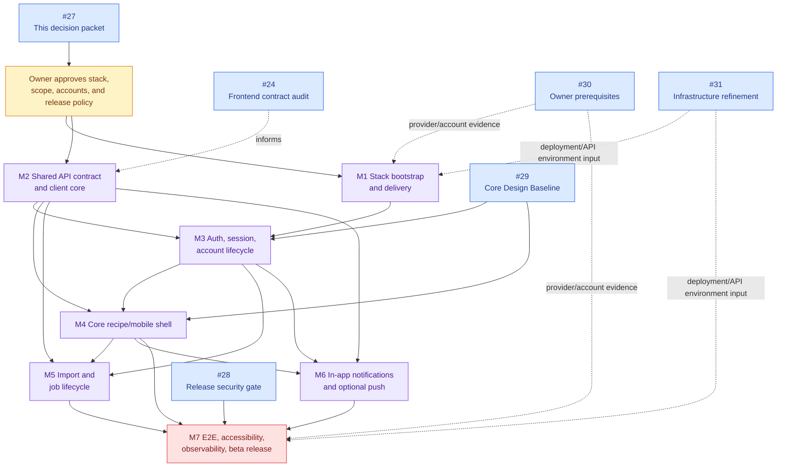

# Native mobile client architecture decision packet

**Issue:** [#27 — Research native client architecture options and contract boundary](https://github.com/starkovalera/recipe-manager/issues/27) 
**Status:** `ready-for-human` — owner stack approval required 
**Decision owner:** Recipe Manager project owner 
**Prepared:** 2026-08-14 
**Scope:** research and recommendation only; this packet adds no production mobile client code.

## Decision summary

### Recommendation for owner approval

Adopt **React Native with Expo, Expo development builds/Continuous Native Generation, and EAS Build/Submit** for the first native client, with the following boundary:

- keep the existing React/Vite web application and its visual implementation separate;
- add a platform-owned `mobile/` application after the stack decision is approved;
- share only non-visual TypeScript contracts and request semantics with the web client;
- generate TypeScript API types from the FastAPI OpenAPI contract instead of copying the current hand-maintained web types into mobile;
- use the official `@clerk/expo` SDK for mobile authentication, but build Recipe Manager's approved auth screens with hooks/custom flows rather than depending on Clerk's beta native UI components;
- use EAS for repeatable Android/iOS development, preview, and production builds, with signing credentials held by the owner-controlled Expo/Apple/Google/GitHub environments;
- treat imports as server-owned durable jobs and mobile as a client that submits, observes, resumes, and presents them;
- make the first mobile release online-first with in-app notification polling; treat push notifications, offline writes, and background uploads as separately approved contract work.

This is a recommendation, not a stack selection. The owner must approve the stack, build-service/account model, mobile first-version scope, and the external setup listed below before implementation issues are created.

### Why this option fits the current repository

The repository already has a React and TypeScript web client, a centralized authenticated HTTP client, a Clerk integration, and a single-backend rule for web and mobile. Expo has an official Clerk SDK, an official build/signing/submission path, and native escape hatches for platform-specific behavior. That makes it possible to reuse request contracts and test utilities without treating the web UI as a mobile template.

The recommendation deliberately does not depend on Expo Go for production behavior. Expo's own documentation requires development builds for native modules such as remote notifications, and EAS Build provides Android/iOS binaries, signing-credential handling, internal distribution, and store-submission integration. The owner should still validate the required native modules and the exact EAS plan before committing.

## Repository baseline and non-negotiable boundaries

The following facts are current at the time of this packet. They are the constraints against which each option is evaluated.

| Boundary | Current repository contract | Mobile consequence |
| --- | --- | --- |
| One backend | The accepted [one-backend ADR](../adr/0001-one-backend-for-web-and-mobile.md) requires one owner-scoped HTTP API for web and mobile. | Mobile must call the same KrakenD/FastAPI boundary. A mobile-only backend or duplicated domain authorization is out of scope. |
| Production topology | The target architecture uses Clerk, KrakenD, FastAPI, PostgreSQL, SQS/Lambda, S3, and Flagsmith; the exact native delivery path is the open #27 decision. See [production architecture](production-architecture.md). | The client stack must fit a public HTTPS API, durable server jobs, private media, and the existing provider boundaries. |
| Authentication | Clerk owns credentials and sessions; KrakenD validates the JWT; FastAPI maps the verified subject to an internal active user and owns authorization. See [authentication and authorization](../authentication-and-authorization.md). | Mobile needs a native/session-safe Clerk adapter and must still call `POST /me/provision`. It must never send a Clerk secret or bypass FastAPI authorization. |
| API shape | FastAPI publishes OpenAPI at runtime. The current web client has manually maintained TypeScript types and a thin `fetch` client. There is no committed generated client package. | Generate a shared contract artifact for TypeScript consumers and keep runtime request behavior in a small platform-neutral client layer. |
| Import lifecycle | `POST /imports` accepts multipart text/URL/files, returns `202` for a new durable queued job, and `GET /imports/{jobId}` exposes status. Server workers own processing and retry. See [import pipeline](../import-pipeline.md). | Mobile submits with an installation/client id and idempotency key, then refetches on screen entry/resume. It must not execute the import in a device background worker. |
| Media | Clients use stable `(type, id)` references and `POST /media/access`; storage keys and bucket names never cross the API boundary. Direct grants and authenticated-fetch grants have short-lived/lifecycle-aware semantics. See [media access](../media-access.md). | A mobile media adapter must resolve grants into native image/file loading without logging or persisting signed URLs. Upload and large-file background behavior remain separate decisions. |
| Notifications | `GET /notifications`, read/unread mutations, and 5-second web polling exist. There is no device-token registration, APNs/FCM delivery, or push deep-link contract. | The first mobile slice can use the existing in-app notification API. Remote push requires a separate backend/provider contract and owner approval. |
| Offline/background | The current web application has no service worker, offline-write contract, or resumable upload contract. | The first release should be online-first. Background refresh may revalidate server state; it must not imply offline mutation or durable local import execution. |
| Observability | Server and worker logs use non-sensitive identifiers and CloudWatch is the initial monitoring choice; Sentry is explicitly deferred in the production architecture. | Mobile release work needs a deliberate client crash/diagnostic policy. API logs remain authoritative for server behavior and must not receive tokens, raw media, recipe sources, or signed URLs. |
| Design boundary | The Core Design Baseline is the gate for production client UI. Existing prototypes and screenshots are design evidence, not production source. See [project context](../../CONTEXT.md) and [Design roadmap](../../design/roadmap.md). | Mobile navigation, gestures, sheets, native permission prompts, accessibility semantics, and visual components remain platform-owned and design-gated. |
| Deployment | The repository currently builds/tests the web, backend, and gateway. There is no mobile workflow, app identifier, signing setup, or store account recorded. | Build, signing, store, secrets, device-matrix, and beta-release work must be introduced as explicit mobile delivery issues after approval. |

The current API client already centralizes bearer-token injection and maps error responses to `{ errorCode, message }`. It also sends `X-Client-Id` for imports and supports `Idempotency-Key` at the API boundary. These are reusable behavioral contracts, not a reason to copy the browser implementation or its `localStorage` dependency.

## Evaluation criteria

The options use the same criteria. Scores are directional decision aids, not benchmark results; a score of 5 is the best fit for this repository and the first mobile beta.

| Criterion | Weight | What a good option must provide |
| --- | ---: | --- |
| Fit with current team and repository | 20% | Reuse TypeScript knowledge and non-visual contracts without coupling mobile to web UI. |
| Native UX and escape hatches | 15% | Platform-specific navigation, permissions, media, accessibility, and lifecycle behavior remain possible. |
| Auth and API integration | 15% | A credible Clerk/session path and a thin client for the existing API without a second backend. |
| Media, background work, and notifications | 15% | Native media handling and OS constraints are visible rather than hidden behind an unrealistic “runs anywhere” promise. |
| Build, signing, CI, and store delivery | 15% | Repeatable Android/iOS artifacts, secrets separation, beta distribution, and a practical release path. |
| Testing and accessibility | 10% | Unit/component, device/integration, E2E, and VoiceOver/TalkBack verification seams. |
| Long-term maintenance and cost | 10% | Upgrade burden, specialist knowledge, provider dependence, and direct recurring cost are explicit. |

## Options compared

### Option A — React Native + Expo/EAS (recommended)

**Shape:** TypeScript/React Native application, Expo SDK, development builds, CNG/prebuild for native configuration, EAS Build/Submit, and platform-specific files/modules where behavior genuinely differs.

**Contract boundary:**

- `packages/api-contract/`: generated TypeScript types from the FastAPI OpenAPI document, committed or reproducibly generated in CI;
- `packages/api-client/`: runtime-neutral request/error/media/job semantics, with an injected token provider and storage/transport adapters;
- `frontend/`: existing web application and web-only UI;
- `mobile/`: native navigation, screens, gestures, media pickers, notification permissions, deep links, secure storage, and accessibility semantics.

**Strengths:**

- strongest reuse of the current React/TypeScript team knowledge and non-visual client contracts;
- official Clerk Expo SDK with React hooks and native OAuth options;
- React Native supports platform-specific modules and file extensions, so iOS/Android differences do not require duplicating the whole product;
- Expo/EAS provides a documented build, signing, internal distribution, submission, and optional update path;
- `expo-notifications` and `expo-background-task` expose native services while documenting OS delivery and scheduling limits;
- Jest is available in the React Native testing path, and Expo documents EAS Workflows with Maestro for device E2E tests.

**Risks and trade-offs:**

- Expo SDK, React Native, native dependency, and config-plugin upgrades remain a recurring maintenance responsibility;
- native modules and remote notifications require development/production builds, not Expo Go;
- Clerk's Expo native UI components are currently documented as beta, so the recommendation is to use the SDK hooks/custom-flow path and keep auth UX under the product's design contract;
- EAS reduces build operations but introduces a hosted service, account ownership, credential policy, and usage-based cost decision;
- JavaScript code is shared, but native permissions, file URIs, background execution, notification behavior, and accessibility still require iOS/Android verification.

**Fit score:** 5 / 5 for repository/team fit; 4 / 5 for native behavior; 5 / 5 for auth/API fit; 4 / 5 for lifecycle capabilities; 5 / 5 for delivery; 4 / 5 for testing/accessibility; 4 / 5 for long-term maintenance/cost.

### Option B — Flutter

**Shape:** Dart/Flutter application with Flutter widgets, native plugins, and platform channels for behavior that is not available through a plugin.

**Strengths:**

- coherent single UI toolkit for Android and iOS with explicit widget, integration-test, localization, and accessibility guidance;
- Flutter documents platform channels and Pigeon for typed Dart/native communication;
- background execution can use Dart isolates and platform-backed scheduling such as WorkManager, subject to OS limits;
- Flutter's official integration-test package can run on physical devices, emulators, and Firebase Test Lab;
- no mandatory Expo hosted build service is required; the project can use GitHub Actions/fastlane or a Flutter-focused CI provider.

**Risks and trade-offs:**

- the existing React/TypeScript application and client code cannot be reused directly; contract generation would need a Dart client or a Dart adapter over the OpenAPI schema;
- the current official Clerk SDK reference lists Expo, Android, and iOS SDKs but not Flutter. This is an inference from the provider's current SDK catalog, so a Flutter proof of concept must validate the exact Clerk/OIDC flow before selection;
- native plugins, notification delivery, background scheduling, and permission behavior still need platform testing and may introduce Kotlin/Swift code;
- signing and release automation remain the team's responsibility unless a separate CI/CD provider is selected;
- a second application language and package ecosystem increase onboarding and cross-client contract drift risk.

**Fit score:** 2 / 5 for repository/team fit; 4 / 5 for native behavior; 3 / 5 for auth/API fit pending a Clerk proof of concept; 4 / 5 for lifecycle capabilities; 3 / 5 for delivery; 4 / 5 for testing/accessibility; 3 / 5 for long-term maintenance/cost.

### Option C — Kotlin Multiplatform + Compose Multiplatform or native UI

**Shape:** Kotlin Multiplatform shared domain/network/data modules, with either Compose Multiplatform UI or Android Jetpack Compose plus iOS SwiftUI/UIKit. The safer initial variant is shared logic with platform-owned UI; shared UI can be introduced later if it proves compatible with the approved product design.

**Strengths:**

- the best direct access to native Android/iOS lifecycle, background, notification, media, and accessibility APIs;
- Kotlin Multiplatform explicitly supports sharing common business logic while retaining platform-specific code through source sets and `expect`/`actual` mechanisms;
- official Clerk Android and iOS SDKs exist, allowing platform-native session integrations;
- common and platform-specific tests are first-class in the KMP project model;
- Compose Multiplatform's Android and iOS targets are documented as stable, while native UI can remain the fallback for platform-specific UX.

**Risks and trade-offs:**

- it adds Kotlin/Gradle and Swift/Xcode expertise to a Python/TypeScript repository and does not reuse the current TypeScript client implementation;
- iOS consumes a framework generated by the shared Kotlin module, which creates an additional Gradle/Xcode integration and release boundary;
- platform-specific auth, media, background, notification, and UI code remains substantial even with shared business logic;
- Android and iOS build/signing workflows must be owned directly or through another CI provider; there is no EAS-like default path;
- Compose Multiplatform can reduce UI duplication but increases the number of framework-specific decisions and should not be used to bypass the approved mobile design contract.

**Fit score:** 2 / 5 for repository/team fit; 5 / 5 for native behavior; 4 / 5 for auth/API fit; 5 / 5 for lifecycle capabilities; 2 / 5 for delivery; 4 / 5 for testing/accessibility; 2 / 5 for long-term maintenance/cost.

### Comparison conclusion

Flutter is a credible product option if the owner values a fully independent UI toolkit and accepts a new language plus a Clerk integration proof of concept. Kotlin Multiplatform is a credible option if native platform control and future shared domain logic outweigh the repository's current TypeScript alignment. React Native + Expo/EAS has the lowest first-client coordination cost while still preserving native UX and platform-owned behavior, so it is the recommended option for approval.

The recommendation is not based on assuming that all mobile behavior is portable. It is based on placing the portability where the repository already has a stable contract—HTTP/OpenAPI, auth token acquisition, error mapping, job states, and media references—and leaving lifecycle-sensitive behavior on the platform.

## Capability and contract matrix

| Capability | Existing server contract | First mobile decision | Gap or follow-up |
| --- | --- | --- | --- |
| Auth and session | Clerk issues the session token; KrakenD validates it; FastAPI owns user provisioning and authorization. | Mobile obtains a token through the selected native SDK, injects it into the same HTTPS client, calls `/me/provision`, and clears local state on sign-out/session change. | Register native app credentials, redirect/deep-link schemes, and secure token storage. No backend auth fork. |
| Owner scope and roles | `/me` returns backend-derived capabilities. Ordinary recipes, media, imports, notifications, search, collections, and tags remain owner-scoped for every role. | Treat capabilities as UX hints only; every mobile request uses the same backend authorization. | Add contract tests proving mobile cannot rely on role visibility to access data. |
| Error handling | Current errors are `{ errorCode, message }`; frontend maps them to `ApiError` with HTTP status. | Share a typed error model and safe user-facing mapping; preserve unknown-code fallback. | Define an explicit generated error schema and retry classification before shared client implementation. |
| Import submission | `POST /imports` is multipart, accepts `clientImportId`, optional text/URL/files, `X-Client-Id`, and `Idempotency-Key`; new work returns `202`. | Use a secure/stable installation identifier plus a per-submission idempotency key; convert native file URIs to multipart parts. | Validate maximum file size/count, MIME handling, cancellation, and foreground/background upload behavior on real devices. |
| Import execution/status | Queue/Lambda processing is server-owned; `GET /imports/{jobId}` exposes the durable state; current web detail polling is 1 second while active. | Poll with backoff while the detail view is visible, refetch on app resume, and render the server state after reconnect. | There is no owner-scoped list of active jobs. Add one only if the approved mobile home/import UX needs it. |
| Media reads | `POST /media/access` returns ordered per-item grants; storage keys and signed URLs are not durable IDs. | Implement native `direct` and `authenticated_fetch` adapters; use memory/file cache only with explicit expiry and revocation rules. | The current `accessMode` wording is browser-oriented. Confirm platform-neutral terminology before adding a generated client. |
| Media uploads | Current import multipart submission is the upload path; there is no general upload-intent/resumable-upload contract. | Keep uploads foreground-only for the first slice unless product scope explicitly requires background/resumable uploads. | A background or unreliable-network upload requires a separate upload-intent, resume, cleanup, and progress contract. |
| In-app notifications | `GET /notifications`, read/unread mutation, read-all mutation, and web polling exist. Notification data includes entity type/id for deep links. | Reuse the API for foreground refresh, unread state, and recipe/import deep links. | Make mobile query freshness and app-resume behavior explicit; do not call this remote push. |
| Remote push | No device-token registration, token rotation, provider delivery, permission preference, or delivery status exists. | Do not make push a prerequisite of the initial online-first mobile slice. | If required for Mobile Beta, create a separate backend/mobile epic for APNs/FCM or an approved push gateway, device registration, payload/deep-link contract, privacy, retries, and revocation. |
| Offline reads/writes | No offline-first or service-worker contract exists. | Online-first. A local cache may improve resume behavior but is never the source of truth for writes. | Owner must decide whether offline browsing or queued edits belong in first mobile scope. |
| Background refresh | Server jobs continue without a client process. Expo/Flutter/native schedulers are OS-controlled and may run late or not at all. | Use background execution only for best-effort revalidation or notification handling, never for import execution. | Define minimum freshness expectations and telemetry before scheduling work. |
| Feature flags | Flagsmith is a cross-client provider in the target architecture; `/me` exposes effective capabilities for the current user. | Keep flag evaluation server-authoritative for protected behavior; use client flags for presentation/rollout only. | Add mobile platform/version targeting to the flag contract if staged rollout requires it. |
| Observability | CloudWatch receives structured server/worker logs with release, request, user, job, recipe, message, and operation identifiers; sensitive payloads are excluded. | Send platform and app release metadata in a safe, bounded form; attach request/job ids to diagnostic views without copying secrets. | Owner must choose OS-store metrics only versus a client crash/telemetry provider such as the currently deferred Sentry. |
| API evolution | OpenAPI is produced by FastAPI; web types are manually maintained and historical plans explicitly deferred generated frontend types. | Make OpenAPI the shared schema source; generate client types in CI and fail on drift. | Choose generator, output ownership, breaking-change policy, and version compatibility checks in the shared-contract epic. |

## Shared contract versus platform-owned code

### Shared and server-owned

These boundaries may be shared across web and the recommended React Native client:

- OpenAPI-generated request/response types and enum values;
- typed error envelope and safe error classification;
- API request construction, bearer-token provider interface, base URL/environment selection, and response parsing;
- pagination, sorting, query-key identity, and mutation invalidation semantics where those are part of the API contract;
- import job state machine, idempotency rules, retry presentation rules, and notification entity/deep-link mapping;
- media reference and grant model, expiry handling, and safe logging rules;
- feature/capability names returned by `/me`;
- contract fixtures and backend/API compatibility tests.

The server remains the owner of authorization, persistence, queue execution, media lifecycle, notification truth, and error-code meaning. Generated client artifacts are consumers of that contract, not a second source of truth.

### Platform-owned

These responsibilities must remain in the mobile application or native platform adapters:

- navigation, screen layout, gestures, sheets, keyboard behavior, and responsive/native interaction patterns;
- VoiceOver/TalkBack semantics, focus order, hit targets, dynamic type, reduced-motion behavior, and permission education;
- Clerk native SDK initialization, secure token/session storage, redirect/deep-link handling, and provider-specific lifecycle callbacks;
- photo library/camera/document picker integration and conversion of platform file references into multipart uploads;
- image loading/cache implementation and revocation of authenticated media object URLs/files;
- notification permission prompts, device-token lifecycle, native notification channels/categories, and OS callbacks;
- background task registration, lifecycle constraints, retry scheduling, and app-resume refresh;
- platform build settings, app identifiers, entitlements, signing, store metadata, and release artifacts.

Do not share web React components, CSS, DOM assumptions, screenshots, or prototype data as a mobile implementation shortcut.

## Recommended bootstrap and migration outline

This sequence assumes owner approval of Option A. If the owner selects another option, preserve the contract phases but replace the platform/bootstrap steps.

### Phase 0 — human decision and prerequisites

1. Approve React Native + Expo/EAS or select another evaluated option.
2. Decide whether hosted EAS builds/signing are acceptable, whether the owner or CI owns credentials, and which EAS plan is allowed.
3. Create or verify the Apple Developer and Google Play accounts, app ownership, bundle identifier/application ID, and tester ownership.
4. Configure Clerk native application settings, redirect/deep-link schemes, social-provider credentials if used, and the production/preview environment policy.
5. Choose minimum iOS/Android versions, device matrix, release cadence, and whether first Mobile Beta is online-only.
6. Decide whether remote push, offline reads, offline writes, and background uploads are first-version requirements.

### Phase 1 — shared contract and client seam

1. Inventory the stable OpenAPI surface and endpoint/error/media/job contracts using the output of #24 and this packet.
2. Add a reproducible OpenAPI-to-client-type generation step; commit generated TypeScript types or publish them as a same-repository package according to the approved ownership rule.
3. Extract or reimplement a small runtime-neutral client core that accepts a token provider and platform transport/storage adapters. Do not make the backend depend on generated frontend output.
4. Add contract checks for method/path parity, error envelope, enum/status values, media grants, multipart imports, idempotency, and safe retry behavior.
5. Resolve only the API gaps required by the approved first mobile slice. Push notifications, resumable uploads, and offline writes remain separate until explicitly promoted.

### Phase 2 — mobile shell and delivery proof

1. Add an isolated `mobile/` Expo application; keep it out of the web component tree.
2. Establish development, preview, and production profiles with environment-specific public configuration only. No backend or provider secrets go into the bundle.
3. Prove Android and iOS development builds, local device connectivity to the intended API environment, Clerk sign-in/provisioning, deep links, secure session restoration, and sign-out.
4. Establish unit/component tests, one device E2E smoke flow, and accessibility checks before feature screens are implemented.
5. Establish EAS/GitHub workflow ownership, artifact retention, signing policy, and build provenance.

### Phase 3 — approved Core mobile vertical slices

Implement only after the relevant #29 Core Design outcomes are approved:

1. authenticated shell and capability-driven navigation;
2. recipe list/detail/search and media read access;
3. recipe edit behavior covered by the approved mobile design contract;
4. import submission, durable job detail, retry presentation, and notification list/read behavior;
5. account/session/deletion states that match the existing backend lifecycle.

Each slice uses the shared contract package and platform-owned UI/accessibility tests. No slice should introduce a second backend or silently add offline semantics.

### Phase 4 — optional push/background/offline work

Promote this phase only after owner approval and a separate contract:

- device token registration, refresh, revoke, provider routing, payload privacy, and deep-link mapping;
- notification permission education and OS-specific categories/channels;
- best-effort background refresh with explicit freshness/telemetry rules;
- resumable uploads if background or unreliable-network imports are a product requirement;
- encrypted local cache and conflict/queue semantics if offline writes are approved.

### Phase 5 — beta and release evidence

1. Run backend contract and mobile unit/component suites on every affected change.
2. Run Android and iOS device/E2E flows for sign-in, provisioning, recipe/media access, import submission/status, notification deep links, retry, account-state handling, and sign-out.
3. Execute VoiceOver and TalkBack checks against the approved Core mobile flows, including permission denial and network failure states.
4. Publish internal builds through TestFlight and Google Play internal testing; preserve build number, commit, environment, tester group, and feedback evidence.
5. Verify API/server release correlation, client crash diagnostics, privacy-safe logs, permissions, signing, rollback, and store metadata before Mobile Beta.

## Proposed implementation epics and dependencies

These are proposed slices for refinement after the owner approves the stack. They are not new GitHub issues yet.

| Proposed epic | Outcome | Required blockers |
| --- | --- | --- |
| M1. Stack bootstrap and delivery | Isolated mobile app, local development, build profiles, signing/secrets policy, and CI artifact proof. | Owner stack/account approval; #30 for provider/account evidence. |
| M2. Shared API contract and client core | Generated contract artifacts, runtime-neutral request/error/media/job semantics, and drift checks. | #24 as an input; API gap decisions from this packet. Does not require mobile UI approval. |
| M3. Auth, session, and account lifecycle | Native Clerk session, provisioning, deep links, secure restoration, sign-out, deactivated/deletion-pending states. | M1; Clerk native configuration from #30; #29 for approved auth UX. |
| M4. Core recipe/mobile shell | Approved navigation, recipe list/detail/search/edit, media reads, accessibility, and localization behavior. | M2 + M3 + applicable #29 Core Design outcomes. |
| M5. Import and job lifecycle | Multipart import, idempotency/client identity, job detail polling/resume, retry, and safe media handling. | M2 + M3 + approved import/mobile design; server import contract remains authoritative. |
| M6. In-app notifications and optional push | Foreground notification list/read/deep links first; push only if promoted with its backend contract. | M2 + M3; push additionally requires an approved provider/device-token epic. |
| M7. E2E, accessibility, observability, and beta release | Device matrix, store test tracks, release evidence, crash/telemetry policy, and Mobile Beta gate. | M1–M6 as applicable; #30 provider evidence; technical production/security gates in #32. |

Solid arrows in the diagram are execution blockers. Dashed arrows are inputs that may inform refinement without blocking every part of the work. The native issue dependency graph should be created only after these proposed epics are refined into independently verifiable child issues.

## Human-owned decisions and prerequisites

### Required before implementation starts

- stack selection and acceptance of the recommended React Native + Expo/EAS service boundary;
- owner for Apple Developer, Google Play, and optional Expo organization accounts;
- Apple bundle identifier, Google application ID, package/display name, support URL, privacy policy, and store ownership;
- Clerk native application configuration, redirect/deep-link schemes, social-provider credentials, and environment separation;
- minimum OS versions and a physical-device/simulator test matrix;
- EAS hosted-build/signing policy or an explicit decision to use self-managed macOS/Android CI;
- GitHub/EAS environment owners, signing secret rotation, artifact retention, and release approval rules;
- first Mobile Beta behavior for online/offline use, push notifications, background refresh, and background uploads;
- client observability policy: OS/store metrics only, or a privacy-reviewed client error/crash provider.

### Cost and account notes verified for this packet

- Apple lists the Apple Developer Program at **USD 99 per membership year**, with regional pricing/eligibility caveats.
- Google Play lists a **one-time USD 25 registration fee**; account verification and testing requirements can vary by account type and date.
- Expo's current pricing page lists a Free tier with limited low-priority builds and a Starter plan at **USD 19/month** plus usage-based charges. EAS can be used on the Free plan, but queue priority, build credits, update limits, and overage rules must be rechecked before approval.
- The existing server cost estimate in [production architecture](production-architecture.md) excludes mobile-store accounts, EAS/CI usage, devices, taxes, and client observability.

Do not create or pay for these accounts, accept store agreements, or commit signing credentials as part of this research issue. Record identifiers and secret-reference names only after the owner has completed the action through [#30](https://github.com/starkovalera/recipe-manager/issues/30).

## Rejected shortcuts and explicit non-goals

- **Second mobile backend:** rejected by the accepted one-backend ADR and would duplicate auth, ownership, job, media, and notification rules.
- **Copy the web UI into mobile:** rejected; responsive web components, CSS, DOM behavior, prototypes, and screenshots are not a native client architecture.
- **Treat Expo Go as the production test surface:** rejected for native modules and remote notifications; use development/preview/production builds.
- **Run import processing on the device:** rejected; the queue/Lambda/backend pipeline is durable and server-owned.
- **Assume push from in-app notifications:** rejected; device registration and provider delivery are not present in the current API.
- **Add offline writes implicitly:** rejected; conflict, queue, retry, encryption, and user-visible freshness semantics are not defined.
- **Share generated client runtime with the backend:** rejected; the backend owns OpenAPI and domain behavior, while generated client artifacts are consumers.
- **Select a framework from visual preference alone:** rejected; auth, signing, lifecycle, testability, account ownership, and maintenance are first-class constraints.

## Acceptance mapping

| Issue #27 criterion | Packet evidence |
| --- | --- |
| Options use the same criteria | [Evaluation criteria](#evaluation-criteria), scores, and three option sections. |
| Backend continuity and platform UX are preserved | [Repository baseline](#repository-baseline-and-non-negotiable-boundaries) and [shared versus platform-owned boundary](#shared-contract-versus-platform-owned-code). |
| Auth, notifications, media, offline/background, testing, CI, signing, and store delivery are addressed | [Capability matrix](#capability-and-contract-matrix), option sections, [bootstrap](#recommended-bootstrap-and-migration-outline), and [human prerequisites](#human-owned-decisions-and-prerequisites). |
| Costs, external accounts, and human-owned setup are explicit | [Cost and account notes](#cost-and-account-notes-verified-for-this-packet) and [human-owned decisions](#human-owned-decisions-and-prerequisites). |
| No production client code is added | This branch changes only this Markdown decision packet. |
| Final handoff is ready for human stack approval | Status at the top of this packet and the proposed approval gate in the dependency graph. |
| Shared Development Task Completion Checkpoint | The handoff follows [`docs/agents/task-completion.md`](../agents/task-completion.md); no backend code changed, so the backend refactoring review is not applicable. |

## Primary sources

The platform claims in this packet were checked against first-party documentation on 2026-08-14. Pricing, store policy, supported OS versions, SDK status, and provider limits are time-sensitive and must be rechecked during implementation.

### Current repository sources

- [One backend and API contract ADR](../adr/0001-one-backend-for-web-and-mobile.md)
- [Production architecture](production-architecture.md)
- [API contract](../api.md)
- [Authentication and authorization](../authentication-and-authorization.md)
- [Media access](../media-access.md)
- [Import pipeline](../import-pipeline.md)
- [Production prerequisites](../production-prerequisites.md)
- [Development Task Completion Checkpoint](../agents/task-completion.md)

### React Native, Expo, and Clerk

- [Expo — EAS Build](https://docs.expo.dev/build/introduction/)
- [Expo — Create your first build](https://docs.expo.dev/build/setup/)
- [Expo — EAS pricing and plans](https://docs.expo.dev/billing/plans/)
- [Expo — Notifications](https://docs.expo.dev/versions/latest/sdk/notifications/)
- [Expo — BackgroundTask](https://docs.expo.dev/versions/latest/sdk/background-task/)
- [Expo — E2E tests with Maestro](https://docs.expo.dev/eas/workflows/examples/e2e-tests/)
- [React Native — Platform-specific code](https://reactnative.dev/docs/platform-specific-code.html)
- [React Native — Testing](https://reactnative.dev/docs/testing-overview)
- [Clerk — Expo SDK reference](https://clerk.com/docs/reference/expo/overview)
- [Clerk — Expo quickstart](https://clerk.com/docs/expo/getting-started/quickstart)
- [Clerk — SDK references](https://clerk.com/docs/reference/overview)

### Flutter

- [Flutter — Platform channels](https://docs.flutter.dev/platform-integration/platform-channels)
- [Flutter — Background processes](https://docs.flutter.dev/packages-and-plugins/background-processes)
- [Flutter — Accessibility testing](https://docs.flutter.dev/ui/accessibility/accessibility-testing)
- [Flutter — Integration tests](https://docs.flutter.dev/testing/integration-tests)
- [Flutter — Continuous delivery](https://docs.flutter.dev/deployment/cd)
- [Flutter — Supported deployment platforms](https://docs.flutter.dev/reference/supported-platforms)

### Kotlin Multiplatform and Compose Multiplatform

- [Kotlin Multiplatform — Overview](https://kotlinlang.org/docs/multiplatform/kmp-overview.html)
- [Kotlin Multiplatform — Share code on platforms](https://kotlinlang.org/docs/multiplatform/multiplatform-share-on-platforms.html)
- [Kotlin Multiplatform — Compose Multiplatform](https://kotlinlang.org/docs/multiplatform/compose-multiplatform.html)
- [Kotlin Multiplatform — Project configuration and iOS framework integration](https://kotlinlang.org/docs/multiplatform/multiplatform-project-configuration.html)
- [Kotlin Multiplatform — Testing](https://kotlinlang.org/docs/multiplatform/multiplatform-run-tests.html)
- [Clerk — Android SDK installation](https://clerk.com/docs/android/reference/native-mobile/installation)
- [Clerk — iOS SDK installation](https://clerk.com/docs/ios/reference/native-mobile/installation)

### Store delivery and accounts

- [Apple Developer Program enrollment and fee](https://developer.apple.com/programs/enroll/)
- [Apple TestFlight overview](https://developer.apple.com/help/app-store-connect/test-a-beta-version/testflight-overview/)
- [Apple App Store Connect workflow](https://developer.apple.com/help/app-store-connect/get-started/app-store-connect-workflow)
- [Google Play registration and app setup](https://support.google.com/googleplay/android-developer/answer/9859152)
- [Google Play internal/open/closed testing](https://support.google.com/googleplay/android-developer/answer/9845334)
- [Google Play registration fee and account conditions](https://support.google.com/googleplay/android-developer/answer/14659200)
