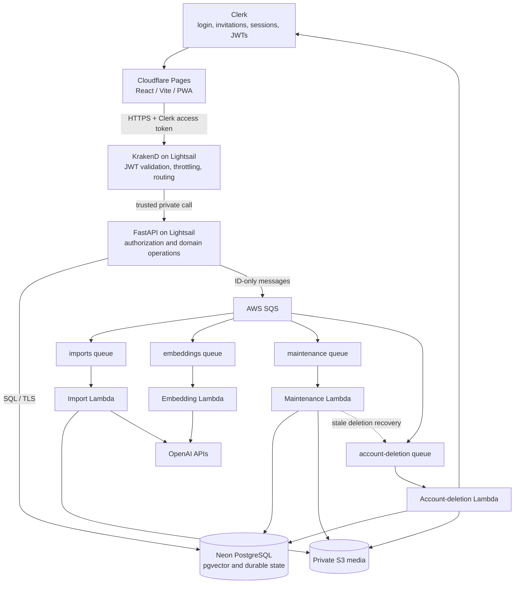

# Recipe Manager — Production Architecture Rules and Standards

**Status:** agreed target architecture for the initial closed beta  
**Last updated:** 2026-07-16  
**Expected scale:** fewer than 100 users, very low request volume  
**Hosted environments:** one hosted production environment; `preview` remains local  
**Primary goals:** low fixed cost, invite-only access, managed background execution, secure user isolation, and a clear path to public access later

> Vendor pricing, free-tier rules, EU-region availability, DPA terms, and service limits must be rechecked immediately before deployment.

---

## 1. Selected production stack

```text
Cloudflare Pages
  React / Vite / PWA

AWS Lightsail — 1 GB
  KrakenD Community Edition
  FastAPI

AWS SQS
  imports
  embeddings
  maintenance
  account-deletion

AWS Lambda
  import function
  embedding function
  maintenance function
  account-deletion function

EventBridge Scheduler
  maintenance schedules

Neon
  managed PostgreSQL + pgvector
  built-in restore window and snapshots

AWS S3
  private media storage

Clerk
  authentication and invite-only registration

Flagsmith
  frontend and backend feature flags
```

OpenAI remains the external AI provider.

The initial production architecture does **not** include:

```text
FastAPI on Lambda
DynamoDB as the primary database
RabbitMQ
Redis
Dramatiq
permanent worker containers
scheduled pg_dump jobs
Sentry
```

---

## 2. Environment model

Use two environments:

```text
preview
prod
```

### `preview`

The only local environment.

It keeps the current disposable preview behavior and runs on the developer machine.

It keeps:

- Docker Compose;
- local PostgreSQL;
- Redis and Dramatiq;
- local file storage;
- Clerk development authentication;
- fake AI providers;
- local feature-flag defaults.

There is no separate local `dev` environment and no hosted pre-production environment at this stage.

### `prod`

The only hosted environment.

It contains:

- Cloudflare Pages frontend;
- Lightsail instance with KrakenD and FastAPI;
- SQS queues and DLQs;
- import, embedding, maintenance, and account-deletion Lambdas;
- EventBridge schedules;
- Neon PostgreSQL;
- private S3 media storage;
- Clerk production application;
- Flagsmith production environment;
- CloudWatch logs, metrics, alarms, and AWS cost budgets.

---

## 3. Repository organization

Keep frontend, backend, and Lambda code in a single repository.

Recommended structure:

```text
frontend/
  React / Vite / PWA

backend/
  FastAPI application
  SQLAlchemy models
  Pydantic schemas
  domain services
  Lambda handlers
  Alembic migrations
  tests

infra/
  Terraform or OpenTofu
  deployment configuration
```

Do not split repositories merely to deploy components independently.

Independent deployment must be implemented through separate artifacts and CI/CD workflows:

```text
frontend changes
  -> deploy Cloudflare Pages only

FastAPI changes
  -> deploy Lightsail FastAPI artifact only

import Lambda changes
  -> deploy import Lambda only

embedding Lambda changes
  -> deploy embedding Lambda only

maintenance Lambda changes
  -> deploy maintenance Lambda only

account-deletion Lambda changes
  -> deploy account-deletion Lambda only
```

Use path-based CI filters plus an explicit dependency map.

Backend and Lambda code should remain together because they share:

- SQLAlchemy models;
- Pydantic schemas;
- domain services;
- authorization logic;
- queue message contracts;
- storage abstractions;
- configuration and error codes.

Keep the frontend in the same repository while one team owns the product and coordinated changes are common.

Split repositories later only for a concrete organizational or security reason, such as:

- independent teams;
- different access restrictions;
- separate release governance;
- repository/CI size becoming problematic;
- mobile clients becoming separately owned products.

A monorepo is not a single deployment unit.

---

## 4. High-level request flow



---

## 5. Cloudflare Pages

Use Cloudflare Pages for the React/Vite frontend.

Requirements:

- HTTPS;
- custom domain;
- PWA support;
- no backend secrets in frontend environment variables;
- production build tied to a known release commit;
- frontend API URL points only to KrakenD.

Cloudflare preview URLs may be used for frontend review, but they do not represent a separate backend environment.

The production frontend remains a React/Vite SPA. Complete the dedicated
frontend redesign/rewrite only after technical production is operational and
before inviting external beta users.

---

## 6. Lightsail layout

Use one Linux Lightsail instance with approximately:

```text
1 GB RAM
2 vCPU
40 GB SSD
```

Run only:

```text
KrakenD
FastAPI
deployment/support utilities
```

FastAPI remains a long-running containerized service on Lightsail. It is **not** migrated to Lambda.

Do not run on the instance:

```text
PostgreSQL
RabbitMQ
Redis
permanent workers
user media storage
```

### Network boundary

Expose publicly:

```text
KrakenD: 80/443
```

Keep private inside the Docker network:

```text
FastAPI
```

FastAPI must not publish a host port.

Restrict SSH to an explicit administrator IP allowlist or another protected administrative access mechanism.

Application state must not depend on the Lightsail filesystem.

---

## 7. KrakenD gateway

Use KrakenD Community Edition as a configuration-driven gateway, not as custom application code.

Responsibilities:

- public API ingress;
- TLS termination;
- routing to private FastAPI;
- Clerk JWT validation through OIDC/JWKS;
- issuer, audience, signature, and expiry checks;
- stripping client-supplied trusted identity headers;
- injecting verified identity claims;
- CORS;
- request-size limits;
- global and route-level throttling;
- per-user throttling by verified token subject where supported;
- access logging without sensitive payloads.

### Authentication flow

1. React sends the user to Clerk for login or invitation acceptance.
2. Clerk authenticates the user and issues a token.
3. React sends the token to KrakenD.
4. KrakenD validates the token.
5. Invalid requests receive `401` and do not reach FastAPI.
6. KrakenD strips any client-provided trusted identity headers.
7. KrakenD forwards verified identity claims, especially `sub`.
8. FastAPI maps the external subject to the internal user.
9. FastAPI enforces roles, permissions, and data scope.

FastAPI does not need to cryptographically revalidate the original token while:

- FastAPI has no public route;
- only KrakenD can reach it;
- trusted headers are always replaced by KrakenD;
- communication occurs through the private Docker network.

### Throttling

Use KrakenD for network-level throttling.

Use FastAPI/PostgreSQL for business limits such as:

```text
maximum concurrent imports per user
retry cooldown
daily expensive-operation quota
```

Gateway throttling is not a replacement for domain quotas.

---

## 8. FastAPI responsibilities

FastAPI remains the application authorization and orchestration layer.

Responsibilities:

- resolve verified Clerk subject to internal `User`;
- enforce roles, permissions, and target-user scope;
- owner-scope user data in SQL;
- perform CRUD and search;
- create durable job state;
- publish IDs to SQS;
- generate presigned S3 URLs;
- expose protected admin/debug APIs;
- evaluate backend feature flags;
- return effective permissions/features through `/me`;
- write domain and audit events.

FastAPI must not execute long-running imports, media processing, embeddings, or maintenance tasks inside HTTP requests.

---

## 9. SQS queues, concurrency, and DLQs

Create Standard queues:

```text
imports
embeddings
maintenance
account-deletion
```

Create matching DLQs:

```text
imports-dlq
embeddings-dlq
maintenance-dlq
account-deletion-dlq
```

Messages contain identifiers or explicit operation names only.

Examples:

```json
{"importJobId": "..."}
```

```json
{"recipeId": "..."}
```

```json
{"operation": "stale_import_reconciliation"}
```

```json
{"userId": "..."}
```

Do not send:

- ORM objects;
- complete recipes;
- uploaded bytes;
- raw source text;
- embedding vectors;
- authentication tokens;
- credentials.

### Initial event-source settings

Use:

```text
imports:
  batch_size = 1
  maximum_concurrency = 2
  maxReceiveCount = 3

embeddings:
  batch_size = 1
  maximum_concurrency = 2
  maxReceiveCount = 3

maintenance:
  batch_size = 1
  maximum_concurrency = 1
  maxReceiveCount = 3

account-deletion:
  batch_size = 1
  maximum_concurrency = 1
  maxReceiveCount = 3
```

After the third unsuccessful receive/processing attempt, move the message to the corresponding DLQ.

Other rules:

- delivery semantics are at least once;
- all handlers must be idempotent;
- use partial batch failure support;
- configure visibility timeout above expected execution duration;
- PostgreSQL remains the source of truth;
- do not enable provisioned concurrency or provisioned SQS pollers initially.

### Enqueue ordering

Required order:

1. create/update durable job state;
2. commit;
3. publish to SQS;
4. record `ENQUEUED` only after successful publishing;
5. on failure, record an enqueue-failure state/event.

Never leave a job looking successfully queued when publishing failed.

---

## 10. Lambda functions

Create:

```text
recipe-manager-import
recipe-manager-embedding
recipe-manager-maintenance
recipe-manager-account-deletion
```

Use on-demand Lambda execution.

Business logic must remain in reusable services:

```text
process_import_job(import_job_id)
process_recipe_embedding(recipe_id)
run_maintenance_operation(operation)
process_account_deletion(user_id)
```

Lambda handlers are infrastructure adapters around these services.

### Packaging

Use Lambda container images in ECR.

The import runtime includes:

- application code;
- required Python dependencies;
- `ffmpeg`;
- `ffprobe`.

Split images only if size or cold start becomes material.

---

## 11. Video duration validation

Long videos are not supported.

Add:

```text
MAX_IMPORT_VIDEO_DURATION_SECONDS
```

Initial recommended value:

```text
300 seconds
```

The authoritative check happens only in the import Lambda.

For URL-based secondary resources, the frontend generally cannot know the real duration without downloading/inspecting the resource and therefore is not responsible for validation.

Required flow:

1. import Lambda downloads or accesses the secondary video resource;
2. Lambda runs `ffprobe`;
3. duration is validated immediately after the resource becomes locally inspectable;
4. validation happens before transcription, frame extraction, and expensive AI calls;
5. malformed or unavailable duration is rejected;
6. duration above the configured limit is rejected;
7. the job is saved as a permanent failure;
8. use stable error codes:

```text
VIDEO_TOO_LONG
VIDEO_DURATION_UNAVAILABLE
```

9. do not retry permanent duration-validation failures;
10. byte-size and duration limits both apply.

---

## 12. Import Lambda

The import Lambda receives `importJobId` and calls:

```text
process_import_job(import_job_id)
```

Requirements:

- idempotent processing;
- safe duplicate-message handling;
- stable statuses and events;
- permanent validation failures are not retried;
- temporary provider/network failures may be retried through SQS;
- final user notification;
- structured logs;
- explicit concurrency limit from Section 9.

---

## 13. Embedding Lambda

The embedding Lambda receives `recipeId` and calls:

```text
process_recipe_embedding(recipe_id)
```

Requirements:

- recalculate current input/hash;
- skip recipes with open review flags;
- avoid recomputation when current embedding is ready;
- tolerate duplicate delivery;
- re-check state after provider calls;
- preserve existing status/event history;
- preserve owner isolation;
- use the concurrency limit from Section 9.

---

## 14. Account-deletion Lambda

The account-deletion Lambda receives `userId` from the dedicated
`account-deletion` queue and calls:

```text
process_account_deletion(user_id)
```

Requirements:

- account deletion is processed only by this Lambda;
- messages contain the internal user identifier only;
- processing is idempotent and safe under duplicate delivery;
- PostgreSQL remains the source of truth for `DELETION_PENDING` state;
- the handler must not depend on a frontend session or identity token;
- failures use the dedicated account-deletion retry and DLQ path;
- maintenance may detect stale deletion requests and republish their IDs, but
  must not execute account deletion itself.

---

## 15. `recipe-manager-maintenance`

`recipe-manager-maintenance` is the periodic safety-net and reconciliation Lambda.

It is **not** the primary handler for normal import failures. The import Lambda must clean up expected failures in its normal execution path.

Maintenance handles abnormal incomplete processing, for example:

- Lambda timeout;
- interrupted execution;
- partial S3 upload;
- state committed before a later step failed;
- stale `RUNNING` status;
- orphaned temporary objects;
- missed cleanup after an unexpected exception.

### Included operations

The initial maintenance scope is exactly:

```text
stale_import_reconciliation
failed_import_artifact_cleanup
orphaned_upload_cleanup
stale_embedding_reconciliation
expired_invitation_cleanup
temporary_resource_cleanup
stale_account_deletion_reconciliation
integrity_check
```

#### `stale_import_reconciliation`

- find imports stuck in `QUEUED` or `RUNNING`;
- mark failed, reset, or re-enqueue according to safe rules;
- preserve diagnostic events;
- prevent duplicate recipe creation.

#### `failed_import_artifact_cleanup`

- delete temporary video/audio/frame artifacts from failed imports;
- remove abandoned cover candidates;
- preserve `ImportJob`, `JobEvent`, error code, and minimal diagnostic context.

#### `orphaned_upload_cleanup`

- find S3 objects not referenced by valid records after a safety delay;
- delete only confirmed orphaned objects;
- do not infer deletion from a single transient database failure.

#### `stale_embedding_reconciliation`

- find embeddings stuck in stale/running states;
- re-enqueue safe work;
- mark unrecoverable cases;
- preserve embedding event history.

#### `expired_invitation_cleanup`

- revoke/archive expired invitations;
- preserve accepted-invitation audit information according to retention policy.

#### `temporary_resource_cleanup`

- remove expired temporary S3 objects and related metadata;
- respect active jobs and retention windows.

#### `stale_account_deletion_reconciliation`

- find users stuck in `DELETION_PENDING` beyond the configured stale threshold;
- republish an ID-only message to the dedicated `account-deletion` queue;
- never execute account deletion inside the maintenance Lambda;
- keep recovery idempotent and safe under duplicate scheduling or delivery.

#### `integrity_check`

- check important cross-record invariants;
- report anomalies;
- perform only explicitly safe repairs.

### Explicitly excluded

The maintenance Lambda does **not** perform:

```text
database_backup
pg_dump
account deletion
normal import exception handling
normal successful-import cleanup
business analytics
large data migrations
```

### Scheduling

EventBridge Scheduler sends operation messages to the `maintenance` SQS queue.

Each operation must be:

- idempotent;
- independently observable;
- safe to rerun;
- protected against duplicate concurrent execution where necessary.

---

## 16. Neon PostgreSQL and pgvector

Use managed Neon PostgreSQL with pgvector.

Requirements:

- choose an EU region where available;
- use TLS;
- use a pooled endpoint for normal application/Lambda traffic;
- use a direct endpoint only when required;
- keep SQLAlchemy pools small;
- cap Lambda concurrency;
- preserve Alembic migrations and relational constraints;
- keep semantic search in PostgreSQL/pgvector.

### Built-in backup and recovery

Primary recovery is Neon-managed.

Configure:

```text
restore window = 7 days
automated snapshots = daily
snapshot retention = 14–30 days
manual snapshot = before risky migrations/backfills
```

Before destructive migrations or large backfills:

1. create a manual snapshot;
2. verify it exists;
3. run the operation;
4. retain it until the change is validated.

### No pg_dump initially

Do not currently:

- package `pg_dump` into Lambda;
- upload scheduled DB dumps to S3;
- add `database_backup` to maintenance;
- maintain a separate backup Lambda.

Neon-managed recovery is sufficient for the initial closed beta.

---

## 17. S3 media storage

Use a private production media bucket.

Store:

```text
uploaded images
short uploaded videos
temporary import artifacts
derived recipe resources
covers
```

Store metadata in PostgreSQL:

```text
owner_id
object_key
resource_type
mime_type
size
checksum
created_at
```

Requirements:

- Block Public Access;
- server-side encryption;
- short-lived presigned URLs;
- strict object-key prefixes;
- lifecycle rules for temporary artifacts;
- deletion recovery/versioning where economical;
- least-privilege IAM;
- no permanent public URLs.

The initial S3 scope is media only. Database dumps are not stored there yet.

---

## 18. Clerk authentication and personal-data boundary

Use Clerk for authentication and invite-only registration.

Clerk stores/processes identity and authentication data, potentially including:

```text
email
name or phone if configured
credentials
verification state
sessions
IP address
device identifiers
login/usage metadata
```

The application stores:

```text
internal user ID
authentication provider and external subject
fixed roles and derived capabilities
application status
recipes and all product data
audit history
```

Do not store in the application DB:

```text
passwords
password hashes
refresh tokens
Clerk session internals
```

Do not store in Clerk:

```text
recipes
ingredients
import content
media
embedding inputs
debug payloads
application audit details
```

Expected GDPR roles:

```text
Recipe Manager = data controller
Clerk = data processor
```

Before production:

- review Clerk DPA;
- review subprocessors;
- document transfer mechanisms;
- minimize identity fields;
- document retention/deletion;
- include Clerk in the privacy policy.

Standard Clerk processing does not automatically mean EU-only storage.

---

## 19. Flagsmith feature management

Use Flagsmith in frontend, FastAPI, and Lambda functions.

Frontend examples:

```text
new_recipe_layout
pwa_install_prompt
feedback_form
```

Backend/Lambda examples:

```text
semantic_search_v2
new_import_pipeline
public_registration
embedding_debug
maintenance_reconciliation_v2
```

A shared flag may be evaluated in both layers:

```text
frontend:
  controls UI visibility

backend:
  controls actual behavior
```

Backend evaluation is authoritative.

Feature flags are not permissions.

Security-sensitive access must never depend only on a frontend flag.

Failure rules:

- SDKs cache configuration;
- no uncached provider request on every API call;
- security-sensitive flags default off;
- provider failure must not crash the system;
- errors are logged without user content.

Expose effective permissions and features through `/me`.

---

## 20. Logging and AWS-native monitoring

Use structured logs in:

```text
FastAPI
import Lambda
embedding Lambda
maintenance Lambda
account-deletion Lambda
```

Attach non-sensitive identifiers:

```text
environment
release
requestId
internalUserId
importJobId
recipeId
SQS messageId
operation
```

Do not log:

```text
JWTs
credentials
raw media
full recipe sources
full embedding inputs
embedding vectors
```

Use CloudWatch for:

```text
DLQ messages > 0
Lambda errors
Lambda throttles
Lambda duration near timeout
oldest SQS message age
maintenance failures
account-deletion failures
unexpected cost growth
```

Sentry is intentionally deferred to Future Improvements.

---

## 21. CI/CD and release flow

### Source control

- `main` is the default and primary integration branch;
- feature work uses branches and pull requests;
- required checks pass before merge.

### Independent deployability

Use separate workflows/artifacts for:

```text
Cloudflare frontend
Lightsail FastAPI
import Lambda
embedding Lambda
maintenance Lambda
account-deletion Lambda
infrastructure
```

Shared-model or migration changes must trigger compatibility checks for all affected deployables.

### Production release

There is no hosted dev environment.

Production deployment is manually triggered for a known `main` commit.

Release flow:

1. identify exact commit;
2. run all required checks;
3. build immutable artifacts/images;
4. push Lambda images to ECR;
5. create a manual Neon snapshot before risky schema changes;
6. run one controlled Alembic migration;
7. apply infrastructure changes;
8. deploy Lambdas;
9. deploy FastAPI/KrakenD to Lightsail;
10. deploy Cloudflare Pages frontend;
11. run smoke tests;
12. verify queues, DLQs, auth, flags, and alarms;
13. record release;
14. support code rollback.

---

## 22. Cost estimate

Assumptions:

```text
one hosted production environment
fewer than 100 users
very low traffic
no provisioned Lambda concurrency
small DB and media volume
free SaaS tiers where appropriate
```

| Component | Planning estimate |
|---|---:|
| Cloudflare Pages | $0 |
| Lightsail 1 GB | approximately $7 |
| KrakenD Community Edition | $0 |
| SQS | approximately $0 within free tier |
| Import/embedding/maintenance/account-deletion Lambda | approximately $0 within free tier |
| Neon Launch | approximately $1–5 |
| S3 media | approximately $0.50–3 |
| ECR + CloudWatch | approximately $0–1 |
| Clerk Hobby | $0 |
| Flagsmith Free | $0 |
| **Estimated total** | **approximately $8.50–16/month** |

Not included:

```text
OpenAI usage
domain registration
VAT/taxes
paid transactional email
unexpected data transfer
paid support/SLA tiers
```

Create:

```text
AWS budget alerts at $10, $20, and $30
Neon usage alerts and autoscaling cap
Clerk and Flagsmith quota notifications
```

---

## 23. Deferred architecture/migration planning

The ordered migration from the current repository to this target architecture
is governed by `production-roadmap.md`. Phase 1 must be split into reviewable
increments and cover:

- queue publisher abstraction;
- SQS publishing;
- Lambda handlers;
- video-duration validation;
- S3 storage abstraction;
- Neon production configuration;
- maintenance dispatcher;
- dedicated account-deletion queue and Lambda adapter;
- removal of RabbitMQ/Dramatiq;
- Lightsail/KrakenD deployment;
- independent deploy workflows;
- migration sequencing and rollback.

---

## 24. Future improvements

### 24.1 Independent PostgreSQL dumps to S3

Not part of the initial closed beta.

#### Motivation

Neon PITR and snapshots protect against:

- accidental deletes;
- broken migrations;
- application bugs;
- recent schema/data mistakes.

They remain inside the same provider/account boundary.

Independent logical dumps add protection against:

- deletion of the Neon project;
- loss of access to the Neon account;
- provider-level incidents;
- migration to another PostgreSQL provider;
- provider-independent archival requirements.

#### Trigger

Add independent dumps when:

```text
the service becomes public
user data becomes difficult to recreate
paid users are introduced
business-continuity requirements increase
provider-independent recovery is required
```

#### Recommended design

Use a dedicated component, not `recipe-manager-maintenance`:

```text
EventBridge Scheduler
  -> dedicated database-backup Lambda or ephemeral container job
  -> pg_dump
  -> separate private S3 backup bucket
```

Implementation steps:

1. create a dedicated backup bucket;
2. enable encryption and versioning;
3. restrict delete permissions;
4. add a dedicated IAM role;
5. store a direct Neon connection secret;
6. package a compatible PostgreSQL client;
7. run `pg_dump --format=custom`;
8. upload with a unique timestamped key;
9. record checksum, size, DB version, and Alembic revision;
10. configure retention;
11. add failure/missing-backup alarms;
12. test restore into an isolated database;
13. document disaster recovery.

A backup is not valid until restore has been tested.

### 24.2 Add Sentry

Sentry is intentionally deferred from the initial deployment.

#### Motivation

CloudWatch and structured logs are sufficient for the first closed beta.

Add Sentry when:

```text
several external users are active
frontend errors are difficult to reproduce
Lambda stack traces need release correlation
support requires cross-service error context
performance tracing becomes useful
```

Implementation steps:

1. create frontend and server-side Sentry projects/DSNs;
2. integrate React;
3. integrate FastAPI and all Lambdas;
4. tag events with environment and release;
5. add only non-sensitive identifiers;
6. configure PII scrubbing;
7. exclude tokens, media, raw source text, embedding inputs, and vectors;
8. upload frontend source maps securely;
9. configure sampling and retention;
10. verify privacy filtering before enabling real traffic.

### 24.3 Terraform/OpenTofu follow-up

Terraform/OpenTofu belongs to production roadmap Phase 2 and starts only after
the Phase 1 local production-readiness boundaries are implemented and verified.

The Terraform discussion must cover:

```text
SQS and DLQs
Lambda functions
event-source mappings
EventBridge Scheduler
IAM roles and policies
S3 buckets and lifecycle rules
ECR
CloudWatch alarms
AWS Budgets
Lightsail networking and deployment boundaries
```

---

## 25. Explicit non-goals

Do not introduce into the initial production topology:

```text
FastAPI on Lambda
DynamoDB as primary DB
RabbitMQ
Redis
Dramatiq
permanent workers
scheduled pg_dump
Sentry
Kubernetes
Kafka
Temporal
Elasticsearch/OpenSearch
separate vector DB
multi-region deployment
provisioned Lambda concurrency
custom authentication service
custom feature-flag service
```
