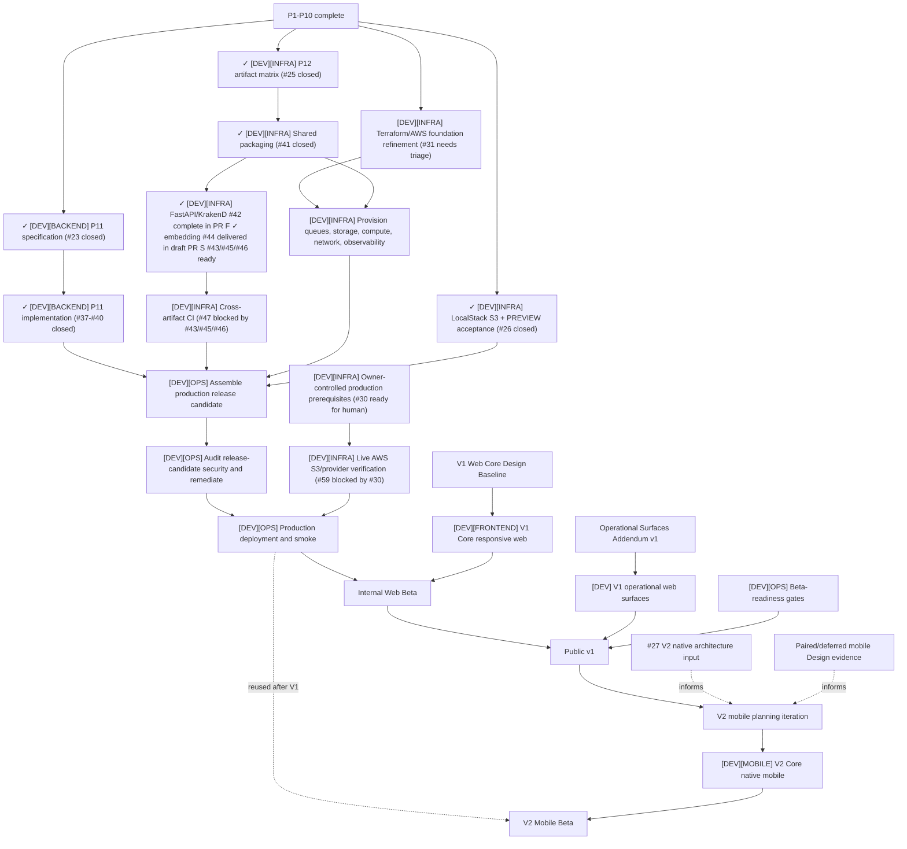

# Recipe Manager Production Roadmap

Updated: 2026-08-19
Status: local baseline, P1-P10, and P11 hardening complete; P12 shared packaging #41 and FastAPI/KrakenD artifact child #42 complete in PR #70; embedding Lambda #44 complete/delivered in draft PR #83; artifact children #43, #45, and #46 ready and cross-artifact CI #47 blocked only by them

This is the canonical current plan for the `[DEV]` track. Detailed architecture and behavior live in their subject documents; GitHub issues carry executable slices and native blocking edges.

## Current status

| Area | Status | Evidence |
| --- | --- | --- |
| Local baseline and CI | Complete | `v0.1.0-local-baseline`, backend/frontend/gateway checks on `main` |
| P1-P10 runtime boundaries | Complete | Merged PRs #4 and #6-#15; current architecture and subject contracts |
| P11 SSRF and streaming hardening | Complete; #23 and children #37-#40 closed | Specification and child graph merged in PR [#49](https://github.com/starkovalera/recipe-manager/pull/49); secure URL policy, DNS validation, and redirects merged in PR [#63](https://github.com/starkovalera/recipe-manager/pull/63); bounded streaming, response policy, timeouts, and cleanup merged in PR [#65](https://github.com/starkovalera/recipe-manager/pull/65); loader migration and failure-semantics work merged in PR [#66](https://github.com/starkovalera/recipe-manager/pull/66); integrated adversarial verification merged in PR [#67](https://github.com/starkovalera/recipe-manager/pull/67) |
| P12 production Docker artifacts | Shared packaging #41 and FastAPI/KrakenD #42 complete in PR #70; embedding Lambda #44 complete/delivered in draft PR #83; #43, #45, and #46 ready; #47 blocked only by those remaining children | [#41](https://github.com/starkovalera/recipe-manager/issues/41) delivered the digest-pinned, frozen-dependency Docker seam in merged [PR #68](https://github.com/starkovalera/recipe-manager/pull/68); [#42](https://github.com/starkovalera/recipe-manager/issues/42) delivers the API/gateway host unit and controlled migration boundary in [PR #70](https://github.com/starkovalera/recipe-manager/pull/70), which closes it on merge; [#44](https://github.com/starkovalera/recipe-manager/issues/44) delivers the embedding Lambda image in draft [PR #83](https://github.com/starkovalera/recipe-manager/pull/83), which closes it on merge; remaining Lambda artifact images are [#43](https://github.com/starkovalera/recipe-manager/issues/43), [#45](https://github.com/starkovalera/recipe-manager/issues/45), and [#46](https://github.com/starkovalera/recipe-manager/issues/46), followed by cross-artifact CI in [#47](https://github.com/starkovalera/recipe-manager/issues/47) |
| LocalStack S3 + PREVIEW acceptance | Evidence recorded | PR #15 added the service/config/tests; merged PR [#58](https://github.com/starkovalera/recipe-manager/pull/58) records the LocalStack and signed-in browser checks |
| Live AWS S3/provider verification | Ready for human; blocked by owner inputs | [#59](https://github.com/starkovalera/recipe-manager/issues/59) requires #30 prerequisites and gates technical production smoke without blocking #31 refinement |
| Terraform, IAM, secrets | Not started | Refinement may begin in parallel with the remaining P12 work where runtime contracts are already fixed |
| Technical production and CD | Blocked | Requires deployable artifacts, infrastructure, and hardening gates |
| Production release-candidate security audit | Blocked | Runs against the exact production build and configuration after its blockers close; production release cannot proceed with unresolved release-blocking findings |
| Core responsive-web implementation | V1 design-gated | Requires the V1 Web Core Design Baseline and its implementation handoff |
| Mobile client implementation | V2 deferred | Starts only after V1 Web Release and a dedicated mobile planning/design gate; #27 is a V2 input |
| Operational surfaces implementation | V1 design-gated | Requires Operational Surfaces Addendum v1; blocks Public v1 only |

The historical greenfield rewrite and background-processing plans are archived under `docs/archive/`; their unchecked boxes are not current work.

## Release sequencing

The current Development roadmap delivers **V1 Web Release**: technical
production, the approved responsive-web Core client, V1 operational surfaces,
security, beta-readiness, and Public v1 release evidence. It does not require a
native client.

After V1, a separate **V2 mobile planning iteration** turns the deferred native
architecture packet, shared contracts, and any paired Design evidence into an
approved mobile specification and executable issues. Every mobile Development
issue belongs to V2; no mobile implementation issue is created or treated as a
V1 blocker before that planning gate.

## What the Development track delivers

The current technical-production work does not by itself produce Public v1:

| Completed scope | Result |
| --- | --- |
| P11, P12, infrastructure, providers, deployment, and production smoke | A deployable technical production environment for internal testing; backend, queues, storage, workers, gateway, and operations are running |
| Technical production plus approved responsive-web implementation | Internal Web Beta |
| Web Beta, implemented V1 Operational Surfaces Addendum, passed production security gate, and beta-readiness verification | Public v1, the first web-only production release |
| Post-V1 mobile planning plus technical production and approved native-mobile implementation | V2 Mobile Beta |

The existing basic frontend may help verify production contracts, but it is not the approved product interface and does not turn technical production into Internal Web Beta.

Large roadmap entries such as P11, P12, Terraform, Core web, or V2 mobile are parent workstreams. Before implementation, split each into executable child issues sized for one context, branch, and independently verifiable outcome.

## Phase 0 — Stable Main and CI Baseline

Status: complete.

- Record production architecture and completed auth testing.
- Add backend, frontend, and gateway CI.
- Verify Alembic against clean PostgreSQL + pgvector.
- Merge the current baseline branch.
- Use `main` as the default integration branch.
- Enable required checks.
- Create `v0.1.0-local-baseline`.

## Phase 1 — Local Production Readiness

Status: P1-P10 and P11 complete; P12 shared packaging children #41 and #42 are complete in PRs #68 and #70, embedding child #44 is complete/delivered in draft PR #83, artifact children #43, #45, and #46 are ready, and cross-artifact CI child #47 remains blocked only by those three Lambda artifacts.

Implementation details and acceptance criteria for each subphase are agreed
immediately before that subphase starts.

P5-P8 establish the import, embedding, account-deletion, and maintenance
entrypoints for the four production Lambdas.

- **P1. PROD settings fail closed**
- **P2. QueuePublisher protocol and preview Dramatiq adapter**
- **P3. Transactional outbox**
- **P4. SQS publisher**
- **P5. Import Lambda adapter**
- **P6. Embedding Lambda adapter**
- **P7. Account-deletion Lambda adapter**
- **P8. Maintenance dispatcher**
- **P9. S3 storage provider**
- **P10. Presigned media access**
- **P11. SSRF and streaming hardening**
- **P12. Production Docker artifacts**

Iteration 1 covers P1 and P2 only: production configuration requires explicit PostgreSQL, SQS, and S3 selections, while PREVIEW publishes ID-only messages through the existing Dramatiq actors. The SQS and S3 values define the target configuration contract; their runtime adapters remain deferred to P4 and P9. P3, the transactional outbox, is not part of this iteration.

Iteration 2 covers P3 only. Import, embedding, and account-deletion scheduling
create ID-only outbox rows atomically with domain state. Immediate publication
continues through the PREVIEW Dramatiq adapter, and a generic reconciliation
command retries pending rows. SQS remains deferred to P4.

Iteration 3 covers P4 only. The existing `QueuePublisher` gains a lazy boto3
SQS adapter with strict ID-only contracts for the imports, embeddings, and
account-deletion queues. AWS resources, IAM, DLQs, and consumers remain
deferred to later phases.

Iteration 4 covers P5 only. The imports queue gains a partial-batch Lambda
adapter around the existing import service. Import processing returns explicit
success, no-op, permanent-failure, or retryable-failure outcomes. A single
documented error-policy registry controls automatic retry and the job state
between attempts. Lambda packaging and AWS infrastructure remain deferred.

Iteration 5 covers P6 only. The embeddings queue gains a partial-batch Lambda
adapter around a duplicate-safe embedding claim. Embedding processing returns
explicit success, no-op, requeued, busy, or retryable-failure outcomes. PREVIEW
Dramatiq retries are aligned to three total executions. Packaging, AWS
infrastructure, and stale-running maintenance remain deferred.

Iteration 6 covers P7 only. The account-deletion queue gains a partial-batch
Lambda adapter around an explicit idempotent deletion outcome. Pending users
remain pending across provider, storage, database, and active-import retries.
PREVIEW retries are aligned to three total executions. Production media cleanup
remains fail-closed until P9 supplies the S3 storage provider.

Iteration 7 covers P8A. The maintenance queue gains a strict operation-only
partial-batch Lambda adapter, a shared dispatcher, and bounded reconciliation
for pending outbox messages, stale imports, stale embeddings, stale recipe
deletions, expired invitations, stale account deletions, and read-only
integrity checks. Generic storage-backed cleanup remains deferred until P9
provides S3, after which the remaining P8B operations will be added.

Iteration 8 covers P9 only. The centralized storage boundary gains logical
locations, purpose-first keys, a local adapter with nested-key compatibility,
and a lazy boto3 S3 adapter for private user media. Import uploads and cover
generation move storage I/O outside database transactions. Client media access,
S3 infrastructure, and storage-backed maintenance remain deferred. The exact
runtime, key, compensation, and P9/P10 contracts are documented in
[`s3-storage.md`](../s3-storage.md).

Iteration 9 covers P8B1. Storage saves use a shared context protocol with
separate user and system purposes; private system artifacts receive their own
logical location. Maintenance can list paginated LOCAL/S3 objects, finalize
retained artifacts for old failed imports, detect old orphan candidates without
deleting them, and write conditional JSON diagnostics. Destructive orphan and
temporary cleanup, report API/UI, and AWS bucket/IAM provisioning remain deferred.

Iteration 10 covers P10. Public recipe/import responses expose stable image and
source IDs, while authenticated batch media access returns partial-success
LOCAL or S3 download grants. S3 grants are 60-second presigned GETs without
per-object HEAD checks; LOCAL retrieval reauthorizes the domain ID. Upload
grants, CDN delivery, public sharing, and AWS provisioning remain deferred.

Iteration 11 covers P11. Harden every remote-fetch and streaming boundary against SSRF, redirect and DNS changes, oversized or misleading responses, unbounded buffering, timeouts, and unsafe diagnostics. Preserve existing loader behavior and provider failure semantics while adding focused adversarial and integration verification.

Iteration 12 covers P12. Produce independently buildable production artifacts for FastAPI and each Lambda entrypoint, with pinned runtime dependencies, non-root/minimal execution where applicable, deterministic build metadata, local invocation checks, and CI validation. Artifact construction does not provision AWS resources.

LocalStack S3 implementation landed with P10, and its LocalStack/PREVIEW acceptance is recorded in [merged PR #58](https://github.com/starkovalera/recipe-manager/pull/58). The real-provider gap is separated into [#59](https://github.com/starkovalera/recipe-manager/issues/59). It does not block starting P11 or P12, and it does not block #31 infrastructure refinement, but live AWS IAM, bucket-policy, and provider-boundary verification must close before technical production smoke.

## Phase 2 — Terraform, IAM, and Secrets Foundation

Status: not started; partially parallel with remaining Phase 1 work.

- Bootstrap remote Terraform state and GitHub OIDC.
- Provision ECR, SQS/DLQ, Lambda, EventBridge, S3, IAM, logs, alarms, budgets, compute, and network boundaries.
- Manage secret containers, references, KMS, and IAM through Terraform.
- Keep secret values outside Terraform state.
- Decide and document the Lightsail or EC2 deployment mechanism.

## Phase 3 — Technical Production and CD

Status: blocked by the required Phase 1 and Phase 2 gates.

- Provision AWS, Neon, Cloudflare, Clerk production, Flagsmith, DNS, and TLS.
- Add independent deployment workflows.
- Assemble immutable production release-candidate artifacts and configuration for an exact `main` commit.
- Audit that production release candidate and remediate every release-blocking security finding before deployment.
- Deploy only the audited release-candidate artifacts.
- Run controlled migrations.
- Execute production smoke tests and rollback rehearsal.
- Keep access limited to internal test users.

## Phase 4 — V1 Web Frontend Redesign / Rewrite

Status: blocked by the V1 Web Core Design Baseline. Web implementation may run in parallel with late technical-production work after the gate opens.

- Keep React/Vite SPA and the existing API contracts.
- Preserve reusable Clerk bootstrap, API client, types, and TanStack Query integration where appropriate.
- Redesign the application shell, navigation, responsive pages, forms, errors, loading states, empty states, accessibility, and PWA experience.
- Validate against real S3, SQS, Lambda, Clerk, and production latency/failure behavior.

## Phase 5 — Beta Readiness

Status: not started.

- Complete security, privacy, accessibility, restore, incident, DLQ, secret-rotation, monitoring, and cost-control reviews.
- Run complete product E2E tests.
- Invite external beta users only after this phase passes.

## V2 — Mobile planning and client delivery

Status: deferred until V1 Web Release.

- Run the dedicated mobile planning iteration and approve the mobile
  specification, requirements, platform scope, and release boundary.
- Revisit [#27 — Native client architecture](https://github.com/starkovalera/recipe-manager/issues/27)
  as research input; its provisional recommendation is not a V1 commitment.
- Create mobile Development child issues only after the V2 planning/design gate
  closes, with the `v2` version label and independent acceptance criteria.
- Reuse the one-backend/API boundary and any approved shared contracts without
  treating web UI or V1 design artifacts as mobile implementation source.

## Phase boundaries

Do not combine Phase 0 with production infrastructure implementation.
Do not combine all Phase 1 items into one pull request.
Do not invite external beta users before Phases 4 and 5 are complete.

## Dependency graph

## Development frontier

The following workstreams may start concurrently once represented by approved issues:

- P12 Lambda artifact children #43, #45, and #46; embedding child #44 is complete/delivered in draft PR #83; FastAPI/KrakenD child #42 is complete in PR #70;
- LocalStack S3 + PREVIEW acceptance is recorded in merged PR [#58](https://github.com/starkovalera/recipe-manager/pull/58);
- Live AWS S3/provider verification in #59 after owner inputs in #30;
- Terraform remote state, GitHub OIDC, module conventions, and environment layout;
- non-visual contract discovery required by the Design track;
- Future Capability investigation that does not change V1 scope.

Cloud resource provisioning is blocked only where it needs P12 artifact contracts. Technical production integration waits for hardening, artifacts, infrastructure, and provider verification. V1 web production implementation remains Design-gated; mobile production implementation is deferred to the V2 planning gate.

## Readiness audit

| Next executable or refinement issue | Readiness | Outcome / blocker |
| --- | --- | --- |
| `[DEV][INFRA] Run and record LocalStack S3 + PREVIEW acceptance` | Evidence recorded | [Merged PR #58](https://github.com/starkovalera/recipe-manager/pull/58) records the automated and signed-in browser acceptance; live AWS is intentionally separate |
| `[DEV][BACKEND] Inventory P11 fetch boundaries and write the hardening specification` | Complete; #23 closed | [PR #49](https://github.com/starkovalera/recipe-manager/pull/49) merged the versioned specification, caller matrix, threat model, rejected alternatives, deterministic verification contract, and child issue graph |
| P11 implementation children | Complete; #37-#40 closed | [#37](https://github.com/starkovalera/recipe-manager/issues/37) is complete in merged [PR #63](https://github.com/starkovalera/recipe-manager/pull/63); [#38](https://github.com/starkovalera/recipe-manager/issues/38) is complete in merged [PR #65](https://github.com/starkovalera/recipe-manager/pull/65); [#39](https://github.com/starkovalera/recipe-manager/issues/39) is complete in merged [PR #66](https://github.com/starkovalera/recipe-manager/pull/66); [#40](https://github.com/starkovalera/recipe-manager/issues/40) is complete in merged [PR #67](https://github.com/starkovalera/recipe-manager/pull/67) |
| `[DEV][INFRA] Inventory P12 deployables and write the artifact matrix` | Complete | [PR #52](https://github.com/starkovalera/recipe-manager/pull/52) merged the [P12 artifact matrix](../specs/2026-08-14-p12-production-artifact-matrix.md), recording six image artifacts, compatibility triggers, rollback identity, and child issues #41–#47 |
| P12 artifact implementation children | #41 and #42 complete in PRs #68 and #70; #44 complete/delivered in draft PR #83; #43, #45, and #46 ready; #47 blocked only by the remaining children | [#41](https://github.com/starkovalera/recipe-manager/issues/41) delivered the shared packaging seam in merged [PR #68](https://github.com/starkovalera/recipe-manager/pull/68); [#42](https://github.com/starkovalera/recipe-manager/issues/42) consumes it for the private API/public gateway host unit in [PR #70](https://github.com/starkovalera/recipe-manager/pull/70), which closes it on merge; [#44](https://github.com/starkovalera/recipe-manager/issues/44) delivers the embedding Lambda artifact in draft [PR #83](https://github.com/starkovalera/recipe-manager/pull/83), which closes it on merge; [#43](https://github.com/starkovalera/recipe-manager/issues/43), [#45](https://github.com/starkovalera/recipe-manager/issues/45), and [#46](https://github.com/starkovalera/recipe-manager/issues/46) remain independently executable; [#47](https://github.com/starkovalera/recipe-manager/issues/47) verifies all remaining artifacts after those slices |
| `[DEV][FRONTEND] Audit reusable non-visual frontend contracts` | Complete; #24 closed | [PR #48](https://github.com/starkovalera/recipe-manager/pull/48) recorded the reusable auth, API, query, and media boundaries without choosing the new UI |
| `[DEV][MOBILE] Research native client architecture options and contract boundary` | V2 deferred | Preserved as a research input; revisit after V1 during the mobile planning iteration, then create executable mobile Development children |
| Terraform state, OIDC, account layout, region, and deployment mechanism | Needs refinement and user action | Requires approved Terraform/OpenTofu choice, AWS account/region, state bootstrap, and Lightsail/EC2 deployment decision |
| AWS account, MFA/billing, production projects, domains, and secret values | Ready for human | Complete the applicable owner actions in [`../production-prerequisites.md`](../production-prerequisites.md); record identifiers and secret references, never secret values |
| `[DEV][OPS] Audit the production release candidate and remediate security findings` | Blocked release gate | Requires the exact production artifacts, dependency locks, IaC, gateway and deployment configuration; blocks production release until Critical/High and other declared release blockers are fixed and checks rerun |
| Core responsive-web implementation children | Blocked by V1 Design | Require the approved V1 Web Core Design Baseline and web implementation handoff |
| Native-mobile implementation children | V2 deferred | Do not create before the post-V1 mobile planning/specification/design gate |
| [#59 — Verify Live AWS S3 media access boundaries](https://github.com/starkovalera/recipe-manager/issues/59) | Ready for human; blocked by #30 | Requires a disposable private AWS bucket and authorized local/CI AWS profile; gates technical production smoke and does not block #31 refinement |
