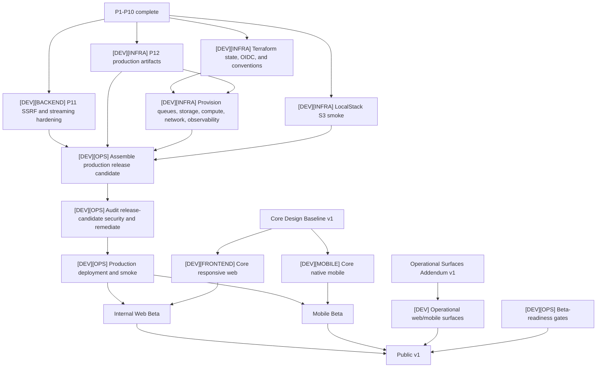

# Recipe Manager Production Roadmap

Updated: 2026-08-13
Status: local baseline and P1-P10 complete; technical production in progress

This is the canonical current plan for the `[DEV]` track. Detailed architecture and behavior live in their subject documents; GitHub issues carry executable slices and native blocking edges.

## Current status

| Area | Status | Evidence |
| --- | --- | --- |
| Local baseline and CI | Complete | `v0.1.0-local-baseline`, backend/frontend/gateway checks on `main` |
| P1-P10 runtime boundaries | Complete | Merged PRs #4 and #6-#15; current architecture and subject contracts |
| P11 SSRF and streaming hardening | Not started | First remaining Phase 1 runtime slice |
| P12 production Docker artifacts | Not started | First remaining Phase 1 packaging slice |
| LocalStack S3 smoke | Implemented; closure evidence missing | PR #15 added the service, config, integration tests, and runbook; the unchecked plan has no recorded automated/manual acceptance result |
| Terraform, IAM, secrets | Not started | May begin in parallel with P11/P12 where runtime contracts are already fixed |
| Technical production and CD | Blocked | Requires deployable artifacts, infrastructure, and hardening gates |
| Production release-candidate security audit | Blocked | Runs against the exact production build and configuration after its blockers close; production release cannot proceed with unresolved release-blocking findings |
| Core web/mobile implementation | Design-gated | Requires Core Design Baseline v1 |
| Operational surfaces implementation | Design-gated | Requires Operational Surfaces Addendum v1; blocks Public v1 only |

The historical greenfield rewrite and background-processing plans are archived under `docs/archive/`; their unchecked boxes are not current work.

## What the Development track delivers

The current technical-production work does not by itself produce Public v1:

| Completed scope | Result |
| --- | --- |
| P11, P12, infrastructure, providers, deployment, and production smoke | A deployable technical production environment for internal testing; backend, queues, storage, workers, gateway, and operations are running |
| Technical production plus approved responsive-web implementation | Internal Web Beta |
| Technical production plus approved native-mobile implementation | Mobile Beta |
| Web Beta, Mobile Beta, implemented Operational Surfaces Addendum, passed production security gate, and beta-readiness verification | Public v1 |

The existing basic frontend may help verify production contracts, but it is not the approved product interface and does not turn technical production into Internal Web Beta.

Large roadmap entries such as P11, P12, Terraform, or Core web/mobile are parent workstreams. Before implementation, split each into executable child issues sized for one context, branch, and independently verifiable outcome.

## Phase 0 — Stable Main and CI Baseline

Status: complete.

- Record production architecture and completed auth testing.
- Add backend, frontend, and gateway CI.
- Verify Alembic against clean PostgreSQL + pgvector.
- Merge the current baseline branch.
- Use `main` as the default integration branch.
- Enable required checks.
- Create `v0.1.0-local-baseline`.

## Phase 1 — Local Production Readiness

Status: P1-P10 complete; P11 and P12 remain.

Implementation details and acceptance criteria for each subphase are agreed
immediately before that subphase starts.

P5-P8 establish the import, embedding, account-deletion, and maintenance
entrypoints for the four production Lambdas.

- **P1. PROD settings fail closed**
- **P2. QueuePublisher protocol and preview Dramatiq adapter**
- **P3. Transactional outbox**
- **P4. SQS publisher**
- **P5. Import Lambda adapter**
- **P6. Embedding Lambda adapter**
- **P7. Account-deletion Lambda adapter**
- **P8. Maintenance dispatcher**
- **P9. S3 storage provider**
- **P10. Presigned media access**
- **P11. SSRF and streaming hardening**
- **P12. Production Docker artifacts**

Iteration 1 covers P1 and P2 only: production configuration requires explicit PostgreSQL, SQS, and S3 selections, while PREVIEW publishes ID-only messages through the existing Dramatiq actors. The SQS and S3 values define the target configuration contract; their runtime adapters remain deferred to P4 and P9. P3, the transactional outbox, is not part of this iteration.

Iteration 2 covers P3 only. Import, embedding, and account-deletion scheduling
create ID-only outbox rows atomically with domain state. Immediate publication
continues through the PREVIEW Dramatiq adapter, and a generic reconciliation
command retries pending rows. SQS remains deferred to P4.

Iteration 3 covers P4 only. The existing `QueuePublisher` gains a lazy boto3
SQS adapter with strict ID-only contracts for the imports, embeddings, and
account-deletion queues. AWS resources, IAM, DLQs, and consumers remain
deferred to later phases.

Iteration 4 covers P5 only. The imports queue gains a partial-batch Lambda
adapter around the existing import service. Import processing returns explicit
success, no-op, permanent-failure, or retryable-failure outcomes. A single
documented error-policy registry controls automatic retry and the job state
between attempts. Lambda packaging and AWS infrastructure remain deferred.

Iteration 5 covers P6 only. The embeddings queue gains a partial-batch Lambda
adapter around a duplicate-safe embedding claim. Embedding processing returns
explicit success, no-op, requeued, busy, or retryable-failure outcomes. PREVIEW
Dramatiq retries are aligned to three total executions. Packaging, AWS
infrastructure, and stale-running maintenance remain deferred.

Iteration 6 covers P7 only. The account-deletion queue gains a partial-batch
Lambda adapter around an explicit idempotent deletion outcome. Pending users
remain pending across provider, storage, database, and active-import retries.
PREVIEW retries are aligned to three total executions. Production media cleanup
remains fail-closed until P9 supplies the S3 storage provider.

Iteration 7 covers P8A. The maintenance queue gains a strict operation-only
partial-batch Lambda adapter, a shared dispatcher, and bounded reconciliation
for pending outbox messages, stale imports, stale embeddings, stale recipe
deletions, expired invitations, stale account deletions, and read-only
integrity checks. Generic storage-backed cleanup remains deferred until P9
provides S3, after which the remaining P8B operations will be added.

Iteration 8 covers P9 only. The centralized storage boundary gains logical
locations, purpose-first keys, a local adapter with nested-key compatibility,
and a lazy boto3 S3 adapter for private user media. Import uploads and cover
generation move storage I/O outside database transactions. Client media access,
S3 infrastructure, and storage-backed maintenance remain deferred. The exact
runtime, key, compensation, and P9/P10 contracts are documented in
[`s3-storage.md`](../s3-storage.md).

Iteration 9 covers P8B1. Storage saves use a shared context protocol with
separate user and system purposes; private system artifacts receive their own
logical location. Maintenance can list paginated LOCAL/S3 objects, finalize
retained artifacts for old failed imports, detect old orphan candidates without
deleting them, and write conditional JSON diagnostics. Destructive orphan and
temporary cleanup, report API/UI, and AWS bucket/IAM provisioning remain deferred.

Iteration 10 covers P10. Public recipe/import responses expose stable image and
source IDs, while authenticated batch media access returns partial-success
LOCAL or S3 download grants. S3 grants are 60-second presigned GETs without
per-object HEAD checks; LOCAL retrieval reauthorizes the domain ID. Upload
grants, CDN delivery, public sharing, and AWS provisioning remain deferred.

Iteration 11 covers P11. Harden every remote-fetch and streaming boundary against SSRF, redirect and DNS changes, oversized or misleading responses, unbounded buffering, timeouts, and unsafe diagnostics. Preserve existing loader behavior and provider failure semantics while adding focused adversarial and integration verification.

Iteration 12 covers P12. Produce independently buildable production artifacts for FastAPI and each Lambda entrypoint, with pinned runtime dependencies, non-root/minimal execution where applicable, deterministic build metadata, local invocation checks, and CI validation. Artifact construction does not provision AWS resources.

LocalStack S3 implementation landed with P10. The remaining local task is to run and record automated/manual acceptance, reconcile the stale unchecked plan, and preserve the separate live-AWS verification gap. It does not block starting P11 or P12, but live AWS IAM and bucket-policy verification must close during technical production.

## Phase 2 — Terraform, IAM, and Secrets Foundation

Status: not started; partially parallel with remaining Phase 1 work.

- Bootstrap remote Terraform state and GitHub OIDC.
- Provision ECR, SQS/DLQ, Lambda, EventBridge, S3, IAM, logs, alarms, budgets, compute, and network boundaries.
- Manage secret containers, references, KMS, and IAM through Terraform.
- Keep secret values outside Terraform state.
- Decide and document the Lightsail or EC2 deployment mechanism.

## Phase 3 — Technical Production and CD

Status: blocked by the required Phase 1 and Phase 2 gates.

- Provision AWS, Neon, Cloudflare, Clerk production, Flagsmith, DNS, and TLS.
- Add independent deployment workflows.
- Assemble immutable production release-candidate artifacts and configuration for an exact `main` commit.
- Audit that production release candidate and remediate every release-blocking security finding before deployment.
- Deploy only the audited release-candidate artifacts.
- Run controlled migrations.
- Execute production smoke tests and rollback rehearsal.
- Keep access limited to internal test users.

## Phase 4 — Frontend Redesign / Rewrite

Status: blocked by Core Design Baseline v1. Implementation may run in parallel with late technical-production work after the gate opens.

- Keep React/Vite SPA and the existing API contracts.
- Preserve reusable Clerk bootstrap, API client, types, and TanStack Query integration where appropriate.
- Redesign the application shell, navigation, responsive pages, forms, errors, loading states, empty states, accessibility, and PWA experience.
- Validate against real S3, SQS, Lambda, Clerk, and production latency/failure behavior.

## Phase 5 — Beta Readiness

Status: not started.

- Complete security, privacy, accessibility, restore, incident, DLQ, secret-rotation, monitoring, and cost-control reviews.
- Run complete product E2E tests.
- Invite external beta users only after this phase passes.

## Phase boundaries

Do not combine Phase 0 with production infrastructure implementation.
Do not combine all Phase 1 items into one pull request.
Do not invite external beta users before Phases 4 and 5 are complete.

## Dependency graph

## Development frontier

The following workstreams may start concurrently once represented by approved issues:

- P11 SSRF and streaming hardening;
- P12 production Docker and Lambda artifacts;
- LocalStack S3 smoke verification;
- Terraform remote state, GitHub OIDC, module conventions, and environment layout;
- non-visual contract discovery required by the Design track;
- Future Capability investigation that does not change first-version scope.

Cloud resource provisioning is blocked only where it needs P12 artifact contracts. Technical production integration waits for hardening, artifacts, infrastructure, and provider verification. Frontend and mobile production implementation remain Design-gated.

## Readiness audit

| Next executable or refinement issue | Readiness | Outcome / blocker |
| --- | --- | --- |
| `[DEV][INFRA] Run and record LocalStack S3 automated acceptance` | Agent-ready | Implementation and tests exist; Docker client/server 29.5.3 availability was confirmed on 2026-08-13; run acceptance and reconcile the stale plan |
| `[DEV][BACKEND] Inventory P11 fetch boundaries and write the hardening specification` | Agent-ready | Current `httpx_fetch` follows redirects and buffers the full response before truncation; the spec must slice implementation children and adversarial tests |
| P11 implementation children | Needs refinement | Become agent-ready after the hardening specification fixes DNS, redirect, streaming, size, timeout, error, and logging contracts |
| `[DEV][INFRA] Inventory P12 deployables and write the artifact matrix` | Agent-ready | FastAPI plus four Lambda entrypoints and independent delivery requirements are documented; concrete build contracts still need refinement |
| P12 artifact implementation children | Needs refinement | Split into shared packaging contract, FastAPI artifact, Lambda artifacts, and CI build/invocation verification |
| `[DEV][FRONTEND] Audit reusable non-visual frontend contracts` | Agent-ready | Read-only audit can identify reusable auth, API, query, and media boundaries without choosing the new UI |
| `[DEV][MOBILE] Research native client architecture options and contract boundary` | Agent-ready research | Produces a decision packet; stack selection requires user approval before implementation |
| Terraform state, OIDC, account layout, region, and deployment mechanism | Needs refinement and user action | Requires approved Terraform/OpenTofu choice, AWS account/region, state bootstrap, and Lightsail/EC2 deployment decision |
| AWS account, MFA/billing, production projects, domains, and secret values | Ready for human | Complete the applicable owner actions in [`../production-prerequisites.md`](../production-prerequisites.md); record identifiers and secret references, never secret values |
| `[DEV][OPS] Audit the production release candidate and remediate security findings` | Blocked release gate | Requires the exact production artifacts, dependency locks, IaC, gateway and deployment configuration; blocks production release until Critical/High and other declared release blockers are fixed and checks rerun |
| Core responsive-web and native-mobile implementation children | Blocked | Require the applicable approved Design Baseline and platform-specific implementation handoff |
| Live AWS S3/IAM/Block Public Access verification | Ready for human prerequisite | Requires a disposable private AWS bucket and authorized local/CI AWS profile before an agent can run the checks |
