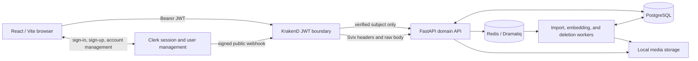
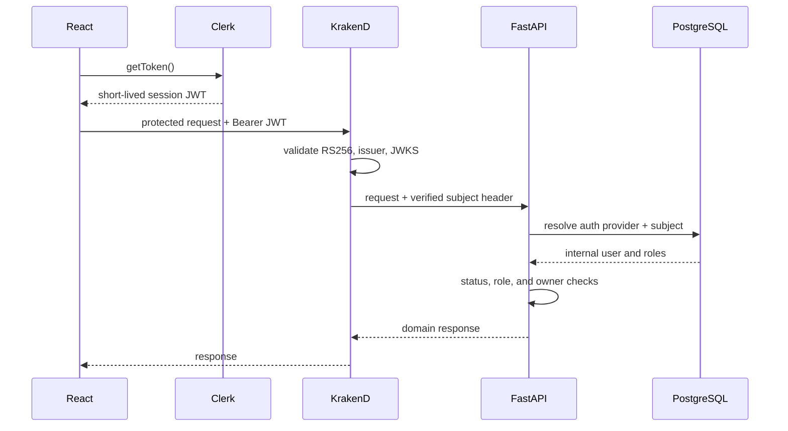
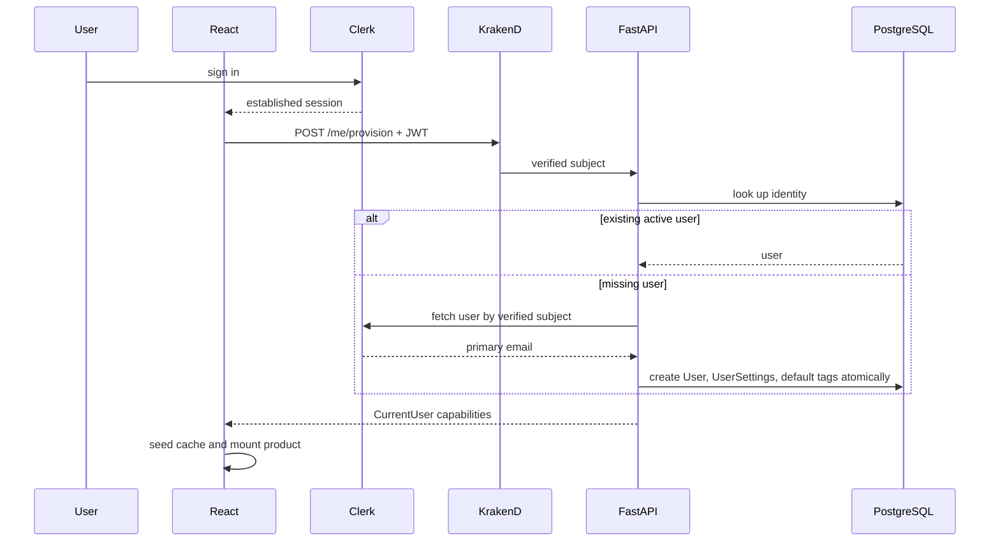
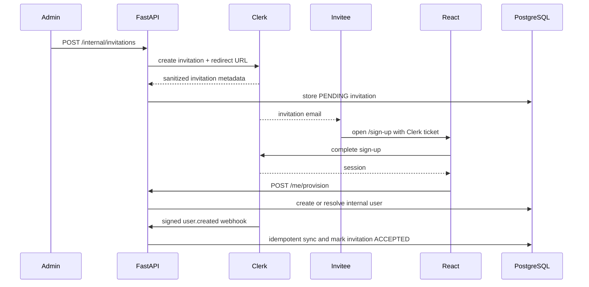
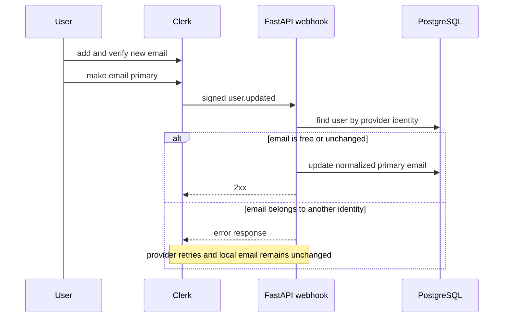
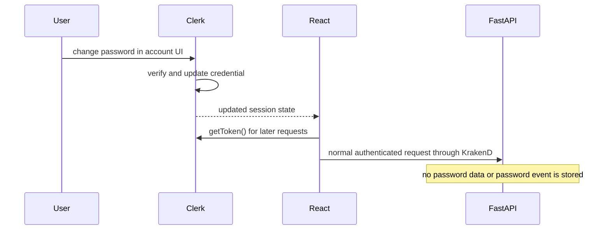
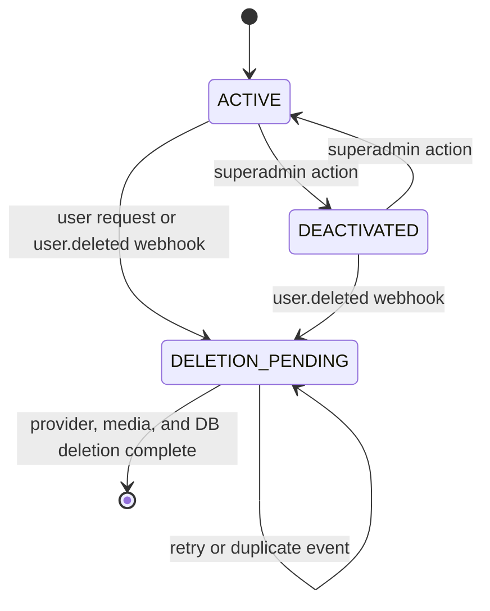
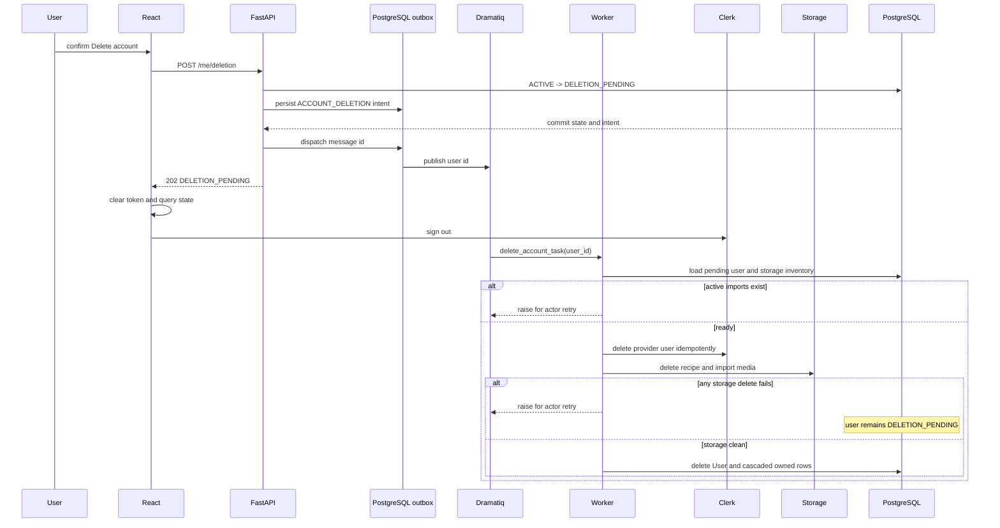

# Authentication and Authorization

This document is the canonical description of authentication, authorization, invitations, and account lifecycle behavior in Recipe Manager.

## Ownership and Trust Boundaries

Clerk owns credentials, password policy, email verification, sign-in sessions, invitation email delivery, and the external user identifier. Recipe Manager never stores passwords, Clerk session tokens, invitation tickets, invitation URLs, or JWTs.

KrakenD is the authentication boundary for browser API traffic. It validates Clerk JWT signature, issuer, and JWKS data, removes the browser-controlled `Authorization` header from the upstream request, and injects the verified Clerk subject as `X-Authenticated-Subject` on protected routes.

FastAPI owns the internal user record, lifecycle status, fixed role assignments, capabilities, owner scoping, and all domain authorization. A valid Clerk session does not grant product access until the verified subject maps to an active internal user.

PostgreSQL is authoritative for application-owned identity metadata:

- `User.auth_provider` and `User.auth_user_id` map the external identity to one internal user.
- `User.email` is the normalized primary email synchronized from Clerk.
- `User.status` is `ACTIVE`, `DEACTIVATED`, or `DELETION_PENDING`.
- `UserRoleAssignment` stores fixed `DEBUG` and `SUPERADMIN` assignments.
- domain rows remain owner-scoped by internal `User.id`.
- `ClerkWebhookEvent` stores processed webhook IDs for idempotency.
- `Invitation` stores sanitized invitation metadata, never the ticket or invitation URL.

## Request Authentication Flow

1. Clerk establishes a browser session.
2. The frontend installs an in-memory token provider backed by Clerk `getToken()`.
3. Every API and protected-media request obtains a current token and sends `Authorization: Bearer <token>` to KrakenD.
4. KrakenD validates the token with `CLERK_ISSUER` and `CLERK_JWKS_URL`.
5. For protected routes, KrakenD propagates only the verified `sub` claim as `X-Authenticated-Subject`. Browser-supplied identity headers are not permitted by CORS or forwarded.
6. FastAPI converts the trusted subject to `AuthenticatedIdentity(AuthProviderType.CLERK, subject)`.
7. `CurrentUserDep` resolves the identity from PostgreSQL and rejects missing, deactivated, or deletion-pending users.
8. The route applies role and owner checks independently of frontend visibility.

Tokens stay in memory. Sign-out or a Clerk identity/session change clears the token provider, React Query cache, and provisioning state before the product remounts.

### Public and protected gateway routes

Only these routes are public at the gateway:

- `GET /health`
- `POST /webhooks/clerk`
- FastAPI documentation routes: `/openapi.json`, `/docs`, `/docs/oauth2-redirect`, and `/redoc`

Every other API route requires a valid Clerk JWT. The committed gateway metadata and FastAPI OpenAPI contract are checked for method/path parity by `backend/tests/infra/test_krakend_config.py`.

Direct FastAPI access on `127.0.0.1:8010` is for diagnostics only. It bypasses JWT validation and therefore cannot represent a real browser-authenticated request. A protected direct request must supply a trusted `X-Authenticated-Subject` manually and should never be exposed as a production ingress.

## Provisioning and Ordinary Login

`POST /me/provision` is the only synchronous first-login provisioning endpoint. It uses `AuthenticatedIdentityDep`, not `CurrentUserDep`, because the internal user may not exist yet.

Provisioning behavior:

- Existing active users return `200` without a provider call or role/default mutation.
- A missing identity is fetched from Clerk outside the database transaction, then created atomically with `UserSettings` and default tags; the first response is `201`.
- Concurrent provisioning and webhook races converge through unique identity/email constraints and explicit `IntegrityError` recovery.
- Email collisions never auto-link identities and return `EMAIL_ALREADY_LINKED`.
- New users receive no privileged roles. Roles are assigned separately by an existing `SUPERADMIN` or by explicit local preview seeding.
- `DEACTIVATED` and `DELETION_PENDING` users see dedicated account-state screens and the product is not mounted.

The frontend intentionally calls provisioning for every newly established Clerk session. This makes login independent of webhook delivery, which is asynchronous and not guaranteed to arrive before the user needs a synchronous response.

## Invitation and First Login

The Clerk instance must use **Restricted mode** when registration is intended to be invite-only. Creating application invitations alone does not prevent uninvited public sign-up.

1. A `SUPERADMIN` submits an email through the Admin Invitations tab.
2. FastAPI asks Clerk to create an invitation with `FRONTEND_INVITATION_URL` as the redirect.
3. Only after provider creation succeeds, FastAPI stores sanitized local metadata.
4. If local persistence fails, FastAPI attempts to revoke the provider invitation as compensation and logs a sanitized failure if compensation also fails.
5. Clerk sends the email. The invitation link carries a Clerk ticket; Recipe Manager neither stores nor displays it.
6. The invited user lands on `/sign-up`, where Clerk's prebuilt `SignUp` component consumes the invitation flow.
7. After Clerk establishes a session, the normal explicit provisioning flow creates or resolves the internal user.
8. A signed `user.created` webhook marks matching non-expired local pending invitations `ACCEPTED`. Expired matches become `EXPIRED`.

Ordering is intentionally tolerant:

- If provisioning wins, it creates the user; the later webhook resolves the same row and accepts the invitation.
- If `user.created` wins, it creates the user and accepts the invitation; provisioning returns the existing user.
- If the webhook never arrives, login still works, but the local invitation can remain `PENDING` until the planned invitation reconciliation job is implemented.
- Provider/local divergence after failed compensation is logged and remains future reconciliation work.

## Email Change

Email addresses are managed in Clerk's account UI. Adding a new address requires Clerk verification before it can become the primary address.

The application synchronizes only the primary email it needs. It never links a different provider identity merely because the emails match. Out-of-order `user.updated` protection and durable conflict reconciliation remain planned work.

## Password Change

Passwords are entirely provider-owned and are changed through Clerk's `UserButton` / account management UI. Recipe Manager receives no password, stores no password hash, and performs no database transition for a password change.

Any session revocation or reauthentication requirement is controlled by the Clerk instance settings. The frontend responds to sign-out or session identity changes by clearing in-memory authentication and query state.

## Account Deletion

Deletion is asynchronous. `POST /me/deletion` atomically locks the user, protects the final active superadmin, changes status to `DELETION_PENDING`, records `deletion_requested_at`, and creates an ID-only pending outbox message. After commit, FastAPI attempts immediate dispatch through the configured queue publisher.

Important failure behavior:

- Immediate outbox dispatch failure does not restore `ACTIVE`; the durable pending state and pending outbox message are preserved for reconciliation.
- Active imports postpone deletion by causing the actor to retry.
- Missing provider users and already-missing files are expected to be idempotent at their service boundaries.
- Any failed media deletion leaves the local user and owned database rows intact in `DELETION_PENDING`.
- Database deletion happens only after provider and media cleanup succeed. User-owned rows such as recipes, tags, collections, import jobs, embeddings through recipes, notifications, settings, and roles are removed through ORM/database cascades.
- A new verified `user.deleted` webhook atomically records its idempotency row, transitions the internal user to `DELETION_PENDING`, and creates a pending outbox message for the same worker before post-commit dispatch.
- `python -m app.queueing.reconcile_outbox` dispatches one bounded batch of existing pending outbox rows. `python -m app.users.reconcile_deletions` creates and dispatches a fresh durable deletion intent for every current pending user. Scheduled stale-pending recovery remains future work.

## Authorization Rules

The role model is fixed in code:

- `DEBUG`: access to internal diagnostic pages, scoped to the user's own records, plus recipe debug data for owned recipes.
- `SUPERADMIN`: access to internal diagnostic pages across users and role/invitation/user-status administration.

Roles do not broaden ordinary product ownership. A superadmin cannot read another user's ordinary recipe detail, collections, tags, notifications, or media through product endpoints.

The frontend consumes capabilities from `/me`:

- `showAdminPages`: `DEBUG` or `SUPERADMIN`
- `showRoleManagement`: `SUPERADMIN`
- `showRecipeDebug`: `DEBUG`

Frontend visibility is UX only. FastAPI independently enforces every role and owner rule through `app.access.rules`.

## Webhook Processing

`POST /webhooks/clerk` is public at KrakenD because provider webhooks do not carry a user session. FastAPI verifies the raw body and Svix signature headers with `CLERK_WEBHOOK_SIGNING_SECRET` before parsing.

Supported events:

- `user.created`: create/update the local identity, initialize defaults idempotently, and accept matching pending invitations.
- `user.updated`: synchronize the normalized primary email without auto-linking.
- `user.deleted`: atomically transition an existing local user to `DELETION_PENDING`, record webhook idempotency, and create a pending deletion outbox message before post-commit dispatch.

Each accepted signed `svix-id` delivery ID is stored in `ClerkWebhookEvent`; duplicate delivery returns `processed: false`.
The JSON body supplies the event type and domain payload but never the idempotency key. Raw payloads, JWTs, signatures,
invitation tickets, and provider secrets are not logged.

Webhooks are asynchronous reconciliation, not a synchronous login dependency. Clerk uses Svix retries for non-2xx delivery and supports replay from the dashboard.

## Local Preview and Role Bootstrap

Preview mode does not bypass Clerk. It uses real Clerk subjects plus explicit local seed configuration:

1. Copy `backend/config/preview-users.example.toml` to the ignored `backend/config/preview-users.local.toml`.
2. Replace `auth_user_id` and email with a real Clerk development user.
3. Keep only the exact roles required for that preview user.
4. Set `APP_ENV=PREVIEW` and `PREVIEW_USERS_FILE` in `backend/.env`.
5. Start FastAPI so preview schema cleanup/migrations complete.
6. Run `uv run python -m app.local.seed_preview_users` from `backend`.

The seed file is local-only and authoritative for its configured preview users, including exact role assignments. Ordinary first-login provisioning creates active users without privileged roles. A role can also be assigned explicitly with `python -m app.local.assign_role` after the internal user exists.

## Configuration Inventory

Root `.env` for Docker Compose / KrakenD:

- `CLERK_ISSUER`
- `CLERK_JWKS_URL`

Backend `.env`:

- `CLERK_SECRET_KEY`
- `CLERK_API_URL`
- `CLERK_WEBHOOK_SIGNING_SECRET`
- `FRONTEND_INVITATION_URL`
- `ACCOUNT_DELETION_TASK_MAX_RETRIES`
- `PREVIEW_USERS_FILE`

Frontend `.env`:

- `VITE_CLERK_PUBLISHABLE_KEY`
- `VITE_API_BASE_URL=http://127.0.0.1:8081`

Secrets belong only in ignored local env files or deployment secret storage. The publishable key, issuer, and JWKS URL are not secrets; the Clerk secret key and webhook signing secret are.

## Operational Gaps

The following behavior is intentionally deferred and tracked in `docs/future-work.md`:

- scheduled invitation expiration and provider/local invitation reconciliation;
- stale `DELETION_PENDING` account recovery scheduling;
- durable webhook conflict handling and out-of-order email update protection;
- optional deletion-completion email;
- expanded user search/filter/pagination UI;
- mandatory immutable language selection on first login;
- differentiated user/admin import retry notification and audit behavior.

## Official Clerk References

- [Restricted access mode](https://clerk.com/docs/guides/secure/restricting-access)
- [Application invitations](https://clerk.com/docs/guides/users/inviting)
- [Invitation sign-up flow](https://clerk.com/docs/guides/development/custom-flows/authentication/application-invitations)
- [Webhook overview and retry behavior](https://clerk.com/docs/guides/development/webhooks/overview)
- [Synchronizing users with webhooks](https://clerk.com/docs/guides/development/webhooks/syncing)
- [Clerk environment variables](https://clerk.com/docs/guides/development/clerk-environment-variables)
- [Clerk CLI](https://clerk.com/docs/cli)
