# Background Processing, Notifications, and Search Plan

## 1. Target Architecture

The target architecture moves import execution out of the HTTP request path and makes recipe import a persisted domain workflow, not just a queue message.

Core tools:

- FastAPI for the HTTP API.
- SQLAlchemy 2 + Alembic.
- PostgreSQL as the target relational store.
- Redis as the initial Dramatiq broker.
- Dramatiq for background task execution.
- pgvector for semantic recipe search.
- TanStack Query for frontend polling, cache invalidation, and mutation state.
- Local filesystem storage through the existing storage interface now; cloud object storage later behind the same interface.

The backend remains the only owner of business logic. Frontend and future mobile clients communicate through HTTP APIs and do not depend on backend runtime code.

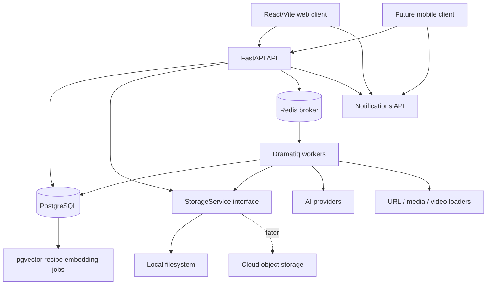

### Main Blocks

- `ImportJob`: domain workflow for one recipe import attempt.
- `ImportJobSource`: raw sources submitted with an import request.
- `RecipeResource`: final and primary recipe resources after parsing.
- `Notification`: persisted user notification.
- `JobEvent`: audit trail for import and embedding processing.
- `RecipeEmbedding`: vector-search embedding/state for a recipe.
- `StorageService`: abstraction over local files now and cloud object storage later.
- `QueueService`: abstraction over enqueueing work; first real implementation is Dramatiq.

### Main Domain Statuses

`ImportJob.status`:

- `queued`
- `running`
- `succeeded`
- `succeeded_with_flags`
- `failed`
- `cancelled`

`RecipeEmbedding.status`:

- `STALE`
- `RUNNING`
- `READY`
- `FAILED`
- `SKIPPED_DUE_TO_FLAGS`

### Target Import Flow

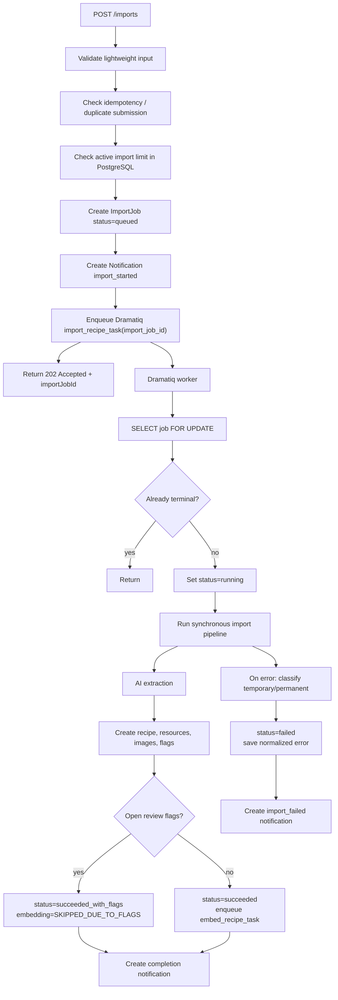

## Import Behavior Preservation Checklist

This checklist applies to every phase. Any phase that touches import, resources, flags, media, AI, storage, or recipe mutation should explicitly verify that it did not regress these behaviors.

- Attachments are accepted before URL images.
- URL images are accepted only within remaining image capacity.
- Manual text input remains recipe evidence.
- Manual image input remains recipe evidence.
- URL-derived text remains recipe evidence.
- URL-derived images remain recipe evidence only when accepted by capacity rules.
- Existing Instagram loader behavior is preserved.
- Existing Threads loader behavior is preserved.
- Video handling preserves transcript extraction and poster image handling.
- Final sources only are sent to AI; parent URL resources are not sent to AI as recipe evidence.
- Current AI input schema remains unchanged unless a separate prompt/schema migration is explicitly approved.
- Current AI output schema remains unchanged unless a separate prompt/schema migration is explicitly approved.
- Current AI `coverCandidate` output schema expects only `sourceRef` and `confidence`; the Python parsing layer keeps legacy `sourcePosition`, `crop`, and `reason` fields as `None` for compatibility with internal code/tests.
- Current AI prompt text remains unchanged unless a separate prompt migration is explicitly approved.
- External authentication identities are represented generically by `(auth_provider, auth_user_id)`. Raw JWTs, Bearer tokens, refresh tokens, session cookies, and invitation tickets are never persisted. KrakenD validates Clerk JWT issuer/JWKS data and forwards only the trusted subject; FastAPI does not repeat issuer validation.
- `AuthenticatedIdentityDep` derives identity only from the trusted gateway subject header and performs no database or provider work. `CurrentUserDep` uses the same request `SessionDep` as the handler, performs one short read-only transaction, never provisions or mutates a user, returns `USER_NOT_PROVISIONED` for a missing mapping, and rejects inactive account statuses with their dedicated errors.
- `POST /me/provision` is the only synchronous interactive-user provisioning path. It accepts no client-selected identity or email, is idempotent, does not call the auth provider or change settings/roles for an existing active user, and never auto-links an identity by email. A missing user is resolved through the cached auth provider outside a database transaction and then created atomically; uniqueness races are recovered by re-reading the committed identity or returning `EMAIL_ALREADY_LINKED`.
- Until mandatory account-language onboarding is implemented, every newly provisioned user is created `ACTIVE` with no roles, one `UserSettings` row using the current backend recipe language, and the matching current default tag set in the same transaction. PREVIEW seeding reuses this initialization while preserving configured internal IDs and synchronizing the configured role set exactly.
- Fixed application roles are `DEBUG` and `SUPERADMIN`, are stored locally, and may be combined on one user. Role-management APIs require `SUPERADMIN`, available role definitions come from the backend, and the final remaining `SUPERADMIN` assignment cannot be removed.
- Ordinary product endpoints remain owner-scoped for every role; `SUPERADMIN` does not gain access to another user's recipes, collections, tags, notifications, or ordinary product data. Internal Import Jobs, Embeddings, and Search Debug require `DEBUG` or `SUPERADMIN`; `DEBUG` sees only owned records while `SUPERADMIN` may see all internal records. Recipe debug data specifically requires `DEBUG`, including when a user has `SUPERADMIN`.
- `GET /me` exposes capability flags rather than roles. Frontend capability checks control visibility only; backend access checks remain authoritative.
- Invitations and user lifecycle administration are rendered only from backend-provided capabilities. Invitation creation, revocation, role changes, and user status changes always go through protected application-backend endpoints; the frontend never displays invitation tickets, provider secrets, or provider invitation URLs.
- The signed-in product application is mounted only after explicit `POST /me/provision` succeeds. While Clerk is loading, the user is signed out, provisioning is pending, or provisioning has failed, recipes, notifications, `/me`, and other protected product queries are not mounted or started.
- Each established Clerk identity/session starts one initial provisioning request after the in-memory Bearer token provider is registered. React Strict Mode effect replay must reuse that in-flight request rather than duplicating provisioning; a failed retryable request is repeated only after an explicit user action.
- A successful provisioning response seeds the frontend `['current-user']` query cache before the product application mounts, so the first rendered capability state comes from the same authoritative response.
- Provisioning and account-state failures block product UI. `ACCOUNT_DEACTIVATED`, `ACCOUNT_DELETION_PENDING`, and `EMAIL_ALREADY_LINKED` have dedicated non-retry screens; unexpected/provider failures expose a finite manual retry and are never retried automatically by the bootstrap layer.
- Sign-out and Clerk identity or session changes unmount the product application, clear the in-memory API token provider and frontend query cache, discard provisioning state, and restart bootstrap for the next established session. Authentication tokens remain memory-only and are never persisted by the application frontend.
- `POST /webhooks/clerk` is a public gateway route that accepts no trusted-user identity and verifies the unchanged raw request body with Svix before processing. KrakenD forwards the required `Svix-Id`, `Svix-Timestamp`, and `Svix-Signature` headers; raw webhook payloads, signatures, secrets, and authorization data are never logged or persisted.
- Clerk webhook processing is idempotent by provider event id. The user lifecycle mutation and `ClerkWebhookEvent` idempotency row are committed atomically; an event is not marked processed when validation or domain synchronization fails.
- Clerk `user.created` and `user.updated` synchronize users only by `(auth_provider, auth_user_id)`. Webhook-first and explicit-provision-first delivery converge to one internal user with one settings/default-tag set and no role changes. Accounts are never auto-linked by email.
- A webhook email collision returns `EMAIL_ALREADY_LINKED` with HTTP `409`, rolls back the user mutation, and leaves the webhook event unprocessed so Svix may redeliver it after the conflict is resolved.
- Account deletion begins with an atomic durable transition from `ACTIVE` to `DELETION_PENDING`; the protected request then publishes an id-only deletion worker and returns `202`. Repeating the request for an already-pending account is idempotent and republishes the worker. A broker publish failure never rolls the account back to `ACTIVE`; manual reconciliation can republish all pending accounts, and stale scheduled reconciliation remains future work.
- User-initiated account deletion requires explicit irreversible confirmation. Once `POST /me/deletion` is accepted, the frontend clears its in-memory API token provider and query cache, permanently unmounts the product for that application session, requests Clerk sign-out, and shows a neutral deletion-requested screen; a later sign-out failure must not remount product data for an account already accepted for deletion.
- The final active `SUPERADMIN` cannot request deletion. The transition serializes concurrent active-superadmin checks so two concurrent requests cannot remove every active superadmin.
- The account-deletion worker operates only on `DELETION_PENDING` users and waits while their imports are `QUEUED` or `RUNNING`. It idempotently removes the external authentication identity, deletes the unique storage-key inventory from owned `RecipeImage` and `ImportJobSource` rows, and only then deletes the local `User`; user-owned tags, recipes, embeddings and embedding events, import jobs and job events, collections, notifications, settings, roles, resources, and flags are removed through ORM/database cascades. Provider, storage, or database failure leaves the account pending for retry, and success is logged only after the local delete transaction commits.
- A verified `user.deleted` webhook atomically records `DELETION_PENDING`, `deletion_requested_at`, and webhook idempotency state before publishing the same deletion worker. Provider `404` during deletion is treated as an idempotent success.
- `Recipe.status` is the single source of truth for recipe deletion lifecycle. The fixed statuses are `ACTIVE` and `DELETION_PENDING`; existing and newly created recipes default to `ACTIVE`.
- Product and search query functions return only `ACTIVE` recipes by default. This boundary includes recipe list/detail/mutation, collections and recipe membership, tag usage counts, autocomplete, exact and semantic search, Search Debug, embedding processing, and internal embedding lists. Maintenance code may explicitly request `status=None`; account deletion intentionally inventories recipes and their media across every recipe status.
- Recipe deletion first atomically locks an owned `ACTIVE` recipe, changes it to `DELETION_PENDING`, and commits. Once that transition is durable, the recipe is no longer visible or mutable through product APIs and no longer participates in search or embedding work.
- After the pending transition, recipe media cleanup attempts every referenced storage key. Physical recipe deletion occurs only when all media cleanup succeeds. A filesystem cleanup failure or final database deletion failure is logged, leaves the recipe `DELETION_PENDING` for future recovery, and does not turn the already accepted delete request into a user-facing failure.
- Recipe embedding state does not duplicate recipe deletion state. Pending recipes are excluded by the recipe-status query boundary, while physical recipe deletion removes embedding state and embedding events through existing cascades.
- Tags are owner-scoped. `GET /tags` is owner-scoped, active-only, and paginated with `{ items, total, limit, offset }`; lower-level tag query functions may return the full active owner-scoped list when pagination arguments are omitted. Tag deletion is soft-delete via `deleted_at` and preserves `recipe_tags` links. Active duplicate tag names are rejected case-insensitively per owner.
- Recipe tags are selected by active current-owner tag IDs only. Recipe edit does not create tags. Deleted, foreign, or unknown tag IDs are rejected.
- AI-returned recipe tags are matched only against active current-owner tags by normalized name. Duplicate AI tags are dropped before persistence, and invalid AI tags are logged and ignored.
- Recipe ingredients are edited and saved as structured rows. The only required ingredient field is `name`; `quantity`, `unit`, and `note` are optional. Frontend ingredient edits remain local until the whole recipe form is saved. `Ingredient.search_name` is an internal normalized/casefolded derivative of `Ingredient.name`, is not exposed through API responses, and is recalculated during import and manual recipe edits. Recipe PATCH updates existing ingredients by `id`, creates new ingredients without `id`, deletes existing ingredients omitted from the payload, and rejects empty ingredient names.
- `Recipe.search_text` and `Recipe.search_text_hash` are internal derived fields, not API response fields. They are built only from `title`, `source_name`, `author_name`, `ingredients.search_name`, `instructions`, `nutrition_estimate`, and `cook_time_minutes`, and are rebuilt after successful import and relevant manual recipe edits. Nutrition data is formatted as readable semantic text, for example `181.0 calories per serving`, `18.5 grams of proteins per serving`, `6.9 grams of fat per serving`, and `10.5 grams of carbs per serving`. Cooking time is formatted as readable semantic text, for example `Cooking time 20 minutes.`, not as a bare number.
- `RecipeEmbedding` is optional technical search-index state: `Recipe 1 -- 0..1 RecipeEmbedding`. `recipe_embeddings.recipe_id` is both primary key and foreign key to `recipes.id` with cascade delete. Application code creates or updates the row only when the embedding subsystem needs to record state.
- `RecipeEmbedding.input_hash` is independent from `Recipe.search_text_hash`. Embedding input is built only from `title`, `ingredients.search_name`, `instructions`, `nutrition_estimate`, and `cook_time_minutes`. Nutrition data and cooking time use the same readable semantic formatting described for `Recipe.search_text`. Recipes with open review flags are marked `SKIPPED_DUE_TO_FLAGS` and are not enqueued for embedding until the last open flag is resolved. Embedding tasks do not create user-facing notifications.
- `RecipeEmbeddingEvent` is append-only internal audit/debug history for `RecipeEmbedding`. It is not user-facing notification data and current embedding status is never computed from events. `RecipeEmbeddingEvent.recipe_id` points to `recipe_embeddings.recipe_id` and cascades through `RecipeEmbedding`.
- Embedding state transitions and their corresponding lifecycle events are persisted atomically in the same database scope. The external embedding provider is called without an open database session.
- `ENQUEUED` is written only after the broker accepts the embedding task. Queue publishing is secondary to successful import, recipe edit, review-flag, retry, and stale-requeue operations: a publish failure is logged, does not fail the completed user operation, leaves the embedding `STALE`, and does not write `ENQUEUED`.
- Embedding provider failure persists `FAILED`, increments `failed_attempts`, writes the corresponding failure event, and is re-raised for Dramatiq retry.
- Recipe and collection list endpoints are owner-scoped and paginated. Public list responses include `items`, `total`, `limit`, and `offset`. Lower-level query functions may return full owner-scoped lists when `limit` and `offset` are omitted.
- Selected search chips are hard filters. Free text is reserved for vector search. `ingredient_name` has been replaced with `ingredient_query` in autocomplete, API parameters, and frontend types. Autocomplete always returns an `ingredient_query` suggestion first for a non-empty `q`, for example `Ingredient - cottage`. Concrete ingredient suggestions are no longer returned, to avoid encouraging overly exact ingredient choices. `/recipes` accepts repeatable `ingredientQuery=<text>` query parameters. Each `ingredientQuery` value filters recipes through `contains` matching against `Ingredient.search_name`, and multiple `ingredientQuery` values are combined with AND semantics.
- `POST /search` uses selected chips as hard filters and free text as semantic/vector search. With free text present, the backend computes the query embedding using the current embedding provider/model, considers only current-owner recipes with `RecipeEmbedding.status = READY`, non-null embeddings, and `RecipeEmbedding.model == current query embedding model`, applies chip filters before vector ranking, and sorts by configured vector distance ascending with `Recipe.id` as a stable tie-breaker. The default and preferred metric is pgvector cosine distance (`<=>`); `EMBEDDING_DISTANCE_METRIC` defaults to `cosine` and currently supports `cosine` and `l2`. Debug similarity for cosine is `1 - distance`.
- Internal search debugging surfaces are available only to authenticated users with `DEBUG` or `SUPERADMIN`; `DEBUG` remains owner-scoped and `SUPERADMIN` may inspect all internal search candidates. Frontend capability checks control visibility only, while backend role checks remain authoritative.
- `POST /internal/search/explain` uses the public `SearchRequest` shape, applies selected chips as hard filters, uses only `READY` same-model embeddings for semantic candidates, and does not persist search debug snapshots. It returns effective filters, provider, query embedding model, distance metric, candidate count, returned count, pagination fields, `snapshot_persisted=false`, and ranked items with recipe id/title, rank, distance, similarity, embedding status, embedding model, input hash, embedding input preview, and match reasons. Semantic match reasons include a similarity `score`; selected chips are returned as individual match reasons.
- Final resource statuses are derived from extractor `primarySourceRefs` and `ignoredSourceRefs`. A primary URL resource is `USED` when any child is `USED`, `IGNORED` when all children are `IGNORED`, and `UNKNOWN` otherwise. The unresolved case where a non-sole URL produces no child resources remains tracked in future work and is not yet an invariant.
- Public API errors use `ApiErrorCode`; import-job persisted failure categories use `ImportJobErrorCode`. These enums are separate and must not be mixed.
- `ImportJob.error_code` is always one of `ImportJobErrorCode.value`: `IMPORT_FAILED`, `IMPORT_PROCESSING_FAILED`, or `IMPORT_EXTRACTION_FAILED`.
- Detailed import failure reasons are stored in `ImportJob.error_message` when available; they are not stored in `ImportJob.error_code`. Failed import events use a nested `error` payload with `import_job_code`, `code`, and `message`, plus arbitrary structured diagnostic fields when available.
- Empty import requests fail preflight validation with API error `NO_IMPORT_SOURCES`; no `ImportJob` is created.
- Import job creation is atomic across the database state: if an `ImportJob` exists, all requested primary `ImportJobSource` rows, the `IMPORT_CREATED` event, and the import-started notification were persisted successfully.
- Import creation validation failures create no `ImportJob`. Storage, database, event, notification, or other unexpected creation failures roll back all database changes, clean up files saved by the failed request, return API error `IMPORT_CREATION_FAILED`, and create no failed job/event/notification.
- URL loaders never synthesize `URL: <url>` text as extractor evidence when a URL has no usable text content.
- Secondary URL/media/video resources are loaded independently. A failed resource does not stop attempts to load the remaining resources, and failed secondary resources do not create `RecipeResource` rows.
- URL loaders and video processors report each secondary resource as `LOADED`, `FAILED`, or `SKIPPED`; only `build_raw_sources` decides whether the aggregated result is fatal. `SKIPPED` represents an expected absence and does not create a failure event.
- A sole primary URL fails with `IMPORT_PROCESSING_FAILED` and detail `SECONDARY_RESOURCE_UPLOADING_FAILED` when it yields no useful secondary resources or only one or more video posters. Otherwise processing continues and failed secondary resources are recorded in `IMPORT_SECONDARY_RESOURCE_UPLOAD_FAILED` with structured diagnostics.
- Until audio-stream detection is implemented, both a silent video and a transcription-provider failure are represented as a failed `VIDEO_TRANSCRIPT` secondary resource while other usable content continues through the pipeline.
- Extraction-stage failures fail the job with `IMPORT_EXTRACTION_FAILED`, store extraction detail code in `error_message`, create failed event/notification, and clean up storage created for the import.
- Extraction detail codes are `RESULT_PARSE_FAILED`, `INVALID_EXTRACTION_RESULT`, `NOT_A_RECIPE`, `EXTRACTOR_UNAVAILABLE`, and `RECIPE_TOO_LONG`.
- `MIXED_SOURCE_PLATFORMS` is diagnostic log text only; it is not an API error code and not an import-job error code.
- Import retry is manual and owner-scoped. It is allowed only for `FAILED` jobs while persisted `attempt_count` is below the current runtime `MAX_IMPORT_ATTEMPTS`; the configured maximum is not snapshotted into the job.
- `ImportJob.attempt_count` counts worker attempts that actually started. It increments only when the worker atomically claims `QUEUED -> RUNNING`; that transition clears previous failure/result fields and refreshes attempt timestamps.
- Every failed attempt cleans files created during that processing attempt. Original primary uploads remain available after intermediate failures and are cleaned only when the current attempt exhausts the current configured maximum.
- Retry queue-publish compensation may restore `QUEUED -> FAILED` and remove the retry-start notification only while the job is still `QUEUED`. It must not overwrite a worker or terminal transition that already occurred.
- `IMPORT_STARTED` and `IMPORT_FAILED` events include the current `attempt_count` and effective `max_attempts` for audit/debugging.
- Logging and other diagnostic output are best-effort side effects. Logging failures must not roll back domain state, failure events, notifications, or storage-cleanup decisions, and must not change a background job outcome.
- A successfully accepted import ends the import form's responsibility for that job: the form clears and remains open without polling the job or redirecting to a completed recipe. Completion and failure remain visible through notifications.
- Public import-job detail exposes only user-safe status, error, timestamps, attempt/retry information, and primary resources. Technical lifecycle events and their payloads remain on the admin-only Import Jobs surface.
- Notifications whose entity type is `IMPORT_JOB` navigate to public import-job detail; recipe notifications navigate to recipe detail.
- Review flag creation rules are preserved.
- Review flag management behavior is preserved.
- `source_name` derivation from non-ignored primary resources is preserved.
- Cover candidate generation is preserved.
- Generated cover persistence is preserved.
- User resource deletion behavior is preserved.
- Local storage cleanup on failed processing/extraction and failed atomic import creation is preserved.
- In local development and preview, frontend API and media requests use the loopback KrakenD gateway at `http://127.0.0.1:8081`; FastAPI remains directly reachable at `http://127.0.0.1:8010` only as the upstream and for diagnostics during this compatibility phase.
- Committed KrakenD route metadata must remain in route/method parity with the FastAPI OpenAPI contract. Flexible Configuration renders every application route to one matching upstream backend with `no-op` request/response handling; the current `input_query_strings: ["*"]` policy is a temporary local compatibility rule, not a production query policy.
- KrakenD is the Clerk JWT authentication boundary: it validates signature, issuer, and JWKS data, removes the browser Authorization header before proxying, and injects only the verified subject header on protected routes. FastAPI remains authoritative for internal-user resolution, lifecycle status, authorization, owner scoping, validation, and business behavior. Direct FastAPI access is diagnostics-only and must provide a trusted identity header itself.

## Phase Start and Completion Checkpoints

Before starting every phase, subphase, or iteration:

1. Review the current global plan and the status of preceding work.
2. Present the concrete phase/subphase plan. While doing so, explicitly check whether any planned items have already been implemented, have become obsolete, or require clarification because of changes made during earlier phases.
3. Identify any requirement clarification, architecture research, tool selection, business-rule decision, prompt change, or AI schema change that requires explicit approval.
4. Review `future-work.md` and include a separate section listing todo items relevant to the upcoming phase/subphase.
5. Update the global plan when the agreed scope or sequencing has changed.
6. Wait for explicit user approval before implementation begins.

### Refactoring Guidelines and Phase Completion Checkpoint

The canonical project-wide refactoring rules are defined in [Refactoring Guidelines](./refactoring-guidelines.md).

Apply them during implementation and before closing every phase, subphase, or iteration. At each completion checkpoint:

1. Re-check the relevant business invariants and public contracts.
2. Using the canonical [Refactoring Guidelines](./refactoring-guidelines.md), review touched code for avoidable duplication, unclear ownership, unnecessary abstractions, oversized functions, hidden side effects, scattered dependent decisions, and obsolete code/tests.
3. Perform only the small local refactor needed to leave the completed scope maintainable.
4. Run focused tests and the full relevant suite when shared behavior or contracts changed.
5. Propose updates to the invariant checklist when business rules changed or were added.
6. Propose future-work entries for intentional compatibility code, shortcuts, or cleanup that does not belong in the completed scope.
7. Stop for user review before starting the next phase, subphase, or iteration.

Do not turn this checkpoint into an unapproved broad redesign. Larger refactoring work must be added to the plan with an explicit scope, invariant review, verification plan, and approval gate.

## 2. Work Plan by Phase

0. Refactor the current import pipeline into clearer internal blocks.
1. Move persistence to PostgreSQL, then add Dramatiq + Redis and non-blocking import.
2. Clarify search requirements, then add hybrid search with pgvector and embedding tasks.
3. Add UI and diagnostics for notifications, import history, and job events.
4. Clarify auth and multi-user requirements, then replace the local default-user model with real authorization.
5. Clarify scaling requirements, then add production hardening where needed.
6. Do a dedicated web UI/UX design pass and draft mobile frontend design.
7. Prepare the mobile implementation path through responsive web/PWA first, then Expo.

## 3. Phase Details

## Phase 0: Import Pipeline Refactor

Goal: make the current synchronous import logic easier to move into a worker without changing behavior.

Status: completed and approved.

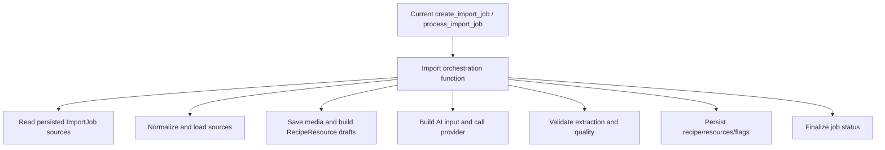

### Work List

- Split the current import pipeline into small, named functions or service classes.
- Keep the same synchronous execution model inside the pipeline.
- Inspect current large files and refactor only the places that directly affect the background-processing migration.
- Current known candidates:
  - `backend/app/imports/jobs.py` is the main import pipeline hotspot and should be split before Dramatiq integration.
  - `backend/app/services/recipes.py` is a secondary backend hotspot; touch only if job/flag/resource updates require it.
  - `frontend/src/pages/RecipeDetailPage.tsx` is a frontend hotspot, but it should mostly wait for the UI/UX phase unless polling/notification changes require a narrow extraction.
- Verify the global Import Behavior Preservation Checklist before and after the refactor.
- Add focused tests around extracted blocks where practical.

### Blocks and Nuances

This phase is intentionally not a rewrite. The goal is to replace one long procedural body with a visible sequence of steps:

1. read job input;
2. validate;
3. load URL/media/video sources;
4. prepare AI input;
5. parse AI output;
6. write recipe data;
7. finalize job.

The extracted functions should be usable from both the current synchronous path and the future Dramatiq actor.

This phase must not change the import contract or any behavior listed in the Import Behavior Preservation Checklist.

## Phase 1: PostgreSQL, Dramatiq, Redis, and Non-Blocking Import

Goal: make import execution non-blocking and durable enough for local production-style testing.

Status: completed and approved.

This phase is split into subphases so database correctness, queue execution, and frontend behavior can be verified independently.

PostgreSQL should come before Dramatiq because active import limits, idempotency, worker claiming, and `SELECT ... FOR UPDATE` are database-centered concerns.

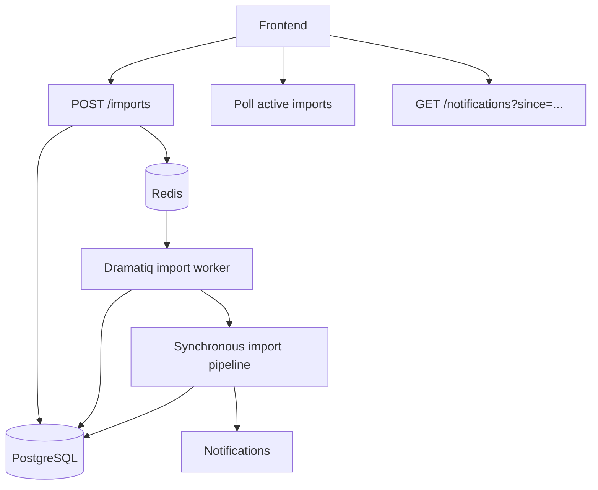

### Work List

#### Phase 1a: PostgreSQL Migration

Status: completed and approved.

- Add PostgreSQL configuration while preserving `dev` and `preview` runtime profiles.
- Make PostgreSQL the normal backend database once background workers are introduced.
- Keep `preview` behavior by recreating/truncating PostgreSQL schema state and local uploads on startup.
- Add Docker Compose for PostgreSQL and Redis.
- Keep local filesystem storage behind `StorageService`; do not couple import logic to local paths.
- Decide whether SQLite remains as a limited test-only/smoke option or is removed from normal development.

#### Phase 1b: Import Schema, Notifications, Job Events, Dramatiq, Redis

Status: completed and approved.

- Update `ImportJob.status` to the target statuses.
- Migrate existing import job statuses by meaning:
  - `pending` -> `queued`;
  - `processing` -> `running`;
  - `succeeded` -> `succeeded`;
  - `failed` -> `failed`.
- Keep this migration pragmatic; there is no production data compatibility requirement yet.
- Keep/import `clientImportId`; add support for `Idempotency-Key` or map it into the same dedupe field.
- Enforce active import limit from PostgreSQL state, not Redis queue depth.
- Add `Notification` model and backend creation service.
- Defer notification polling API to Phase 1d.
- Add `JobEvent` audit model.
- Add Dramatiq dependency and Redis broker configuration.
- Add `import_recipe_task(import_job_id)` actor.
- Keep `POST /imports` sync-first during Phase 1b; Phase 1b prepares the worker boundary but does not change frontend-facing import behavior yet.
- Keep worker logic synchronous internally; do not rewrite import internals to async.
- Keep Dramatiq actors thin wrappers over domain handlers.

Implemented notes:

- `Notification.type` and `Notification.status` are stored as strings rather than database enums so new notification types do not require schema migrations.
- `JobEvent.event_type` is stored as a string for the same reason.
- `ImportJob.dedupe_key` is the internal idempotency key. It is derived from `Idempotency-Key` when present, otherwise from `clientImportId`.
- At the end of Phase 1b, sync-first import writes `queued`, `worker_started`, `source_downloaded`, `ai_called`, `ai_succeeded`, `recipe_created`, and `failed` job events where applicable.
- At the end of Phase 1b, sync-first import writes `import_started`, `import_succeeded`, `import_succeeded_with_flags`, and `import_failed` notifications where applicable.
- At the end of Phase 1b, the Dramatiq actor exists as a thin wrapper around `process_import_job`, but `POST /imports` still calls the domain handler directly until Phase 1c.

#### Phase 1c: Backend Queue Cutover

Status: completed and approved.

- Make `POST /imports` return `202 Accepted` with `{ importJobId, status }`.
- Move import execution into the Dramatiq worker.
- Keep worker internals synchronous: workers execute normal sync domain handlers, not async/await pipeline code.
- Verify that multiple imports can be executed by worker concurrency while the per-user active import limit is enforced from PostgreSQL `queued`/`running` state.
- Keep the frontend contract as close as possible to the current shape, but do not implement notification polling UI in this subphase.
- Add basic structured logs for API enqueueing and worker execution.

Implemented notes:

- Newly created imports return `202 Accepted` and remain `queued` until the worker processes them.
- Duplicate dedupe keys return the existing import job with `200 OK` and are not enqueued again.
- `import_recipe_task` runs the existing synchronous `process_import_job` handler in the worker process.
- Active import limit is enforced per user from PostgreSQL `queued`/`running` state. The current default is `3`.
- Frontend polling and notification UX are intentionally deferred to Phase 1d.

After this subphase, run the required checkpoint:

- check whether a small refactor is needed;
- verify the Import Behavior Preservation Checklist;
- update this plan if new decisions were made;
- stop for review before starting the next subphase.

#### Phase 1d: Polling API and Frontend Import UX

Status: completed and approved.

- Add API polling for active imports and notifications.
- Add frontend polling for active imports and notifications.
- Make the import form non-blocking from the user's perspective.
- Show user notifications/toasts when import starts and finishes.
- Redirect to recipe detail from a successful import completion notification.
- Keep recipe and collection list invalidation consistent with import completion.

Implemented notes:

- `GET /notifications` returns current-user notifications for polling and history.
- `PATCH /notifications/{notificationId}` marks a notification read/unread.
- `PATCH /notifications/read-all` marks current-user unread notifications read through a frontend-provided notification id cutoff.
- The frontend polls notifications and shows the latest unread notification as an in-app toast.
- A `Notifications` tab shows notification history, read/unread state, mark-read and mark-all-read actions, and recipe navigation for successful imports.
- Import polling treats both `succeeded` and `succeeded_with_flags` as successful terminal statuses.
- Import terminal statuses invalidate recipes, collections, and notifications.

After this subphase, run the same checkpoint: refactor check, invariant check, plan update if needed, and stop for review.

### Blocks and Nuances

#### ImportJob

`ImportJob` remains a domain entity and should not be reduced to a Dramatiq task id. It owns:

- current status;
- owner/user;
- client id;
- idempotency key;
- created recipe id;
- normalized error code/message;
- timestamps;
- retry metadata if useful at the domain level.

Terminal statuses are:

- `succeeded`
- `succeeded_with_flags`
- `failed`
- `cancelled`

#### Queue Boundary

Dramatiq actors should stay thin:

```text
import_recipe_task(import_job_id)
  -> run_import_job(import_job_id)
```

The business logic belongs to `run_import_job`, not to the actor decorator.

#### Idempotency

Preferred approach:

- frontend still sends stable `clientImportId`;
- backend also accepts `Idempotency-Key`;
- backend stores one canonical dedupe key;
- unique constraint: `(owner_id, dedupe_key)`.

If the same key is submitted again, return the existing `ImportJob`.

#### Active Import Limit

Count active jobs in PostgreSQL:

```text
status in queued, running
```

This prevents Redis queue state from becoming the source of truth.

#### Error Handling and Retries

- Import retry is manual, not automatic.
- The total allowed attempt count includes the initial attempt and defaults to three.
- Dramatiq actor retries are independently configurable and default to zero.
- The detailed manual retry design is tracked in Phase 3.

#### Notifications

Notifications are persisted records, not just frontend toasts.

Initial notification types:

- `import_started`
- `import_succeeded`
- `import_succeeded_with_flags`
- `import_failed`

Initial API:

- `GET /notifications?since=<timestamp>&type=<optional>`
- `PATCH /notifications/{id}` to mark read
- optionally `GET /imports?status=active` for active import polling

The first frontend version uses polling. SSE is a later scaling/UX enhancement.

Notification API endpoints are implemented in Phase 1d. Phase 1b only creates the persisted model and backend service that import processing can call; Phase 1c only moves import execution into the worker.

Basic internal import job diagnostics may be implemented before Phase 4 to support local debugging of the queue cutover. Until Phase 5, these views are treated as local/admin-only tooling by convention, not by real authorization.

#### Observability

Minimum structured log fields:

- `request_id`
- `import_job_id`
- `recipe_id`
- `user_id`
- `task_name`
- `task_duration_ms`
- `ai_model`
- `ai_latency_ms`
- `status`
- `error_code`

`JobEvent` is part of Phase 1b. It should capture:

- `queued`
- `worker_started`
- `source_downloaded`
- `ai_called`
- `ai_succeeded`
- `recipe_created`
- `embedding_enqueued`
- `failed`

## Phase 2: Hybrid Search and Embedding Tasks

Goal: add user-scoped settings, fixed tags, deterministic search text, autocomplete chips, pagination, embeddings, and semantic/vector search. This phase is large and is split into iterations; each iteration is a review checkpoint and must not begin implementation until its iteration plan is printed and approved.

Status: completed and approved.

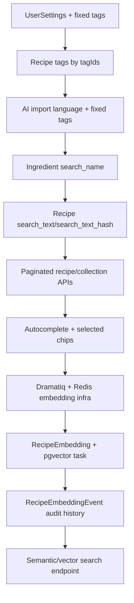

### Phase 2 Goal

```text
- UserSettings with fixed recipe_language
- user-owned fixed tags
- tag soft delete
- recipe tags selected by tagIds
- AI import aware of user language and available tags
- ingredient search_name
- recipe.search_text/search_text_hash
- autocomplete + selected chips
- paginated recipe/collection/search APIs
- RecipeEmbedding with pgvector
- embedding tasks with `SKIPPED_DUE_TO_FLAGS` behavior
- free text search = vector search only
```

Current models live in `backend/app/models/__init__.py`; the project already has `User`, `Recipe`, `Ingredient`, `Tag`, `RecipeTag`, `Collection`, `ImportJob`, and `RecipeReviewFlag`.

### Phase 2 Process Rules

- Before each iteration, print the implementation plan and confirm whether any user input is required.
- If an iteration explicitly requires user input, ask for it before implementation.
- After each iteration:
  - verify the global Import Behavior Preservation Checklist when import, resources, flags, media, AI, storage, or recipe mutation were touched;
  - propose invariant checklist updates if key business-logic decisions changed or were added;
  - do a small refactor if the iteration left avoidable local complexity;
  - propose future-work cleanup items if shortcuts, temporary compatibility fields, or unfinished tails remain;
  - wait for user review/approval before the next iteration.

### Global Requirements

#### User Isolation

Every query must be scoped by current user / owner.

This applies to:

```text
- recipes
- ingredients through recipe.owner_id
- tags
- collections
- sources
- review flags
- import jobs
- embeddings through recipe.owner_id
- vector search SQL
```

Never fetch globally and filter in application code if the database can filter by owner.

#### Search Contract

The agreed search behavior is the implementation contract:

```text
- selected chips are hard filters
- free text search is vector search only
- autocomplete creates typed selected chips
- search returns match_reasons
- search is paginated with hasMore
- empty/fallback behavior must be explicit
- vector search must filter by owner_id in SQL
```

No separate implementation PR is needed only to write the contract, but implementation must follow it.

### Iteration 1: UserSettings + Default Tags

#### Files

```text
backend/app/models/__init__.py
backend/app/db/init.py
backend/app/core/config.py
backend/alembic/versions/<new_revision>.py
tests if available
```

#### Add `UserSettings`

Add near `User`:

```python
class UserSettings(TimestampMixin, Base):
    __tablename__ = "user_settings"

    user_id: Mapped[str] = mapped_column(
        ForeignKey("users.id", ondelete="CASCADE"),
        primary_key=True,
    )
    recipe_language: Mapped[str] = mapped_column(String, nullable=False)

    user: Mapped["User"] = relationship(back_populates="settings")
```

Add to `User`:

```python
settings: Mapped["UserSettings"] = relationship(
    back_populates="user",
    cascade="all, delete-orphan",
    uselist=False,
)
```

`ensure_default_user` currently creates only the default local user. Update it to also ensure settings and default tags.

#### Defaults

```python
DEFAULT_RECIPE_LANGUAGE = "ru"
```

Default tags:

```python
DEFAULT_TAG_NAMES = [
    "аэрогриль",
    "духовка",
    "мороженое",
    "быстрое",
    "низкокалорийное",
    "высокобелковое",
    "без сахара",
    "праздничное",
    "вегетарианское",
    "десерт",
    "завтрак",
    "обед",
    "салат",
    "перекус",
    "горячее",
    "суп",
    "выпечка",
    "простое",
]
```

#### Config

Add env-configurable setting:

```text
MAX_TAGS_PER_USER=50
```

Expose in settings as:

```python
max_tags_per_user: int = 50
```

#### Bootstrap Behavior

```text
ensure_default_user:
  - ensure User exists
  - ensure UserSettings exists with recipe_language="ru"
  - ensure default tags exist
  - tag seeding is idempotent
```

### Iteration 2: Tag Model, Soft Delete, Tag Management UI

#### Files

```text
backend/app/models/__init__.py
backend/app/api/routes/tags.py
backend/app/schemas/tags.py
backend/app/services/tags.py
backend/app/main.py
backend/alembic/versions/<new_revision>.py
frontend tag-management page/tab
```

Current `Tag` has `owner_id`, `name`, and `UniqueConstraint("owner_id", "name")`.

#### Update `Tag`

```python
class Tag(TimestampMixin, Base):
    __tablename__ = "tags"

    id: Mapped[str] = mapped_column(String, primary_key=True, default=new_id)
    owner_id: Mapped[str] = mapped_column(
        ForeignKey("users.id", ondelete="CASCADE"),
        nullable=False,
        index=True,
    )
    name: Mapped[str] = mapped_column(String, nullable=False)
    description: Mapped[str | None] = mapped_column(Text)
    deleted_at: Mapped[datetime | None] = mapped_column(DateTime(timezone=True))

    owner: Mapped[User] = relationship(back_populates="tags")
    recipes: Mapped[list[Recipe]] = relationship(
        secondary="recipe_tags",
        back_populates="tags",
    )
```

Remove the old plain unique constraint and replace it with PostgreSQL partial unique index:

```sql
CREATE UNIQUE INDEX ix_tags_owner_lower_name_active_unique
ON tags (owner_id, lower(name))
WHERE deleted_at IS NULL;
```

#### Backend API

Add:

```http
GET /tags
POST /tags
PATCH /tags/{tag_id}
GET /tags/{tag_id}/usage
DELETE /tags/{tag_id}
```

Behavior:

```text
GET /tags:
  returns active tags only

POST /tags:
  checks current active tag count < max_tags_per_user
  rejects duplicate active names case-insensitively
  creates tag

PATCH /tags/{tag_id}:
  updates name/description
  preserves recipe_tags links

GET /tags/{tag_id}/usage:
  returns number of recipes using the tag

DELETE /tags/{tag_id}:
  soft delete: deleted_at = now()
  do not delete recipe_tags rows
```

#### Frontend

Create a new tag management tab/page:

```text
- list active tags
- create tag
- edit tag name
- edit description
- delete tag
- before delete, fetch usage and confirm:
  "This tag is used by X recipes."
```

Add the new backend router in `backend/app/main.py`, where other routers are included.

### Iteration 3: Recipe Tags by `tagIds`, No Auto-Create

#### Files

```text
backend/app/schemas/recipes.py
backend/app/services/recipes.py
frontend recipe edit UI
frontend API client/types
```

Currently `RecipePatchIn.tags` is `list[str] | None`.

#### Change Patch Schema

Replace:

```python
tags: list[str] | None = None
```

with:

```python
tagIds: list[str] | None = None
```

#### Change Recipe Output

Current `RecipeDetailOut.tags` is `list[str]`.

Change to:

```python
tags: list[TagOut]
```

where:

```python
class TagOut(BaseModel):
    id: str
    name: str
    description: str | None = None
```

Reuse from `schemas.tags` if convenient.

#### Update Serializer

Current serializer returns tag names only.

Change to return active tag objects:

```python
tags=[
    TagOut(id=tag.id, name=tag.name, description=tag.description)
    for tag in sorted(
        [tag for tag in recipe.tags if tag.deleted_at is None],
        key=lambda tag: tag.name,
    )
]
```

Ensure that we return to a user only non-deleted tags everywhere.

#### Update `patch_recipe`

Current `patch_recipe` auto-creates tags from strings.

Replace with validation by IDs:

```python
if patch.tagIds is not None:
    unique_tag_ids = list(dict.fromkeys(patch.tagIds))

    tags = session.scalars(
        select(Tag).where(
            Tag.owner_id == recipe.owner_id,
            Tag.id.in_(unique_tag_ids),
            Tag.deleted_at.is_(None),
        )
    ).all()

    if len(tags) != len(unique_tag_ids):
        raise ApiError(ApiErrorCode.INVALID_TAG, "Some tags are invalid.")

    recipe.tags = list(tags)
```

Add `INVALID_TAG` error code if missing.

#### Frontend

Recipe edit UI:

```text
- show selected tags as chips
- add/remove tags only from active existing tags
- no free-form tag creation inside recipe edit
- tag creation/editing only in tag management tab
```

### Iteration 4: AI Import - Language + Fixed Tags

This is the AI-related iteration.

#### Important Instruction

Do not rewrite the extraction prompt content manually. Ask the user for the new version.

Must do:

```text
- add .format(language=..., tags=...) plumbing
- ask for the updated prompt text
- do not invent final prompt wording
```

#### Files

```text
backend/app/ai/prompt.py
backend/app/ai/provider.py
backend/app/ai/openai_provider.py
backend/app/ai/schemas.py
backend/app/imports/jobs.py
```

#### Provider Interface

Current provider interface:

```python
async def extract(self, sources: list[ReadySource]) -> ExtractionResult:
```

Change to:

```python
async def extract(
    self,
    sources: list[ReadySource],
    *,
    language: str,
    tags: str,
) -> ExtractionResult:
    ...
```

`language` comes from `UserSettings.recipe_language`.

`tags` is a comma-separated string of active tag names:

```python
tags = ", ".join(tag.name for tag in active_tags)
```

#### Prompt Formatting

Current provider uses static `recipe_extraction_prompt`.

Change to:

```python
prompt = recipe_extraction_prompt.format(
    language=language,
    tags=tags,
)
```

#### Apply AI Tags

Current AI output already has `tags: list[str]`.

In import flow:

```text
- load active owner tags
- pass comma-separated active tag names into prompt
- match recipe_result.tags to active tags by normalized name
- attach only matched active tags
- ignore/log unknown AI tags
```

Current import creates `Recipe` and ingredients but does not attach `recipe_result.tags` in the shown flow.

### Iteration 5: Ingredient `search_name` + Update by ID

#### Files

```text
backend/app/models/__init__.py
backend/app/schemas/recipes.py
backend/app/services/recipes.py
backend/app/imports/jobs.py
backend/app/services/search_text.py or backend/app/services/ingredients.py
backend/alembic/versions/<new_revision>.py
frontend recipe edit UI/API
```

Current `Ingredient` has only `name`, `quantity`, `unit`, `note`, `position`.

#### Model Changes

Add:

```python
search_name: Mapped[str] = mapped_column(String, nullable=False)
```

#### Migration

For existing rows:

```text
search_name = normalize_search_text(name)
```

#### Helper

Add:

```python
def normalize_search_text(value: str) -> str:
    ...

def build_ingredient_search_name(
    name: str,
) -> str:
    ...
```

Rule:

```text
search_name = normalize_search_text(name)
```

Normalization must trim, case-fold/lowercase, collapse whitespace, and avoid common encoding artifacts where feasible.

#### Update `IngredientIn`

Current `IngredientIn` has no `id`.

Change to:

```python
class IngredientIn(BaseModel):
    id: str | None = None
    name: str
    quantity: str | None = None
    unit: str | None = None
    note: str | None = None
```

#### Update Patch Behavior

Current `patch_recipe` replaces the entire ingredients list.

New behavior:

```text
if IngredientIn.id exists and belongs to recipe:
  update existing ingredient
  update name/quantity/unit/note/position
  rebuild search_name if name changed

if IngredientIn.id is missing:
  create new ingredient
  search_name = build_ingredient_search_name(name)

if existing ingredient is omitted from payload:
  delete it
```

#### Update Import Creation

Current import creates `Ingredient(name=..., quantity=..., unit=..., note=...)`.

Change to:

```python
Ingredient(
    name=ingredient.name,
    search_name=build_ingredient_search_name(ingredient.name),
    quantity=ingredient.quantity,
    unit=ingredient.unit,
    note=ingredient.note,
    position=index,
)
```

Do not expose `search_name`.

#### Frontend Ingredient Editor

Replace the recipe edit page's free-form ingredient textarea with structured ingredient editing:

```text
- render an "Add ingredient" block before the existing ingredient list
- each ingredient has separate editable fields: name, quantity, unit, note
- name is the only required ingredient field
- deleting an ingredient is local until the whole recipe form is saved
- adding an ingredient is local until the whole recipe form is saved
- saving the recipe sends the full structured ingredients array with the rest of the recipe patch payload
- block save if any ingredient row has an empty name
- keep the existing max ingredient count validation, but apply it to ingredient rows instead of textarea lines
- use a small red X button for row deletion
```

### Iteration 6: Recipe `search_text/search_text_hash`

#### Files

```text
backend/app/models/__init__.py
backend/app/services/search_text.py
backend/app/imports/jobs.py
backend/app/services/recipes.py
backend/alembic/versions/<new_revision>.py
frontend/src/api/types.ts
frontend/src/pages/RecipeDetailPage.tsx
frontend/src/pages/RecipeDetailPage.test.tsx
```

#### Model Changes

Add to `Recipe`:

```python
search_text: Mapped[str | None] = mapped_column(Text)
search_text_hash: Mapped[str | None] = mapped_column(String)
```

`Recipe` already has the relevant fields: `title`, `cook_time_minutes`, `instructions`, `nutrition_estimate`, `author_name`, `source_name`, `ingredients`.

#### Builder

Add deterministic builder:

```python
def build_recipe_search_text(recipe: Recipe) -> str:
    ...
```

Include:

```text
title
source_name
author_name
ingredients.search_name
instructions
nutrition_estimate
cook_time_minutes
```

Do not include:

```text
tags
collections
cover image
source_url
created_at / updated_at
ingredient.note
ingredient.quantity
ingredient.unit
```

#### Editable Source Metadata

At the beginning of this iteration, make recipe source metadata editable on the recipe detail page:

```text
- author_name is a free-form editable field
- source_name is selected from the fixed SourceName enum values
- source_name and author_name are saved through the normal recipe PATCH flow
```

#### Update Points

Rebuild synchronously after:

```text
- import recipe creation
- recipe patch when title changed
- source_name changed
- author_name changed
- ingredient name/search_name changed
- instructions changed
- nutrition_estimate changed
- cook_time_minutes changed
```

### Iteration 7: Pagination for Recipes and Collections

Status: completed and approved.

This should happen before or alongside search UI work.

#### Files

```text
backend/app/schemas/recipes.py
backend/app/services/recipes.py
backend/app/api/routes/recipes.py
backend/app/schemas/collections.py
backend/app/services/collections.py
backend/app/api/routes/collections.py
frontend list views
```

Implemented note: `GET /recipes` and `GET /collections` now accept `limit` and `offset`, default to `limit=24` and `offset=0`, and return `items`, `total`, `limit`, and `offset`. The shared pagination metadata fields live in a schema mixin. The lower-level query functions still support full unpaginated owner-scoped reads when `limit` and `offset` are omitted.

#### Recipes Pagination

Add query params:

```http
GET /recipes?limit=24&offset=0
```

Response:

```python
class RecipeListOut(BaseModel):
    items: list[RecipeListItemOut]
    total: int
    limit: int
    offset: int
```

#### Collections Pagination

Add query params:

```http
GET /collections?limit=24&offset=0
```

Response:

```python
class CollectionListOut(BaseModel):
    items: list[CollectionOut]
    total: int
    limit: int
    offset: int
```

Use `total` for recipes and collections.

#### Tags Pagination

Add query params:

```http
GET /tags?limit=24&offset=0
```

Response:

```python
class TagListOut(BaseModel):
    items: list[TagOut]
    total: int
    limit: int
    offset: int
```

Use the same pagination envelope as recipes and collections.

### Iteration 8: Autocomplete + Selected Chips Backend/Frontend

Status: completed and approved.

#### Autocomplete Sources

Direct table search only. No `search_suggestions`.

Sources:

```text
tags.name
recipes.source_name
recipes.author_name
recipes.title
ingredient_query from current user input
```

Do not include:

```text
collections.name
recent searches
search_suggestions
canonical ingredient aliases
```

#### Suggestion DTO

```python
class SearchSuggestionOut(BaseModel):
    type: Literal[
        "tag",
        "ingredient_query",
        "source_name",
        "author_name",
        "title",
    ]
    id: str | None = None
    recipeId: str | None = None
    value: str | None = None
    label: str
```

Examples:

```json
{"type": "tag", "id": "tag_123", "label": "высокобелковое"}
```

```json
{"type": "ingredient_query", "value": "cottage", "label": "Ingredient - cottage"}
```

```json
{"type": "title", "recipeId": "recipe_123", "label": "Куриный суп"}
```

#### Selected Chips

Frontend turns selected suggestions into typed chips.

Rules:

```text
selected chips = hard filters
free text = vector search later
```

For this iteration, implement structured chip filtering only if vector search is not ready yet.

Chip behavior:

```text
tag             -> filter by recipe_tags.tag_id
ingredient_query -> hard textual filter: recipe has at least one ingredient whose search_name contains value
source_name     -> filter by recipes.source_name
author_name     -> filter by recipes.author_name
title           -> filter by recipes.id
```

`ingredient_query` is intentionally not canonical ingredient search. It is a lightweight MVP text-based ingredient filter. It avoids the need for ingredient catalog/hierarchy while supporting common queries like `cottage` matching `cottage cheese 5%`, `soft cottage cheese`, and `low-fat cottage cheese`.

### Iteration 9: Background Task Infrastructure - Dramatiq + Redis

Status: completed and approved.

Add infrastructure before embedding tasks.

Requirements:

```text
- add Redis/Dramatiq config
- add worker entrypoint
- add local dev command
- add task discovery
- keep current sync-first import behavior for now
- embedding tasks will use this infrastructure
```

The current README already says imports are sync-first but frontend polling is compatible with a future queue.

### Iteration 10: RecipeEmbedding + pgvector + Embedding Task

Status: completed and approved.

#### Model

Use name `RecipeEmbedding`, not `RecipeEmbeddingJob`.

Relationship semantics:

```text
Recipe 1 -- 0..1 RecipeEmbedding
```

`Recipe` is the primary domain entity. `RecipeEmbedding` is technical search-index state and may be absent. If a `RecipeEmbedding` row exists, there is exactly one row per recipe because `recipe_embeddings.recipe_id` is both primary key and foreign key to `recipes.id` with `ondelete="CASCADE"`. Do not add `embedding_id` to `recipes`.

```python
class RecipeEmbedding(Base):
    __tablename__ = "recipe_embeddings"

    recipe_id: Mapped[str] = mapped_column(
        ForeignKey("recipes.id", ondelete="CASCADE"),
        primary_key=True,
    )

    embedding: Mapped[list[float] | None] = mapped_column(Vector(1536), nullable=True)

    model: Mapped[str] = mapped_column(String, nullable=False)
    input_hash: Mapped[str | None] = mapped_column(String)

    status: Mapped[str] = mapped_column(String, nullable=False)

    error_message: Mapped[str | None] = mapped_column(String)
    failed_attempts: Mapped[int] = mapped_column(Integer, default=0, nullable=False)

    last_attempt_at: Mapped[datetime | None] = mapped_column(DateTime(timezone=True))
    last_error_at: Mapped[datetime | None] = mapped_column(DateTime(timezone=True))

    created_at: Mapped[datetime] = mapped_column(DateTime(timezone=True), nullable=False)
    updated_at: Mapped[datetime] = mapped_column(DateTime(timezone=True), nullable=False)
```

Statuses:

```text
STALE
RUNNING
READY
FAILED
SKIPPED_DUE_TO_FLAGS
```

No `desired_input_hash`.

Task receives `recipe_id` only. Do not pass hash as task argument in MVP.

Application code should create/update `RecipeEmbedding` only when the embedding subsystem needs to record state: scheduling, skipping due to review flags, retrying, running, failing, or saving a ready vector. Code that reads `recipe.embedding` must handle `None`.

#### pgvector

Enable pgvector in PostgreSQL migration.

Add vector column and indexes later after query shape is stable. For the first implementation, exact vector search is acceptable.

#### Embedding Input

Include:

```text
title
ingredients.search_name
instructions
nutrition_estimate
cook_time_minutes
```

Do not include:

```text
tags
source_name
author_name
ingredient.note
ingredient.quantity
ingredient.unit
collections
cover image
source_url
```

#### Recipe Flags Behavior

Current project has review flags with `OPEN` and `RESOLVED`.

Rules:

```text
If recipe has open review flags:
  create/update RecipeEmbedding.status = SKIPPED_DUE_TO_FLAGS
  do not enqueue embedding

If last open review flag is resolved:
  mark RecipeEmbedding.status = STALE
  enqueue embed_recipe(recipe_id)

If a flag is reopened:
  set RecipeEmbedding.status = SKIPPED_DUE_TO_FLAGS
```

Current review flag endpoint calls `set_review_flag_status`.

Update that service to schedule embedding when the last open flag is resolved. Current implementation only updates the flag status and commits.

#### Task Behavior

```text
embed_recipe(recipe_id):
  - reload latest recipe
  - check owner-scoped recipe exists
  - if open review flags exist:
      set status = SKIPPED_DUE_TO_FLAGS
      return
  - build deterministic embedding input
  - compute input_hash
  - if status=READY and input_hash/model match:
      return
  - mark RUNNING
  - call embedding provider
  - reload recipe after provider call
  - recompute hash
  - if hash changed:
      mark STALE
      enqueue embed_recipe(recipe_id)
      return
  - save vector, model, input_hash, status=READY
```

#### Failure Handling MVP

Only:

```text
- queue retry for temporary errors
- manual retry endpoint
```

Manual retry:

```http
POST /recipes/{recipe_id}/embedding/retry
```

Behavior:

```text
- check recipe belongs to current user
- if open flags exist: set SKIPPED_DUE_TO_FLAGS and do not enqueue
- else set STALE and enqueue embed_recipe(recipe_id)
```

No watchdog/repair job yet.

No user notifications for embedding tasks. Logs/audit are enough.

### Iteration 10b: RecipeEmbeddingEvent Audit History

Status: completed and approved.

Goal: add append-only internal audit/debug history for the `RecipeEmbedding` lifecycle. This is not user-facing notification functionality and must not change how current embedding status is computed.

#### Architecture Rules

```text
RecipeEmbedding remains the source of truth for current embedding/indexing state.
RecipeEmbeddingEvent is history/audit only.
Do not compute current embedding status from events.
Do not rename RecipeEmbedding to RecipeEmbeddingJob.
Do not add RecipeEmbeddingAttempt.
Do not create user notifications for embedding events.
Admin embeddings UI shows only recipes that already have a RecipeEmbedding row.
```

Relationship semantics:

```text
Recipe 1 -- 0..1 RecipeEmbedding
RecipeEmbedding 1 -- 0..N RecipeEmbeddingEvent
```

`RecipeEmbeddingEvent.recipe_id` points to `recipe_embeddings.recipe_id`, not directly to `recipes.id`. If `Recipe` is deleted, `RecipeEmbedding` is deleted by cascade, and `RecipeEmbeddingEvent` rows are deleted by cascade through `RecipeEmbedding`.

#### Model

Create `RecipeEmbeddingEvent`:

```python
class RecipeEmbeddingEvent(Base):
    __tablename__ = "embedding_events"
    __table_args__ = (
        Index("ix_embedding_events_recipe_created_at", "recipe_id", "created_at"),
        Index("ix_embedding_events_owner_created_at", "owner_id", "created_at"),
        Index("ix_embedding_events_type_created_at", "event_type", "created_at"),
    )

    id: Mapped[str] = mapped_column(String, primary_key=True, default=new_id)
    recipe_id: Mapped[str] = mapped_column(
        ForeignKey("recipe_embeddings.recipe_id", ondelete="CASCADE"),
        nullable=False,
    )
    owner_id: Mapped[str] = mapped_column(ForeignKey("users.id", ondelete="CASCADE"), nullable=False)
    event_type: Mapped[str] = mapped_column(String, nullable=False)
    status_after: Mapped[str | None] = mapped_column(String)
    payload: Mapped[dict[str, Any] | None] = mapped_column(JSON)
    created_at: Mapped[datetime] = mapped_column(
        DateTime(timezone=True),
        server_default=func.now(),
        nullable=False,
    )

    embedding: Mapped["RecipeEmbedding"] = relationship(back_populates="events")
    owner: Mapped["User"] = relationship()
```

Update `RecipeEmbedding`:

```python
events: Mapped[list["RecipeEmbeddingEvent"]] = relationship(
    back_populates="embedding",
    cascade="all, delete-orphan",
)
```

Do not use a DB enum for `event_type` in this iteration. Keep it as a string, like existing `JobEvent.event_type`.

#### Migration

Create table `embedding_events`:

```text
id string primary key
recipe_id string not null, FK -> recipe_embeddings.recipe_id ON DELETE CASCADE
owner_id string not null, FK -> users.id ON DELETE CASCADE
event_type string not null
status_after string nullable
payload JSON nullable
created_at timezone datetime, server_default now, not null
```

Create indexes:

```text
ix_embedding_events_recipe_created_at(recipe_id, created_at)
ix_embedding_events_owner_created_at(owner_id, created_at)
ix_embedding_events_type_created_at(event_type, created_at)
```

#### Event API

Create constants and helper in `backend/app/embeddings/events.py`.

Event constants:

```python
class EmbeddingEventType:
    SCHEDULED = "SCHEDULED"
    ENQUEUED = "ENQUEUED"
    STARTED = "STARTED"
    SKIPPED_DUE_TO_FLAGS = "SKIPPED_DUE_TO_FLAGS"
    ALREADY_READY = "ALREADY_READY"
    PROVIDER_SUCCEEDED = "PROVIDER_SUCCEEDED"
    SAVED = "SAVED"
    STALE_REQUEUED = "STALE_REQUEUED"
    FAILED = "FAILED"
    RETRY_REQUESTED = "RETRY_REQUESTED"
```

Helper:

```python
def add_embedding_event(
    session: Session,
    *,
    embedding: RecipeEmbedding,
    owner_id: str,
    event_type: str,
    payload: dict[str, Any] | None = None,
) -> RecipeEmbeddingEvent:
    event = RecipeEmbeddingEvent(
        recipe_id=embedding.recipe_id,
        owner_id=owner_id,
        event_type=event_type,
        status_after=embedding.status,
        payload=payload,
    )
    session.add(event)
    return event
```

Set `RecipeEmbedding.status` first, then call `add_embedding_event`, so `status_after` snapshots the state after the event is applied. Write event rows in the same transaction as the related `RecipeEmbedding` state change where possible.

#### Event Writing Rules

```text
SCHEDULED:
  write when embedding recalculation is needed and status becomes STALE
  payload: reason, model

ENQUEUED:
  write after embed_recipe(recipe_id) is successfully queued
  payload: taskName, recipeId

SKIPPED_DUE_TO_FLAGS:
  write after status becomes SKIPPED_DUE_TO_FLAGS
  payload: reason=open_review_flags, openFlagCount

STARTED:
  write when worker sets status=RUNNING
  payload: model, inputHash

ALREADY_READY:
  write only when an actual worker task starts and exits as no-op
  payload: model, inputHash

PROVIDER_SUCCEEDED:
  write after provider returns vector successfully, before or around saving it
  payload: model, inputHash, dimension, durationMs

SAVED:
  write after vector is persisted and status becomes READY
  payload: model, inputHash, dimension

STALE_REQUEUED:
  write when recipe changed while provider call was running and computed vector is discarded
  payload: reason, taskInputHash, latestInputHash
  also write `ENQUEUED` if requeue succeeds

FAILED:
  write after status becomes FAILED
  payload: model, inputHash, error, temporary, failedAttempts

RETRY_REQUESTED:
  write when manual retry is requested
  payload: source=manual, previousStatus, failedAttempts
  also write `ENQUEUED` if retry is queued
```

Do not write `ALREADY_READY` from scheduler checks; it is worker-only.

#### Admin API and UI

Extend the internal/admin embeddings functionality:

```text
GET /internal/embeddings
  returns only existing RecipeEmbedding rows
  includes event history
  uses existing internal/admin-safe-by-convention surface

POST /internal/embeddings/{recipe_id}/retry
  triggers manual retry
  writes RETRY_REQUESTED
  writes ENQUEUED if queueing succeeds
```

Dedicated paginated `/admin/recipe-embeddings` endpoints are deferred until real admin auth/routes are introduced. Current implementation extends the existing `/internal/embeddings` local/admin diagnostics page.

Admin page "Recipe embeddings" should show one row per existing `RecipeEmbedding` row:

```text
recipe title
recipe id
owner id
owner email if easy to join
current RecipeEmbedding.status
model
short input_hash
failed_attempts
last_attempt_at
last_error_at
updated_at
actions: retry, open recipe, expand events
```

Expandable events:

```text
created_at
event_type
status_after
payload
```

Sort events by `created_at`; use newest first unless the existing internal UI convention says otherwise.

#### Tests

Add/update tests:

```text
RecipeEmbeddingEvent can be created for an existing RecipeEmbedding.
add_embedding_event stores recipe_id, owner_id, event_type, status_after, payload.
Deleting Recipe cascades Recipe -> RecipeEmbedding -> RecipeEmbeddingEvent.
Scheduling writes SCHEDULED; successful broker publishing then writes ENQUEUED.
Open review flags write SKIPPED_DUE_TO_FLAGS and do not enqueue.
Worker success writes STARTED, PROVIDER_SUCCEEDED, SAVED.
Worker no-op writes ALREADY_READY.
Provider failure writes FAILED.
Stale requeue writes STALE_REQUEUED; successful broker publishing then writes ENQUEUED.
Manual retry writes RETRY_REQUESTED and SCHEDULED; successful broker publishing then writes ENQUEUED.
Internal/admin embeddings API/UI returns existing RecipeEmbedding rows and their events.
Recipes without RecipeEmbedding rows are not included in the admin embeddings page.
```

### Iteration 10c: Embedding Module Refactor

Status: completed and approved.

Goal: refactor the embedding subsystem into an explicit lifecycle-oriented pipeline with typed states, short database scopes, and no open ORM session during the provider call, while preserving current product behavior and API contracts.

This iteration must follow [Refactoring Guidelines](./refactoring-guidelines.md) and stop for review after every subphase.

#### Preserved Behavior

```text
Recipe 1 -- 0..1 RecipeEmbedding.
Embedding input fields and normalization remain unchanged.
Embedding provider/model selection remains unchanged.
Open review flags produce SKIPPED_DUE_TO_FLAGS and prevent enqueue.
Ready embedding with the same input hash and model is not recalculated.
Recipe changes during provider execution discard the stale vector and requeue.
Provider failure records failed state, increments failed_attempts, and is re-raised for Dramatiq retry.
Dramatiq max_retries remains 3.
Embedding tasks do not create user-facing notifications.
Public and internal API paths remain unchanged.
Embedding status and event names and values are identical uppercase strings in Python, PostgreSQL, API responses, and frontend contracts.
Search ranking and vector distance behavior remain unchanged.
```

Queue publishing is a secondary operation. Failure to publish an embedding task must not turn an already successful import, recipe edit, or review-flag update into a failed user operation. The embedding remains `STALE`, the publishing failure is logged, and no `ENQUEUED` event is written. A transactional outbox remains deferred to production hardening.

#### Target Module Responsibilities

```text
embeddings/input.py
  Build one immutable RecipeEmbeddingInput containing text and input_hash.

embeddings/queries.py
  Own embedding/recipe reads, owner-scoped reads, get-or-create, and internal diagnostics queries.

embeddings/events.py
  Build typed RecipeEmbeddingEvent rows from explicit identifiers and lifecycle state.

embeddings/planning.py
  Decide skip, no-op, or schedule and apply the corresponding state/event changes.

embeddings/processing.py
  Orchestrate worker start, provider execution, completion, stale requeue, and failure persistence.

embeddings/queue.py
  Own the Dramatiq publishing boundary and successful enqueued-event recording.

embeddings/service.py
  Keep thin public use cases such as owner-scoped manual retry.

embeddings/tasks.py
  Declare the Dramatiq actor and call process_recipe_embedding(recipe_id).

embeddings/logging.py
  Own embedding-specific structured lifecycle logs.
```

Do not add repository, unit-of-work, command bus, generic state-machine, or global embedding context abstractions in this iteration. Remove `diagnostics.py` after moving its database query to `queries.py`.

#### Target Types and Interfaces

```python
@dataclass(frozen=True)
class RecipeEmbeddingInput:
    text: str
    input_hash: str


@dataclass(frozen=True)
class EmbeddingPlan:
    embedding: RecipeEmbedding
    enqueue: bool


@dataclass(frozen=True)
class EmbeddingProcessingContext:
    recipe_id: str
    owner_id: str
    provider_name: str
    model: str
    embedding_input: RecipeEmbeddingInput
```

`EmbeddingProcessingContext` belongs in `processing.py` because it is local to worker execution. It is an immutable snapshot used only across the provider-call session boundary.

`EmbeddingPlan` is session-local: callers must consume its ORM `embedding` inside the session that created the plan, commit the scheduling state, and pass only scalar identifiers to the queue boundary.

```python
def build_recipe_embedding_input(recipe: Recipe) -> RecipeEmbeddingInput: ...

def prepare_recipe_embedding(
    session: Session,
    recipe: Recipe,
    *,
    force: bool = False,
) -> EmbeddingPlan: ...

def start_recipe_embedding(
    session: Session,
    recipe_id: str,
    *,
    provider_name: str,
    model: str,
) -> EmbeddingProcessingContext | None: ...

def complete_recipe_embedding(
    session: Session,
    context: EmbeddingProcessingContext,
    vector: list[float],
    *,
    duration_ms: int,
) -> bool: ...

def fail_recipe_embedding(
    session: Session,
    context: EmbeddingProcessingContext,
    error: Exception,
) -> int | None: ...

def build_embedding_event(
    session: Session,
    *,
    recipe_id: str,
    owner_id: str,
    event_type: RecipeEmbeddingEventType,
    status_after: RecipeEmbeddingStatus | None,
    **payload: Any,
) -> RecipeEmbeddingEvent: ...

def enqueue_recipe_embedding(recipe_id: str, owner_id: str) -> bool: ...

def process_recipe_embedding(recipe_id: str) -> None: ...
```

The boolean returned by `complete_recipe_embedding` means that the recipe changed during provider execution and a new task must be published after the completion transaction commits.

The boolean returned by `enqueue_recipe_embedding` reports whether broker publishing succeeded. Publishing failure is logged inside the queue boundary and is not raised into the completed user operation.

#### Typed Lifecycle Model

Change `RecipeEmbeddingStatus` so every enum name and value is the same uppercase string, and map model fields directly to the enum instead of storing untyped strings:

```python
class RecipeEmbeddingStatus(str, Enum):
    STALE = "STALE"
    RUNNING = "RUNNING"
    READY = "READY"
    FAILED = "FAILED"
    SKIPPED_DUE_TO_FLAGS = "SKIPPED_DUE_TO_FLAGS"
```

Add `RecipeEmbeddingEventType` with the lifecycle values:

```python
class RecipeEmbeddingEventType(str, Enum):
    SCHEDULED = "SCHEDULED"
    ENQUEUED = "ENQUEUED"
    STARTED = "STARTED"
    SKIPPED_DUE_TO_FLAGS = "SKIPPED_DUE_TO_FLAGS"
    ALREADY_READY = "ALREADY_READY"
    PROVIDER_SUCCEEDED = "PROVIDER_SUCCEEDED"
    SAVED = "SAVED"
    STALE_REQUEUED = "STALE_REQUEUED"
    FAILED = "FAILED"
    RETRY_REQUESTED = "RETRY_REQUESTED"
```

This explicitly supersedes the Iteration 10b decision to keep embedding event types as untyped strings and lowercase values.
SQLAlchemy can persist the enum member names directly because each member name and value are identical; `values_callable` is not needed.

Update model fields:

```python
RecipeEmbedding.status: RecipeEmbeddingStatus
RecipeEmbeddingEvent.event_type: RecipeEmbeddingEventType
RecipeEmbeddingEvent.status_after: RecipeEmbeddingStatus | None
```

Add an Alembic migration that converts existing lowercase status and event values to their uppercase equivalents, creates PostgreSQL enum types, and converts the columns. Downgrade must restore the lowercase string values. Cover upgrade, downgrade, fresh database, and persisted-value compatibility in migration/model tests.

#### Worker Transaction Flow

```python
def process_recipe_embedding(recipe_id: str) -> None:
    provider_name, provider = get_embedding_provider()

    with db_session() as session:
        context = start_recipe_embedding(
            session,
            recipe_id,
            provider_name=provider_name,
            model=provider.model,
        )

    if context is None:
        return

    try:
        vector = provider.embed(context.embedding_input.text)
    except Exception as error:
        with db_session() as session:
            fail_recipe_embedding(session, context, error)
        raise

    with db_session() as session:
        requeue = complete_recipe_embedding(session, context, vector, duration_ms=duration_ms)

    if requeue:
        enqueue_recipe_embedding(context.recipe_id, context.owner_id)
```

The real implementation must calculate `duration_ms` around the provider call. The provider call must execute without an open SQLAlchemy session or transaction.

#### Subphase 10c.1: Typed Lifecycle and Migration

Status: completed and approved.

- Add `RecipeEmbeddingEventType` and type all three lifecycle model fields.
- Add PostgreSQL migration and update schema/model serialization where required.
- Replace `.value` comparisons with enum comparisons in application code and queries.
- Update model, migration, API serialization, and search tests.
- Run the refactoring checkpoint and stop for review.

#### Subphase 10c.2: Input and Query Cleanup

Status: completed and approved.

- Replace separate text/hash builders with one `RecipeEmbeddingInput` builder.
- Remove `Any` from the input builder.
- Update search debug and embedding consumers to use `text` and `input_hash` from the same snapshot.
- Consolidate duplicated recipe-for-embedding queries with optional owner filtering.
- Move internal diagnostics selection into `queries.py` and delete `diagnostics.py`.
- Run the refactoring checkpoint and stop for review.

#### Subphase 10c.3: Planning Lifecycle

Status: completed and approved.

- Add `planning.py` and move skip/no-op/schedule decisions into `prepare_recipe_embedding`.
- Pass `Session` explicitly; remove hidden session lookup through ORM objects.
- Centralize open-flag counting and remove duplicate skip logic.
- Return `EmbeddingPlan` instead of an unnamed tuple.
- Preserve the rule that scheduler no-op does not write `ALREADY_READY`; that event remains worker-only.
- Add focused tests for open flags, ready no-op, changed input, missing embedding row, and forced retry.
- Run the refactoring checkpoint and stop for review.

#### Subphase 10c.4: Worker Processing Lifecycle

Status: completed and approved.

- Add `processing.py` with start, complete, failure, and orchestration functions.
- Commit `RUNNING` and `STARTED` before calling the provider.
- Call the provider without an open database session.
- Reload the current recipe after the provider returns and recompute the input snapshot.
- Save `READY` and `SAVED`, or set `STALE` and write `STALE_REQUEUED`, atomically with the corresponding state.
- Persist provider failure in a fresh session and re-raise it for Dramatiq retry.
- Make `tasks.py` a thin actor declaration without direct SessionLocal usage.
- Add focused tests for success, already-ready, missing recipe, open flags, provider failure, recipe mutation during provider call, and requeue.
- Run the refactoring checkpoint and stop for review.

#### Subphase 10c.5: Queue Boundary and Callers

Status: completed and approved.

- Add `queue.py` as the single Dramatiq publishing boundary.
- Write `ENQUEUED` only after broker publishing succeeds.
- Keep embedding `STALE` and log the error when publishing fails; do not fail the completed user operation.
- Adapt import success, recipe editing, review-flag resolution/reopen, public retry, and internal retry callers.
- Keep routers thin and preserve response models and owner checks.
- Remove old service helpers, compatibility imports, duplicate commits, and stale tests.
- Add regression tests proving queue failure does not fail import/edit/flag operations.
- Run the refactoring checkpoint and stop for review.

#### Subphase 10c.6: Logging, Cleanup, and Verification

Status: completed and approved.

- Add embedding lifecycle structured logging with snake_case fields and stable messages.
- Remove repeated component prefixes from log messages.
- Verify no test-only provider or queue behavior remains in production code.
- Update embedding invariants and future-work entries, including the deferred transactional outbox.
- Run `uv run ruff check app tests`.
- Run focused embedding, import, recipe, search, worker, model, and migration tests.
- Run the full backend suite.
- Run frontend tests and production build because enum serialization and internal embedding responses are cross-service contracts.
- Stop for final review before continuing to Iteration 11 work.

### Iteration 11: Semantic/Vector Search Endpoint

Status: completed and approved.

#### Files

```text
backend/app/api/routes/search.py
backend/app/services/search.py
backend/app/schemas/search.py
frontend search UI
```

#### Search Behavior

Final agreed MVP behavior:

```text
selected chips = hard filters
free text = vector search only
```

#### Search Request

```python
class SearchRequest(BaseModel):
    text: str | None = None
    selected: list[SearchChipIn] = []
    limit: int = 24
    offset: int = 0
```

#### Search Response

Search uses `hasMore`, not `total`.

```python
class SearchResultOut(BaseModel):
    id: str
    title: str
    coverImage: RecipeImageOut | None = None
    matchReasons: list[MatchReasonOut]

class SearchResponse(BaseModel):
    items: list[SearchResultOut]
    limit: int
    offset: int
    hasMore: bool
```

#### Filters

Only implement agreed filters from selected chips:

```text
tag
ingredient_query
source_name
author_name
title
```

Do not add extra collection/source/flag filter objects beyond agreed chip behavior.

#### Vector Search SQL Isolation

Vector query must filter by owner in SQL:

```sql
SELECT recipes.*
FROM recipes
JOIN recipe_embeddings ON recipe_embeddings.recipe_id = recipes.id
WHERE recipes.owner_id = :owner_id
  AND recipe_embeddings.status = 'READY'
ORDER BY recipe_embeddings.embedding <=> :query_embedding
LIMIT :limit_plus_one
OFFSET :offset;
```

If selected chips exist, apply them before/inside the query, not after fetching global vector results.

#### Empty and Fallback Behavior

Implement explicit states:

```text
No selected chips, no text:
  frontend uses existing GET /recipes default grid behavior.
  POST /search can return latest recipes if called directly with no filters.

Selected chips only:
  return matching recipes sorted by default order.

Text only:
  return vector matches.
  if no `READY` embeddings exist, return empty items with hasMore=false.

Selected chips + text:
  apply hard filters first, then vector rank within filtered candidates.

Embeddings missing for some recipes:
  those recipes are absent from semantic results until embedding is `READY`.

Recipe has SKIPPED_DUE_TO_FLAGS:
  absent from vector search.
```

Return empty list, not error, for no matches.

Implemented endpoint: `POST /search`.

Frontend behavior:

```text
No active search text and no chips:
  GET /recipes

Free text or selected chips present:
  POST /search
```

### Iteration 12: Admin Search Debugging Tools

Status: completed and approved.

Goal: add admin-only tools for explaining semantic search behavior and previewing the exact embedding input used for a recipe.

#### Scope

```text
Add minimal structured logs for semantic search.
Add internal/admin Search Debug page.
Add Search Explain endpoint.
Add embedding input preview.
Show embedding input preview:
  1. on admin Search Debug page;
  2. on recipe detail page, only for admin users.
Do not persist search debug snapshots in DB.
Do not reimplement RecipeEmbedding or RecipeEmbeddingEvent.
```

#### Admin Visibility and Guard

All search debug, search explain, and embedding input preview functionality is admin-only.

Until real auth/roles are implemented, use the explicit temporary internal admin guard introduced for `/internal/*`. Do not expose debug endpoints publicly, and do not show debug UI to normal users.

When Phase 5 introduces real authorization, replace the temporary guard with role/permission checks for these surfaces too.

#### Backend API

Add internal endpoints under the protected `/internal` router:

```text
POST /internal/search/explain
  accepts the same search text and selected chips shape as POST /search
  returns query interpretation, active hard filters, embedding provider/model, candidate/result counts, and ranked matches with debug scores/distances when available
  does not persist snapshots

GET /internal/recipes/{recipe_id}/embedding-input
  returns the current embedding input text and hash for one recipe
  owner/admin access is enforced by the internal admin guard for now
```

Keep response data diagnostic, not user-facing. The normal `POST /search` response contract must remain unchanged.

#### Semantic Search Logs

Add concise structured backend logs for semantic search:

```text
component=recipes.search
ownerId
textPresent
selectedChipCount
limit
offset
provider
model
candidateCount when available
returnedCount
durationMs
```

Do not log full recipe text, full embedding vectors, or full user query if it may contain private data. If query logging is needed for local debugging, keep it behind an explicit debug setting.

#### Frontend UI

Add an internal/admin `Search Debug` page:

```text
visible only to admin users
allows entering free text and selected chips
calls POST /internal/search/explain
shows effective filters
shows result ordering and diagnostic match data
allows opening a recipe detail page
shows embedding input preview for selected/result recipes
```

On recipe detail:

```text
show embedding input preview only for admin users
use GET /internal/recipes/{recipe_id}/embedding-input
do not show this block to normal users
```

Because real frontend auth state is not available yet, admin-only frontend visibility can use the same explicit temporary local/admin convention as other internal pages. Backend protection remains authoritative.

#### Tests

Add/update tests:

```text
internal search explain requires admin guard
internal embedding input preview requires admin guard
search explain returns no persisted debug snapshot rows
search explain applies selected chips as hard filters
search explain uses only `READY` embeddings for semantic ranking
embedding input preview returns the same text/hash built by the embedding input builder
frontend Search Debug page calls internal explain endpoint
recipe detail hides embedding preview for non-admin state once user context exists
```

## Phase 3: Import Pipeline Details

Goal: tighten import pipeline correctness, diagnostics, and failure semantics before broader UI/diagnostics work.

Status: completed and approved.

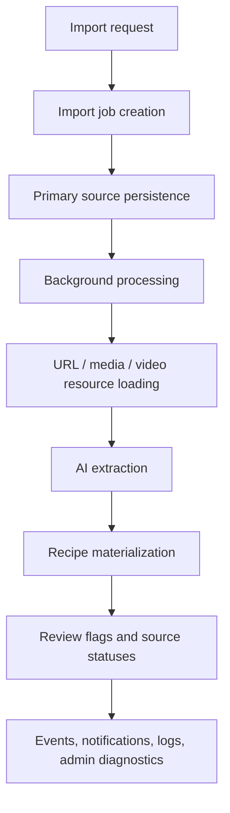

### Already Covered in This Phase

- Introduced separated API and import-job error taxonomies:
  - `ApiErrorCode` for public API errors;
  - `ImportJobErrorCode` for persisted high-level job failure categories;
  - processing and extraction detail codes for `ImportJob.error_message` and failed event payloads.
- Changed empty import preflight failure from API `NOT_A_RECIPE` to `NO_IMPORT_SOURCES`; no job is created for this validation failure.
- Implemented atomic creation semantics: creation-stage failures are synchronous API failures, not failed background jobs.
- Added staged secondary URL/media/video loading:
  - individual resources report `LOADED`, `FAILED`, or `SKIPPED` without stopping sibling loads;
  - a sole URL fails with high-level `IMPORT_PROCESSING_FAILED` and detail `SECONDARY_RESOURCE_UPLOADING_FAILED` only when no useful secondary evidence was loaded or the result contains video posters only;
  - non-fatal failures are recorded in `IMPORT_SECONDARY_RESOURCE_UPLOAD_FAILED` and processing continues with usable evidence.
- Added extraction failure handling:
  - high-level `IMPORT_EXTRACTION_FAILED`;
  - detail codes including `RESULT_PARSE_FAILED`, `INVALID_EXTRACTION_RESULT`, `NOT_A_RECIPE`, `EXTRACTOR_UNAVAILABLE`, and `RECIPE_TOO_LONG`;
  - storage cleanup for extraction failures.
- Kept `MIXED_SOURCE_PLATFORMS` as a log string only, not a persisted or API error code.
- Added/updated migration and tests for `ImportJob.error_code` enum persistence.
- Added regression tests for creation failure, processing failure, extraction failure, and API preflight error behavior.
- Preserved existing source/resource invariants:
  - attachments first;
  - URL images only within remaining capacity;
  - URL text/images/video poster/transcript handling;
  - final sources sent to AI;
  - source status mapping;
  - review flag rules, including single URL imports treating ignored/conflicting child resources as diagnostics only and creating warning flags only for low confidence;
  - cover candidate generation and persistence.
- Added and refined internal diagnostics already needed during import/search work:
  - import jobs/job events page;
  - embedding status/events view;
  - search debug/explain endpoint and page;
  - embedding input preview for admin users.

### Remaining Work / Follow-Up Candidates

- Import-history UX, additional review-flag UX, and storage-retention cleanup are tracked in `future-work.md`.
- Real admin permissions remain in Phase 5; broader visual and error-message design remains in Phase 7.

### Subphase: Atomic Import Job Creation

Status: completed and approved.

Goal: persist an `ImportJob` only when its complete primary-source creation scope succeeds.

#### Database and Storage Boundary

- Keep request preflight validation before the creation transaction.
- Inside one explicit database transaction:
  - resolve idempotency/dedupe;
  - enforce the active-import limit;
  - add and flush the queued `ImportJob`;
  - save uploaded images and add all requested primary `ImportJobSource` rows;
  - add `IMPORT_CREATED`;
  - add the import-started notification;
  - commit the complete database scope.
- Track every storage key saved during the request.
- On any failure after storage writes begin, roll back database changes and run best-effort cleanup for every tracked storage key.
- Storage cleanup failures are logged and never mask the original creation error.
- Existing idempotent duplicate behavior remains unchanged.

#### Error Taxonomy

- Add public `ApiErrorCode.IMPORT_CREATION_FAILED` and `ImportCreationError(ApiError)` with HTTP 500 and static message `Failed to create import. Please try again.`
- Remove creation-stage errors from the internal `ImportRecipeError` hierarchy.
- Remove `ImportCreationErrorCode` and `ResourceUploadError`; log original storage/database exceptions as structured diagnostics.
- Remove persisted `ImportJobErrorCode.IMPORT_CREATION_FAILED`.

#### Migration

- Before removing the PostgreSQL enum value, map existing `ImportJob.error_code = IMPORT_CREATION_FAILED` rows to `IMPORT_FAILED`.
- Downgrade restores the enum member but cannot reconstruct the old per-row classification.

#### API and Frontend Behavior

- Creation failures return the new API error directly from `POST /imports`; no background task is enqueued.
- The import form keeps URL, text, and selected files after the error and displays the static API message.
- A failed creation produces no `ImportJob`, `ImportJobSource`, `JobEvent`, or `Notification` rows.

#### Verification

- Cover preflight failures, first/second upload failure, event/notification/database failure, cleanup continuation, successful atomic creation, and duplicate behavior.
- Cover migration upgrade/downgrade and fresh-schema behavior.
- Add frontend regression coverage for preserving all form fields and selected files after HTTP 500.
- Run focused import/create/API/migration checks, full backend tests, frontend typecheck/tests, and frontend build.

#### Implementation Result

- Import creation now uses one explicit transaction for the job, all primary sources, `IMPORT_CREATED`, and the import-started notification.
- Failed creation rolls back all database rows, performs best-effort cleanup for every saved file, logs original exceptions, and returns public API error `IMPORT_CREATION_FAILED`.
- Creation errors are no longer represented by `ImportRecipeError` or persisted `ImportJobErrorCode` values.
- Migration `20260710_0018` maps existing creation-failure rows to `IMPORT_FAILED` and removes the obsolete PostgreSQL enum value.
- The existing frontend already retained its form on mutation failure; regression coverage now fixes that behavior as a contract.

### Subphase: Manual Import Retry

Status: completed and approved.

Goal: allow the owner to manually restart a failed background import without recreating its successfully persisted primary inputs.

#### Agreed Configuration and Attempt Semantics

- `MAX_IMPORT_ATTEMPTS` is configurable through environment settings and defaults to `3` total attempts, including the initial attempt.
- `IMPORT_TASK_MAX_RETRIES` configures Dramatiq actor retries independently and defaults to `0`.
- `MAX_IMPORT_ATTEMPTS` is runtime policy, not persisted job data. Every existing job uses the current value from `Settings`, regardless of the value in effect when the job was created or when previous attempts ran.
- Add the effective limit to `ImportConfig` and pass it through import processing where attempt/event decisions require it.
- Import retry is user-requested only; the application does not automatically retry failed imports.
- Add non-null `ImportJob.attempt_count` with default `0`.
- Atomically increment `attempt_count` when a worker successfully claims `QUEUED -> RUNNING`.
- The initial worker execution becomes attempt `1`; retries become attempts `2` and `3`.
- Retry is allowed only when the job is `FAILED` and `attempt_count < MAX_IMPORT_ATTEMPTS`.
- For the first version, every `FAILED` import is retryable regardless of its detailed processing/extraction error. Possible non-retryable detail codes are deferred to `future-work.md`.

#### Retry State Transition

- A successful retry request transitions `FAILED -> QUEUED`.
- The retry request does not clear fields from the previous attempt. It changes only the status and creates the new `IMPORT_STARTED` notification, so queue-publish compensation does not need a separate snapshot of old values.
- `start_import_job` remains the single point that starts an attempt. When it atomically claims `QUEUED -> RUNNING`, it:
  - increments `attempt_count`;
  - clears `error_code`, `error_message`, and `created_recipe_id`;
  - sets `started_at` for the new attempt;
  - clears `finished_at`.
- `created_recipe_id` should already be null for a failed import, but clearing it at actual attempt start keeps the transition defensive and explicit.
- Do not add `IMPORT_RETRY_REQUESTED` at this stage.
- Add `attempt_count` and `max_attempts` to `IMPORT_STARTED` and `IMPORT_FAILED` event payloads.
- After a user retry request is accepted, create another existing `IMPORT_STARTED` notification for the same import job.
- The notification records the user-visible retry start; the `IMPORT_STARTED` job event is still written only when the worker actually claims and starts the next attempt.

#### Storage and Persistence Semantics

- Use separate collections for persisted primary files and files created during the current processing execution.
- Agreed names:
  - `primary_storage_keys` for original uploaded image files referenced by `ImportJobSource`;
  - `secondary_storage_keys` for URL images, video posters, generated covers, and other files created by the current `process_import_job` execution.
- On every failed attempt, delete all `secondary_storage_keys` from that attempt.
- After a non-final failed attempt, preserve `primary_storage_keys` so the next manual retry can reuse them.
- After the final failed attempt, delete both current `secondary_storage_keys` and primary files.
- Database entities created during failed processing remain protected by the existing transaction rollback behavior.
- `ImportJobSource` rows are intentionally left unchanged after final primary-file cleanup; later reconciliation is recorded in `future-work.md`.

#### API and Frontend Guards

- Add a manual retry endpoint scoped to the current owner.
- Backend must prevent concurrent/double retry requests and must re-check status and attempt limits transactionally.
- If attempts are exhausted, return `IMPORT_ATTEMPTS_EXHAUSTED` with HTTP `409`.
- If another request already moved the job out of `FAILED`, return `IMPORT_NOT_RETRYABLE` with HTTP `409`.
- If retry preparation or queue publishing fails unexpectedly, return `IMPORT_RETRY_FAILED` with HTTP `500`.
- Missing or foreign jobs continue to return the existing `IMPORT_NOT_FOUND` with HTTP `404`.
- Retry should be subject to the same per-owner active-import limit as a new import.
- Public/internal job responses expose persisted `attempt_count` plus the current effective maximum attempt count from settings needed by future clients.

#### Queue Publish Compensation

- The retry transaction changes `FAILED -> QUEUED` and creates the retry `IMPORT_STARTED` notification without clearing previous-attempt fields.
- After that transaction commits, publish the Dramatiq message.
- If publishing fails, open a compensating transaction and lock the job.
- If the job is still `QUEUED`:
  - restore only its status to `FAILED`; previous error/timestamp fields are already intact;
  - delete the retry notification created by the failed request;
  - log the original publish error;
  - return `IMPORT_RETRY_FAILED` with HTTP `500`.
- The compensating update must be conditional so it cannot overwrite a worker transition that already changed the job to `RUNNING` or a terminal state.
- If publishing raised but the locked job is no longer `QUEUED`, treat delivery as successful/ambiguous rather than failed:
  - do not revert status;
  - do not delete the retry notification;
  - log the publish exception and observed current status;
  - return the current job with HTTP `200` because the worker already observed and progressed the retry.

#### Implementation Outline

1. Configuration and persistence:
   - add `MAX_IMPORT_ATTEMPTS=3` and `IMPORT_TASK_MAX_RETRIES=0` settings;
   - add `ImportJob.attempt_count` with migration/backfill/default `0`;
   - add the effective current max to `ImportConfig`, API output, and internal job diagnostics.
2. Attempt lifecycle:
   - make `start_import_job` atomically claim only `QUEUED` jobs;
   - increment `attempt_count`, clear prior failure/result fields, set new timestamps, and add attempt metadata to `IMPORT_STARTED`;
   - add attempt metadata to `IMPORT_FAILED`.
3. Storage cleanup:
   - rename/separate `primary_storage_keys` and `secondary_storage_keys` throughout processing;
   - always clean current secondary files after failure;
   - clean primary files only when the current failed attempt exhausts the current configured limit.
4. Retry API:
   - add owner-scoped `POST /imports/{job_id}/retry`;
   - lock and validate the job, current attempt limit, active-import limit, and `FAILED` status;
   - transition only status to `QUEUED` and create `IMPORT_STARTED` notification;
   - publish the task and apply the agreed conditional compensation on failure.
5. Backend verification:
   - migration/default/backfill tests;
   - worker claim/increment/field-reset and event payload tests;
   - intermediate/final storage cleanup tests;
   - owner, exhausted, non-failed, active-limit, concurrent request, publish compensation, and ambiguous-delivery API tests;
   - full backend lint/tests and PostgreSQL migration smoke test.

#### Frontend Import Retry and Job Detail

Status: completed and approved.

- Do not add Retry to the current import form page's status block.
- After job creation, the import form resets and remains independent from that job: it does not poll job state, show processing/extraction failures, or redirect when a recipe is created. It shows only synchronous job-creation/API errors and lets the user submit another import immediately.
- Add a user-facing ImportJob detail page representing one concrete import job; it is distinct from both the import form and the admin ImportJobs page.
- Import-job notifications navigate to that user-facing ImportJob detail page; recipe notifications continue to navigate directly to recipes.
- The user-facing ImportJob detail page is deliberately non-technical. It shows a friendly status, mapped known error details with `Unexpected error.` fallback, timestamps, current/max attempts, primary submitted resources, Retry when available, and Open recipe after success. It does not show internal IDs, event history/payloads, owner/client/dedupe fields, storage keys, or internal source status/error fields.
- Public ImportJob output exposes only safe source fields needed by this page: source type plus URL, original image name/media URL, or submitted text.
- The admin ImportJobs page shows attempt metadata, exposes Retry when available, links successful jobs to their created recipe, and renders each event payload in an expandable diagnostic block.
- User-triggered and admin-triggered retry permissions, notification recipients, and audit semantics must be revisited during the authentication/users phase before real multi-user access is enabled.
- Frontend tests cover form decoupling, unique client import IDs, creation errors, notification navigation, public detail polling/retry/error mapping, admin retry, and event payload expansion.

#### Staged Secondary Resource Loading

Status: completed and approved.

- Secondary resource loading is tolerant at the individual-resource boundary. A failed URL image, video poster, video download, or transcription is recorded as a typed result instead of immediately aborting `_append_url_raw_sources`.
- Add typed `SecondaryResourceLoadResult` records with `LOADED`, `FAILED`, and `SKIPPED` statuses and diagnostic resource kinds for URL content, text, image, video poster, and video transcript.
- Successful content continues through the existing `RawSource` and `RecipeResource` flow. Failed or skipped content never creates a `RecipeResource`.
- Instagram, Threads, generic URL loading, video processing, and local secondary-file persistence report partial successes and failures without discarding already loaded resources.
- Remove the synthetic `URL: <normalized_url>` text fallback. Missing real caption/description is a skipped text result and is not recipe evidence.
- For the current implementation, both a video without usable audio and a transcription/provider failure are recorded as `VIDEO_TRANSCRIPT/FAILED`; neither fails the import at the video processor boundary.
- `build_raw_sources` is the only layer that decides whether secondary loading is fatal:
  - when the sole primary source is one URL, fail with `SecondaryResourceUploadError` if it produced no successfully loaded secondary resources;
  - also fail if every successfully loaded secondary resource is a video poster, regardless of poster count;
  - otherwise continue with all successful resources.
- If processing continues and at least one secondary resource is `FAILED`, write `IMPORT_SECONDARY_RESOURCE_UPLOAD_FAILED` with attempt metadata and a structured list of failed resource diagnostics.
- `SKIPPED` results are written only to structured logs and are not included in the failure event.
- Failed secondary resources are represented only in the event payload. They are not persisted as `RecipeResource` rows.
- Preserve attachments-first image capacity, platform-specific source extraction, video poster/transcript roles, source ordering, AI input/output contracts, resource-status aggregation, review flags, cover generation, and cleanup rules.

### Checkpoints

After each import-pipeline-detail change:

- Run import-focused tests and full backend tests when shared error/resource behavior changes.
- Re-check the import invariants list.
- Propose invariant updates when a business rule changes.
- Propose future-todo updates for temporary compatibility or known cleanup work.

## Phase 4: UI and Diagnostics

Goal: make background processing visible and debuggable without exposing internal complexity to normal users.

Status: completed and approved.

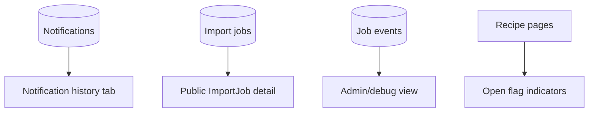

### Completed Scope

- Added notification polling and notification history with read/unread actions.
- Added a user-facing ImportJob detail page linked from import-job notifications.
- Kept the import form independent from background job completion: it resets after accepted creation and does not poll or redirect.
- Added user-safe status, mapped known errors with an unexpected-error fallback, timestamps, attempt limits, primary resources, retry, and successful recipe navigation.
- Added internal/admin Import Jobs and Job Events diagnostics with attempt metadata, recipe links, newest-first events, and expandable payloads.
- Added admin retry action and backend temporary admin guards.
- Added recipe, embedding, and search debugging surfaces needed for local development.
- Kept technical event payloads and internal metadata out of the public ImportJob detail response and page.

### Explicit Deferrals

- A general user-facing Import History page is not part of this phase. Its need and UX are tracked in `future-work.md`; notification history and direct ImportJob detail are sufficient for now.
- Real permission checks and hiding all internal/debug UI from non-admin users remain Phase 5 work.
- Broader visual redesign, notification styling, review-flag UX, and user-facing error-message design remain Phase 7 work.

### Blocks and Nuances

Normal users should see simple statuses:

- importing;
- succeeded;
- succeeded with warning;
- failed.

Debug/admin views can expose:

- worker attempts;
- retry reason;
- AI latency;
- event timeline;
- source loader failures.

## Phase 5: Authorization and Multi-User Access

Goal: replace the current local default/admin user assumption with real authentication and authorization before the product design pass and mobile work.

This phase is split into incremental subphases. The fixed-role authorization boundary is implemented first; real user authentication and session management still require a dedicated requirements checkpoint before implementation.

### Subphase 5a: Minimal User Roles - Completed

- Added fixed code-defined `DEBUG` and `SUPERADMIN` roles with multiple role assignments per user.
- Centralized reusable access rules while keeping `CurrentUserDep` as the only route dependency for the current user.
- Kept ordinary product APIs owner-scoped. `SUPERADMIN` broadens only approved internal diagnostics and retry operations, not access to foreign recipes or other product data.
- Protected Import Jobs, Embeddings, Search Debug, internal retries, role management, and recipe debug data according to the approved role matrix.
- Added `/me` capability output so the frontend consumes backend-derived features instead of reproducing role logic.
- Replaced separate internal navigation entries with one capability-gated Admin area and added role assignment management.
- Added migration `20260712_0022`; existing `local-user` rows are seeded once and fresh preview users receive both roles without restoring deliberately revoked roles on later startup.
- Removed the old standalone embedding-input debug endpoint and made recipe debug output response-driven and available only to `DEBUG` users.
- Added backend and frontend isolation, retry, capability, role-management, and debug-visibility tests.

Remaining Phase 5 work starts with authentication requirements clarification and replaces only the implementation behind `get_current_user()` while preserving the authorization boundary established in this subphase.

### Subphase 5b: Local KrakenD Pass-Through - Completed

Goal: put a Dockerized KrakenD Community Edition pass-through gateway in front of the existing host-run FastAPI application without changing authentication, authorization, API contracts, queueing, or business logic.

- Pin KrakenD Community Edition to `2.13.8` and validate its immutable static configuration during the image build.
- Bind the local gateway to `127.0.0.1:8081` and proxy to host FastAPI on `127.0.0.1:8010` through `host.docker.internal`.
- Explicitly declare every current FastAPI route/method pair plus FastAPI documentation routes using `no-op` request/response handling.
- Forward existing query parameters and compatibility headers, including multipart uploads, range requests, `X-Client-Id`, and `Idempotency-Key`.
- Move the frontend API and media base to KrakenD while leaving FastAPI directly reachable for diagnostics.
- Add automated OpenAPI/config parity checks, Docker config validation, local startup documentation, and an authoritative manual cross-component testing checklist.
- Keep FastAPI CORS and the Phase 5a role system unchanged. Clerk/JWT, trusted identity headers, rate limiting, TLS, production networking, and FastAPI containerization remain outside this subphase.

Completion stops at the local compatibility gateway. Real authentication requirements clarification remains the next Phase 5 authorization step.

### Subphase 5c: Clerk Authentication, Invitations, and Account Lifecycle - In Progress

Goal: replace the local default-user identity with Clerk authentication while preserving the fixed local role model, `CurrentUserDep`, ordinary owner scoping, and the existing FastAPI/frontend boundary.

- Add Clerk React authentication and a centralized per-request Bearer-token provider without persisting raw tokens.
- Replace the static KrakenD route file with Flexible Configuration and validate Clerk JWTs at the gateway. Only the verified subject header crosses the gateway boundary; browser-supplied identity headers and the original Authorization header are not accepted by FastAPI.
- Resolve verified Clerk subjects to internal users, provision new active users through the Clerk Backend API, and keep fixed `DEBUG` / `SUPERADMIN` assignments exclusively in PostgreSQL.
- Replace the preview default-user shortcut with an explicit, validated, local-only preview user seed file and bootstrap CLI.
- Add invite-only user administration, Clerk webhook reconciliation, active/deactivated/deletion-pending account states, and user-initiated asynchronous account deletion.
- Add signed-out/signed-in frontend shells, invitation handling, account lifecycle screens, and Admin invitation/status controls.
- Preserve owner-scoped product APIs, worker ownership through persisted ids, and backend-authoritative authorization.

Detailed execution plan: `docs/superpowers/plans/2026-07-13-clerk-auth-invitations-account-lifecycle.md`.

The former requirements checkpoint below is resolved by this subphase specification. The remaining user-settings and broader admin/UI design items stay in later approved work.

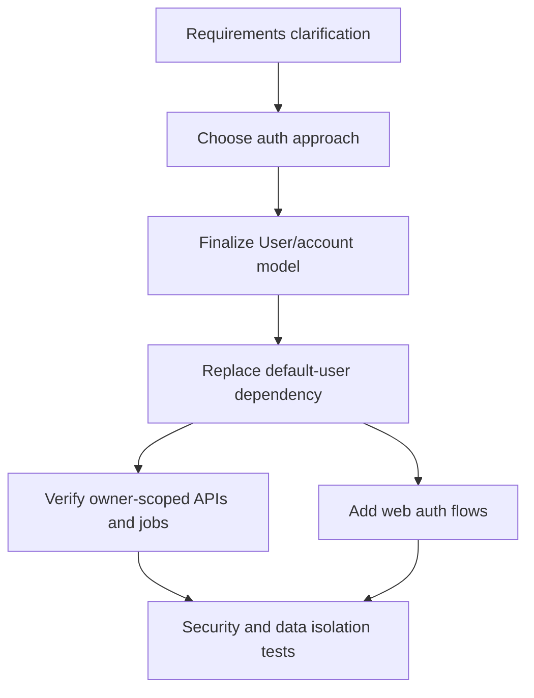

### Work List

- Start with an auth requirements checkpoint:
  - login methods: email/password, magic link, OAuth, or external provider;
  - registration/invite model;
  - password reset and email verification expectations;
  - single-user local preview behavior;
  - admin/default user migration behavior;
  - session model: cookies, JWT, refresh tokens, or managed provider SDK;
  - mobile compatibility requirements;
  - account deletion/export expectations;
  - rate limits and abuse protections.
- Choose auth implementation:
  - self-hosted auth in FastAPI;
  - managed provider;
  - hybrid local dev shortcut plus production provider.
- Define and implement user settings:
  - profile/account settings;
  - import-related preferences where appropriate;
  - notification preferences;
  - future per-user provider/API settings if needed.
- Define and implement an admin panel:
  - user management;
  - internal job/event diagnostics;
  - operational settings that should not be exposed to normal users;
  - access control for admin-only pages.
- Replace the current temporary local-admin guard with real permission checks for all internal/admin surfaces:
  - backend `GET /internal/import-jobs`;
  - backend `GET /internal/embeddings`;
  - backend `POST /internal/embeddings/{recipe_id}/retry`;
  - backend `POST /internal/search/explain`;
  - web `Import jobs / Job events` page;
  - web `Recipe embeddings` page;
  - web `Search Debug` page;
  - recipe detail admin-only embedding input preview block;
  - future user management, user settings, admin settings, and worker diagnostics pages.
- Ensure non-admin frontend users cannot see internal/debug information even when it appears inside an otherwise public page. Hide debug sections, raw event payloads, internal identifiers, embedding diagnostics, storage metadata, and admin actions based on real permissions; backend authorization remains authoritative.
- Replace `get_current_user` default local-user behavior with authenticated user resolution.
- Keep a clean dependency boundary so mobile can use the same backend APIs.
- Verify all owner-scoped data access:
  - recipes;
  - resources/images/media;
  - collections;
  - imports;
  - notifications;
  - review flags;
  - search/embedding jobs when present.
- Hide internal/admin pages from normal users once real roles are introduced:
  - import jobs / job events;
  - recipe embeddings;
  - search debug;
  - recipe detail embedding input preview;
  - user management;
  - user settings and admin settings where applicable;
  - debug/audit views;
  - worker diagnostics.
- Ensure workers operate under persisted `owner_id` and never infer user identity from worker runtime context.
- Add tests for cross-user isolation and authorization failures.
- Decide how preview mode handles auth fixtures.

### Blocks and Nuances

Current local-first default user is a development convenience, not a production auth model. This phase should remove that assumption from API behavior while preserving simple local/preview testing.

Workers should never depend on request sessions or frontend identity tokens. They should receive durable ids, load persisted jobs, and rely on owner-scoped rows already written by the API.

This phase should happen before the dedicated UI/UX phase so web and mobile design can account for real login, session, account, and user-state flows.

## Phase 6: Scaling and Production Hardening

Goal: keep the architecture ready for higher load without complicating the first implementation.

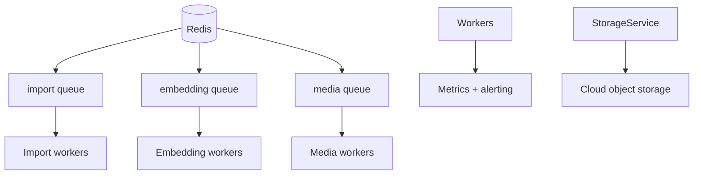

### Work List

- Start with a requirements checkpoint:
  - decide whether Redis is still enough or RabbitMQ is needed;
  - decide whether polling is still enough or SSE is needed;
  - decide target deployment shape and expected concurrency;
  - decide cloud object storage provider.
- Increase worker count.
- Split queues by task type:
  - import;
  - embedding;
  - media.
- Add per-provider AI rate limits.
- Consider RabbitMQ if broker durability becomes more important than Redis simplicity.
- Replace local filesystem with cloud object storage through `StorageService`.
- Add SSE after polling is proven insufficient.
- Add metrics and alerting.

### Blocks and Nuances

Metrics to add later:

- `imports_started_total`
- `imports_succeeded_total`
- `imports_failed_total`
- `import_duration_seconds`
- `embedding_duration_seconds`
- `queue_depth`
- `active_workers`
- `ai_errors_total`

Polling should remain the first notification transport. SSE is useful later but should not be required for correctness.

## Phase 7: Web UI/UX and Mobile FE Design

Goal: do a dedicated product/design phase before mobile implementation. This phase is intentionally a placeholder for future requirements clarification and research; implementation details are not defined yet.

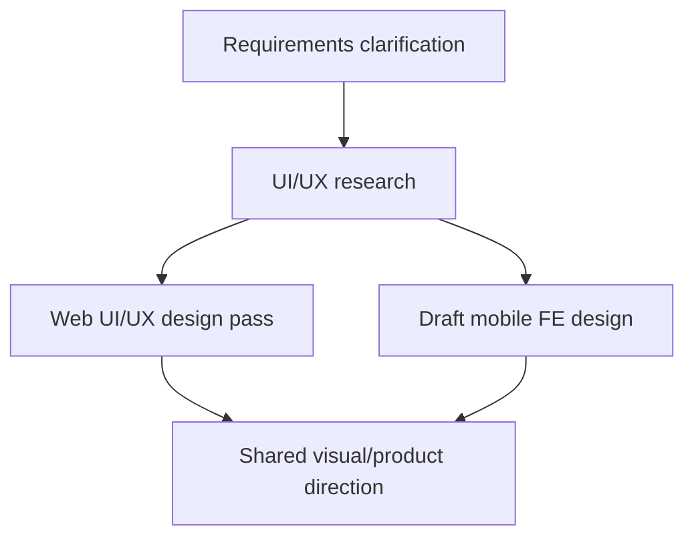

### Work List

- Clarify requirements for web and mobile UX.
- Research relevant UX patterns for recipe management, import workflows, source review, notifications, and search.
- Do a dedicated UI/UX design pass for the web app.
- Draft FE design for the mobile app.
- Redesign key web flows:
  - recipe list;
  - import flow;
  - recipe detail/editing;
  - sources/resources;
  - flags;
  - notifications;
  - notification popup/box placement, including showing new notifications in a corner overlay instead of inline page content;
  - unread notification indicator for the Notifications tab, such as a red dot/badge when unread notifications exist;
  - search.
- Review and improve user-facing error messages as part of the visual/content design system, including consistent tone, actionable recovery guidance, and presentation by error severity.
- Produce a design direction that can inform both responsive web and mobile implementation.

### Blocks and Nuances

This phase should not start from implementation. It needs requirements clarification and research first.

The mobile design here is a frontend design draft, not the mobile app build. It exists so the web design does not paint us into a corner before Expo/PWA work starts.

## Phase 8: Mobile Path

Goal: prepare mobile implementation without creating a second backend.

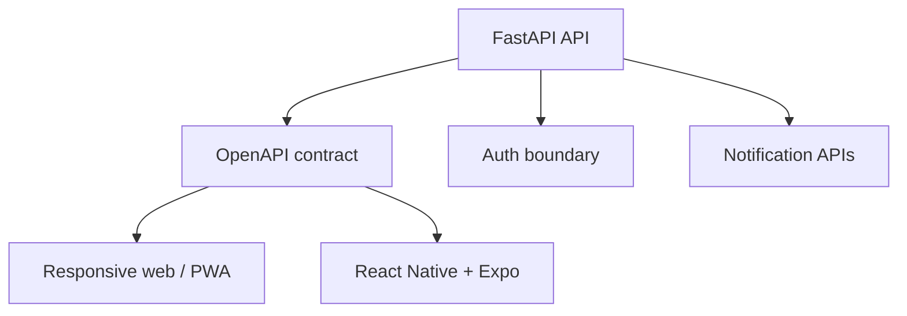

### Work List

- Improve responsive layout after the web and mobile FE design direction is clearer.
- Add OpenAPI-generated client/types when the API stabilizes.
- Build PWA-friendly flows.
- Add Expo app later.
- Add push notifications later.

### Blocks and Nuances

No separate backend should be needed for mobile. The backend should expose stable API contracts, owner-scoped data, and the real auth dependency introduced before the UI/UX phase.

Generated TypeScript clients are acceptable as generated artifacts. They should not create runtime coupling between backend and frontend.

## Resolved Decisions, Questions, and Proposals

### Resolved: Move PostgreSQL Before Dramatiq

I recommend migrating to PostgreSQL before adding Dramatiq. The reason is that the hardest correctness pieces are database-owned:

- `SELECT ... FOR UPDATE` worker claiming;
- active import limit by persisted state;
- idempotency constraints;
- job status transitions;
- future pgvector support.

Adding Dramatiq while still on SQLite would make local testing easier in the short term but would force us to revisit locking and concurrency semantics soon after.

Decision: yes. PostgreSQL migration comes before Dramatiq integration.

### Resolved: Keep `clientImportId`, Add `Idempotency-Key`

The current frontend already has `clientImportId`. I would keep it and optionally accept `Idempotency-Key` as an HTTP-level alias. Internally they should map to one `dedupe_key` column.

Decision: yes.

### Resolved: Add `JobEvent` in Phase 1b

`JobEvent` is useful during this migration because background failures are otherwise harder to debug. It belongs to Phase 1b.

### Resolved: PostgreSQL Becomes the Normal Development Database

PostgreSQL becomes the normal backend database once background workers are introduced. `preview` behavior stays: schema state and local uploads are recreated/truncated on startup.

SQLite can remain only as a limited test/smoke option if keeping it is cheap. It should not shape the worker architecture.

### Resolved: Docker Compose for PostgreSQL and Redis

Use Docker Compose for PostgreSQL and Redis to keep `dev` and `preview` setup reproducible.

### Open: Exact Search Ranking

Phase 2 starts with requirements for hybrid search ranking. The likely shape is exact/text search plus vector similarity, filtered by `owner_id`, but ranking and UI expectations need a separate decision before implementation.

### Open: RabbitMQ and SSE Timing

Phase 6 starts with a checkpoint to decide whether RabbitMQ and SSE are actually needed at that stage.
