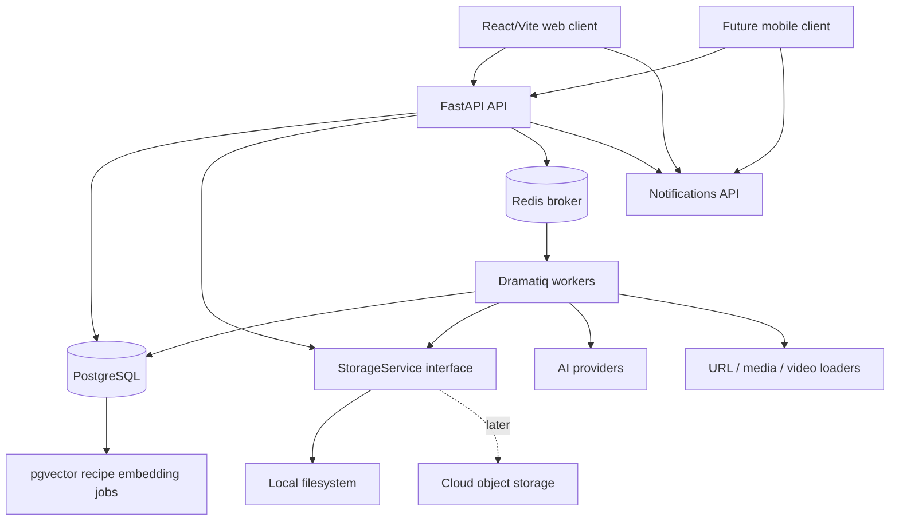
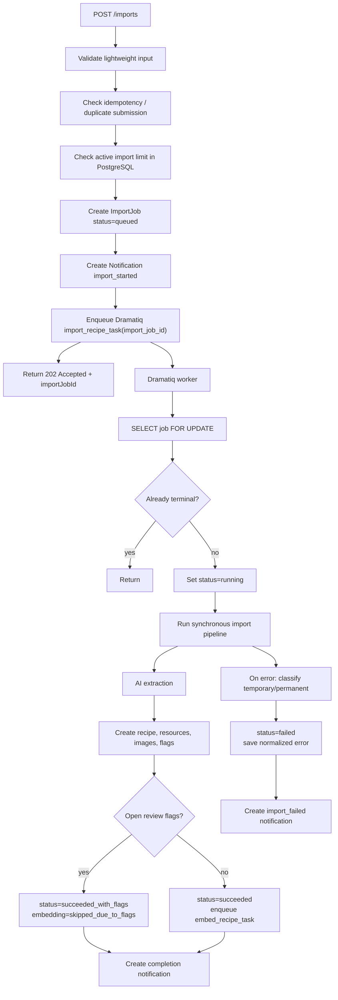
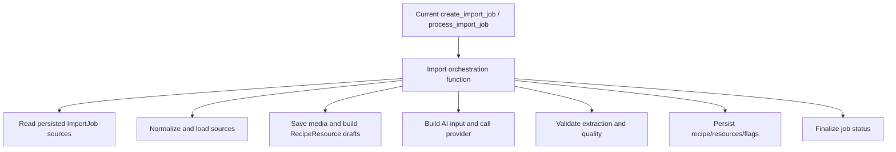
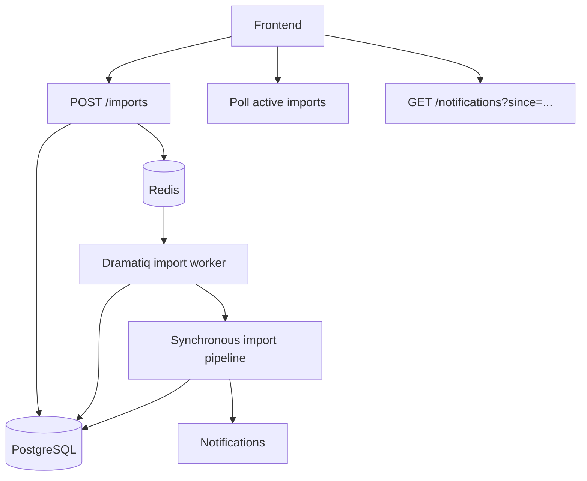
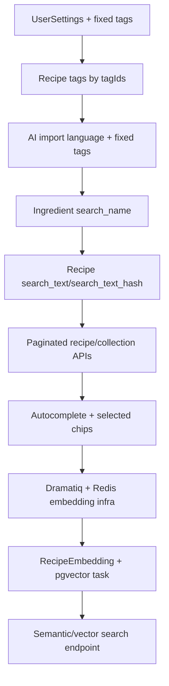
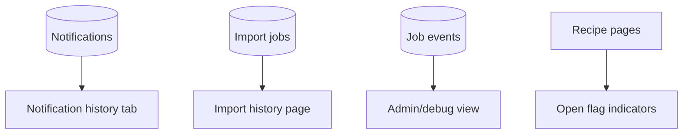
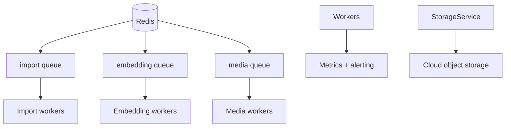
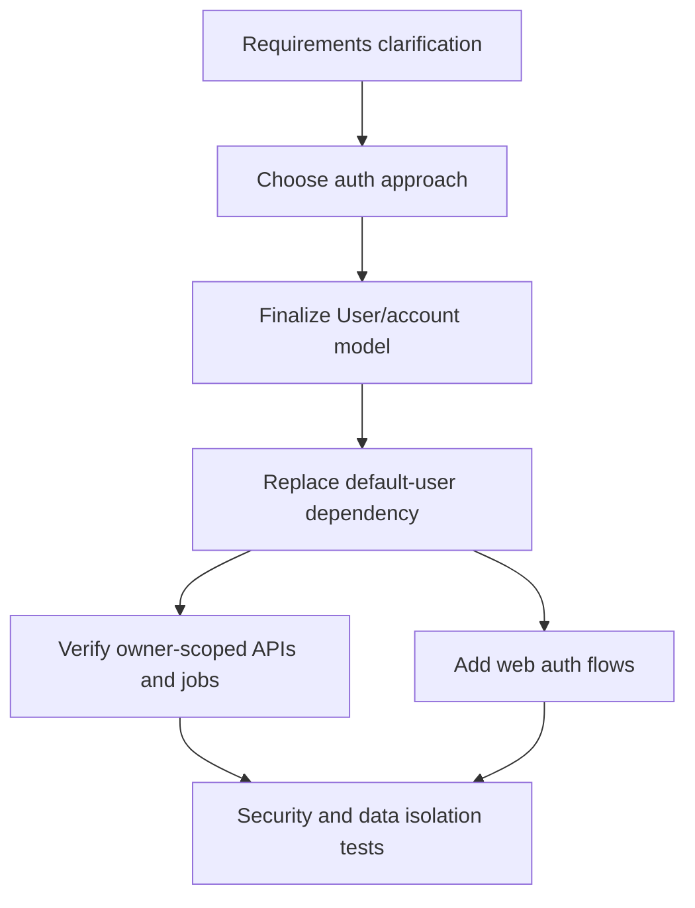
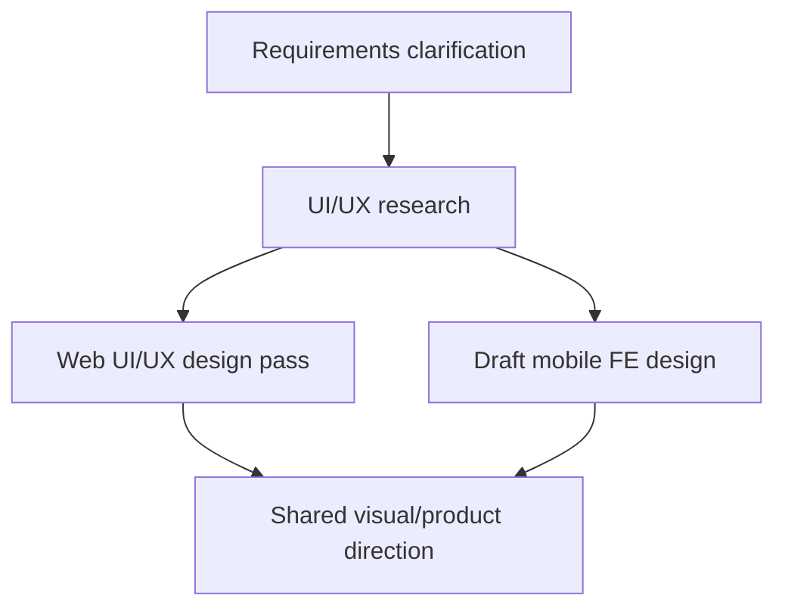
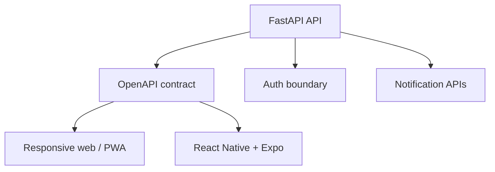

# Background Processing, Notifications, and Search Plan

## 1. Target Architecture

The target architecture moves import execution out of the HTTP request path and makes recipe import a persisted domain workflow, not just a queue message.

Core tools:

- FastAPI for the HTTP API.
- SQLAlchemy 2 + Alembic.
- PostgreSQL as the target relational store.
- Redis as the initial Dramatiq broker.
- Dramatiq for background task execution.
- pgvector for semantic recipe search.
- TanStack Query for frontend polling, cache invalidation, and mutation state.
- Local filesystem storage through the existing storage interface now; cloud object storage later behind the same interface.

The backend remains the only owner of business logic. Frontend and future mobile clients communicate through HTTP APIs and do not depend on backend runtime code.



### Main Blocks

- `ImportJob`: domain workflow for one recipe import attempt.
- `ImportJobSource`: raw sources submitted with an import request.
- `RecipeResource`: final and primary recipe resources after parsing.
- `Notification`: persisted user notification.
- `JobEvent`: audit trail for import and embedding processing.
- `RecipeEmbedding`: vector-search embedding/state for a recipe.
- `StorageService`: abstraction over local files now and cloud object storage later.
- `QueueService`: abstraction over enqueueing work; first real implementation is Dramatiq.

### Main Domain Statuses

`ImportJob.status`:

- `queued`
- `running`
- `succeeded`
- `succeeded_with_flags`
- `failed`
- `cancelled`

`RecipeEmbedding.status`:

- `stale`
- `running`
- `ready`
- `failed`
- `skipped_due_to_flags`

### Target Import Flow



## Import Behavior Preservation Checklist

This checklist applies to every phase. Any phase that touches import, resources, flags, media, AI, storage, or recipe mutation should explicitly verify that it did not regress these behaviors.

- Attachments are accepted before URL images.
- URL images are accepted only within remaining image capacity.
- Manual text input remains recipe evidence.
- Manual image input remains recipe evidence.
- URL-derived text remains recipe evidence.
- URL-derived images remain recipe evidence only when accepted by capacity rules.
- Existing Instagram loader behavior is preserved.
- Existing Threads loader behavior is preserved.
- Video handling preserves transcript extraction and poster image handling.
- Final sources only are sent to AI; parent URL resources are not sent to AI as recipe evidence.
- Current AI input schema remains unchanged unless a separate prompt/schema migration is explicitly approved.
- Current AI output schema remains unchanged unless a separate prompt/schema migration is explicitly approved.
- Current AI `coverCandidate` output schema expects only `sourceRef` and `confidence`; the Python parsing layer keeps legacy `sourcePosition`, `crop`, and `reason` fields as `None` for compatibility with internal code/tests.
- Current AI prompt text remains unchanged unless a separate prompt migration is explicitly approved.
- Default local user/admin always has `UserSettings` with `recipe_language` from backend settings/env, and default tags are seeded idempotently for that user.
- Tags are owner-scoped. `GET /tags` is owner-scoped, active-only, and paginated with `{ items, total, limit, offset }`; lower-level tag query functions may return the full active owner-scoped list when pagination arguments are omitted. Tag deletion is soft-delete via `deleted_at` and preserves `recipe_tags` links. Active duplicate tag names are rejected case-insensitively per owner.
- Recipe tags are selected by active current-owner tag IDs only. Recipe edit does not create tags. Deleted, foreign, or unknown tag IDs are rejected.
- AI-returned recipe tags are matched only against active current-owner tags by normalized name. Duplicate AI tags are dropped before persistence, and invalid AI tags are logged and ignored.
- Recipe ingredients are edited and saved as structured rows. The only required ingredient field is `name`; `quantity`, `unit`, and `note` are optional. Frontend ingredient edits remain local until the whole recipe form is saved. `Ingredient.search_name` is an internal normalized/casefolded derivative of `Ingredient.name`, is not exposed through API responses, and is recalculated during import and manual recipe edits. Recipe PATCH updates existing ingredients by `id`, creates new ingredients without `id`, deletes existing ingredients omitted from the payload, and rejects empty ingredient names.
- `Recipe.search_text` and `Recipe.search_text_hash` are internal derived fields, not API response fields. They are built only from `title`, `source_name`, `author_name`, `ingredients.search_name`, `instructions`, `nutrition_estimate`, and `cook_time_minutes`, and are rebuilt after successful import and relevant manual recipe edits.
- Recipe and collection list endpoints are owner-scoped and paginated. Public list responses include `items`, `total`, `limit`, and `offset`. Lower-level query functions may return full owner-scoped lists when `limit` and `offset` are omitted.
- Selected search chips are hard filters. Free text is reserved for vector search. `ingredient_name` has been replaced with `ingredient_query` in autocomplete, API parameters, and frontend types. Autocomplete always returns an `ingredient_query` suggestion first for a non-empty `q`, for example `Ingredient - cottage`. Concrete ingredient suggestions are no longer returned, to avoid encouraging overly exact ingredient choices. `/recipes` accepts repeatable `ingredientQuery=<text>` query parameters. Each `ingredientQuery` value filters recipes through `contains` matching against `Ingredient.search_name`, and multiple `ingredientQuery` values are combined with AND semantics.
- URL source status aggregation is preserved.
- Final and primary resource status mapping is preserved.
- Review flag creation rules are preserved.
- Review flag management behavior is preserved.
- `source_name` derivation from non-ignored primary resources is preserved.
- Cover candidate generation is preserved.
- Generated cover persistence is preserved.
- User resource deletion behavior is preserved.
- Local storage cleanup on failed import is preserved.

## 2. Work Plan by Phase

0. Refactor the current import pipeline into clearer internal blocks.
1. Move persistence to PostgreSQL, then add Dramatiq + Redis and non-blocking import.
2. Clarify search requirements, then add hybrid search with pgvector and embedding tasks.
3. Add UI and diagnostics for notifications, import history, and job events.
4. Clarify scaling requirements, then add production hardening where needed.
5. Clarify auth and multi-user requirements, then replace the local default-user model with real authorization.
6. Do a dedicated web UI/UX design pass and draft mobile frontend design.
7. Prepare the mobile implementation path through responsive web/PWA first, then Expo.

## 3. Phase Details

## Phase 0: Import Pipeline Refactor

Goal: make the current synchronous import logic easier to move into a worker without changing behavior.



### Work List

- Split the current import pipeline into small, named functions or service classes.
- Keep the same synchronous execution model inside the pipeline.
- Inspect current large files and refactor only the places that directly affect the background-processing migration.
- Current known candidates:
  - `backend/app/imports/jobs.py` is the main import pipeline hotspot and should be split before Dramatiq integration.
  - `backend/app/services/recipes.py` is a secondary backend hotspot; touch only if job/flag/resource updates require it.
  - `frontend/src/pages/RecipeDetailPage.tsx` is a frontend hotspot, but it should mostly wait for the UI/UX phase unless polling/notification changes require a narrow extraction.
- Verify the global Import Behavior Preservation Checklist before and after the refactor.
- Add focused tests around extracted blocks where practical.

### Blocks and Nuances

This phase is intentionally not a rewrite. The goal is to replace one long procedural body with a visible sequence of steps:

1. read job input;
2. validate;
3. load URL/media/video sources;
4. prepare AI input;
5. parse AI output;
6. write recipe data;
7. finalize job.

The extracted functions should be usable from both the current synchronous path and the future Dramatiq actor.

This phase must not change the import contract or any behavior listed in the Import Behavior Preservation Checklist.

## Phase 1: PostgreSQL, Dramatiq, Redis, and Non-Blocking Import

Goal: make import execution non-blocking and durable enough for local production-style testing.

This phase is split into subphases so database correctness, queue execution, and frontend behavior can be verified independently.

PostgreSQL should come before Dramatiq because active import limits, idempotency, worker claiming, and `SELECT ... FOR UPDATE` are database-centered concerns.



### Work List

#### Phase 1a: PostgreSQL Migration

- Add PostgreSQL configuration while preserving `dev` and `preview` runtime profiles.
- Make PostgreSQL the normal backend database once background workers are introduced.
- Keep `preview` behavior by recreating/truncating PostgreSQL schema state and local uploads on startup.
- Add Docker Compose for PostgreSQL and Redis.
- Keep local filesystem storage behind `StorageService`; do not couple import logic to local paths.
- Decide whether SQLite remains as a limited test-only/smoke option or is removed from normal development.

#### Phase 1b: Import Schema, Notifications, Job Events, Dramatiq, Redis

Status: implemented and approved.

- Update `ImportJob.status` to the target statuses.
- Migrate existing import job statuses by meaning:
  - `pending` -> `queued`;
  - `processing` -> `running`;
  - `succeeded` -> `succeeded`;
  - `failed` -> `failed`.
- Keep this migration pragmatic; there is no production data compatibility requirement yet.
- Keep/import `clientImportId`; add support for `Idempotency-Key` or map it into the same dedupe field.
- Enforce active import limit from PostgreSQL state, not Redis queue depth.
- Add `Notification` model and backend creation service.
- Defer notification polling API to Phase 1d.
- Add `JobEvent` audit model.
- Add Dramatiq dependency and Redis broker configuration.
- Add `import_recipe_task(import_job_id)` actor.
- Keep `POST /imports` sync-first during Phase 1b; Phase 1b prepares the worker boundary but does not change frontend-facing import behavior yet.
- Keep worker logic synchronous internally; do not rewrite import internals to async.
- Keep Dramatiq actors thin wrappers over domain handlers.

Implemented notes:

- `Notification.type` and `Notification.status` are stored as strings rather than database enums so new notification types do not require schema migrations.
- `JobEvent.event_type` is stored as a string for the same reason.
- `ImportJob.dedupe_key` is the internal idempotency key. It is derived from `Idempotency-Key` when present, otherwise from `clientImportId`.
- At the end of Phase 1b, sync-first import writes `queued`, `worker_started`, `source_downloaded`, `ai_called`, `ai_succeeded`, `recipe_created`, and `failed` job events where applicable.
- At the end of Phase 1b, sync-first import writes `import_started`, `import_succeeded`, `import_succeeded_with_flags`, and `import_failed` notifications where applicable.
- At the end of Phase 1b, the Dramatiq actor exists as a thin wrapper around `process_import_job`, but `POST /imports` still calls the domain handler directly until Phase 1c.

#### Phase 1c: Backend Queue Cutover

Status: implemented and reviewed.

- Make `POST /imports` return `202 Accepted` with `{ importJobId, status }`.
- Move import execution into the Dramatiq worker.
- Keep worker internals synchronous: workers execute normal sync domain handlers, not async/await pipeline code.
- Verify that multiple imports can be executed by worker concurrency while the per-user active import limit is enforced from PostgreSQL `queued`/`running` state.
- Keep the frontend contract as close as possible to the current shape, but do not implement notification polling UI in this subphase.
- Add basic structured logs for API enqueueing and worker execution.

Implemented notes:

- Newly created imports return `202 Accepted` and remain `queued` until the worker processes them.
- Duplicate dedupe keys return the existing import job with `200 OK` and are not enqueued again.
- `import_recipe_task` runs the existing synchronous `process_import_job` handler in the worker process.
- Active import limit is enforced per user from PostgreSQL `queued`/`running` state. The current default is `3`.
- Frontend polling and notification UX are intentionally deferred to Phase 1d.

After this subphase, run the required checkpoint:

- check whether a small refactor is needed;
- verify the Import Behavior Preservation Checklist;
- update this plan if new decisions were made;
- stop for review before starting the next subphase.

#### Phase 1d: Polling API and Frontend Import UX

Status: implemented, pending review.

- Add API polling for active imports and notifications.
- Add frontend polling for active imports and notifications.
- Make the import form non-blocking from the user's perspective.
- Show user notifications/toasts when import starts and finishes.
- Redirect to recipe detail from a successful import completion notification.
- Keep recipe and collection list invalidation consistent with import completion.

Implemented notes:

- `GET /notifications` returns current-user notifications for polling and history.
- `PATCH /notifications/{notificationId}` marks a notification read/unread.
- `PATCH /notifications/read-all` marks current-user unread notifications read through a frontend-provided notification id cutoff.
- The frontend polls notifications and shows the latest unread notification as an in-app toast.
- A `Notifications` tab shows notification history, read/unread state, mark-read and mark-all-read actions, and recipe navigation for successful imports.
- Import polling treats both `succeeded` and `succeeded_with_flags` as successful terminal statuses.
- Import terminal statuses invalidate recipes, collections, and notifications.

After this subphase, run the same checkpoint: refactor check, invariant check, plan update if needed, and stop for review.

### Blocks and Nuances

#### ImportJob

`ImportJob` remains a domain entity and should not be reduced to a Dramatiq task id. It owns:

- current status;
- owner/user;
- client id;
- idempotency key;
- created recipe id;
- normalized error code/message;
- timestamps;
- retry metadata if useful at the domain level.

Terminal statuses are:

- `succeeded`
- `succeeded_with_flags`
- `failed`
- `cancelled`

#### Queue Boundary

Dramatiq actors should stay thin:

```text
import_recipe_task(import_job_id)
  -> run_import_job(import_job_id)
```

The business logic belongs to `run_import_job`, not to the actor decorator.

#### Idempotency

Preferred approach:

- frontend still sends stable `clientImportId`;
- backend also accepts `Idempotency-Key`;
- backend stores one canonical dedupe key;
- unique constraint: `(owner_id, dedupe_key)`.

If the same key is submitted again, return the existing `ImportJob`.

#### Active Import Limit

Count active jobs in PostgreSQL:

```text
status in queued, running
```

This prevents Redis queue state from becoming the source of truth.

#### Error Handling and Retries

Errors should be normalized into two categories.

Temporary errors:

- AI API timeout;
- network error;
- video transcript provider unavailable;
- rate limit.

Permanent errors:

- unsupported source;
- not a recipe;
- invalid image;
- AI returned `notARecipe`;
- conflicting sources that cannot be resolved.

Retry policy:

- AI timeout: retry up to 3 times with backoff.
- source download failed: retry up to 2 times.
- validation failed: no retry.
- `notARecipe`: no retry.

The job must be idempotent: if a retried task sees a terminal status, it returns without changing data.

#### Notifications

Notifications are persisted records, not just frontend toasts.

Initial notification types:

- `import_started`
- `import_succeeded`
- `import_succeeded_with_flags`
- `import_failed`

Initial API:

- `GET /notifications?since=<timestamp>&type=<optional>`
- `PATCH /notifications/{id}` to mark read
- optionally `GET /imports?status=active` for active import polling

The first frontend version uses polling. SSE is a later scaling/UX enhancement.

Notification API endpoints are implemented in Phase 1d. Phase 1b only creates the persisted model and backend service that import processing can call; Phase 1c only moves import execution into the worker.

Basic internal import job diagnostics may be implemented before Phase 3 to support local debugging of the queue cutover. Until Phase 5, these views are treated as local/admin-only tooling by convention, not by real authorization.

#### Observability

Minimum structured log fields:

- `request_id`
- `import_job_id`
- `recipe_id`
- `user_id`
- `task_name`
- `task_duration_ms`
- `ai_model`
- `ai_latency_ms`
- `status`
- `error_code`

`JobEvent` is part of Phase 1b. It should capture:

- `queued`
- `worker_started`
- `source_downloaded`
- `ai_called`
- `ai_succeeded`
- `recipe_created`
- `embedding_enqueued`
- `failed`

## Phase 2: Hybrid Search and Embedding Tasks

Goal: add user-scoped settings, fixed tags, deterministic search text, autocomplete chips, pagination, embeddings, and semantic/vector search. This phase is large and is split into iterations; each iteration is a review checkpoint and must not begin implementation until its iteration plan is printed and approved.



### Phase 2 Goal

```text
- UserSettings with fixed recipe_language
- user-owned fixed tags
- tag soft delete
- recipe tags selected by tagIds
- AI import aware of user language and available tags
- ingredient search_name
- recipe.search_text/search_text_hash
- autocomplete + selected chips
- paginated recipe/collection/search APIs
- RecipeEmbedding with pgvector
- embedding tasks with skipped_due_to_flags behavior
- free text search = vector search only
```

Current models live in `backend/app/models/__init__.py`; the project already has `User`, `Recipe`, `Ingredient`, `Tag`, `RecipeTag`, `Collection`, `ImportJob`, and `RecipeReviewFlag`.

### Phase 2 Process Rules

- Before each iteration, print the implementation plan and confirm whether any user input is required.
- If an iteration explicitly requires user input, ask for it before implementation.
- After each iteration:
  - verify the global Import Behavior Preservation Checklist when import, resources, flags, media, AI, storage, or recipe mutation were touched;
  - propose invariant checklist updates if key business-logic decisions changed or were added;
  - do a small refactor if the iteration left avoidable local complexity;
  - propose future-work cleanup items if shortcuts, temporary compatibility fields, or unfinished tails remain;
  - wait for user review/approval before the next iteration.

### Global Requirements

#### User Isolation

Every query must be scoped by current user / owner.

This applies to:

```text
- recipes
- ingredients through recipe.owner_id
- tags
- collections
- sources
- review flags
- import jobs
- embeddings through recipe.owner_id
- vector search SQL
```

Never fetch globally and filter in application code if the database can filter by owner.

#### Search Contract

The agreed search behavior is the implementation contract:

```text
- selected chips are hard filters
- free text search is vector search only
- autocomplete creates typed selected chips
- search returns match_reasons
- search is paginated with hasMore
- empty/fallback behavior must be explicit
- vector search must filter by owner_id in SQL
```

No separate implementation PR is needed only to write the contract, but implementation must follow it.

### Iteration 1: UserSettings + Default Tags

#### Files

```text
backend/app/models/__init__.py
backend/app/db/init.py
backend/app/core/config.py
backend/alembic/versions/<new_revision>.py
tests if available
```

#### Add `UserSettings`

Add near `User`:

```python
class UserSettings(TimestampMixin, Base):
    __tablename__ = "user_settings"

    user_id: Mapped[str] = mapped_column(
        ForeignKey("users.id", ondelete="CASCADE"),
        primary_key=True,
    )
    recipe_language: Mapped[str] = mapped_column(String, nullable=False)

    user: Mapped["User"] = relationship(back_populates="settings")
```

Add to `User`:

```python
settings: Mapped["UserSettings"] = relationship(
    back_populates="user",
    cascade="all, delete-orphan",
    uselist=False,
)
```

`ensure_default_user` currently creates only the default local user. Update it to also ensure settings and default tags.

#### Defaults

```python
DEFAULT_RECIPE_LANGUAGE = "ru"
```

Default tags:

```python
DEFAULT_TAG_NAMES = [
    "аэрогриль",
    "духовка",
    "мороженое",
    "быстрое",
    "низкокалорийное",
    "высокобелковое",
    "без сахара",
    "праздничное",
    "вегетарианское",
    "десерт",
    "завтрак",
    "обед",
    "салат",
    "перекус",
    "горячее",
    "суп",
    "выпечка",
    "простое",
]
```

#### Config

Add env-configurable setting:

```text
MAX_TAGS_PER_USER=50
```

Expose in settings as:

```python
max_tags_per_user: int = 50
```

#### Bootstrap Behavior

```text
ensure_default_user:
  - ensure User exists
  - ensure UserSettings exists with recipe_language="ru"
  - ensure default tags exist
  - tag seeding is idempotent
```

### Iteration 2: Tag Model, Soft Delete, Tag Management UI

#### Files

```text
backend/app/models/__init__.py
backend/app/api/routes/tags.py
backend/app/schemas/tags.py
backend/app/services/tags.py
backend/app/main.py
backend/alembic/versions/<new_revision>.py
frontend tag-management page/tab
```

Current `Tag` has `owner_id`, `name`, and `UniqueConstraint("owner_id", "name")`.

#### Update `Tag`

```python
class Tag(TimestampMixin, Base):
    __tablename__ = "tags"

    id: Mapped[str] = mapped_column(String, primary_key=True, default=new_id)
    owner_id: Mapped[str] = mapped_column(
        ForeignKey("users.id", ondelete="CASCADE"),
        nullable=False,
        index=True,
    )
    name: Mapped[str] = mapped_column(String, nullable=False)
    description: Mapped[str | None] = mapped_column(Text)
    deleted_at: Mapped[datetime | None] = mapped_column(DateTime(timezone=True))

    owner: Mapped[User] = relationship(back_populates="tags")
    recipes: Mapped[list[Recipe]] = relationship(
        secondary="recipe_tags",
        back_populates="tags",
    )
```

Remove the old plain unique constraint and replace it with PostgreSQL partial unique index:

```sql
CREATE UNIQUE INDEX ix_tags_owner_lower_name_active_unique
ON tags (owner_id, lower(name))
WHERE deleted_at IS NULL;
```

#### Backend API

Add:

```http
GET /tags
POST /tags
PATCH /tags/{tag_id}
GET /tags/{tag_id}/usage
DELETE /tags/{tag_id}
```

Behavior:

```text
GET /tags:
  returns active tags only

POST /tags:
  checks current active tag count < max_tags_per_user
  rejects duplicate active names case-insensitively
  creates tag

PATCH /tags/{tag_id}:
  updates name/description
  preserves recipe_tags links

GET /tags/{tag_id}/usage:
  returns number of recipes using the tag

DELETE /tags/{tag_id}:
  soft delete: deleted_at = now()
  do not delete recipe_tags rows
```

#### Frontend

Create a new tag management tab/page:

```text
- list active tags
- create tag
- edit tag name
- edit description
- delete tag
- before delete, fetch usage and confirm:
  "This tag is used by X recipes."
```

Add the new backend router in `backend/app/main.py`, where other routers are included.

### Iteration 3: Recipe Tags by `tagIds`, No Auto-Create

#### Files

```text
backend/app/schemas/recipes.py
backend/app/services/recipes.py
frontend recipe edit UI
frontend API client/types
```

Currently `RecipePatchIn.tags` is `list[str] | None`.

#### Change Patch Schema

Replace:

```python
tags: list[str] | None = None
```

with:

```python
tagIds: list[str] | None = None
```

#### Change Recipe Output

Current `RecipeDetailOut.tags` is `list[str]`.

Change to:

```python
tags: list[TagOut]
```

where:

```python
class TagOut(BaseModel):
    id: str
    name: str
    description: str | None = None
```

Reuse from `schemas.tags` if convenient.

#### Update Serializer

Current serializer returns tag names only.

Change to return active tag objects:

```python
tags=[
    TagOut(id=tag.id, name=tag.name, description=tag.description)
    for tag in sorted(
        [tag for tag in recipe.tags if tag.deleted_at is None],
        key=lambda tag: tag.name,
    )
]
```

Ensure that we return to a user only non-deleted tags everywhere.

#### Update `patch_recipe`

Current `patch_recipe` auto-creates tags from strings.

Replace with validation by IDs:

```python
if patch.tagIds is not None:
    unique_tag_ids = list(dict.fromkeys(patch.tagIds))

    tags = session.scalars(
        select(Tag).where(
            Tag.owner_id == recipe.owner_id,
            Tag.id.in_(unique_tag_ids),
            Tag.deleted_at.is_(None),
        )
    ).all()

    if len(tags) != len(unique_tag_ids):
        raise ApiError(ErrorCode.INVALID_TAG, "Some tags are invalid.")

    recipe.tags = list(tags)
```

Add `INVALID_TAG` error code if missing.

#### Frontend

Recipe edit UI:

```text
- show selected tags as chips
- add/remove tags only from active existing tags
- no free-form tag creation inside recipe edit
- tag creation/editing only in tag management tab
```

### Iteration 4: AI Import - Language + Fixed Tags

This is the AI-related iteration.

#### Important Instruction

Do not rewrite the extraction prompt content manually. Ask the user for the new version.

Must do:

```text
- add .format(language=..., tags=...) plumbing
- ask for the updated prompt text
- do not invent final prompt wording
```

#### Files

```text
backend/app/ai/prompt.py
backend/app/ai/provider.py
backend/app/ai/openai_provider.py
backend/app/ai/schemas.py
backend/app/imports/jobs.py
```

#### Provider Interface

Current provider interface:

```python
async def extract(self, sources: list[ReadySource]) -> ExtractionResult:
```

Change to:

```python
async def extract(
    self,
    sources: list[ReadySource],
    *,
    language: str,
    tags: str,
) -> ExtractionResult:
    ...
```

`language` comes from `UserSettings.recipe_language`.

`tags` is a comma-separated string of active tag names:

```python
tags = ", ".join(tag.name for tag in active_tags)
```

#### Prompt Formatting

Current provider uses static `recipe_extraction_prompt`.

Change to:

```python
prompt = recipe_extraction_prompt.format(
    language=language,
    tags=tags,
)
```

#### Apply AI Tags

Current AI output already has `tags: list[str]`.

In import flow:

```text
- load active owner tags
- pass comma-separated active tag names into prompt
- match recipe_result.tags to active tags by normalized name
- attach only matched active tags
- ignore/log unknown AI tags
```

Current import creates `Recipe` and ingredients but does not attach `recipe_result.tags` in the shown flow.

### Iteration 5: Ingredient `search_name` + Update by ID

#### Files

```text
backend/app/models/__init__.py
backend/app/schemas/recipes.py
backend/app/services/recipes.py
backend/app/imports/jobs.py
backend/app/services/search_text.py or backend/app/services/ingredients.py
backend/alembic/versions/<new_revision>.py
frontend recipe edit UI/API
```

Current `Ingredient` has only `name`, `quantity`, `unit`, `note`, `position`.

#### Model Changes

Add:

```python
search_name: Mapped[str] = mapped_column(String, nullable=False)
```

#### Migration

For existing rows:

```text
search_name = normalize_search_text(name)
```

#### Helper

Add:

```python
def normalize_search_text(value: str) -> str:
    ...

def build_ingredient_search_name(
    name: str,
) -> str:
    ...
```

Rule:

```text
search_name = normalize_search_text(name)
```

Normalization must trim, case-fold/lowercase, collapse whitespace, and avoid common encoding artifacts where feasible.

#### Update `IngredientIn`

Current `IngredientIn` has no `id`.

Change to:

```python
class IngredientIn(BaseModel):
    id: str | None = None
    name: str
    quantity: str | None = None
    unit: str | None = None
    note: str | None = None
```

#### Update Patch Behavior

Current `patch_recipe` replaces the entire ingredients list.

New behavior:

```text
if IngredientIn.id exists and belongs to recipe:
  update existing ingredient
  update name/quantity/unit/note/position
  rebuild search_name if name changed

if IngredientIn.id is missing:
  create new ingredient
  search_name = build_ingredient_search_name(name)

if existing ingredient is omitted from payload:
  delete it
```

#### Update Import Creation

Current import creates `Ingredient(name=..., quantity=..., unit=..., note=...)`.

Change to:

```python
Ingredient(
    name=ingredient.name,
    search_name=build_ingredient_search_name(ingredient.name),
    quantity=ingredient.quantity,
    unit=ingredient.unit,
    note=ingredient.note,
    position=index,
)
```

Do not expose `search_name`.

#### Frontend Ingredient Editor

Replace the recipe edit page's free-form ingredient textarea with structured ingredient editing:

```text
- render an "Add ingredient" block before the existing ingredient list
- each ingredient has separate editable fields: name, quantity, unit, note
- name is the only required ingredient field
- deleting an ingredient is local until the whole recipe form is saved
- adding an ingredient is local until the whole recipe form is saved
- saving the recipe sends the full structured ingredients array with the rest of the recipe patch payload
- block save if any ingredient row has an empty name
- keep the existing max ingredient count validation, but apply it to ingredient rows instead of textarea lines
- use a small red X button for row deletion
```

### Iteration 6: Recipe `search_text/search_text_hash`

#### Files

```text
backend/app/models/__init__.py
backend/app/services/search_text.py
backend/app/imports/jobs.py
backend/app/services/recipes.py
backend/alembic/versions/<new_revision>.py
frontend/src/api/types.ts
frontend/src/pages/RecipeDetailPage.tsx
frontend/src/pages/RecipeDetailPage.test.tsx
```

#### Model Changes

Add to `Recipe`:

```python
search_text: Mapped[str | None] = mapped_column(Text)
search_text_hash: Mapped[str | None] = mapped_column(String)
```

`Recipe` already has the relevant fields: `title`, `cook_time_minutes`, `instructions`, `nutrition_estimate`, `author_name`, `source_name`, `ingredients`.

#### Builder

Add deterministic builder:

```python
def build_recipe_search_text(recipe: Recipe) -> str:
    ...
```

Include:

```text
title
source_name
author_name
ingredients.search_name
instructions
nutrition_estimate
cook_time_minutes
```

Do not include:

```text
tags
collections
cover image
source_url
created_at / updated_at
ingredient.note
ingredient.quantity
ingredient.unit
```

#### Editable Source Metadata

At the beginning of this iteration, make recipe source metadata editable on the recipe detail page:

```text
- author_name is a free-form editable field
- source_name is selected from the fixed SourceName enum values
- source_name and author_name are saved through the normal recipe PATCH flow
```

#### Update Points

Rebuild synchronously after:

```text
- import recipe creation
- recipe patch when title changed
- source_name changed
- author_name changed
- ingredient name/search_name changed
- instructions changed
- nutrition_estimate changed
- cook_time_minutes changed
```

### Iteration 7: Pagination for Recipes and Collections

Status: implemented, pending review.

This should happen before or alongside search UI work.

#### Files

```text
backend/app/schemas/recipes.py
backend/app/services/recipes.py
backend/app/api/routes/recipes.py
backend/app/schemas/collections.py
backend/app/services/collections.py
backend/app/api/routes/collections.py
frontend list views
```

Implemented note: `GET /recipes` and `GET /collections` now accept `limit` and `offset`, default to `limit=24` and `offset=0`, and return `items`, `total`, `limit`, and `offset`. The shared pagination metadata fields live in a schema mixin. The lower-level query functions still support full unpaginated owner-scoped reads when `limit` and `offset` are omitted.

#### Recipes Pagination

Add query params:

```http
GET /recipes?limit=24&offset=0
```

Response:

```python
class RecipeListOut(BaseModel):
    items: list[RecipeListItemOut]
    total: int
    limit: int
    offset: int
```

#### Collections Pagination

Add query params:

```http
GET /collections?limit=24&offset=0
```

Response:

```python
class CollectionListOut(BaseModel):
    items: list[CollectionOut]
    total: int
    limit: int
    offset: int
```

Use `total` for recipes and collections.

#### Tags Pagination

Add query params:

```http
GET /tags?limit=24&offset=0
```

Response:

```python
class TagListOut(BaseModel):
    items: list[TagOut]
    total: int
    limit: int
    offset: int
```

Use the same pagination envelope as recipes and collections.

### Iteration 8: Autocomplete + Selected Chips Backend/Frontend

Status: implemented, pending review.

#### Autocomplete Sources

Direct table search only. No `search_suggestions`.

Sources:

```text
tags.name
recipes.source_name
recipes.author_name
recipes.title
ingredient_query from current user input
```

Do not include:

```text
collections.name
recent searches
search_suggestions
canonical ingredient aliases
```

#### Suggestion DTO

```python
class SearchSuggestionOut(BaseModel):
    type: Literal[
        "tag",
        "ingredient_query",
        "source_name",
        "author_name",
        "title",
    ]
    id: str | None = None
    recipeId: str | None = None
    value: str | None = None
    label: str
```

Examples:

```json
{"type": "tag", "id": "tag_123", "label": "высокобелковое"}
```

```json
{"type": "ingredient_query", "value": "cottage", "label": "Ingredient - cottage"}
```

```json
{"type": "title", "recipeId": "recipe_123", "label": "Куриный суп"}
```

#### Selected Chips

Frontend turns selected suggestions into typed chips.

Rules:

```text
selected chips = hard filters
free text = vector search later
```

For this iteration, implement structured chip filtering only if vector search is not ready yet.

Chip behavior:

```text
tag             -> filter by recipe_tags.tag_id
ingredient_query -> hard textual filter: recipe has at least one ingredient whose search_name contains value
source_name     -> filter by recipes.source_name
author_name     -> filter by recipes.author_name
title           -> filter by recipes.id
```

`ingredient_query` is intentionally not canonical ingredient search. It is a lightweight MVP text-based ingredient filter. It avoids the need for ingredient catalog/hierarchy while supporting common queries like `cottage` matching `cottage cheese 5%`, `soft cottage cheese`, and `low-fat cottage cheese`.

### Iteration 9: Background Task Infrastructure - Dramatiq + Redis

Add infrastructure before embedding tasks.

Requirements:

```text
- add Redis/Dramatiq config
- add worker entrypoint
- add local dev command
- add task discovery
- keep current sync-first import behavior for now
- embedding tasks will use this infrastructure
```

The current README already says imports are sync-first but frontend polling is compatible with a future queue.

### Iteration 10: RecipeEmbedding + pgvector + Embedding Task

#### Model

Use name `RecipeEmbedding`, not `RecipeEmbeddingJob`.

```python
class RecipeEmbedding(Base):
    __tablename__ = "recipe_embeddings"

    recipe_id: Mapped[str] = mapped_column(
        ForeignKey("recipes.id", ondelete="CASCADE"),
        primary_key=True,
    )

    embedding: Mapped[list[float] | None] = mapped_column(Vector(1536), nullable=True)

    model: Mapped[str] = mapped_column(String, nullable=False)
    input_hash: Mapped[str | None] = mapped_column(String)

    status: Mapped[str] = mapped_column(String, nullable=False)

    error_message: Mapped[str | None] = mapped_column(String)
    failed_attempts: Mapped[int] = mapped_column(Integer, default=0, nullable=False)

    last_attempt_at: Mapped[datetime | None] = mapped_column(DateTime(timezone=True))
    last_error_at: Mapped[datetime | None] = mapped_column(DateTime(timezone=True))

    created_at: Mapped[datetime] = mapped_column(DateTime(timezone=True), nullable=False)
    updated_at: Mapped[datetime] = mapped_column(DateTime(timezone=True), nullable=False)
```

Statuses:

```text
stale
running
ready
failed
skipped_due_to_flags
```

No `desired_input_hash`.

Task receives `recipe_id` only. Do not pass hash as task argument in MVP.

#### pgvector

Enable pgvector in PostgreSQL migration.

Add vector column and indexes later after query shape is stable. For the first implementation, exact vector search is acceptable.

#### Embedding Input

Include:

```text
title
ingredients.search_name
instructions
nutrition_estimate
cook_time_minutes
```

Do not include:

```text
tags
source_name
author_name
ingredient.note
ingredient.quantity
ingredient.unit
collections
cover image
source_url
```

#### Recipe Flags Behavior

Current project has review flags with `OPEN` and `RESOLVED`.

Rules:

```text
If recipe has open review flags:
  create/update RecipeEmbedding.status = skipped_due_to_flags
  do not enqueue embedding

If last open review flag is resolved:
  mark RecipeEmbedding.status = stale
  enqueue embed_recipe(recipe_id)

If a flag is reopened:
  set RecipeEmbedding.status = skipped_due_to_flags
```

Current review flag endpoint calls `set_review_flag_status`.

Update that service to schedule embedding when the last open flag is resolved. Current implementation only updates the flag status and commits.

#### Task Behavior

```text
embed_recipe(recipe_id):
  - reload latest recipe
  - check owner-scoped recipe exists
  - if open review flags exist:
      set status = skipped_due_to_flags
      return
  - build deterministic embedding input
  - compute input_hash
  - if status=ready and input_hash/model match:
      return
  - mark running
  - call embedding provider
  - reload recipe after provider call
  - recompute hash
  - if hash changed:
      mark stale
      enqueue embed_recipe(recipe_id)
      return
  - save vector, model, input_hash, status=ready
```

#### Failure Handling MVP

Only:

```text
- queue retry for temporary errors
- manual retry endpoint
```

Manual retry:

```http
POST /recipes/{recipe_id}/embedding/retry
```

Behavior:

```text
- check recipe belongs to current user
- if open flags exist: set skipped_due_to_flags and do not enqueue
- else set stale and enqueue embed_recipe(recipe_id)
```

No watchdog/repair job yet.

No user notifications for embedding tasks. Logs/audit are enough.

### Iteration 11: Semantic/Vector Search Endpoint

#### Files

```text
backend/app/api/routes/search.py
backend/app/services/search.py
backend/app/schemas/search.py
frontend search UI
```

#### Search Behavior

Final agreed MVP behavior:

```text
selected chips = hard filters
free text = vector search only
```

#### Search Request

```python
class SearchRequest(BaseModel):
    text: str | None = None
    selected: list[SearchChipIn] = []
    limit: int = 24
    offset: int = 0
```

#### Search Response

Search uses `hasMore`, not `total`.

```python
class SearchResultOut(BaseModel):
    id: str
    title: str
    coverImage: RecipeImageOut | None = None
    matchReasons: list[MatchReasonOut]

class SearchResponse(BaseModel):
    items: list[SearchResultOut]
    limit: int
    offset: int
    hasMore: bool
```

#### Filters

Only implement agreed filters from selected chips:

```text
tag
ingredient_query
source_name
author_name
title
```

Do not add extra collection/source/flag filter objects beyond agreed chip behavior.

#### Vector Search SQL Isolation

Vector query must filter by owner in SQL:

```sql
SELECT recipes.*
FROM recipes
JOIN recipe_embeddings ON recipe_embeddings.recipe_id = recipes.id
WHERE recipes.owner_id = :owner_id
  AND recipe_embeddings.status = 'ready'
ORDER BY recipe_embeddings.embedding <=> :query_embedding
LIMIT :limit_plus_one
OFFSET :offset;
```

If selected chips exist, apply them before/inside the query, not after fetching global vector results.

#### Empty and Fallback Behavior

Implement explicit states:

```text
No selected chips, no text:
  return latest recipes or empty? choose existing product behavior and document it.

Selected chips only:
  return matching recipes sorted by default order.

Text only:
  return vector matches.
  if no ready embeddings exist, return empty items with hasMore=false.

Selected chips + text:
  apply hard filters first, then vector rank within filtered candidates.

Embeddings missing for some recipes:
  those recipes are absent from semantic results until embedding is ready.

Recipe has skipped_due_to_flags:
  absent from vector search.
```

Return empty list, not error, for no matches.

## Phase 3: UI and Diagnostics

Goal: make background processing visible and debuggable without exposing internal complexity to normal users.



### Work List

- Add notification history tab.
- Add import history page.
- Add job event audit table if not already added.
- Show retry attempts and final normalized error.
- Add admin/debug view for jobs and events.
- Hide the basic internal diagnostics page behind real roles in Phase 5.
- Improve user-facing error messages.
- Keep functional UI changes scoped here; broader visual redesign belongs to Phase 6.

### Blocks and Nuances

Normal users should see simple statuses:

- importing;
- succeeded;
- succeeded with warning;
- failed.

Debug/admin views can expose:

- worker attempts;
- retry reason;
- AI latency;
- event timeline;
- source loader failures.

## Phase 4: Scaling and Production Hardening

Goal: keep the architecture ready for higher load without complicating the first implementation.



### Work List

- Start with a requirements checkpoint:
  - decide whether Redis is still enough or RabbitMQ is needed;
  - decide whether polling is still enough or SSE is needed;
  - decide target deployment shape and expected concurrency;
  - decide cloud object storage provider.
- Increase worker count.
- Split queues by task type:
  - import;
  - embedding;
  - media.
- Add per-provider AI rate limits.
- Consider RabbitMQ if broker durability becomes more important than Redis simplicity.
- Replace local filesystem with cloud object storage through `StorageService`.
- Add SSE after polling is proven insufficient.
- Add metrics and alerting.

### Blocks and Nuances

Metrics to add later:

- `imports_started_total`
- `imports_succeeded_total`
- `imports_failed_total`
- `import_duration_seconds`
- `embedding_duration_seconds`
- `queue_depth`
- `active_workers`
- `ai_errors_total`

Polling should remain the first notification transport. SSE is useful later but should not be required for correctness.

## Phase 5: Authorization and Multi-User Access

Goal: replace the current local default/admin user assumption with real authentication and authorization before the product design pass and mobile work.

This phase starts with requirements clarification. Do not implement auth before decisions are made.



### Work List

- Start with an auth requirements checkpoint:
  - login methods: email/password, magic link, OAuth, or external provider;
  - registration/invite model;
  - password reset and email verification expectations;
  - single-user local preview behavior;
  - admin/default user migration behavior;
  - session model: cookies, JWT, refresh tokens, or managed provider SDK;
  - mobile compatibility requirements;
  - account deletion/export expectations;
  - rate limits and abuse protections.
- Choose auth implementation:
  - self-hosted auth in FastAPI;
  - managed provider;
  - hybrid local dev shortcut plus production provider.
- Define and implement user settings:
  - profile/account settings;
  - import-related preferences where appropriate;
  - notification preferences;
  - future per-user provider/API settings if needed.
- Define and implement an admin panel:
  - user management;
  - internal job/event diagnostics;
  - operational settings that should not be exposed to normal users;
  - access control for admin-only pages.
- Replace `get_current_user` default local-user behavior with authenticated user resolution.
- Keep a clean dependency boundary so mobile can use the same backend APIs.
- Verify all owner-scoped data access:
  - recipes;
  - resources/images/media;
  - collections;
  - imports;
  - notifications;
  - review flags;
  - search/embedding jobs when present.
- Hide internal/admin pages from normal users once real roles are introduced:
  - import jobs / job events;
  - debug/audit views;
  - worker diagnostics.
- Ensure workers operate under persisted `owner_id` and never infer user identity from worker runtime context.
- Add tests for cross-user isolation and authorization failures.
- Decide how preview mode handles auth fixtures.

### Blocks and Nuances

Current local-first default user is a development convenience, not a production auth model. This phase should remove that assumption from API behavior while preserving simple local/preview testing.

Workers should never depend on request sessions or frontend identity tokens. They should receive durable ids, load persisted jobs, and rely on owner-scoped rows already written by the API.

This phase should happen before the dedicated UI/UX phase so web and mobile design can account for real login, session, account, and user-state flows.

## Phase 6: Web UI/UX and Mobile FE Design

Goal: do a dedicated product/design phase before mobile implementation. This phase is intentionally a placeholder for future requirements clarification and research; implementation details are not defined yet.



### Work List

- Clarify requirements for web and mobile UX.
- Research relevant UX patterns for recipe management, import workflows, source review, notifications, and search.
- Do a dedicated UI/UX design pass for the web app.
- Draft FE design for the mobile app.
- Redesign key web flows:
  - recipe list;
  - import flow;
  - recipe detail/editing;
  - sources/resources;
  - flags;
  - notifications;
  - notification popup/box placement, including showing new notifications in a corner overlay instead of inline page content;
  - unread notification indicator for the Notifications tab, such as a red dot/badge when unread notifications exist;
  - search.
- Produce a design direction that can inform both responsive web and mobile implementation.

### Blocks and Nuances

This phase should not start from implementation. It needs requirements clarification and research first.

The mobile design here is a frontend design draft, not the mobile app build. It exists so the web design does not paint us into a corner before Expo/PWA work starts.

## Phase 7: Mobile Path

Goal: prepare mobile implementation without creating a second backend.



### Work List

- Improve responsive layout after the web and mobile FE design direction is clearer.
- Add OpenAPI-generated client/types when the API stabilizes.
- Build PWA-friendly flows.
- Add Expo app later.
- Add push notifications later.

### Blocks and Nuances

No separate backend should be needed for mobile. The backend should expose stable API contracts, owner-scoped data, and the real auth dependency introduced before the UI/UX phase.

Generated TypeScript clients are acceptable as generated artifacts. They should not create runtime coupling between backend and frontend.

## Resolved Decisions, Questions, and Proposals

### Resolved: Move PostgreSQL Before Dramatiq

I recommend migrating to PostgreSQL before adding Dramatiq. The reason is that the hardest correctness pieces are database-owned:

- `SELECT ... FOR UPDATE` worker claiming;
- active import limit by persisted state;
- idempotency constraints;
- job status transitions;
- future pgvector support.

Adding Dramatiq while still on SQLite would make local testing easier in the short term but would force us to revisit locking and concurrency semantics soon after.

Decision: yes. PostgreSQL migration comes before Dramatiq integration.

### Resolved: Keep `clientImportId`, Add `Idempotency-Key`

The current frontend already has `clientImportId`. I would keep it and optionally accept `Idempotency-Key` as an HTTP-level alias. Internally they should map to one `dedupe_key` column.

Decision: yes.

### Resolved: Add `JobEvent` in Phase 1b

`JobEvent` is useful during this migration because background failures are otherwise harder to debug. It belongs to Phase 1b.

### Resolved: PostgreSQL Becomes the Normal Development Database

PostgreSQL becomes the normal backend database once background workers are introduced. `preview` behavior stays: schema state and local uploads are recreated/truncated on startup.

SQLite can remain only as a limited test/smoke option if keeping it is cheap. It should not shape the worker architecture.

### Resolved: Docker Compose for PostgreSQL and Redis

Use Docker Compose for PostgreSQL and Redis to keep `dev` and `preview` setup reproducible.

### Open: Exact Search Ranking

Phase 2 starts with requirements for hybrid search ranking. The likely shape is exact/text search plus vector similarity, filtered by `owner_id`, but ranking and UI expectations need a separate decision before implementation.

### Open: RabbitMQ and SSE Timing

Phase 4 starts with a checkpoint to decide whether RabbitMQ and SSE are actually needed at that stage.
