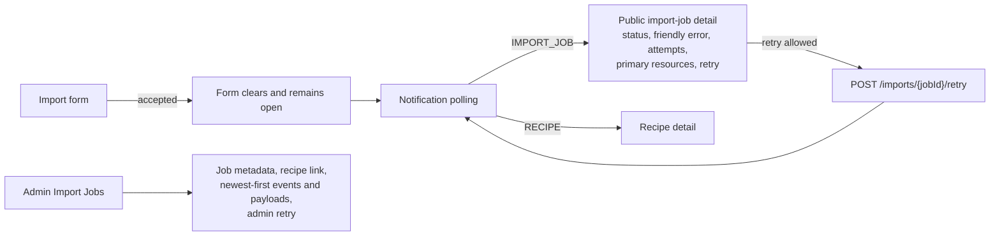

# Import Pipeline Flow

This diagram focuses on the persisted `ImportJob` lifecycle, retry behavior,
events, notifications, and user navigation. Detailed source and extraction rules
are documented in `import-pipeline.md`.

```mermaid
stateDiagram-v2
  [*] --> CreationValidation: POST /imports

  CreationValidation --> [*]: API validation error\nno job created
  CreationValidation --> ExistingJob: duplicate owner and dedupe key
  CreationValidation --> Queued: atomic creation succeeds

  state Queued {
    [*] --> AwaitingWorker
  }

  Queued: status QUEUED
  Queued: IMPORT_CREATED event
  Queued: IMPORT_STARTED notification
  ExistingJob --> [*]: return existing job

  Queued --> Running: worker atomically claims job
  Running: status RUNNING
  Running: increment attempt_count
  Running: IMPORT_STARTED event
  Running: RAW_SOURCES_DOWNLOADED event
  Running: EXTRACTOR_REQUESTED event
  Running: EXTRACTOR_SUCCEEDED event

  Running --> Running: secondary failures are non-fatal\nIMPORT_SECONDARY_RESOURCE_UPLOAD_FAILED
  Running --> AutomaticRetry: retryable failure\nand attempts remain
  Running --> Failed: non-retryable failure\nor attempts exhausted
  Running --> Succeeded: recipe saved without open flag
  Running --> SucceededWithFlags: recipe saved with open flag

  AutomaticRetry: IMPORT_FAILED event terminal=false
  AutomaticRetry: current-attempt files cleaned
  AutomaticRetry: no final notification
  AutomaticRetry --> Queued: return job to QUEUED\nSQS retries same record

  Failed: status FAILED
  Failed: IMPORT_FAILED event terminal=true
  Failed: final failure notification
  Failed: terminal cleanup
  Failed --> Queued: owner/admin requests retry\nand attempts remain
  Failed --> [*]: attempts exhausted or no retry

  Succeeded: status SUCCEEDED
  Succeeded: RECIPE_CREATED event
  Succeeded: recipe notification
  Succeeded --> EmbeddingQueued: embedding plan allows enqueue
  Succeeded --> [*]: no embedding enqueue needed

  SucceededWithFlags: status SUCCEEDED_WITH_FLAGS
  SucceededWithFlags: RECIPE_CREATED event
  SucceededWithFlags: recipe notification
  SucceededWithFlags --> [*]: embedding skipped until flags resolve

  EmbeddingQueued --> [*]
```



## Failure and Cleanup Rules

- Creation validation or atomic creation failure is synchronous. No failed job,
  event, or notification is retained, and files saved by the failed creation are
  cleaned up.
- A processing attempt always cleans its secondary files after failure.
- Primary uploads survive intermediate automatic failures so the next delivery
  can reuse them. They are cleaned after a terminal failure when cleanup is
  enabled.
- Failure persistence uses an independent database scope so the failed status,
  event, and notification survive rollback of recipe persistence.
- Failed events contain nested `error.import_job_code`, `error.code`, and
  `error.message`, plus structured diagnostics when available. Intermediate
  automatic failures use `terminal=false` and do not create final failure
  notifications; terminal failures use `terminal=true` and do.

## Retry Rules

- `attempt_count` increments only when a worker atomically claims
  `QUEUED -> RUNNING`; transport receives do not increment it.
- Automatic retry is controlled by the import error-policy registry. A
  retryable failure with attempts remaining returns the job to `QUEUED`, and the
  Import Lambda reports the same SQS record as a partial batch failure.
- Manual retry remains a separate owner/admin API operation for terminal
  `FAILED` jobs while attempts remain. It creates a new durable outbox message
  and retains its existing user-visible retry-start notification.
- The authoritative classification and exact state transitions are documented
  in [`import-error-handling.md`](import-error-handling.md).

## Current Access Boundary

Owner scoping is part of recipe, collection, notification, and import APIs. The
current dependency resolves the local default/admin user. Public import-job
detail exposes a user-safe subset; technical event history is protected by the
backend internal/admin guard. Real authentication and permission enforcement are
deferred to the dedicated auth phase.
