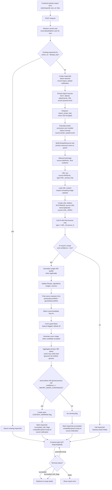

# Import Pipeline Flow

Current backend implementation is queue-first: `POST /imports` creates an `ImportJob`, enqueues Dramatiq work, and returns `202 Accepted`. The worker processes the import in the background. Frontend polling UX is still Phase 1d.

Owner scoping is part of the current backend path: recipe, collection, and import endpoints resolve the current user through a single API dependency. Today that dependency returns the local default/admin user; later it can be replaced with authenticated user resolution without changing the service contracts.
