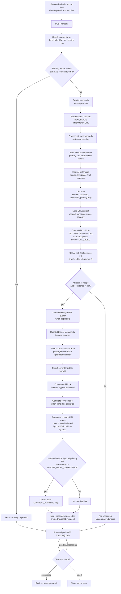

# Import Pipeline Flow

Current implementation is sync-first: `POST /imports` creates an `ImportJob`, processes it in the same request, and the frontend still polls `GET /imports/{jobId}` so the contract can move to a real background queue later.

Owner scoping is part of the current backend path: recipe, collection, and import endpoints resolve the current user through a single API dependency. Today that dependency returns the local default/admin user; later it can be replaced with authenticated user resolution without changing the service contracts.
