# Current Import Pipeline

The current implementation is queue-first with a transactional outbox.
`POST /imports` atomically creates a queued `ImportJob`, its primary sources,
and an ID-only pending outbox message, then attempts post-commit dispatch through
the configured queue publisher.
The worker executes the synchronous import pipeline in the background. The
import form clears after a job is accepted and does not poll that job or redirect
when it finishes; users receive completion and failure notifications instead.

```mermaid
flowchart TD
  form["Import form<br/>text, URL, attachments, clientImportId"] --> preflight{"Request preflight"}
  preflight -->|"invalid"| apiError["Synchronous API error<br/>no ImportJob created"]
  preflight -->|"valid"| dedupe{"Existing owner + dedupe_key?"}
  dedupe -->|"yes"| existing["Return existing ImportJob"]
  dedupe -->|"no"| create["Atomic creation transaction<br/>ImportJob QUEUED<br/>primary ImportJobSource rows<br/>IMPORT_CREATED event<br/>IMPORT_STARTED notification<br/>pending IMPORT_JOB outbox message"]
  create --> publish["Post-commit outbox dispatch<br/>return 202 Accepted"]
  publish --> reset["Clear form<br/>remain on Import page"]

  publish --> claim{"Worker atomically claims<br/>QUEUED to RUNNING"}
  claim -->|"not queued"| stop["Stop without processing"]
  claim -->|"claimed"| started["Increment attempt_count<br/>clear previous result/error fields<br/>write IMPORT_STARTED event"]

  started --> raw["Build RawSource values<br/>manual text and images first"]
  raw --> url{"Primary URL present?"}
  url -->|"yes"| load["Instagram, Threads, or generic loader<br/>respect remaining image capacity"]
  load --> staged["Attempt secondary resources independently<br/>LOADED, FAILED, or SKIPPED"]
  staged --> fatal{"Sole URL has no useful evidence<br/>or posters only?"}
  fatal -->|"yes"| failure
  fatal -->|"no"| partial{"Any FAILED secondary resources?"}
  partial -->|"yes"| partialEvent["Write IMPORT_SECONDARY_RESOURCE_UPLOAD_FAILED"]
  partial -->|"no"| rawEvent
  partialEvent --> rawEvent["Write RAW_SOURCES_DOWNLOADED"]
  url -->|"no"| rawEvent

  rawEvent --> transient["Build in-memory Recipe, RecipeResource,<br/>and RecipeImage candidates"]
  transient --> extractionSources["Build extraction sources<br/>final resources only, type != URL<br/>request-local source_N ids"]
  extractionSources --> requested["Write EXTRACTOR_REQUESTED"]
  requested --> extractor["RecipeExtractionProvider.extract"]
  extractor --> succeeded["Write EXTRACTOR_SUCCEEDED"]
  succeeded --> validate{"Validate and normalize result"}
  validate -->|"invalid, not recipe,<br/>too long, or confidence too low"| failure["Persist FAILED job<br/>IMPORT_FAILED event<br/>failure notification"]
  validate -->|"valid"| save["Single success transaction<br/>recipe fields and ingredients<br/>resources and statuses<br/>cover and flags<br/>search text and embedding plan"]

  save --> flag{"Open review flag?"}
  flag -->|"yes"| flagged["SUCCEEDED_WITH_FLAGS<br/>embedding skipped due to flags"]
  flag -->|"no"| success["SUCCEEDED<br/>embedding may be enqueued"]
  flagged --> completed["RECIPE_CREATED event<br/>completion notification"]
  success --> completed
  completed --> notification["Notification polling<br/>open recipe detail"]

  failure --> cleanup["Always delete files created in this attempt<br/>delete primary uploads only after final attempt"]
  cleanup --> failedNotification["Notification polling<br/>open public import-job detail"]
  failedNotification --> retry{"Retry allowed?<br/>FAILED and attempts below current limit"}
  retry -->|"yes"| retryRequest["POST /imports/{jobId}/retry<br/>atomically set QUEUED, notify,<br/>and persist outbox message<br/>then dispatch after commit"]
  retryRequest --> claim

  classDef fail fill:#ffe0e0,stroke:#b91c1c,color:#111;
  classDef decision fill:#f3f4f6,stroke:#555,color:#111;
  classDef db fill:#e7f5ff,stroke:#1d4ed8,color:#111;
  classDef extractor fill:#fff0b3,stroke:#b7791f,color:#111,stroke-width:2px;

  class apiError,failure fail;
  class preflight,dedupe,claim,url,fatal,partial,validate,flag,retry decision;
  class create,started,partialEvent,rawEvent,requested,succeeded,save,flagged,success,completed db;
  class extractor extractor;
```

## Source Model and Capacity

- `ImportJobSource` stores primary user inputs: manual text, manual images, and
  the submitted URL.
- Attachments are accepted first and consume `MAX_IMPORT_IMAGES` capacity. URL
  images are accepted only within the remaining capacity. Video posters use the
  separate video capacity.
- URL-derived text, images, video posters, and video transcripts become final
  child resources. Parent URL resources are not sent to the extractor.
- URL loaders never synthesize `URL: <url>` fallback text.
- Secondary resources are attempted independently. Failed or skipped resources
  do not create `RecipeResource` rows.
- A sole URL fails when it produces no useful final evidence or only video
  posters. With other usable evidence, partial secondary failures are audited and
  the import continues.
- `RecipeResource.source` records `MANUAL`, `URL`, `URL_VIDEO`, or `GENERATED`.

## Extraction, Statuses, and Flags

- The extractor receives final resources only, identified by request-local ids
  such as `source_1`. An in-memory mapping resolves returned ids back to resource
  objects.
- Final statuses come from extractor `primarySourceRefs` and
  `ignoredSourceRefs`.
- A parent URL is `USED` if any child is `USED`, `IGNORED` if all children are
  `IGNORED`, and `UNKNOWN` otherwise.
- For a single primary URL, ignored/conflicting child evidence remains persisted
  for diagnostics, but only low confidence creates a review flag. The extraction
  quality object is not rewritten merely to implement this flag rule.
- For multiple primary sources, a review flag is created for extractor
  conflicts, an ignored primary source, or confidence at or below
  `IMPORT_WARN_CONFIDENCE`.
- Confidence at or below `IMPORT_MIN_CONFIDENCE` fails the import before recipe
  persistence.
- An accepted extractor `coverCandidate` may create a separate generated cover
  resource. Optional candidate-guard behavior remains isolated in
  `backend/app/imports/cover_guard.py` and is disabled by default.

## Jobs, Retry, and User Navigation

- `clientImportId` maps to the owner-scoped dedupe key; `Idempotency-Key` is an
  HTTP-level alias. A duplicate request returns the existing job.
- `attempt_count` increments only when a worker successfully claims a queued job.
  The maximum number of attempts comes from current runtime settings and is not
  stored on the job.
- Manual retry is owner-scoped and allowed only for `FAILED` jobs below the
  current attempt limit. Concurrent retry is protected by the backend. The
  accepted retry state, notification, and pending outbox message commit
  atomically; immediate dispatch failure leaves that durable state available
  for reconciliation.
- `IMPORT_STARTED` and `IMPORT_FAILED` events include current and maximum attempt
  counts. Events are currently not directly associated with an attempt row or
  attempt id.
- Import-job notifications open the public, user-safe import-job detail page.
  Successful recipe notifications open recipe detail. Technical event payloads
  remain on the admin-only Import Jobs page.

## Current Deferrals

- Reliable distinction between silent videos and transcription-provider
  failures.
- Review/status behavior for a non-sole URL that yields no successfully loaded
  secondary resources.
- Explicit event-to-attempt association.
- Full live Instagram/Threads scraping resilience, cloud storage, real auth and
  permissions, mobile-specific flows, and generated frontend API types.
