# Current Import Pipeline

This is the current backend queue-first implementation state. The API creates
`ImportJob(status=queued)`, enqueues Dramatiq work, and the worker runs the
existing synchronous import pipeline in the background. Frontend polling UX is
implemented in Phase 1d.

```mermaid
flowchart TD
  start["Frontend import form"] --> submit["POST /imports multipart<br/>clientImportId + optional url/text/files"]
  submit --> validate{"Validate request"}
  validate -->|"no usable source"| fail400["400 NO_IMPORT_SOURCES"]
  validate -->|"text too long"| failText["400 TEXT_TOO_LONG"]
  validate -->|"too many/invalid files"| failFiles["400 TOO_MANY_FILES / INVALID_FILE_TYPE / FILE_TOO_LARGE"]
  validate -->|"ok"| dedupe{"Existing owner/dedupe_key?"}
  dedupe -->|"yes"| existing["Return existing ImportJob"]
  dedupe -->|"no"| persist["Persist ImportJob queued<br/>Persist TEXT/IMAGE/URL ImportJobSource rows<br/>record import_started + queued event"]

  persist --> enqueue["Enqueue import_recipe_task<br/>return 202 Accepted"]
  enqueue --> process["Dramatiq worker runs sync handler<br/>status=running + worker_started event"]
  process --> tree["Build RecipeResource tree<br/>primary resources have parent_resource_id = null"]
  tree --> images["Save attachment images first<br/>IMAGE + source=MANUAL"]
  images --> text["Add text input<br/>TEXT + source=MANUAL"]
  text --> url{"URL source?"}
  url -->|"no"| ai
  url -->|"yes"| remaining["remaining images = MAX_IMPORT_IMAGES - accepted attachments"]
  remaining --> loader["Loader registry<br/>Instagram -> Threads -> Generic"]
  loader --> loadedUrl["Create URL primary row<br/>URL + source=MANUAL"]
  loadedUrl --> children["Create final URL children<br/>TEXT/IMAGE + source=URL<br/>transcript/poster + source=URL_VIDEO"]
  children --> ai["RecipeExtractionProvider.extract<br/>final sources only, type != URL"]

  ai -->|"not recipe"| failJob["Mark ImportJob failed<br/>cleanup saved files"]
  ai --> quality{"confidence <= IMPORT_MIN_CONFIDENCE?"}
  quality -->|"yes"| lowConfidence["Mark ImportJob failed<br/>cleanup saved files"]
  quality -->|"no"| sources["Map primarySourceRefs / ignoredSourceRefs<br/>to final RecipeResource statuses"]
  sources --> singleUrl["Normalize single URL recipe-level quality"]
  sources --> cover{"AI coverCandidate references accepted image?"}
  cover -->|"no"| write
  cover -->|"yes"| guard["cover_guard black box<br/>ENABLE_COVER_CANDIDATE_GUARD default off"]
  guard --> generatedCover["Generate COVER image derivative"]
  generatedCover --> write["Update Recipe, Ingredients, Images,<br/>Sources, optional ReviewFlag"]
  write --> aggregate["Aggregate primary source status<br/>URL used if any child used<br/>URL ignored if all children ignored"]
  aggregate --> warn{"warning rule<br/>single URL: low confidence only<br/>multi-primary: conflict OR ignored primary OR low confidence"}
  warn -->|"yes"| flag["Create CONTENT_WARNING flag"]
  warn -->|"no"| success
  flag --> flagged["Mark ImportJob succeeded_with_flags<br/>createdRecipeId set"]
  flagged --> poll
  success["Mark ImportJob succeeded<br/>createdRecipeId set<br/>record completion notification"] --> poll["Frontend polls GET /imports/{jobId}<br/>until terminal status"]
  failJob --> poll
  lowConfidence --> poll
  poll --> detail["GET /recipes/{id}<br/>returns sources, images, cover, flags"]

  classDef fail fill:#ffe0e0,stroke:#b91c1c,color:#111;
  classDef decision fill:#f3f4f6,stroke:#555,color:#111;
  classDef db fill:#e7f5ff,stroke:#1d4ed8,color:#111;
  classDef ai fill:#fff0b3,stroke:#b7791f,color:#111,stroke-width:2px;

  class fail400,failText,failFiles,failJob,lowConfidence fail;
  class validate,dedupe,url,quality,cover,warn decision;
  class persist,write,success db;
  class ai ai;
```

## Implemented Rules

- `clientImportId` deduplicates imports for the default local user through `ImportJob.dedupe_key`; `Idempotency-Key` can be used as an HTTP-level alias.
- `POST /imports` returns `202 Accepted` for a new queued job; duplicate dedupe keys return the existing job.
- Dramatiq workers execute the existing synchronous import pipeline.
- Import processing records `JobEvent` rows and persisted user `Notification` rows, but notification polling API remains deferred.
- Text input participates as recipe evidence.
- Attachments are accepted before URL images and occupy `MAX_IMPORT_IMAGES` capacity.
- URL images are loaded only within the remaining image capacity.
- URL loader order is Instagram, Threads, then generic fallback.
- `RecipeResource.source` records origin: `MANUAL`, `URL`, `URL_VIDEO`, or `GENERATED`.
- URL imports create a parent URL source plus child final sources for URL text, URL images, video transcript, and video poster.
- AI receives final sources only: all `RecipeResource` rows where `type != URL`, labeled with short request-local ids such as `source_1`.
- The backend keeps an in-memory mapping from each request-local AI id back to its `RecipeResource` object for status and cover processing.
- Final recipe source statuses are derived from AI `primarySourceRefs` and `ignoredSourceRefs` before any single URL recipe-level quality normalization.
- Primary URL source status is aggregated from children: used if any child is used, ignored if all children are ignored, otherwise unknown.
- Single URL import treats ignored/conflicting child resources inside the only URL as internal diagnostics. Child resource statuses are still persisted, but recipe-level `quality.hasConflicts`, `quality.hasIgnored`, and `ignoredSourceRefs` are normalized to `false`, `false`, and `[]`.
- `quality.confidence <= IMPORT_MIN_CONFIDENCE` fails the import and cleans saved files.
- Warning flags for single URL imports are created only when `quality.confidence <= IMPORT_WARN_CONFIDENCE`.
- Warning flags for multi-primary imports are created when `quality.hasConflicts`, any primary source is ignored, or `quality.confidence <= IMPORT_WARN_CONFIDENCE`.
- AI `coverCandidate` generates a separate cover derivative when it references an accepted image source.
- Cover candidate guard logic is isolated in `backend/app/imports/cover_guard.py` and remains default-off.

## Current Deferrals

- Frontend polling and notification UX are Phase 1d.
- Full live Instagram/Threads scraping resilience. Current platform loaders are isolated and fixture-tested.
- Cloud storage, auth, mobile-specific flows, and generated frontend API types.
