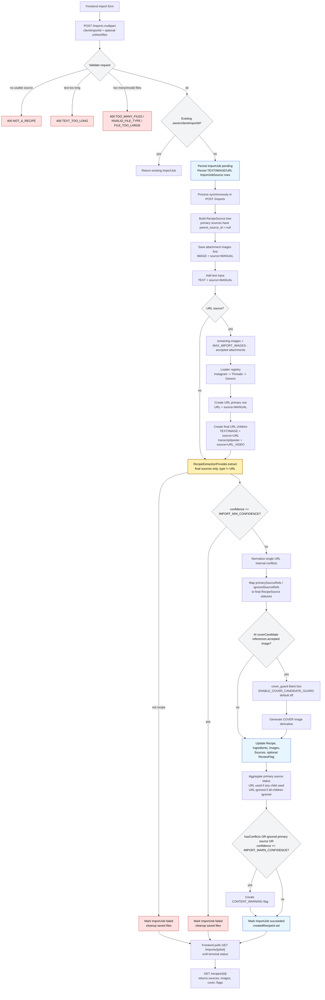

# Current Import Pipeline

This is the current sync-first implementation state. The API keeps the `ImportJob`
contract so the frontend shape can stay stable when the real background queue is
added later.

## Implemented Rules

- `clientImportId` deduplicates imports for the default local user.
- `POST /imports` processes synchronously for the local MVP and returns a terminal job when processing completes.
- Text input participates as recipe evidence.
- Attachments are accepted before URL images and occupy `MAX_IMPORT_IMAGES` capacity.
- URL images are loaded only within the remaining image capacity.
- URL loader order is Instagram, Threads, then generic fallback.
- `RecipeSource.source` records origin: `MANUAL`, `URL`, or `URL_VIDEO`.
- URL imports create a parent URL source plus child final sources for URL text, URL images, video transcript, and video poster.
- AI receives final sources only: all `RecipeSource` rows where `type != URL`, labeled with `RecipeSource.id`.
- Final recipe source statuses are derived from AI `primarySourceRefs` and `ignoredSourceRefs`.
- Primary URL source status is aggregated from children: used if any child is used, ignored if all children are ignored, otherwise unknown.
- Single URL import normalizes internal conflicts before warning/failure decisions, but source statuses still use the raw AI refs.
- `quality.confidence <= IMPORT_MIN_CONFIDENCE` fails the import and cleans saved files.
- Warning flags are created when `quality.hasConflicts`, any primary source is ignored, or `quality.confidence <= IMPORT_WARN_CONFIDENCE`.
- AI `coverCandidate` generates a separate cover derivative when it references an accepted image source.
- Cover candidate guard logic is isolated in `backend/app/imports/cover_guard.py` and remains default-off.

## Current Deferrals

- Real background queue/worker. The API contract already supports polling, but processing is sync-first.
- Real OpenAI provider wiring for production imports; tests/dev use the provider interface and fake provider.
- Video transcript/poster processing.
- Full live Instagram/Threads scraping resilience. Current platform loaders are isolated and fixture-tested.
- Cloud storage, auth, mobile-specific flows, and generated frontend API types.
