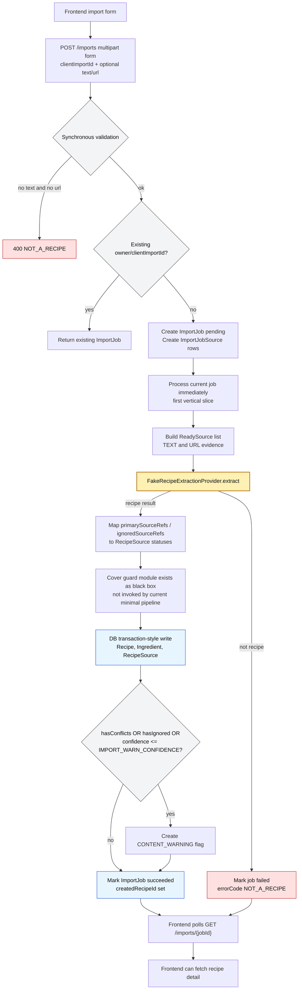

# Current Import Pipeline

This documents the current implementation state after the first backend/frontend vertical slice. It is intentionally narrower than the target design in `docs/design.md`.

## Implemented Rules

- `clientImportId` deduplicates imports for the default local user.
- Text input participates as recipe evidence.
- URL input currently participates as URL evidence without platform loading.
- Fake AI provider returns recipe quality and primary source refs.
- Recipe source statuses are derived from `primarySourceRefs` and `ignoredSourceRefs`.
- Warning flags are created when `quality.hasConflicts`, `quality.hasIgnored`, or `quality.confidence <= IMPORT_WARN_CONFIDENCE`.
- Cover guard logic is isolated in `backend/app/imports/cover_guard.py` so it can be removed from the scenario without changing source rules or API routes.

## Target Gaps Still To Implement

- Real background queue/worker instead of immediate first-slice processing.
- Attachments-first image capacity in the multipart route.
- URL loaders for generic pages, Instagram, and Threads.
- Video transcript and poster image handling.
- Strict AI JSON/OpenAI provider integration.
- Cover generation and optional guard invocation from the pipeline.
- Storage cleanup on failed imports after files are accepted.
