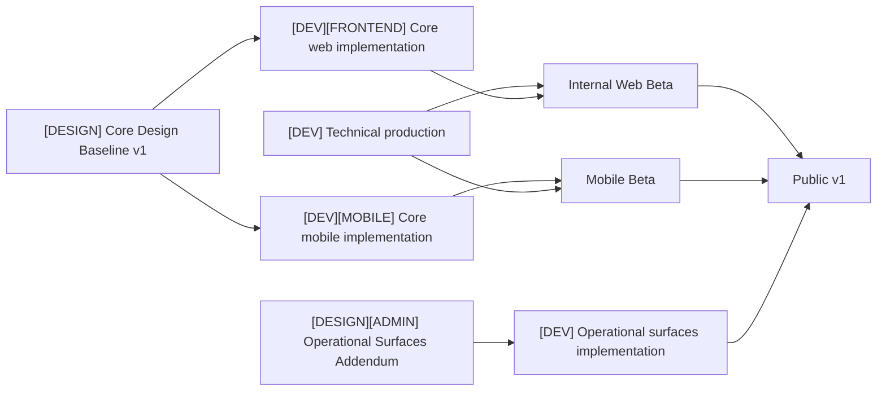

# Recipe Manager Roadmap

Updated: 2026-08-13

This is the canonical project-level status index. It coordinates two parallel global tracks while keeping detailed decisions and executable work in their owning artifacts.

## Source-of-truth hierarchy

1. This file defines project milestones and cross-track gates.
2. [`../design/roadmap.md`](../design/roadmap.md) defines current Design scope and dependencies.
3. [`architecture/production-roadmap.md`](architecture/production-roadmap.md) defines current Development scope and dependencies.
4. GitHub issues are the executable work queue and use [`agents/planning.md`](agents/planning.md).
5. [`production-prerequisites.md`](production-prerequisites.md) records owner decisions and external setup that unblock production work.
6. [`future/`](future/README.md) holds capabilities that are not active first-version work.
7. [`archive/`](archive/README.md) preserves superseded plans and historical snapshots.

Architecture and behavior contracts remain authoritative for their subject areas. Roadmaps report scope and status; they do not duplicate those contracts.

## Global tracks

| Track | Current state | Current destination |
| --- | --- | --- |
| `[DESIGN]` | In progress | Approve Core Design Baseline v1, then Operational Surfaces Addendum v1 |
| `[DEV]` | In progress | Finish technical production, implement approved clients, and reach Public v1 |

Design and Development proceed in parallel. Backend, infrastructure, production hardening, contract discovery, and non-visual client foundations may continue while Design is open. Production UI implementation is gated by the applicable approved baseline.

Within each Design Domain, shared product-contract work precedes separate responsive-web and native-mobile design children. Those platform children may run in parallel and are reconciled before the domain enters the Core baseline.

## Release milestones

| Milestone | Required outcome |
| --- | --- |
| Core Design Baseline v1 | Primary web and mobile journeys, shared system, states, accessibility, localization pressure, and implementation handoff are approved |
| Internal Web Beta | Technical production and the approved responsive web Core are operational for internal users; native mobile is not required |
| Mobile Beta | Approved primary native mobile journeys are implemented; the complete operational/admin set is not required |
| Operational Surfaces Addendum v1 | Admin, debug, and operational web/mobile contracts are approved |
| Public v1 | Stable web and mobile, implemented operational surfaces, passed production release-candidate security audit, production operations, and beta-readiness gates are complete |

## Cross-track dependency map

The Operational Addendum does not block Core web/mobile implementation. It does block Public v1 through its implementation.

## Current frontier

The detailed roadmaps identify the frontier. At project level:

- multiple independent Design Domains may proceed in parallel;
- the P11/P12 specification slices and LocalStack acceptance closure are immediately agent-ready;
- infrastructure foundation work can proceed after its explicit architecture decisions and user-owned AWS prerequisites are satisfied;
- Future Capabilities remain outside this frontier until promoted.
