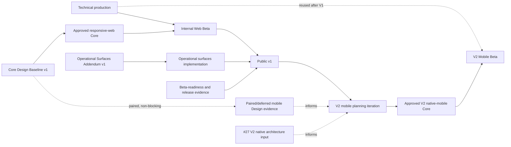
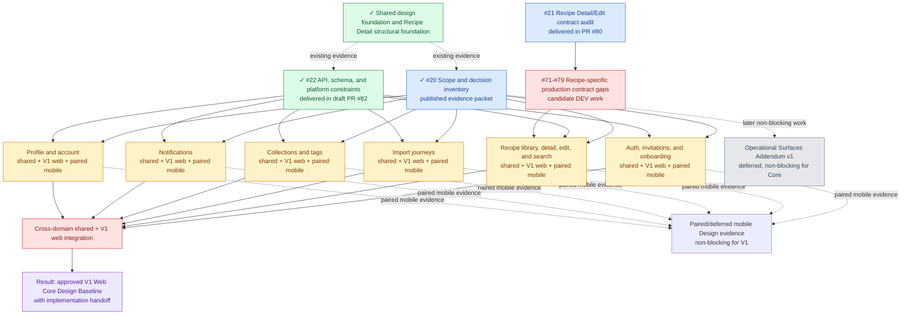
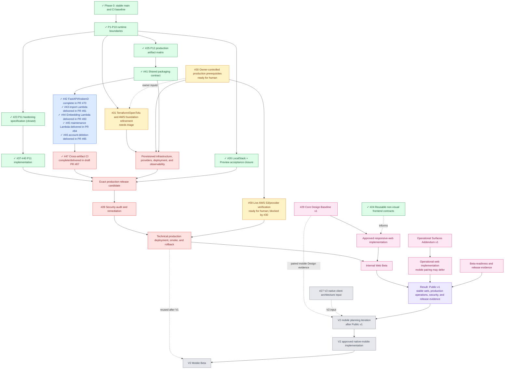

# Recipe Manager Roadmap

Updated: 2026-08-20 
Audience: human project planning

This is the canonical human-facing project overview. It shows the major work blocks, their status, the order in which results become available, and links to the documents that own the detail. It is intentionally concise: product decisions, technical contracts, and executable issue bodies remain in their subject documents and GitHub.

## Source-of-truth hierarchy

1. This document defines the project-scale Design and Development work graph and release outcomes.
2. [`design/roadmap.md`](../design/roadmap.md) owns detailed Design scope, domain status, and baseline gates.
3. [`architecture/production-roadmap.md`](architecture/production-roadmap.md) owns detailed Development phases, readiness, and implementation gates.
4. [`architecture/production-architecture.md`](architecture/production-architecture.md) owns the target production topology and its unresolved architecture decisions.
5. GitHub issues are the executable work queue; native issue dependencies are the source of truth for blockers.
6. [`future/`](future/README.md) holds capabilities that are not active V1 work; the V2 mobile track is documented separately as a deferred release sequence.
7. [`archive/`](archive/README.md) preserves superseded plans and historical snapshots.

The roadmap summarizes its source documents rather than copying their contracts. Agent workflow and issue-writing rules remain in the agent documentation and are deliberately outside this human-facing map.

## Global tracks

| Track | Current state | Current destination |
| --- | --- | --- |
| `[DESIGN]` | Core Design Baseline v1 in progress; Design Operations contract #88 delivered in draft PR #86 and pilot #89–#94 planned | Prove the repository-owned graph/cockpit workflow on Recipe Detail desktop web, then resume measured V1 Design rollout and approve the web implementation handoff |
| `[DEV]` | Local baseline, P1-P10 runtime boundaries, P11 hardening, and all P12 production artifacts and cross-artifact CI complete; #47 complete/delivered in draft PR #87; technical production in progress | Finish infrastructure, deployment, approved web client, operational surfaces, and Public v1 gates; start mobile only in the post-V1 V2 track |

Design and Development proceed in parallel. Production UI implementation is gated by the applicable approved Design baseline; backend, infrastructure, contract discovery, and other non-visual work may proceed earlier when their own blockers are closed.

## Release sequencing

V1 is the first production release and is **web-only**. Its release gate is the
approved V1 web Design handoff plus technical production, operational surfaces,
security, and beta-readiness evidence. Paired mobile Design work may run in the
same product context, but its completion and every mobile Development task are
outside the V1 release gate.

V2 starts after V1 Web Release with a dedicated mobile planning iteration. That
iteration turns the deferred mobile architecture packet, shared contracts, and
paired Design evidence into an approved mobile specification and executable
Development issues. Use the orthogonal GitHub labels `v1` and `v2` together
with the canonical triage labels; the version label identifies release target,
not readiness.

## Release outcomes

| Milestone | Human-readable result |
| --- | --- |
| Core Design Baseline v1 | Approved shared product meaning and V1 responsive-web behavior, difficult states, accessibility/localization coverage, and the web implementation handoff; paired mobile evidence is non-blocking |
| Internal Web Beta | Technical production plus the approved responsive-web Core client is operational for internal users |
| Operational Surfaces Addendum v1 | Admin, debug, and operational web contracts required for the V1 public release are approved; mobile operational design may be paired or deferred |
| Public v1 | Stable web, implemented V1 operational surfaces, passed security and beta-readiness gates, and recorded release evidence |
| V2 Mobile Planning | After Public v1, the mobile specification, requirements, design gate, and executable Development slices are approved |
| V2 Mobile Beta | Technical production plus the approved V2 native-mobile Core client is operational |

## Cross-track dependency map

The Operational Addendum does not block V1 Core web implementation. It blocks Public v1 through its implementation and release evidence. Public v1 is the solid sequencing gate for V2 planning; paired mobile Design evidence and #27 are dashed inputs until that planning iteration creates approved mobile scope and blockers.

## Design track

Source of truth: [`Product Design Roadmap`](../design/roadmap.md). Tracker: [#29 — Core Design Baseline v1](https://github.com/starkovalera/recipe-manager/issues/29).

The graph uses one node for each logically independent Design Domain. Each
domain is refined as a shared product contract, a V1 responsive-web result, and
an optional paired native-mobile result. Shared/web reconciliation is part of
the V1 handoff; mobile-specific reconciliation is useful evidence but does not
block V1.

Issue #21's Recipe-specific audit is recorded and delivered in
[`15-verified-recipe-detail-contracts.md`](../design/recipe-detail/decisions/15-verified-recipe-detail-contracts.md).
The publication is [draft PR #80](https://github.com/starkovalera/recipe-manager/pull/80).
It confirms the current owner-only authorization and existing read-only/API
boundaries, while candidate [#71](https://github.com/starkovalera/recipe-manager/issues/71)–[#79](https://github.com/starkovalera/recipe-manager/issues/79)
hold the missing Unit, validation, ordering, concurrency, media, selector,
nutrition, notes, and rating contracts. Those gaps remain prerequisites for
the applicable Recipe platform children; paired mobile work is non-blocking for
V1.

### Design Operations visibility

The accepted
[`Design Operations cockpit specification`](../design/shared/design-operations-cockpit-spec.md)
keeps GitHub/current decisions authoritative and generates a visual current
slice from a repository-owned graph. The primary interactive surface is a static
web cockpit; Pen is a bounded parallel experiment, not a source of status.

The workstream is [#88](https://github.com/starkovalera/recipe-manager/issues/88)–[#94](https://github.com/starkovalera/recipe-manager/issues/94),
all with the `[DESIGN][SHARED]` prefix. Its immediate sequence is specification
#88, human setup #89, and Core Pen experiment #90. Product Design execution is
temporarily held until #90 records the Pen role, but no product Design issue has
a native Pen blocker. Recipe Detail cockpit #92 remains architecturally
independent; #93 automates the proven lifecycle, and #94 refines rollout tasks
for every remaining Design Domain.

Known stale tracker/roadmap state is deliberately retained for the first map.
Issue #91 reconciles it only after #90 demonstrates `verification_needed`, so
the same change becomes the controlled regeneration proof.

### Design result

The Design track's V1 result is an approved shared product contract and
responsive-web handoff detailed enough to implement without treating
prototypes as production source. Paired mobile evidence may be available, but
the V1 Core baseline is not blocked by completing mobile Design. The V2 mobile
client receives a separate planning and design gate after V1; the Operational
Addendum remains required before Public v1.

## Development track

Source of truth: [`Production Roadmap`](architecture/production-roadmap.md). Tracker: [#32 — Public v1 delivery tracker](https://github.com/starkovalera/recipe-manager/issues/32).

Issue [#23](https://github.com/starkovalera/recipe-manager/issues/23) is closed: merged PR [#49](https://github.com/starkovalera/recipe-manager/pull/49) delivered the complete P11 specification and child-issue graph. Child A [#37](https://github.com/starkovalera/recipe-manager/issues/37) is complete in merged [PR #63](https://github.com/starkovalera/recipe-manager/pull/63); Child B [#38](https://github.com/starkovalera/recipe-manager/issues/38) is complete in merged [PR #65](https://github.com/starkovalera/recipe-manager/pull/65); Child C [#39](https://github.com/starkovalera/recipe-manager/issues/39) is complete in merged [PR #66](https://github.com/starkovalera/recipe-manager/pull/66); and Child D [#40](https://github.com/starkovalera/recipe-manager/issues/40) is complete in merged [PR #67](https://github.com/starkovalera/recipe-manager/pull/67). P11 implementation is complete.

The P12 artifact matrix in [#25](https://github.com/starkovalera/recipe-manager/issues/25) is complete in merged PR [#52](https://github.com/starkovalera/recipe-manager/pull/52). Shared packaging child [#41](https://github.com/starkovalera/recipe-manager/issues/41) is complete in merged [PR #68](https://github.com/starkovalera/recipe-manager/pull/68). FastAPI/KrakenD child [#42](https://github.com/starkovalera/recipe-manager/issues/42) is complete in [PR #70](https://github.com/starkovalera/recipe-manager/pull/70); import Lambda child [#43](https://github.com/starkovalera/recipe-manager/issues/43) is complete/delivered in [PR #81](https://github.com/starkovalera/recipe-manager/pull/81); embedding Lambda child [#44](https://github.com/starkovalera/recipe-manager/issues/44) is complete/delivered in [PR #83](https://github.com/starkovalera/recipe-manager/pull/83); maintenance Lambda child [#45](https://github.com/starkovalera/recipe-manager/issues/45) is complete/delivered in [PR #84](https://github.com/starkovalera/recipe-manager/pull/84); and account-deletion artifact child [#46](https://github.com/starkovalera/recipe-manager/issues/46) is complete/delivered in [PR #85](https://github.com/starkovalera/recipe-manager/pull/85). Cross-artifact CI child [#47](https://github.com/starkovalera/recipe-manager/issues/47) is complete/delivered in draft [PR #87](https://github.com/starkovalera/recipe-manager/pull/87), closing P12 with six-image build, health/invocation, identity, scan, and manifest verification.

LocalStack and Preview acceptance for [#26](https://github.com/starkovalera/recipe-manager/issues/26) is recorded in merged PR [#58](https://github.com/starkovalera/recipe-manager/pull/58). The real-provider boundary is intentionally separate in [#59 — Verify Live AWS S3 media access boundaries](https://github.com/starkovalera/recipe-manager/issues/59): [#30](https://github.com/starkovalera/recipe-manager/issues/30) is its owner-input blocker, and #59 gates technical production smoke without blocking #31 refinement or the other independent Phase 1 work.

### Development result

The Development track ends its current V1 sequence with Public v1: a
deployable and operated production system, an approved responsive-web client,
implemented V1 operational surfaces, a passed release-candidate security gate,
and recorded beta-readiness/release evidence. Technical production alone
produces internal infrastructure and does not constitute a product beta. The
native-mobile client is a separate V2 outcome that starts with post-V1
planning.

### Target architecture at roadmap end

The source-of-truth architecture diagram is maintained in [`Production Architecture — roadmap end-state view`](architecture/production-architecture.md#roadmap-end-state-view). The logical topology is sufficiently known to draw now: web and mobile use one API boundary, FastAPI owns domain authorization, queues and Lambdas own durable background work, Neon owns durable relational state, S3 owns private media, and Clerk/Flagsmith provide cross-cutting services.

The target architecture remains cross-client, but V1 does not depend on the
native client. The native stack and delivery decision ([#27](https://github.com/starkovalera/recipe-manager/issues/27)) is a V2 input to revisit after V1; Terraform/OpenTofu plus the Lightsail/EC2 deployment mechanism ([#31](https://github.com/starkovalera/recipe-manager/issues/31)) and owner-provided cloud/account/domain/secret prerequisites ([#30](https://github.com/starkovalera/recipe-manager/issues/30)) remain current V1 infrastructure decisions. Those open decisions are shown explicitly in the architecture source instead of being guessed here. Separately, [#59](https://github.com/starkovalera/recipe-manager/issues/59) validates the real AWS provider boundary after #30; it is a production gate, not a topology decision or a blocker for #31 refinement.

## Human-facing project documents

| Document | Use |
| --- | --- |
| [`CONTEXT.md`](../CONTEXT.md) | Shared product language and project-level planning vocabulary |
| [`Product Design Roadmap`](../design/roadmap.md) | Design Domains, baseline gates, and Design readiness |
| [`Production Roadmap`](architecture/production-roadmap.md) | Development phases, runtime readiness, and delivery gates |
| [`Production Architecture`](architecture/production-architecture.md) | Selected topology, boundaries, target end-state, and open infrastructure decisions |
| [`Production prerequisites`](production-prerequisites.md) | Human-owned accounts, provider setup, and external inputs |
| [`V1/V2 release boundary ADR`](adr/0006-v1-web-only-release-v2-mobile-boundary.md) | Accepted sequencing rule: V1 web-only, V2 mobile after post-V1 planning |
| [`Future Capabilities`](future/README.md) | Product ideas, technical debt, and intentional deferrals outside active scope |
| [`Shared product scope`](../design/shared/product-scope.md) | Human-readable cross-product scope and V1/V2 boundaries |
| [`API, schema, and platform constraints`](../design/shared/api-schema-platform-constraints.md) | Verified cross-domain contract matrix, lifecycle mapping, platform split, and Development candidate seams for #22 |
| [`Recipe Detail current scope`](../design/recipe-detail/decisions/current-scope.md) | Human-readable Design Domain decisions and remaining Recipe Detail work |
| [`API documentation`](api.md) | Current API contracts and integration-facing behavior |

## Keeping this roadmap current

After a work block or its executable issue changes status, especially after a
merged pull request:

1. update the owning detailed roadmap or architecture document;
2. update the corresponding node and status in this overview, marking completed blocks with `✓` and recording the concrete result;
3. revise the graph when a real dependency, outcome, or release gate changes;
4. update the target architecture diagram when an open architecture decision closes;
5. refresh task links, status references, and open questions in the affected documents;
6. keep GitHub issue bodies and native blocker edges authoritative for execution details; close the issue only when its own acceptance criteria and required scope are complete, leaving unfinished child work tracked separately.

The task lifecycle requires this synchronization before completion is handed off.
This document is the human-readable project map, not a second issue tracker.
