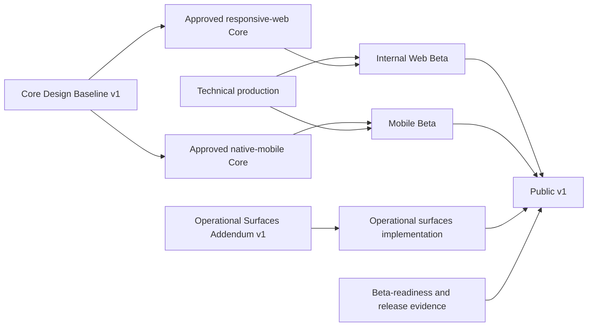
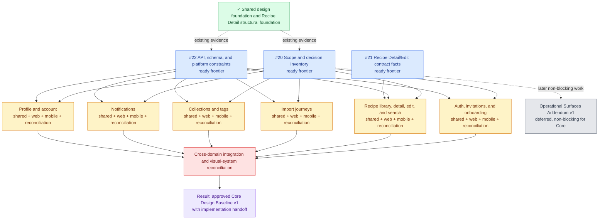
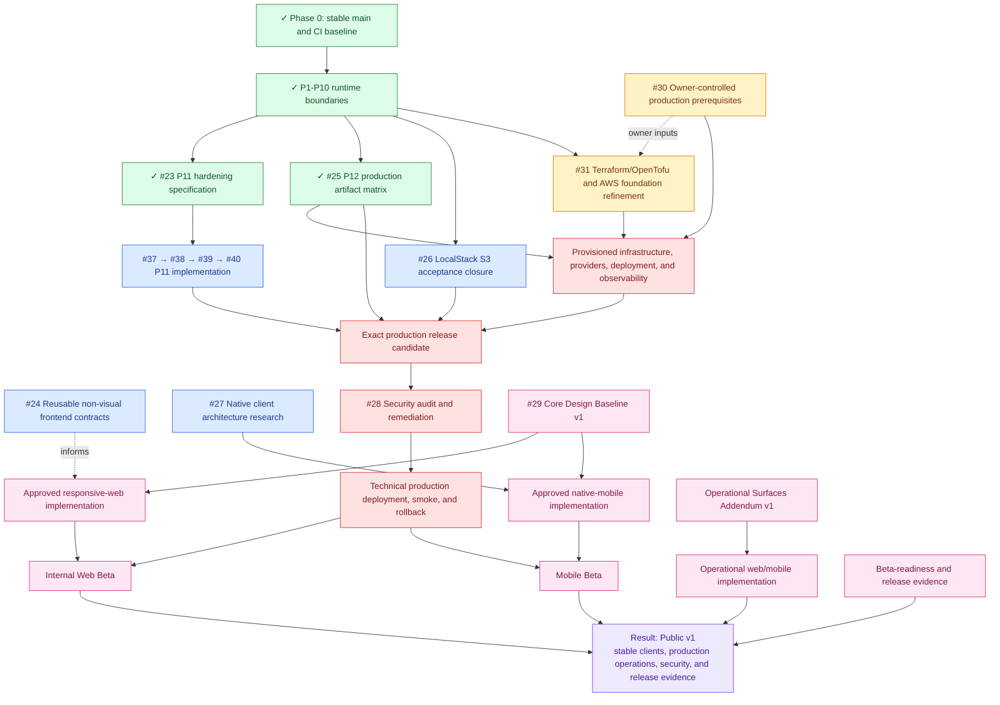

# Recipe Manager Roadmap

Updated: 2026-08-14 
Audience: human project planning

This is the canonical human-facing project overview. It shows the major work blocks, their status, the order in which results become available, and links to the documents that own the detail. It is intentionally concise: product decisions, technical contracts, and executable issue bodies remain in their subject documents and GitHub.

## Source-of-truth hierarchy

1. This document defines the project-scale Design and Development work graph and release outcomes.
2. [`design/roadmap.md`](../design/roadmap.md) owns detailed Design scope, domain status, and baseline gates.
3. [`architecture/production-roadmap.md`](architecture/production-roadmap.md) owns detailed Development phases, readiness, and implementation gates.
4. [`architecture/production-architecture.md`](architecture/production-architecture.md) owns the target production topology and its unresolved architecture decisions.
5. GitHub issues are the executable work queue; native issue dependencies are the source of truth for blockers.
6. [`future/`](future/README.md) holds capabilities that are not active first-version work.
7. [`archive/`](archive/README.md) preserves superseded plans and historical snapshots.

The roadmap summarizes its source documents rather than copying their contracts. Agent workflow and issue-writing rules remain in the agent documentation and are deliberately outside this human-facing map.

## Global tracks

| Track | Current state | Current destination |
| --- | --- | --- |
| `[DESIGN]` | Core Design Baseline v1 in progress | Approve shared product contracts, complete web/mobile domain design, reconcile the domains, and approve the implementation handoff |
| `[DEV]` | Local baseline, P1-P10 runtime boundaries, and the P11 hardening specification complete; technical production in progress | Finish P11 implementation, artifacts, infrastructure, deployment, approved clients, operational surfaces, and Public v1 gates |

Design and Development proceed in parallel. Production UI implementation is gated by the applicable approved Design baseline; backend, infrastructure, contract discovery, and other non-visual work may proceed earlier when their own blockers are closed.

## Release outcomes

| Milestone | Human-readable result |
| --- | --- |
| Core Design Baseline v1 | Approved shared product meaning, responsive-web and native-mobile behavior, difficult states, accessibility/localization coverage, and implementation handoff |
| Internal Web Beta | Technical production plus the approved responsive-web Core client is operational for internal users |
| Mobile Beta | Technical production plus the approved native-mobile Core client is operational |
| Operational Surfaces Addendum v1 | Admin, debug, and operational web/mobile contracts are approved |
| Public v1 | Stable web and mobile, implemented operational surfaces, passed security and beta-readiness gates, and recorded release evidence |

## Cross-track dependency map

The Operational Addendum does not block Core web/mobile implementation. It blocks Public v1 through its implementation and release evidence.

## Design track

Source of truth: [`Product Design Roadmap`](../design/roadmap.md). Tracker: [#29 — Core Design Baseline v1](https://github.com/starkovalera/recipe-manager/issues/29).

The graph uses one node for each logically independent Design Domain. Each domain is refined as a shared product contract, separate responsive-web and native-mobile work, and a reconciliation result in the detailed Design roadmap.

### Design result

The Design track ends with an approved, cross-platform product contract that is detailed enough to implement without treating prototypes as production source. The Core baseline is the gate for Core web/mobile UI implementation; the Operational Addendum remains a later, separately reconciled result required before Public v1.

## Development track

Source of truth: [`Production Roadmap`](architecture/production-roadmap.md). Tracker: [#32 — Public v1 delivery tracker](https://github.com/starkovalera/recipe-manager/issues/32).

The P11 specification in [#23](https://github.com/starkovalera/recipe-manager/issues/23) is complete in merged PR [#49](https://github.com/starkovalera/recipe-manager/pull/49). The remaining implementation gate is the native-blocked child chain [#37](https://github.com/starkovalera/recipe-manager/issues/37) → [#38](https://github.com/starkovalera/recipe-manager/issues/38) → [#39](https://github.com/starkovalera/recipe-manager/issues/39) → [#40](https://github.com/starkovalera/recipe-manager/issues/40).

The P12 artifact matrix in [#25](https://github.com/starkovalera/recipe-manager/issues/25) is complete in merged PR [#52](https://github.com/starkovalera/recipe-manager/pull/52). It defines six production image artifacts, shared packaging and runtime invariants, compatibility triggers, release identity, rollback rules, and the independently verifiable implementation children [#41](https://github.com/starkovalera/recipe-manager/issues/41)–[#47](https://github.com/starkovalera/recipe-manager/issues/47). Those implementation children remain the active P12 work.

### Development result

The Development track ends with Public v1: a deployable and operated production system, approved responsive web and native mobile clients, implemented operational surfaces, a passed release-candidate security gate, and recorded beta-readiness/release evidence. Technical production alone produces internal infrastructure and does not constitute a product beta.

### Target architecture at roadmap end

The source-of-truth architecture diagram is maintained in [`Production Architecture — roadmap end-state view`](architecture/production-architecture.md#roadmap-end-state-view). The logical topology is sufficiently known to draw now: web and mobile use one API boundary, FastAPI owns domain authorization, queues and Lambdas own durable background work, Neon owns durable relational state, S3 owns private media, and Clerk/Flagsmith provide cross-cutting services.

The exact infrastructure diagram remains conditional in three places: native client stack and delivery ([#27](https://github.com/starkovalera/recipe-manager/issues/27)), Terraform/OpenTofu plus the Lightsail/EC2 deployment mechanism ([#31](https://github.com/starkovalera/recipe-manager/issues/31)), and owner-provided cloud/account/domain/secret prerequisites ([#30](https://github.com/starkovalera/recipe-manager/issues/30)). Those open decisions are shown explicitly in the architecture source instead of being guessed here.

## Human-facing project documents

| Document | Use |
| --- | --- |
| [`CONTEXT.md`](../CONTEXT.md) | Shared product language and project-level planning vocabulary |
| [`Product Design Roadmap`](../design/roadmap.md) | Design Domains, baseline gates, and Design readiness |
| [`Production Roadmap`](architecture/production-roadmap.md) | Development phases, runtime readiness, and delivery gates |
| [`Production Architecture`](architecture/production-architecture.md) | Selected topology, boundaries, target end-state, and open infrastructure decisions |
| [`Production prerequisites`](production-prerequisites.md) | Human-owned accounts, provider setup, and external inputs |
| [`Future Capabilities`](future/README.md) | Product ideas, technical debt, and intentional deferrals outside active scope |
| [`Shared product scope`](../design/shared/product-scope.md) | Human-readable cross-product scope and first-version boundaries |
| [`Recipe Detail current scope`](../design/recipe-detail/decisions/current-scope.md) | Human-readable Design Domain decisions and remaining Recipe Detail work |
| [`API documentation`](api.md) | Current API contracts and integration-facing behavior |

## Keeping this roadmap current

After a work block or its executable issue changes status, especially after a
merged pull request:

1. update the owning detailed roadmap or architecture document;
2. update the corresponding node and status in this overview, marking completed blocks with `✓` and recording the concrete result;
3. revise the graph when a real dependency, outcome, or release gate changes;
4. update the target architecture diagram when an open architecture decision closes;
5. refresh task links, status references, and open questions in the affected documents;
6. keep GitHub issue bodies and native blocker edges authoritative for execution details; close the issue only when its own acceptance criteria and required scope are complete, leaving unfinished child work tracked separately.

The task lifecycle requires this synchronization before completion is handed off.
This document is the human-readable project map, not a second issue tracker.
