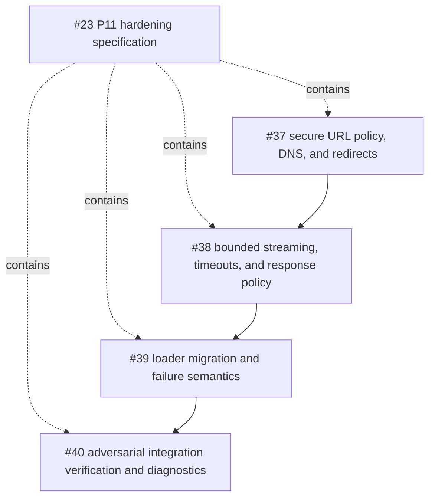

# P11 Remote Fetch and Streaming Hardening Specification

**Status:** proposed implementation contract
**Version:** 1.0
**Date:** 2026-08-14
**Parent issue:** [#23 — Inventory P11 fetch boundaries and write the hardening specification](https://github.com/starkovalera/recipe-manager/issues/23)

## Outcome

P11 hardens the import pipeline's user-influenced remote HTTP fetches against
server-side request forgery (SSRF), DNS and redirect changes, response-size
exhaustion, misleading metadata, indefinite waits, and unsafe diagnostics.
The result is one deep `RemoteFetcher` module behind the existing fetch seam.
Loader modules continue to own provider parsing and loader-specific success,
failure, fallback, and skipped-resource behavior.

This document is a specification and implementation handoff. It does not
change production behavior by itself and does not authorize changes to Clerk,
OpenAI, S3, SQS, or other provider contracts.

## Current inventory

### In-scope import fetch callers

All rows below use `httpx_fetch` by default. The injected `Fetch` callable in
`backend/app/imports/source_loading/url_loaders/types.py` is the test seam;
P11 makes the default adapter safe without requiring each loader to implement
its own URL or transport policy.

| Boundary | Current caller and path | Input origin | Current request/body behavior | Current result contract |
|---|---|---|---|---|
| Generic page | `GenericUrlContentLoader.load` in `backend/app/imports/source_loading/url_loaders/generic.py` | User-submitted import URL | `GET`, redirects enabled, `256 KiB` requested, full `response.content` read before slicing | Bounded HTML text; preview-image failure is recorded while page text survives |
| Generic preview image | Same generic loader | `og:image` resolved with `urljoin` from fetched page | One GET with `max_image_bytes` | Only JPEG/PNG/WebP with non-empty bytes is accepted; failure is secondary `IMAGE` |
| Instagram embed | `_fetch_instagram_embed` in `backend/app/imports/source_loading/url_loaders/instagram.py` | User URL normalized to Instagram embed URL | One GET, `2 MiB` requested | Embed failure invokes the generic-loader fallback |
| Instagram image | `_download_image` in the Instagram loader | Provider-returned absolute image URL | One GET with `max_image_bytes` | Invalid/empty image becomes secondary `IMAGE FAILED`; other images continue |
| Threads page | `ThreadsUrlContentLoader.load` in `backend/app/imports/source_loading/url_loaders/threads.py` | User-submitted Threads URL | One GET, `2 MiB` requested | Bounded HTML/JSON extraction; page failure remains primary URL-content failure |
| Threads image | `_download_image` in the Threads loader | Provider-returned absolute image URL | One GET with `max_image_bytes` | Invalid/empty image becomes secondary `IMAGE FAILED`; caption survives |
| Video poster | `VideoProcessor._download_poster` in `backend/app/imports/source_loading/video_processors/generic.py` | Provider-returned video metadata | One GET with `max_image_bytes` | Invalid/empty poster is `SKIPPED`; transport errors are `VIDEO_POSTER FAILED` |
| Video bytes | `VideoProcessor._transcribe` in the same module | Provider-returned video URL | One GET with `max_video_bytes`, then bytes are sent to the OpenAI transcription SDK | Empty video is skipped; fetch or transcription errors are `VIDEO_TRANSCRIPT FAILED` |

The reusable `FixturePlatformLoader` in
`backend/app/imports/source_loading/url_loaders/platforms.py` also defaults to
`httpx_fetch`, but its own comment says it is not wired into the production
registry. It remains covered by the shared adapter contract and is not a
separate production child issue.

The runtime path is:

```text
DefaultUrlContentService
  -> UrlContentLoaderRegistry
     -> InstagramUrlContentLoader / ThreadsUrlContentLoader / GenericUrlContentLoader
        -> Fetch(url, max_bytes)
           -> RemoteFetcher

LoadedRemoteVideo
  -> VideoProcessor
     -> Fetch(url, max_bytes)
        -> RemoteFetcher
```

### Audited adjacent network clients

These callers are accounted for so that “every backend remote-fetch and
streaming boundary” is not confused with the P11 import URL seam.

| Boundary | Path | Why it is not part of the P11 SSRF seam | Required disposition |
|---|---|---|---|
| Clerk API | `backend/app/auth/clerk_client.py` | Base URL is trusted configuration and resource paths are built from internal provider IDs; it does not fetch an arbitrary user URL | Preserve the existing provider error contract and `10s` client timeout. Revisit independently if provider transport hardening is needed |
| OpenAI recipe extraction | `backend/app/ai/openai_provider.py` | SDK endpoint and credentials are trusted configuration; source payloads are bounded before the provider call | Preserve provider failure mapping and existing sensitive-log tests |
| OpenAI embeddings | `backend/app/embeddings/openai_provider.py` | Same trusted SDK endpoint; no user-controlled URL or response body is used as an import resource | Preserve embedding provider contract |
| S3 object reads | `backend/app/storage/s3.py` | Bucket and key are selected by the storage boundary; this is private application storage, not arbitrary URL egress | Preserve P9 `StorageService.read` semantics. A future object-size/streaming hardening change must be a separate storage issue |
| SQS and presigned URL operations | `backend/app/queueing/sqs.py`, `backend/app/media/access/s3.py` | SDK/configuration controlled; no arbitrary response is parsed by the import loader | Preserve P4/P10 contracts |
| LocalStack test GETs | `backend/tests/integration/localstack/test_s3_media_flow.py` | Test-only direct client calls | Keep `trust_env=False`; not production P11 scope |

P11 does include the video/poster URL fetches above. It does not wrap or
redesign the subsequent OpenAI SDK call.

## Threat model

The attacker controls the submitted import URL and may control a remote origin
or any image/video URL returned by a fetched page or provider payload. The
worker's egress may otherwise reach loopback, private networks, cloud metadata,
container services, or administrative ports.

The attacker can attempt to:

- use `file:`, `gopher:`, `data:`, `ftp:`, malformed, credential-bearing, or
  non-default-port URLs;
- encode private addresses as IPv4, IPv6, IPv4-mapped IPv6, numeric, or
  hostname forms;
- return a DNS answer containing both public and private addresses, or change
  the answer between validation and connection;
- redirect to a different host, scheme, port, private address, or redirect
  loop;
- send an oversized `Content-Length`, invalid headers, chunked data beyond the
  limit, a compressed expansion, or an endless slow response;
- report an unsafe or misleading `Content-Type` and cause an image/video body
  to be processed by the wrong loader;
- put credentials, tokens, query data, response details, or parser output into
  logs and persisted failure diagnostics.

The security goal is fail-closed egress and bounded work. P11 does not claim
to defend against a compromised host kernel, a malicious production DNS
resolver, or a network path that ignores the selected destination. Those are
residual infrastructure assumptions and require production egress controls.

## Target fetch interface

The shared module should be deep: callers provide a URL and a declared byte
budget; the module owns URL validation, DNS policy, connection selection,
redirect handling, response reading, limits, timeouts, and safe error
classification.

The implementation may refine names, but the externally observable interface
must retain these properties:

```python
class FetchResponse:
    content: bytes                 # at most the declared decoded-byte limit
    headers: dict[str, str]        # normalized names; values remain untrusted
    final_url: str                 # validated effective URL after redirects


Fetch = Callable[[str, int], Awaitable[FetchResponse]]
```

The injected `Fetch` seam remains available to deterministic loader tests.
Tests of the default adapter must inject resolver/transport seams rather than
making live DNS or internet requests.

The default adapter must:

1. validate the request URL before any network operation;
2. resolve and validate every candidate destination before connecting;
3. revalidate every redirect target and return the validated effective URL;
4. use a direct client with `trust_env=False`, no cookies, no authorization,
   no request body, and no fetch-level retry;
5. stream the response into a bounded buffer and never call
   `response.content` before the limit is enforced;
6. close the response/client on success, error, and cancellation; and
7. raise stable typed fetch errors without embedding raw URL, body, headers,
   or exception repr in the public diagnostic.

## URL, scheme, and port policy

P11 uses strict HTTPS egress for the production contract:

| Rule | Policy |
|---|---|
| Scheme | `https` only; reject all other schemes and scheme-relative input |
| Port | Omitted or `443` only; reject explicit non-443 ports |
| Userinfo | Reject URLs containing username or password |
| Fragment | Reject a non-empty fragment; fragments are not sent to an HTTP origin |
| Host | Required, syntactically valid, IDNA-normalized for resolution, and not a local-name exception |
| Method | `GET` only; no request body, cookies, or caller-supplied authorization headers |
| TLS | Certificate and hostname verification remain enabled; no user-controlled custom CA or `verify=False` |
| Environment | `trust_env=False`; proxy, credential, and CA environment variables must not silently alter the policy |

The default port is part of the normalized policy, not a reason to send a
different port after DNS resolution. Public IP literals are allowed only when
the IP passes the same global-address check as a DNS result. Hostnames such as
`localhost` are rejected by resolution rather than granted a special bypass.

The existing Instagram normalizer already produces HTTPS URLs. Generic and
Threads HTTP URLs become an intentional P11 contract change: they fail as
unsupported URL input rather than being fetched insecurely.

## DNS and public-address enforcement

Use `socket.getaddrinfo(host, 443, type=socket.SOCK_STREAM,
proto=socket.IPPROTO_TCP)` or an equivalent injected resolver. Inspect every
returned IPv4 and IPv6 address, not only the first result. Reject the request
if the result set is empty or any candidate is not globally reachable.

The implementation must treat all of the following as blocked unless a future,
explicitly approved allowlist changes the policy:

- loopback, unspecified, link-local, multicast, reserved, private, unique-local,
  and IPv4-mapped private addresses;
- RFC 1918, RFC 3927, RFC 4193, carrier-grade NAT/shared space, and cloud or
  platform metadata ranges;
- mixed DNS answers containing one public and one blocked address;
- literal or encoded variants that resolve to a blocked address.

`ipaddress.ip_address(...).is_global` is the default classification primitive,
backed by the IANA special-purpose registries. The implementation must still
test the mapped IPv4 value and retain a project-owned regression list for
metadata and platform ranges that are not adequately represented by a library
predicate.

Validation alone is not enough. The actual connection must use a vetted
resolved address (while preserving the original hostname for TLS SNI and
certificate verification), or an equivalent direct egress mechanism that
proves the same property. Resolving with `getaddrinfo`, then passing the
hostname to an ordinary client that resolves again, is explicitly rejected as
a DNS time-of-check/time-of-use gap.

### Residual DNS-rebinding assumptions

The P11 implementation assumes that the direct transport does not perform an
unvalidated second DNS lookup and that a vetted IP remains the socket
destination for the request. It must resolve again for every redirect and for
every new connection. A compromised resolver, host, kernel, transparent proxy,
or network device could still violate this assumption; production deployment
must add egress firewall/metadata isolation and monitor unexpected destinations.
P11 does not claim a universal defense against a compromised execution host.

## Redirect policy

Redirects remain supported for provider compatibility, but are no longer an
implicit trust transfer.

- Follow at most **5** redirects per fetch.
- Resolve relative `Location` references against the current effective URL.
- Validate scheme, userinfo, port, host, and all resolved addresses again for
  every target.
- Reconnect through the same vetted-destination rules; do not reuse a client
  policy that was only validated for the first host.
- Preserve GET-only behavior and do not forward cookies, authorization, or
  other origin-specific secrets.
- Reject loops, missing/invalid `Location`, unsupported status transitions,
  and any redirect to a non-HTTPS or non-443 target.
- Return the final validated URL for safe relative-resource resolution. Loader
  persistence semantics remain unchanged: generic loaders continue to return
  the submitted/normalized source URL unless a separate contract explicitly
  changes it.

HTTPX supports redirect history and an explicit maximum, but enabling
`follow_redirects=True` alone is not sufficient: the redirect target must be
validated before each follow.

## Response status, metadata, and MIME policy

The fetcher accepts only a successful `2xx` response. A non-2xx response is a
typed upstream-status failure; it is never parsed as HTML or media. The
current loader-level distinction between primary URL failure and secondary
resource failure remains unchanged.

`Content-Length` is advisory metadata, not a safety boundary:

- parse it as a strict non-negative decimal integer;
- reject invalid values or conflicting repeated values;
- fail before reading when it is greater than the declared limit;
- for absent/chunked/unknown length, read at most `limit + 1` decoded bytes;
- if the extra byte exists, fail as oversized; never return a silently
  truncated successful response.

The limit applies to the decoded representation delivered to callers. If
content encoding is supported, the implementation must enforce the decoded
limit while streaming and reject unknown encodings. It must not trust a small
compressed `Content-Length` as proof that the decoded representation is safe.

Purpose-specific content rules are:

| Fetch purpose | Accepted content policy | Oversized/archive behavior |
|---|---|---|
| HTML or provider metadata | Parse only after the byte limit. Accept the documented HTML/JSON/text provider responses; an absent header may be tolerated for compatibility, but arbitrary binary must not be treated as a successful page | Fail at the fetch/loader seam; never unpack archives |
| Image or poster | `image/jpeg`, `image/png`, or `image/webp`, case-insensitive after parameter removal; empty or missing/unsupported type is failure | Hard limit; reject archive, SVG, HTML, and generic binary as an image |
| Video bytes | Accept `video/*`, `application/octet-stream`, or a missing `Content-Type`; reject an explicit non-video/non-octet type. The header remains advisory for the accepted binary fallback | Hard limit; no archive extraction, transcoding, or content sniffing in P11 |

This preserves the current video contract for missing and generic binary
headers while rejecting an explicitly incompatible type. It must not silently
broaden image acceptance. HTML purposes accept `text/html`,
`application/xhtml+xml`, `application/json`, `text/plain`, or a missing header;
an explicit unsupported/binary type is rejected before parsing.
`Content-Type` is untrusted metadata; RFC 9110 explicitly notes that it can be
missing or incorrectly configured, so the loader purpose owns the final
acceptance decision.

The current byte budgets remain the initial hard limits:

| Resource | Current owner/budget | P11 rule |
|---|---|---|
| Generic HTML | `256 KiB` literal in generic loader | Preserve as a hard decoded-byte limit |
| Instagram embed | `2 MiB` `MAX_EMBED_BYTES` | Preserve as a hard decoded-byte limit |
| Threads HTML | `2 MiB` `MAX_HTML_BYTES` | Preserve as a hard decoded-byte limit |
| Fixture platform HTML | `512 KiB` | Preserve in the shared adapter; fixture loader is not production-wired |
| Images/posters | `Settings.max_upload_bytes`, default `8 MiB` | Caller budget is an upper bound; no truncating success |
| Video bytes | `Settings.max_video_bytes`, default `64 MiB` | Caller budget is an upper bound; no truncating success |

The existing image/video count limits (`max_import_images=10`,
`max_import_videos=1`) remain in force. Current loader operations are
sequential; any future parallel fetch must introduce an explicit per-import
aggregate budget before it is enabled.

## Timeout, cancellation, and connection behavior

Use one shared client per bounded import operation or equivalent scoped client,
not a new client per media item. Configure explicit connect, read, pool, and
operation budgets rather than relying on a scalar timeout. Initial project
budgets are:

| Fetch class | Connect | Read inactivity | Pool | Wall-clock operation |
|---|---:|---:|---:|---:|
| HTML, metadata, image, poster | 3 s | 5 s | 1 s | 15 s |
| Video bytes | 5 s | 15 s | 1 s | 90 s |

These are per request, not retry budgets. No automatic retry is added to the
fetch seam; existing outer import attempts remain the only retry mechanism.
The implementation must:

- close streaming responses in a context manager/finally path;
- let task cancellation propagate after cleanup rather than converting it to a
  normal loader failure;
- cap connection pooling for the worker's expected concurrency and avoid
  unbounded sockets; and
- ensure a slow response cannot consume a worker indefinitely even when it
  sends a byte before every read timeout.

HTTPX documents separate connect/read/write/pool timeouts and a streaming API;
P11 adds the operation-level wall-clock budget because per-chunk read timeout
alone does not bound a deliberately slow but continuously active origin.

## Stable errors and diagnostics

The fetch seam exposes a closed error taxonomy. Internal exception details may
be chained for local debugging but never become the public `error` value,
structured log payload, or import API response.

| Code | Meaning | Fetch/outer retry behavior |
|---|---|---|
| `INVALID_URL` | URL cannot be parsed or contains forbidden userinfo/fragment/host form | Never retried by the fetcher; existing outer import policy is unchanged |
| `UNSUPPORTED_SCHEME` | Scheme is not HTTPS | Never retried by the fetcher; existing outer import policy is unchanged |
| `UNSUPPORTED_PORT` | Port is not implicit/443 | Never retried by the fetcher; existing outer import policy is unchanged |
| `DNS_FAILED` | Name cannot be resolved or has no usable TCP result | Never retried by the fetcher; existing outer import policy is unchanged |
| `PRIVATE_ADDRESS` | Literal or resolved address is not globally reachable | Never retried by the fetcher; existing outer import policy is unchanged |
| `REDIRECT_BLOCKED` | Redirect target fails URL/DNS/address policy | Never retried by the fetcher; existing outer import policy is unchanged |
| `REDIRECT_LIMIT` | More than five redirects or a loop | Never retried by the fetcher; existing outer import policy is unchanged |
| `UPSTREAM_STATUS` | Response is not 2xx | Never retried by the fetcher; existing outer import policy is unchanged |
| `RESPONSE_HEADERS_INVALID` | Length or required response metadata is malformed | Never retried by the fetcher; existing outer import policy is unchanged |
| `RESPONSE_TOO_LARGE` | Declared or observed decoded bytes exceed the budget | Never retried by the fetcher; existing outer import policy is unchanged |
| `RESPONSE_TYPE_UNSUPPORTED` | Purpose-specific MIME/content policy rejected the response | Never retried by the fetcher; existing outer import policy is unchanged |
| `TIMEOUT` | Connect, read, pool, or wall-clock budget expired | Never retried by the fetcher; existing outer import policy is unchanged |
| `NETWORK_ERROR` | Other transport failure | Never retried by the fetcher; existing outer import policy is unchanged |
| `CANCELLED` | Caller cancellation | Propagate cancellation; do not classify as import failure |

Log fields may include `component`, stable `code`, resource kind, sanitized
hostname, effective port, redirect count, status code, and bytes read. They
must not include full URLs, query strings, fragments, userinfo, authorization,
response bodies, raw headers, provider payloads, or `repr(error)`. A persisted
`SecondaryResourceLoadResult.error` should contain the stable code (and a
short safe message if needed), never exception text.

Loader behavior after translation remains:

| Caller | Primary/secondary mapping to preserve |
|---|---|
| Generic page | Fetch/parser failure propagates to `URL_CONTENT FAILED`; preview image failure is `IMAGE FAILED` while text remains |
| Instagram embed | Embed failure still invokes generic fallback; fallback failure remains primary URL failure |
| Instagram/Threads image | Per-image failure records `IMAGE FAILED` and continues other descriptors |
| Threads page | Page failure remains primary URL failure; caption is not discarded for a failed image |
| Video poster | Poster transport/type failure records `VIDEO_POSTER FAILED`; other video work continues |
| Video transcription | Video fetch or provider failure records `VIDEO_TRANSCRIPT FAILED`; it does not discard successful poster work |
| Single URL import | Existing `NO_USABLE_SECONDARY_RESOURCES` and `SECONDARY_RESOURCE_UPLOADING_FAILED` behavior remains; outer automatic/manual retry policy is unchanged |

## Rejected alternatives

1. **Validate with `urlparse`/`urlsplit` only.** Parsing identifies fields but
   does not validate whether the host resolves to an internal address.
2. **Resolve once, then pass the hostname to ordinary HTTPX.** The second
   lookup creates a DNS rebinding time-of-check/time-of-use gap.
3. **Disable all redirects.** This breaks provider/CDN behavior; redirects are
   retained with per-hop validation and a low maximum.
4. **Use a `HEAD` request before `GET`.** It doubles traffic, is not reliable
   for origin servers, and creates a separate validation/fetch race.
5. **Keep `response.content[:max_bytes]`.** HTTPX has already buffered the full
   body; slicing after the fact does not bound memory or work and accepts
   truncated content as successful.
6. **Trust `Content-Length` or `Content-Type` as truth.** Both are untrusted
   response metadata; the body still needs bounded reading and purpose-specific
   validation.
7. **Use a provider-host allowlist as the general solution.** Generic imports
   intentionally support public sites and provider CDNs; an allowlist would be
   a different product contract, not SSRF hardening.
8. **Add fetch-level retries.** Retries multiply SSRF/resource cost and change
   the existing import retry contract; the worker's outer retry policy already
   owns retry decisions.
9. **Log the original exception and URL for troubleshooting.** It can disclose
   credentials, query tokens, internal addresses, response data, and unstable
   implementation details.
10. **Add archive extraction or content sniffing in P11.** No current loader
    needs archives; accepting them would create a new decompression and parser
    attack surface.

## Deterministic verification contract

The implementation children must test the highest stable seams with injected
resolver and transport adapters. No test may depend on public DNS, the local
machine's private network, or a live provider.

### URL and SSRF cases

- malformed, empty, relative, scheme-relative, `file:`, `gopher:`, `data:`,
  `ftp:`, userinfo, fragment, invalid IDNA, and non-443 port inputs;
- public IPv4 and IPv6 literals accepted when TLS/transport fixtures permit;
- loopback, unspecified, link-local, private, reserved, multicast, unique-local,
  carrier-grade/shared, IPv4-mapped private, decimal/encoded, and metadata-range
  destinations rejected;
- DNS returning only private addresses rejected;
- DNS returning public plus private addresses rejected as a set;
- redirect from public to private, HTTP, non-443, userinfo, malformed, and loop
  targets rejected;
- more than five valid redirects rejected;
- DNS answer changing between validation and connection cannot cause a socket
  to connect to the unvetted address; the test must assert the attempted
  destination, not only the preflight result;
- original hostname is retained for TLS SNI/certificate verification when the
  vetted socket connects to an IP.

### Response/resource-exhaustion cases

- non-2xx status does not reach a loader parser;
- valid `Content-Length` at, below, and above the limit;
- invalid, conflicting, missing, chunked, and lying length headers;
- body crossing the limit fails after at most `limit + 1` decoded bytes;
- compressed/encoded response cannot exceed the decoded budget;
- empty body, missing type, parameters/case variation, unsupported image type,
  archive type, and provider-compatible video binary cases;
- read timeout, connect timeout, pool timeout, wall-clock timeout, and task
  cancellation all close the response/client;
- no fetch-level retry occurs.

### Loader and diagnostics regressions

- existing generic, Instagram, Threads, and video tests remain green;
- Instagram embed fallback remains intact;
- secondary image/poster/transcript failures remain independent and preserve
  `FAILED`/`SKIPPED` semantics;
- relative generic preview URLs resolve against the validated effective URL,
  while persisted source URL behavior remains unchanged;
- stable error codes appear in results, but private URLs, query values,
  exception repr, response bodies, and authorization data do not appear in logs
  or public diagnostics;
- outer import automatic/manual retry behavior remains unchanged.

## Implementation child issue graph

The parent issue is scope containment. The implementation children below are
separate executable slices; the native `blocked by` edges are only the true
implementation gates.



The child issues and native dependency edges are:

| Child | Issue | Native blocker |
| --- | --- | --- |
| A | [#37 secure URL policy, DNS, and redirects](https://github.com/starkovalera/recipe-manager/issues/37) | — |
| B | [#38 bounded streaming, timeouts, and response policy](https://github.com/starkovalera/recipe-manager/issues/38) | #37 |
| C | [#39 loader migration and failure semantics](https://github.com/starkovalera/recipe-manager/issues/39) | #38 |
| D | [#40 adversarial integration verification and diagnostics](https://github.com/starkovalera/recipe-manager/issues/40) | #39 |

### Child A — secure URL policy, DNS, and redirects

**Output:** a reusable secure destination adapter at the fetch seam.

**Owns:** URL parsing and normalization, HTTPS/443/userinfo/fragment policy,
IDNA handling, literal-IP classification, all-address DNS validation,
vetted-address connection selection, redirect revalidation, five-hop limit,
`trust_env=False`, and resolver/transport test seams.

**Does not own:** response-body buffering, loader parsing, provider SDK calls,
or import error-policy changes.

**Verification:** all URL/DNS/redirect cases in the deterministic contract,
including a test that proves the actual socket destination is vetted.

### Child B — bounded streaming, timeouts, and response policy

**Output:** bounded `FetchResponse` production behavior behind Child A's
secure destination adapter.

**Owns:** scoped HTTPX client, explicit timeout/resource limits, status and
header validation, decoded-byte streaming limit, cancellation cleanup,
effective URL, and purpose-specific response metadata policy.

**Does not own:** provider parser changes or loader fallback mapping.

**Verification:** response/resource-exhaustion cases, connection cleanup, and
no-truncating-success regression tests.

### Child C — loader migration and failure semantics

**Output:** every in-scope caller uses the hardened interface without changing
its provider-specific parsing or import lifecycle contract.

**Owns:** generic, Instagram, Threads, fixture, and video callers; effective
URL use for relative resources; stable error translation; removal of raw
exception repr/full-URL diagnostics; and current loader regression tests.

**Does not own:** new provider support, archive extraction, or Clerk/OpenAI/S3
transport redesign.

**Verification:** all current loader/video/import failure tests plus new
mapping and sanitization assertions.

### Child D — adversarial integration verification and diagnostics

**Output:** a repeatable P11 security verification packet at the integrated
import seam.

**Owns:** resolver/transport adversarial matrix, end-to-end loader exercises,
timeout/cancellation evidence, log/result redaction assertions, and a concise
residual-risk record for production egress controls.

**Does not own:** changing the target policy or adding unrelated security
features discovered during testing.

**Verification:** the complete deterministic verification contract and the
shared Development Task Completion Checkpoint.

## Completion and review gates

This specification is complete when:

- every in-scope caller and adjacent network client is present in the matrix;
- all scheme, port, DNS, redirect, IP, stream, byte, MIME, archive, timeout,
  cancellation, error, and logging rules above are represented in executable
  child acceptance criteria;
- child issues are one-agent slices with native blockers matching the graph;
- no production code or provider contract was changed by the specification
  task; and
- the parent issue links this versioned document and the child issue graph.

Implementation children must run the shared
[Development Task Completion Checkpoint](../agents/task-completion.md),
including backend refactoring review when backend code changes. P11 does not
close the production release gate by itself; the exact release candidate still
flows through issue [#28](https://github.com/starkovalera/recipe-manager/issues/28).

## Source references

The following primary sources support the transport and parsing mechanics. The
numeric budgets and fail-closed rules are Recipe Manager policy decisions in
this specification.

- [Python `urllib.parse` URL parsing](https://docs.python.org/3/library/urllib.parse.html#url-parsing) — structured URL fields and the warning that parsing alone does not validate a URL.
- [Python `socket.getaddrinfo`](https://docs.python.org/3/library/socket.html#socket.getaddrinfo) — all candidate socket addresses and their address-family representation.
- [Python `ipaddress`](https://docs.python.org/3/library/ipaddress.html) — `is_global`, `is_private`, mapped-address, loopback, link-local, reserved, and unspecified classifications.
- [IANA IPv4 special-purpose registry](https://www.iana.org/assignments/iana-ipv4-special-registry/iana-ipv4-special-registry.xhtml) and [IPv6 special-purpose registry](https://www.iana.org/assignments/iana-ipv6-special-registry/iana-ipv6-special-registry.xhtml) — special-range reachability authority used by the Python classification.
- [HTTPX API reference](https://www.python-httpx.org/api/) — redirect defaults/maxima, `trust_env`, client limits, response metadata, and streaming entrypoints.
- [HTTPX async streaming](https://www.python-httpx.org/async/#streaming-responses) — `AsyncClient.stream`, `aiter_bytes`, and response cleanup responsibilities.
- [HTTPX timeouts](https://www.python-httpx.org/advanced/timeouts/) and [resource limits](https://www.python-httpx.org/advanced/resource-limits/) — separate connect/read/pool budgets and connection caps.
- [RFC 9110 HTTP Semantics](https://httpwg.org/specs/rfc9110.html) — `Location`, `Content-Length`, `Content-Type`, content encoding, and the untrusted nature of response metadata.

## Repository evidence

- `backend/app/imports/source_loading/url_loaders/generic.py`
- `backend/app/imports/source_loading/url_loaders/instagram.py`
- `backend/app/imports/source_loading/url_loaders/threads.py`
- `backend/app/imports/source_loading/url_loaders/platforms.py`
- `backend/app/imports/source_loading/url_loaders/types.py`
- `backend/app/imports/source_loading/video_processors/generic.py`
- `backend/app/imports/job_stages/raw_sources.py`
- `backend/app/imports/error_policy.py`
- `backend/app/core/logging.py`
- `backend/tests/imports/url_loaders/test_generic.py`
- `backend/tests/imports/url_loaders/test_platforms.py`
- `backend/tests/imports/test_video_processor.py`
- `docs/architecture/production-roadmap.md`
- `docs/refactoring-guidelines.md`
