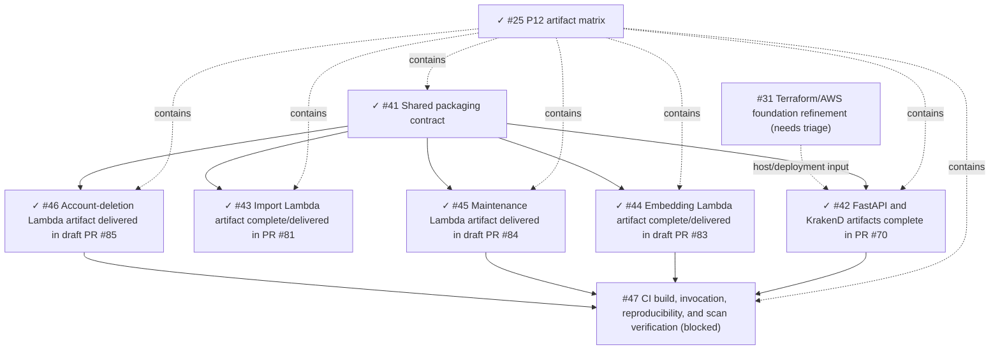

# P12 Production Artifact Matrix

**Status:** agreed P12 artifact contract
**Issue:** [#25 — Inventory P12 deployables and write the artifact matrix](https://github.com/starkovalera/recipe-manager/issues/25)
**Scope:** production packaging and verification only; cloud provisioning is out of scope

## Purpose

P12 turns the current repository runtime boundaries into deterministic, independently
buildable production artifacts. It does not create AWS resources, configure IAM,
create ECR repositories, choose Terraform/OpenTofu, or select the final
Lightsail-versus-EC2 provisioning mechanism.

The contract is deliberately host-neutral. FastAPI and KrakenD are two OCI images
that are released together as one host deployment unit. The four background
functions remain separate Lambda images so that they can be deployed, scanned, and
rolled back independently.

## Boundary and terminology

### P12 artifacts

P12 owns exactly six production image artifacts:

1. `recipe-manager-api` — FastAPI;
2. `recipe-manager-krakend` — public KrakenD edge;
3. `recipe-manager-import` — import Lambda;
4. `recipe-manager-embedding` — embedding Lambda;
5. `recipe-manager-maintenance` — maintenance Lambda;
6. `recipe-manager-account-deletion` — account-deletion Lambda.

The API and gateway are separate artifacts inside one host deployment unit. They
must not be collapsed into one image: the gateway is the only public ingress and
FastAPI remains private on the container network.

### Production outputs outside P12

The complete production topology also has these outputs, which are recorded here
to make the scope boundary explicit but are not implemented by #25:

| Production output | P12 status | Owning work |
| --- | --- | --- |
| Cloudflare Pages frontend build | Outside P12 | Frontend delivery after the applicable Design and technical-production gates |
| Terraform/OpenTofu state and infrastructure changes | Outside P12 | [#31 — Terraform/OpenTofu and AWS foundation](https://github.com/starkovalera/recipe-manager/issues/31), then Phase 2 |

ECR repositories, Lambda functions, SQS queues, event-source mappings, IAM,
EventBridge schedules, Lightsail/EC2 instances, and DNS are provisioning
resources, not additional P12 artifacts.

### Terms

- **Artifact** — one independently versioned build output, represented in P12 by
  an OCI image.
- **Deployable** — an artifact that a release process can select independently.
- **Deployment unit** — an operational grouping of deployables released together;
  the host unit contains the API and gateway images.
- **Release manifest** — the immutable mapping from a source revision to every
  artifact digest and verification result used by one release.

## Artifact matrix

| ID / artifact | Build context and dependencies | Runtime contract | Runtime user and filesystem | Health or invocation | Compatibility owner |
| --- | --- | --- | --- | --- | --- |
| **A1 — `recipe-manager-api`** | `backend/` plus the shared packaging contract; `backend/pyproject.toml` and `backend/uv.lock`; production dependencies only; Alembic files remain in the image | `uvicorn app.main:app --host 0.0.0.0 --port 8000`; `APP_ENV=PROD`; PostgreSQL, SQS, S3, Clerk, and feature-flag configuration arrives through the runtime secret/config boundary | Named non-root service user; read-only root filesystem; `/tmp` only for ephemeral process data; no persistent user media or database state on the host | Private `GET /health`; controlled `alembic upgrade head` command is available from the same image and runs once per release before service deployment | Backend code, models, schemas, migrations, queue messages, storage contracts, configuration, and shared dependencies |
| **A2 — `recipe-manager-krakend`** | `infra/krakend/`; existing pinned KrakenD configuration, template, endpoint map, and entrypoint | Existing `recipe-manager-krakend-entrypoint`; `krakend run -c /etc/krakend/krakend.tmpl`; public 80/443 boundary; FastAPI upstream remains private | Use the pinned image's non-root `krakend` user; read-only root filesystem except required temporary runtime paths; no application state | `GET /__health` checks KrakenD; `GET /health` verifies the proxied FastAPI path; `CLERK_ISSUER` and `CLERK_JWKS_URL` are required runtime configuration | Gateway template/config, API route parity, issuer/JWKS settings, request limits, and base-image updates |
| **A3 — `recipe-manager-import`** | Shared locked Python packaging plus an AWS-compatible Python 3.12 Lambda base image pinned by digest; import handler and its services; import-only native media tools | Lambda handler `app.lambdas.imports.handler`; SQS `ImportJobQueueMessage`; ID-only body; partial-batch response keyed by SQS `messageId` | Lambda-compatible least-privilege runtime user; read-only root filesystem; `/tmp` is the only writable location; no local durable state | Deterministic SQS event fixture through the Lambda runtime contract; `ffmpeg -version` and `ffprobe -version` build/runtime checks | Import handler, import services, queue message schema, storage boundary, OpenAI/video behavior, and native media-tool provenance |
| **A4 — `recipe-manager-embedding`** | Shared locked Python packaging plus an AWS-compatible Python 3.12 Lambda base image pinned by digest; embedding handler and services | Lambda handler `app.lambdas.embeddings.handler`; ID-only `RecipeEmbeddingQueueMessage`; partial-batch response | Lambda-compatible least-privilege runtime user; read-only root filesystem; `/tmp` only; no `ffmpeg` or `ffprobe` | Deterministic fixtures for success, no-op, busy/retryable, and malformed records | Embedding handler, processing outcomes, embedding input/status models, queue messages, provider dependencies, and migrations |
| **A5 — `recipe-manager-maintenance`** | Shared locked Python packaging plus an AWS-compatible Python 3.12 Lambda base image pinned by digest; maintenance handler, dispatcher, and operations | Lambda handler `app.lambdas.maintenance.handler`; operation-only `MaintenanceQueueMessage`; partial-batch response | Lambda-compatible least-privilege runtime user; read-only root filesystem; `/tmp` only; no `ffmpeg` or `ffprobe` | Deterministic fixtures for valid operation, retryable failure, anomaly result, and malformed records | Maintenance dispatcher, operation enum, storage/reporting boundaries, queue messages, and reconciliation models |
| **A6 — `recipe-manager-account-deletion`** | Shared locked Python packaging plus an AWS-compatible Python 3.12 Lambda base image pinned by digest; account-deletion handler and services | Lambda handler `app.lambdas.account_deletion.handler`; ID-only `AccountDeletionQueueMessage`; partial-batch response | Lambda-compatible least-privilege runtime user; read-only root filesystem; `/tmp` only; no `ffmpeg` or `ffprobe` | Deterministic fixtures for success, waiting-for-imports/retryable behavior, duplicate delivery, and malformed records | Account-deletion handler/service, user lifecycle, storage and Clerk boundaries, queue messages, and migrations |

AWS's Lambda container contract requires a Linux image that can run with a
read-only filesystem, with writable `/tmp`; AWS base images include the Lambda
runtime components and define a least-privilege default user. P12 uses those
constraints as verification invariants rather than treating a local
`docker run` as proof of production compatibility.

## Shared packaging decisions

### Dependency source of truth

- `backend/pyproject.toml` declares application dependencies.
- `backend/uv.lock` is the complete, frozen resolution used by production
  builds.
- Runtime images install only production dependencies; pytest, Ruff, and other
  development tools remain outside the final image.
- A shared multi-stage build contract may reuse dependency stages, but the final
  API, gateway, and Lambda images remain independently addressable.
- No credentials, `.env` files, local databases, test storage, or generated
  user media enter an image layer.

### Base images and architecture

- Every base-image reference is pinned by digest in the implementation.
- The initial artifact target is one explicit `linux/amd64` architecture.
- Lambda images use an AWS-compatible Python 3.12 runtime image so the Lambda
  runtime interface is supplied by the base image.
- The API image uses a minimal Python 3.12 runtime with an explicit non-root
  service user.
- The KrakenD image keeps the repository's pinned KrakenD version and must
  record its digest when production packaging is implemented.
- A multi-architecture Lambda manifest is not produced for the initial release.

### Native media tools

`ffmpeg` and `ffprobe` are system executables, not Python packages. The current
repository has configuration fields for their paths, but no current code invokes
either executable: video bytes are sent directly to the OpenAI transcription
boundary and no duration check is currently performed.

They are therefore **not shared current dependencies**. The target import
artifact includes them because the production architecture assigns future video
duration inspection to the import Lambda:

- only A3 contains `ffmpeg` and `ffprobe`;
- their package/binary provenance and version are pinned and verified;
- A4–A6 do not carry them;
- adding the binaries does not silently implement duration validation;
- duration validation and wiring the existing settings are compatibility work
  for the import implementation child or a separately approved backend issue.

### Runtime configuration and secrets

Image layers contain code and non-secret defaults only. Runtime configuration
provides database URLs, queue URLs, bucket names, Clerk settings, feature-flag
settings, and model/provider configuration. AWS credentials come from the
runtime IAM mechanism, not from application image settings.

## Migration and compatibility contract

The API image contains Alembic and the migration source because schema versioning
is part of the application release. The migration owner is the release process,
not an arbitrary API replica:

1. build and verify images for one exact source commit;
2. create/verify a Neon snapshot before a risky migration or backfill;
3. run one controlled `alembic upgrade head` from A1;
4. verify the resulting revision;
5. deploy the API/gateway unit and the affected Lambda images;
6. run smoke and queue/DLQ checks;
7. retain the release manifest for rollback.

Before child issue #42, `backend/app/main.py` ran migrations during every
FastAPI startup. The #42 implementation delegates PROD migrations to the
controlled release step while preserving the local DEV/PREVIEW/TEST startup
behavior. A database downgrade is never an automatic image rollback:
incompatible schema changes require an explicitly reviewed migration/restore
procedure.

### Compatibility triggers

| Change | Artifacts that must rebuild and verify | Required invariant |
| --- | --- | --- |
| `backend/pyproject.toml`, `backend/uv.lock`, Python base image, shared build stage | A1, A3, A4, A5, A6; A2 when its base/config changes | Every final image reports the same source revision and applicable dependency lock |
| `backend/app/models/`, Alembic revisions, enum values, shared schemas, configuration fields | A1 plus every Lambda that imports or persists the changed contract | Expand/contract compatibility is preserved during rollout; old queued IDs remain valid |
| `backend/app/queueing/messages.py` or queue provider behavior | A1 and the affected consumer Lambda(s) | ID-only wire messages remain strict and independently retryable |
| `backend/app/imports/` or import dependencies | A1 and A3 | Import service and import handler keep the same disposition/retry semantics |
| `backend/app/embeddings/` | A1, A4, and A5 when maintenance reconciles embedding state | Embedding status/event history and duplicate delivery behavior remain compatible |
| `backend/app/maintenance/` | A1 when it publishes work, A5, and any affected recovery consumer | Maintenance remains a safety-net and never becomes account deletion or normal import handling |
| `backend/app/users/deletion.py` or account-deletion contracts | A1, A5 when it republishes stale deletion IDs, and A6 | Account deletion remains ID-only, idempotent, and isolated to A6 |
| `infra/krakend/` or generated API route parity | A2 and the affected API contract checks | KrakenD remains the only public ingress and forwards only the intended contract |

The CI child must encode this dependency map rather than relying only on a
single broad backend job or a manually remembered rebuild list.

## Local and CI verification seams

### Common build

```text
docker buildx build --platform linux/amd64 --load \
  --tag <artifact>:git-<full-sha> \
  --file <artifact-dockerfile> <context>
```

The build must use frozen lockfile resolution, pinned base digests, and a
deterministic source timestamp derived from the commit rather than an arbitrary
wall-clock value.

### API and gateway

```text
docker run --rm <recipe-manager-api>:git-<full-sha> <controlled-migration-command>
docker run --rm -p <private-port>:8000 <recipe-manager-api>:git-<full-sha>
curl.exe http://127.0.0.1:<private-port>/health
docker compose build krakend
curl.exe http://127.0.0.1:<gateway-port>/__health
curl.exe http://127.0.0.1:<gateway-port>/health
```

The gateway smoke requires a running FastAPI upstream. It must verify both the
gateway self-health response and the proxied API health response.

### Lambda images

Each Lambda image is invoked with a deterministic local SQS event fixture
containing the exact ID-only message for its queue. The harness must verify the
handler result, partial-batch identifiers, malformed-record behavior, and
read-only-root/`/tmp` assumptions. AWS base images may use the Lambda Runtime
Interface Emulator for the HTTP invocation harness; direct handler tests remain
the fast unit seam.

### CI checks

The artifact CI job must:

- run the existing backend lint, migration, and test checks;
- build A1–A6 for `linux/amd64`;
- inspect labels, source revision, architecture, user, entrypoint, and exposed
  ports;
- run API/gateway health checks and all four Lambda fixtures;
- verify A3 contains `ffmpeg`/`ffprobe` while A4–A6 do not;
- produce the release-manifest mapping of artifact, source revision, digest,
  target architecture, and verification result;
- run a pinned vulnerability/secret scanner with an explicit initial failure
  policy for unresolved Critical/High findings;
- rerun all affected artifact checks for lockfile, model, migration, queue, or
  shared-runtime changes.

This is build and verification only. ECR pushes, Lambda updates, IAM, Terraform,
and production deployment remain separate tasks.

## Metadata, tagging, and rollback

Every image must carry OCI metadata equivalent to:

```text
org.opencontainers.image.source
org.opencontainers.image.revision
org.opencontainers.image.created
org.opencontainers.image.version
org.opencontainers.image.base.name
```

The release identity is:

- a human-readable tag `git-<full-commit-sha>`;
- the immutable content digest produced by the build;
- one release manifest containing all six P12 image digests and verification
  evidence.

Production deployment references the digest, not a mutable `latest` tag. The
full-SHA tag is for discovery and audit; it is not a substitute for a digest in
deployment configuration.

Rollback selects the previous digest per artifact from the release manifest. The
API/gateway host unit normally rolls back together, while Lambda artifacts may
roll back independently when their queue contract and database schema remain
compatible. An image rollback never silently downgrades the database.

## Child issue graph

Child issues are one-agent, one-branch, independently verifiable slices. The
parent relationship is containment; solid arrows below are true execution
blockers, and dashed arrows are non-blocking inputs.



| Child | Scope | Dependency |
| --- | --- | --- |
| [#41](https://github.com/starkovalera/recipe-manager/issues/41) | Shared dependency/build, metadata, architecture, and runtime packaging seam | Complete in [PR #68](https://github.com/starkovalera/recipe-manager/pull/68) |
| [#42](https://github.com/starkovalera/recipe-manager/issues/42) | FastAPI image and KrakenD image in one host deployment unit | Complete in [PR #70](https://github.com/starkovalera/recipe-manager/pull/70); closes on merge; #41 complete |
| [#43](https://github.com/starkovalera/recipe-manager/issues/43) | Import Lambda image, import-only `ffmpeg`/`ffprobe`, and invocation seam | Complete/delivered in [PR #81](https://github.com/starkovalera/recipe-manager/pull/81); closes on merge; #41 complete |
| [#44](https://github.com/starkovalera/recipe-manager/issues/44) | Embedding Lambda image | Complete/delivered in draft [PR #83](https://github.com/starkovalera/recipe-manager/pull/83); closes on merge; #41 complete |
| [#45](https://github.com/starkovalera/recipe-manager/issues/45) | Maintenance Lambda image | Complete/delivered in draft [PR #84](https://github.com/starkovalera/recipe-manager/pull/84); closes on merge; #41 complete |
| [#46](https://github.com/starkovalera/recipe-manager/issues/46) | Account-deletion Lambda image | Complete/delivered in draft [PR #85](https://github.com/starkovalera/recipe-manager/pull/85); closes on merge; #41 complete |
| [#47](https://github.com/starkovalera/recipe-manager/issues/47) | Cross-artifact CI, fixtures, manifests, and vulnerability scans | Blocked by #43 and #46 |

P12 does not add native blockers from #23, #26, #30, or #31 to the artifact
children. Those workstreams provide independent inputs or later provisioning
gates; they do not prevent local artifact construction.

## Rejected alternatives

### One image for all Lambda functions

Rejected because import-only native media tools would inflate every worker image,
couple unrelated releases, and make independent rollback less precise.

### One combined FastAPI/KrakenD image

Rejected because it breaks the private FastAPI/public gateway boundary, obscures
separate health contracts, and couples the gateway configuration lifecycle to
the API process.

### Migrations owned by API startup

Rejected for production because multiple service starts can race, startup success
would be coupled to schema mutation, and an image rollback would not define a
database rollback. The release process owns one controlled migration invocation.

### Floating `latest` as the production reference

Rejected because a tag can point at a different image without changing the
deployment configuration. Production selects an immutable digest.

### ZIP Lambda packages

Rejected for P12 because the agreed production architecture uses Lambda
container images in ECR and the import artifact needs a deterministic native
media-tool boundary.

### Cloud provisioning in P12

Rejected because artifact construction must remain testable without billable
resources and must not absorb Terraform, IAM, ECR, queue, or deployment
decisions owned by later phases.

## Implementation evidence and intentional gaps

The current checkout provides the following evidence for the child work:

- `docker/production/Dockerfile` provides the shared runtime targets, the #42
  FastAPI artifact target, the #43 import Lambda target, and the #45
  maintenance Lambda target;
- `infra/krakend/Dockerfile` provides the pinned #42 KrakenD artifact and
  validates its local and production configuration;
- The embedding Lambda artifact is delivered in draft [PR #83](https://github.com/starkovalera/recipe-manager/pull/83); the maintenance Lambda artifact is delivered in draft [PR #84](https://github.com/starkovalera/recipe-manager/pull/84); the #43 import Lambda artifact is delivered in [PR #81](https://github.com/starkovalera/recipe-manager/pull/81); the #46 account-deletion Lambda artifact is delivered in draft [PR #85](https://github.com/starkovalera/recipe-manager/pull/85);
- `backend/tests/infra/test_maintenance_lambda_artifact.py` and the four
  `docker/production/fixtures/maintenance-lambda/` events verify the #45
  handler/dispatcher boundary without production service state;
- `docker/production/maintenance-lambda.md` records the #45 build, runtime,
  digest, local invocation, and scan evidence commands;
- `docker/production/account-deletion-lambda.md` provides the #46 account-deletion
  artifact target, deterministic fixtures, runtime smoke, and scan runbook;
- `docker/production/import-lambda.md` records the #43 native-tool provenance,
  deterministic SQS fixtures, Lambda runtime invocation, and scan runbook;
- PROD FastAPI startup delegates Alembic to the controlled #42 release command;
- the four Lambda handlers and their tests already exist under
  `backend/app/lambdas/` and `backend/tests/lambdas/`;
- `ffmpeg_path` and `ffprobe_path` are declared but unused;
- current CI verifies backend, frontend, and KrakenD configuration but does not
  build, invoke, fingerprint, or scan the six P12 artifacts.

These gaps are implementation work for #41–#47, not reasons to add cloud
provisioning or to broaden #25.

## References

- [Production roadmap](../architecture/production-roadmap.md)
- [Production architecture](../architecture/production-architecture.md)
- [Development Task Completion Checkpoint](../agents/task-completion.md)
- [AWS Lambda container image requirements](https://docs.aws.amazon.com/lambda/latest/dg/images-create.html)
- [AWS Python Lambda container image guidance](https://docs.aws.amazon.com/lambda/latest/dg/python-image.html)
- [Issue #25](https://github.com/starkovalera/recipe-manager/issues/25)
